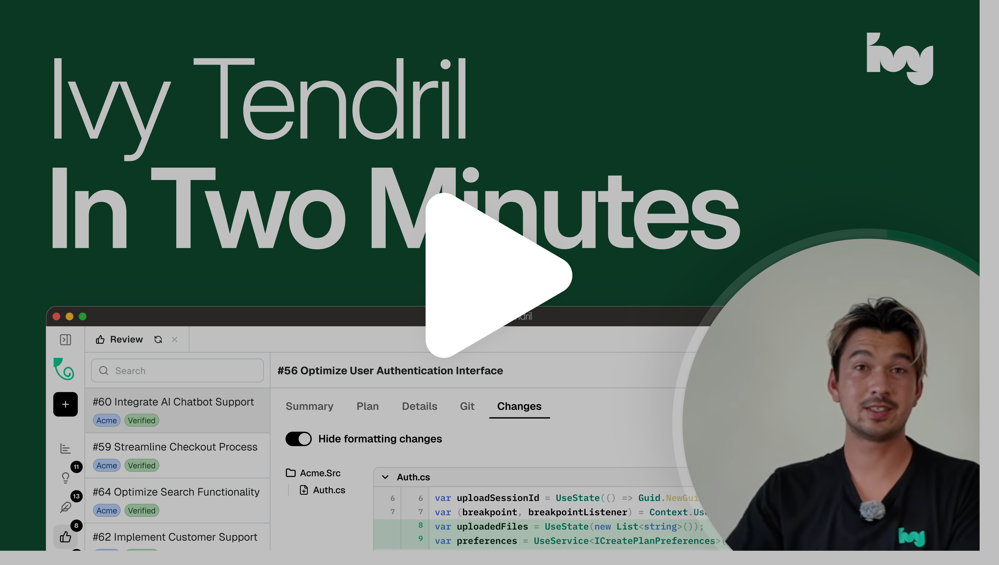
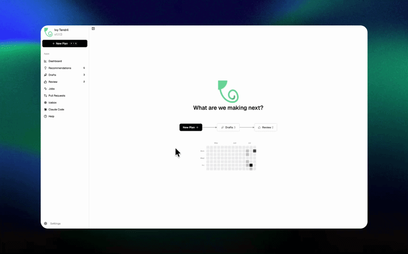
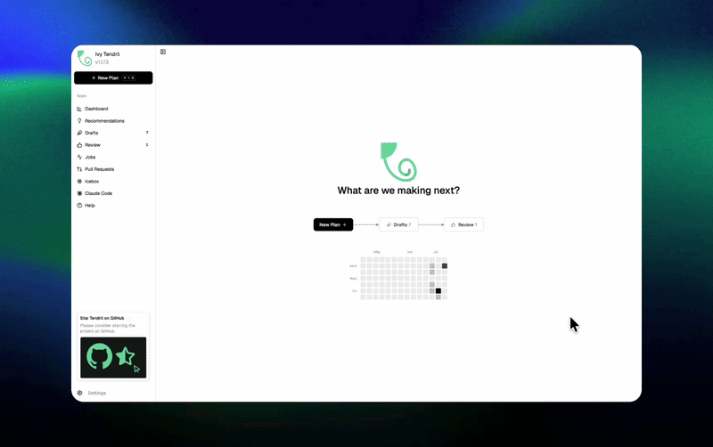
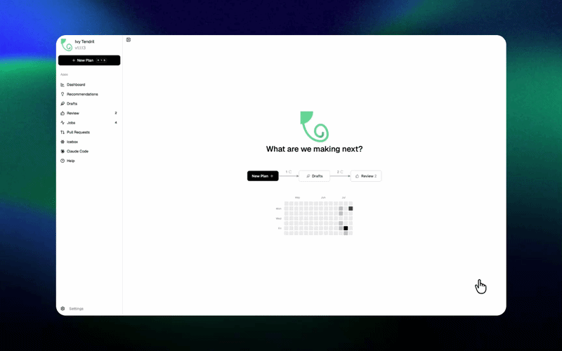

<p align="right">
  <strong>English</strong> | <a href="docs/translations/README.zh-CN.md">简体中文</a> | <a href="docs/translations/README.ja.md">日本語</a> | <a href="docs/translations/README.es.md">Español</a> | <a href="docs/translations/README.de.md">Deutsch</a> | <a href="docs/translations/README.fr.md">Français</a> | <a href="docs/translations/README.ru.md">Русский</a> | <a href="docs/translations/README.hi.md">हिन्दी</a>
</p>

<h1>
  <a href="https://tendril.ivy.app"></a> Ivy Tendril
</h1>

<p>
  <a href="https://github.com/Ivy-Interactive/Ivy-Tendril/stargazers"></a>
  <a href="https://github.com/Ivy-Interactive/Ivy-Tendril/releases/latest"></a>
  <a href="https://github.com/Ivy-Interactive/Ivy-Tendril/actions/workflows/repo-health.yml"></a>
  <a href="https://tendril.ivy.app"></a>
  
</p>

<h2>The Agentic Software Factory for 10x Builders</h2>

<p>
AI agents can now write 99% of the code. This changes what it means to be a developer. Our role shifts to knowing <strong>what good looks like</strong>. To do that, we need completely new developer tools. Tendril is that tool and replaces your IDE in an agentic era.
</p>

<p>
<a href="https://youtu.be/_KVG1NnAj-8">
  
</a>
</p>

<p>https://youtu.be/_KVG1NnAj-8</p>

## Features

<table>
<tr>
<td width="50%" valign="middle">

### Parallel Worktrees

Run agents in isolated git worktrees. Keep your main branch clean until you review, approve, and merge changes.

[Docs &rarr;](https://tendril.ivy.app/docs/gettingstarted/introduction)

</td>
<td width="50%">
  
</td>
</tr>
<tr>
<td width="50%" valign="middle">

### Tunneling (Remote & Mobile Coding)

Expose your server securely using Cloudflare Quick Tunnels to monitor and steer agent runs from anywhere.

[Docs &rarr;](https://tendril.ivy.app/docs/gettingstarted/introduction)

</td>
<td width="50%">
  
</td>
</tr>
<tr>
<td width="50%" valign="middle">

### Voice & Rich Input

Dictate prompts using built-in Whisper voice input and attach text files, logs, or documents with drag-and-drop.

[Docs &rarr;](https://tendril.ivy.app/docs/gettingstarted/introduction)

</td>
<td width="50%">
  
</td>
</tr>
<tr>
<td width="50%" valign="middle">

### Plan Annotations

Annotate drafts inline to automatically update plans with revised agent goals.

[Docs &rarr;](https://tendril.ivy.app/docs/gettingstarted/introduction)

</td>
<td width="50%">
  
</td>
</tr>
<tr>
<td width="50%" valign="middle">

### Powerful Code Reviews

Review agent changes, inspect diffs, and approve code with automated verification gates.

[Docs &rarr;](https://tendril.ivy.app/docs/gettingstarted/introduction)

</td>
<td width="50%">
  
</td>
</tr>
<tr>
<td width="50%" valign="middle">

### GitHub Integration & Automated Inbox

Ingest GitHub Issues or jam.dev bug reports via webhooks to turn markdown plans into active jobs automatically.

[Docs &rarr;](https://tendril.ivy.app/docs/integrations/jamdev)

</td>
<td width="50%">
  
</td>
</tr>
</table>

---

## Supported Agents

Works with **any CLI agent**: if it runs in a terminal, it runs in Tendril.

<p>
  <a href="https://docs.anthropic.com/claude/docs/claude-code"><kbd> Claude Code</kbd></a> &nbsp;
  <a href="https://github.com/openai/codex"><kbd> Codex</kbd></a> &nbsp;
  <a href="https://docs.github.com/en/copilot/how-tos/set-up/install-copilot-cli"><kbd> GitHub Copilot</kbd></a> &nbsp;
  <a href="https://github.com/google-gemini/gemini-cli"><kbd> Gemini</kbd></a> &nbsp;
  <a href="https://opencode.ai/docs/cli/"><kbd> OpenCode</kbd></a> &nbsp;
  <kbd>+ any CLI agent</kbd>
</p>

## Agent Skills

Extend your favorite AI coding agents with official Tendril engineering and debugging skills.

### Quick Start

Install Tendril skills for any supported agent using the universal skills installer:

```bash
npx skills add ivy-interactive/ivy-tendril
```

Or install a specific skill:

```bash
npx skills add ivy-interactive/ivy-tendril --skill tendril-debug-plan
```

### Supported Tools & Environments

<details>
<summary><strong>Visual Studio Code (GitHub Copilot & Extensions)</strong></summary>

Install skills for GitHub Copilot in VS Code:

```bash
npx skills add ivy-interactive/ivy-tendril --agent github-copilot
```

Global install (across all workspaces):

```bash
npx skills add ivy-interactive/ivy-tendril --agent github-copilot -g
```

Or copy skills directly to `.agents/skills/` or `.github/skills/` (project-level) or `~/.copilot/skills/` (global).

Once installed, skills appear in GitHub Copilot Chat under the `/skills` menu and can be invoked directly as slash commands (e.g. `/tendril-debug-plan`, `/tendril-debug-job`, `/tendril-review`, `/tendrillable`).

Third-party VS Code agent extensions:
- Cline: `npx skills add ivy-interactive/ivy-tendril --agent cline`
- Continue: `npx skills add ivy-interactive/ivy-tendril --agent continue`
- Roo Code: `npx skills add ivy-interactive/ivy-tendril --agent roo`

For full editor integration, install the official [Ivy Tendril VS Code Extension](https://marketplace.visualstudio.com/items?itemName=ivy-interactive.ivy-tendril) for embedded plan dashboards, worktree navigation, and live execution monitoring.

See the [VS Code Setup Guide](docs/vscode-setup.md) for detailed configuration options.
</details>

<details>
<summary><strong>Claude Code</strong></summary>

Install from the Claude Code marketplace:

```
/plugin marketplace add ivy-interactive/ivy-tendril
/plugin install tendril-skills@ivy-tendril
```

Local development:

```bash
claude --plugin-dir /path/to/ivy-tendril
```

See the [Claude Code Setup Guide](docs/claude-setup.md) for detailed configuration options.
</details>

<details>
<summary><strong>Antigravity CLI (agy)</strong></summary>

Install plugin via Git URL:

```bash
agy plugin install https://github.com/ivy-interactive/ivy-tendril.git
```

Local installation:

```bash
agy plugin install ./
```

See the [Antigravity Setup Guide](docs/antigravity-setup.md) for detailed configuration options.
</details>

<details>
<summary><strong>Cursor</strong></summary>

Install targeting Cursor:

```bash
npx skills add ivy-interactive/ivy-tendril --agent cursor
```

Or copy skills to `.cursor/skills/` (project-level) or `~/.cursor/skills/` (global).

See the [Cursor Setup Guide](docs/cursor-setup.md) for detailed configuration options.
</details>

<details>
<summary><strong>OpenAI Codex</strong></summary>

Install from the Codex plugin marketplace:

```bash
codex plugin marketplace add ivy-interactive/ivy-tendril
codex plugin add tendril-skills@tendril-skills
```
</details>

<details>
<summary><strong>Gemini CLI</strong></summary>

Install using the Gemini CLI:

```bash
gemini skills install https://github.com/ivy-interactive/ivy-tendril.git --path skills
```
</details>

---

## Install

Download standalone desktop installers (`.pkg`, `.AppImage`, `.exe`) directly from [GitHub Releases](https://github.com/Ivy-Interactive/Ivy-Tendril/releases/latest) or run one of the quick install commands below:

**macOS / Linux:**
```bash
curl -sSf https://cdn.ivy.app/install-tendril.sh | sh
```

**Windows:**
```powershell
irm https://cdn.ivy.app/install-tendril.ps1 | iex
```

### Run

Tendril is a desktop application, but the same installation is also a CLI. The two are separate
binaries: `tendril-app` is the desktop app, and `tendril` is the CLI and the server.

Start the desktop application by launching **Tendril** from your applications menu (or run the
`tendril-app` binary directly).

Start the daemon headlessly — the HTTP & WebSocket API, no desktop UI:
```bash
tendril run
```

`tendril run` checks the port and migrates the database first, then serves on `127.0.0.1:5010`. Use
`--port` / `--host` to change that, and `tendril serve` if you want the bare listener with no
pre-flight checks (it is also the command that takes `--tls-cert` / `--tls-key`).

Everything else is a subcommand — `tendril --help` lists them all, and `tendril doctor` reports on
the installation (exit code 0 when nothing is `[FAIL]`, 1 otherwise, so it can gate a script).

---

## 🏛 Directory Layout

```
Ivy-Tendril-V2/
├── src/
│   ├── apps/
│   │   ├── tendril-app/            # Tauri desktop app + React frontend
│   │   └── tendril-docs/           # Documentation site
│   ├── packages/
│   │   └── components/             # @ivy-interactive/components + Storybook
│   ├── crates/
│   │   ├── tendril-core/           # Core domain models, SQLite database, worktree engine
│   │   ├── tendril-server/         # Axum REST & WebSocket HTTP server daemon
│   │   └── tendril-cli/            # Command-line interface ("tendril")
│   ├── extensions/
│   │   └── vscode/                 # VS Code / Antigravity IDE extension
│   ├── promptwares/                # Promptware agent definitions & firmware
│   ├── skills/                     # Agent workflow skills
│   └── scripts/                    # Repository setup & test validation scripts
├── docs/                           # Documentation content
├── Cargo.toml                      # Unified Cargo workspace
├── pnpm-workspace.yaml             # Unified pnpm workspace
└── package.json                    # Workspace root scripts
```

---

## 🚀 Getting Started

### Prerequisites
- [Rust](https://rustup.rs/) (edition 2021)
- [Node.js](https://nodejs.org/) (v22+) & [pnpm](https://pnpm.io/) (v11+)
- [Vite+](https://viteplus.dev/) (`vp`)
- GitHub CLI (`gh`)

### Quick Start

1. **Install dependencies**:
   ```bash
   pnpm install
   ```

2. **Build components & UI library**:
   ```bash
   pnpm --filter @ivy-interactive/components build
   ```

3. **Run Storybook**:
   ```bash
   pnpm dev:storybook
   ```

4. **Build & run desktop app**:
   ```bash
   pnpm dev:app
   ```

5. **Build backend crates**:
   ```bash
   cargo build --workspace
   ```

6. **Run tests**:
   ```bash
   # Web & component tests
   pnpm test

   # Rust tests
   cargo test --workspace
   ```

### Visual & Screenshot Testing

To run screenshot verifications and Storybook visual tests locally:

```bash
pnpm install
pnpm run install:playwright:deps
```

---

## 🤖 Agent Skills

Extend your favorite AI coding agents with official Tendril engineering and debugging skills.

### Quick Start

Install Tendril skills for any supported agent using the universal skills installer:

```bash
npx skills add ivy-interactive/ivy-tendril-v2
```

Or install a specific skill:

```bash
npx skills add ivy-interactive/ivy-tendril-v2 --skill tendril-debug-plan
```

### Supported Tools & Environments

<details>
<summary><strong>Visual Studio Code (GitHub Copilot & Extensions)</strong></summary>

Install skills for GitHub Copilot in VS Code:

```bash
npx skills add ivy-interactive/ivy-tendril-v2 --agent github-copilot
```

Global install (across all workspaces):

```bash
npx skills add ivy-interactive/ivy-tendril-v2 --agent github-copilot -g
```

Or copy skills directly to `.agents/skills/` or `.github/skills/` (project-level) or `~/.copilot/skills/` (global).

Once installed, skills appear in GitHub Copilot Chat under the `/skills` menu and can be invoked directly as slash commands (e.g. `/tendril-debug-plan`, `/tendril-debug-job`, `/tendril-review`, `/tendrillable`).

Third-party VS Code agent extensions:
- Cline: `npx skills add ivy-interactive/ivy-tendril-v2 --agent cline`
- Continue: `npx skills add ivy-interactive/ivy-tendril-v2 --agent continue`
- Roo Code: `npx skills add ivy-interactive/ivy-tendril-v2 --agent roo`

See the [VS Code Setup Guide](docs/vscode-setup.md) for detailed configuration options.
</details>

<details>
<summary><strong>Claude Code</strong></summary>

Install from the Claude Code marketplace:

```
/plugin marketplace add ivy-interactive/ivy-tendril-v2
/plugin install tendril-skills@ivy-tendril-v2
```

Local development:

```bash
claude --plugin-dir /path/to/ivy-tendril-v2
```

See the [Claude Code Setup Guide](docs/claude-setup.md) for detailed configuration options.
</details>

<details>
<summary><strong>Antigravity CLI (agy)</strong></summary>

Install plugin via Git URL:

```bash
agy plugin install https://github.com/ivy-interactive/ivy-tendril-v2.git
```

Local installation:

```bash
agy plugin install ./
```

See the [Antigravity Setup Guide](docs/antigravity-setup.md) for detailed configuration options.
</details>

<details>
<summary><strong>Cursor</strong></summary>

Install targeting Cursor:

```bash
npx skills add ivy-interactive/ivy-tendril-v2 --agent cursor
```

Or copy skills to `.cursor/skills/` (project-level) or `~/.cursor/skills/` (global).

See the [Cursor Setup Guide](docs/cursor-setup.md) for detailed configuration options.
</details>

<details>
<summary><strong>OpenAI Codex</strong></summary>

Install from the Codex plugin marketplace:

```bash
codex plugin marketplace add ivy-interactive/ivy-tendril-v2
codex plugin add tendril-skills@tendril-skills
```
</details>

---

## Community & Support

- **Discord:** Join the community on **[Discord](https://discord.gg/FHgxkDga3y)**.
- **Feedback & Ideas:** Found a bug or have an idea? [Open an issue](https://github.com/Ivy-Interactive/Ivy-Tendril/issues).
- **Show Support:** [Star](https://github.com/Ivy-Interactive/Ivy-Tendril) this repo to follow along with our development.

---

## License

Tendril is source-available and licensed under the [Functional Source License (FSL-1.1-ALv2)](LICENSE). Agent skills and plugins (`skills/`, `.claude-plugin/`, `.codex-plugin/`, `.agents/`) are also licensed under the root repository terms ([Functional Source License (FSL-1.1-ALv2)](LICENSE)).
