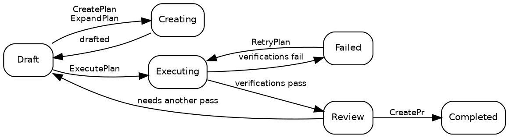

# Plans

## Plan states

A plan is always in exactly one of ten states:

| State         | Description                                                                                                       |
| ------------- | ----------------------------------------------------------------------------------------------------------------- |
| **Draft**     | Initial state. The plan exists but execution has not started.                                                     |
| **Creating**  | [CreatePlan](02_Promptwares.md) or [ExpandPlan](02_Promptwares.md) is drafting technical detail.                  |
| **Updating**  | [UpdatePlan](02_Promptwares.md) is refining a plan with annotations and feedback.                                 |
| **Executing** | [ExecutePlan](02_Promptwares.md) is implementing code in a [Git worktree](https://git-scm.com/docs/git-worktree). |
| **Review**    | Execution finished and required verification gates passed. Ready for developer review.                            |
| **Completed** | Reviewed, approved, and shipped — normally via a pull request opened by [CreatePr](02_Promptwares.md).            |
| **Failed**    | Verifications failed, or an interrupted execution could not be recovered.                                         |
| **Blocked**   | The plan cannot proceed without missing context, credentials, or user decisions.                                  |
| **Skipped**   | Abandoned, discarded, or deemed unnecessary.                                                                      |
| **Icebox**    | Shelved for future development.                                                                                   |

The normal lifecycle path:



> [!NOTE]
> **Stopping or cancelling a running job** restores the plan to its pre-job state — a stopped
> [ExecutePlan](02_Promptwares.md) returns to `Draft`, and a stopped
> [RetryPlan](02_Promptwares.md) returns to `Review`. Work product and worktrees
> are preserved so you can inspect partial diffs or resume work.

## Creating a plan

There are four primary entry points to create a plan:

1. **The Desktop App** — write a prompt or feature brief in the **New Plan** dialog, triggering
   [CreatePlan](02_Promptwares.md).
2. **The Inbox API** — `POST /api/inbox` triggers automatic ingestion from [GitHub](https://github.com)
   issues or [Jam.dev](https://jam.dev) bug reports. It is also exposed to autonomous agents as the
   `tendril_inbox` [Model Context Protocol](https://modelcontextprotocol.io/) (MCP) tool.
3. **Recommendations** — promote follow-up suggestions generated by previous agent runs into independent plans.
4. **The CLI** — run `tendril plan create "<title>" <project>`.

Each plan is stored as a folder under `$TENDRIL_HOME/Plans/` with a sequential numeric ID and a slugified
name (e.g. `00524-RelocateMultilingualRead/`).

## Plan structure

A plan directory is completely transparent, human-readable, and local:

```
00524-RelocateMultilingualRead/
├── plan.yaml        # metadata: state, project, repos, pull requests, commits, verifications
├── Revisions/       # immutable version history: 001.md, 002.md …
├── Verification/    # individual report and test output per verification gate
├── Artifacts/       # screenshots, diagrams, and generated binary assets
├── Worktrees/       # isolated git worktrees per repository used during execution
└── costs.csv        # token expenditure and dollar cost audit log
```

Execution logs and telemetry do **not** live in the plan folder. Every run logs raw transcripts, prompts,
and stdout/stderr directly to `$TENDRIL_HOME/Jobs/{jobId}-{planId}-{promptware}/`.

Inspect and manage plans directly via the CLI:

```bash
# List all active plans and their current states
tendril plan list

# Inspect detailed metadata and repository attachments
tendril plan get 00524

# Validate directory integrity and schema conformity
tendril plan validate 00524

# Clean up worktrees for completed or terminal plans (--force overrides state)
tendril plan cleanup 00524 --force

# Diagnose and migrate plans to current schema versions
tendril plan doctor --fix --prune-husks
```

## Revisions & inline annotations

Each time a plan specification is drafted or updated, a new immutable **revision** is recorded in
`Revisions/` rather than replacing the previous file:

- **Problem** — the user requirements, bug symptoms, and root cause analysis.
- **Solution** — architectural decisions, phased implementation steps, and file modifications.
- **Tests & Acceptance** — explicit criteria and automated test cases verifying correctness.

### Inline plan annotations

In the desktop app, developers can highlight any line in a draft plan and add inline annotations.
Rather than forcing you to rewrite your brief, Tendril packages these annotations alongside the active
revision and executes [UpdatePlan](02_Promptwares.md). The workflow agent reads your
critiques, resolves contradictions, and generates the next numbered revision in `Revisions/`.

Which quality checks actually gate execution is defined in `plan.yaml` under `verifications` — see
[Lifecycle & Jobs](03_Lifecycle.md).

## Next steps

- [Promptwares](02_Promptwares.md) — explore workflow agent definitions, tool scoping, and memory.
- [Lifecycle & Jobs](03_Lifecycle.md) — deep dive into job execution, worktree sandboxing, and verifications.
