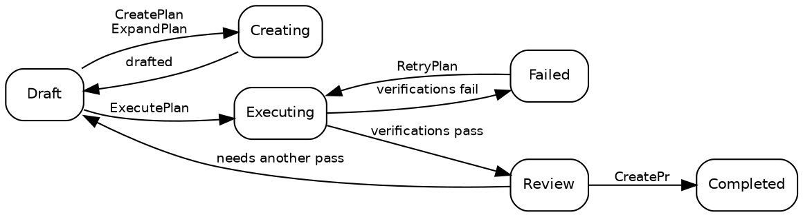

# Plans

## Plan states

A plan is always in exactly one of ten states:

| State         | Description                                                                          |
| ------------- | ------------------------------------------------------------------------------------ |
| **Draft**     | Initial state. The plan exists but execution has not started.                        |
| **Creating**  | `CreatePlan` or `ExpandPlan` is drafting the technical detail.                       |
| **Updating**  | `UpdatePlan` is refining an existing, already-drafted plan.                          |
| **Executing** | `ExecutePlan` is implementing the plan in a worktree.                                |
| **Review**    | Execution finished and the required verifications passed. Ready for a human.         |
| **Completed** | Reviewed, approved, and shipped — normally as a pull request.                        |
| **Failed**    | Verifications kept failing, or an interrupted execution could not be recovered.      |
| **Blocked**   | The plan cannot proceed without missing context, credentials or a decision from you. |
| **Skipped**   | Abandoned, discarded or judged unnecessary.                                          |
| **Icebox**    | Shelved for later.                                                                   |

The normal path is short:



> [!NOTE]
> **Stopping or deleting a running job** returns the plan to the state it was in _before_ the job
> started — a stopped `ExecutePlan` goes back to `Draft`, a stopped `RetryPlan` back to `Review`. A
> stopped or failed run keeps its work product, so you can inspect or resume the worktree. Deleting an
> `ExecutePlan` job is the exception: it discards the worktrees and artifacts and resets the plan to a
> clean `Draft`.

## Creating a plan

There are four pathways, and they all end in the same folder:

1. **The app** — write a description in the **New Plan** modal to spawn `CreatePlan`.
2. **The inbox** — `POST /api/inbox` on the running daemon starts a `CreatePlan` job from a task
   description. This is what the GitHub and jam.dev webhook integrations use, and it is exposed to
   coding agents as the `tendril_inbox` MCP tool.
3. **Recommendations** — accept a recommendation an earlier job left behind.
4. **The CLI** — `tendril plan create "<title>" <project>`.

Each plan is stored as a folder under `$TENDRIL_HOME/Plans/` with a numeric ID and a shortened name,
for example `00524-RelocateMultilingualRead/`.

## Plan structure

A plan folder is fully transparent and entirely local:

```
00524-RelocateMultilingualRead/
├── plan.yaml        # state, project, title, repos, prs, commits, verifications, dependsOn
├── Revisions/       # 001.md, 002.md … problem / solution / tests
├── Verification/    # one report per verification
├── Artifacts/       # screenshots and generated assets
├── Worktrees/       # the git worktrees used during execution
└── costs.csv        # token and cost tracking
```

Execution logs do **not** live here. Every job writes its log, its prompt and the raw agent output to
`$TENDRIL_HOME/Jobs/`, in a folder named `{jobId}-{planId}-{promptware}` — so a plan's execution
history survives even when the plan is reset to `Draft`.

Because it is all plain files, the CLI, the app and your own tools see the same data:

```bash
tendril plan list
tendril plan get 00524
tendril plan validate 00524
```

## Revisions

Each time a plan is drafted or refined, a new **revision** is written to `Revisions/` rather than
overwriting the last one, so the reasoning is versioned alongside the code. A revision contains:

- **Problem** — what needs to be fixed or built, and why it matters.
- **Solution** — the technical approach, in enough detail to implement without guessing.
- **Tests** — how correctness will be judged.

Which checks actually gate the plan is recorded in `plan.yaml` under `verifications`, not in the
revision text — see [Lifecycle & Jobs](03_Lifecycle.md).

## Next steps

- [Promptwares](02_Promptwares.md) — the agents that move a plan between the states above.
- [Lifecycle & Jobs](03_Lifecycle.md) — what happens during a single run.
