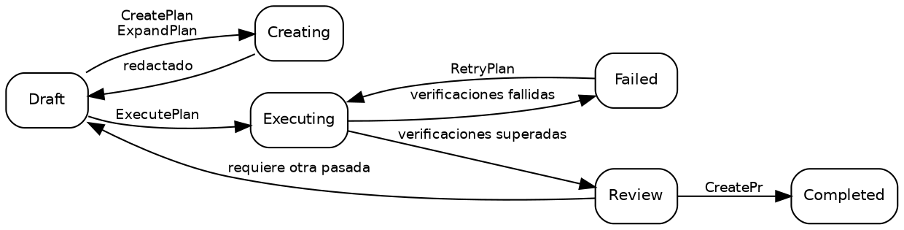

# Planes

## Estados de un plan

Un plan se encuentra siempre en exactamente uno de diez estados posibles:

| Estado        | Descripción                                                                                                             |
| ------------- | ----------------------------------------------------------------------------------------------------------------------- |
| **Draft**     | Estado inicial. El plan existe pero la ejecución aún no ha comenzado.                                                   |
| **Creating**  | [CreatePlan](02_Promptwares.md) o [ExpandPlan](02_Promptwares.md) está redactando el detalle técnico.                   |
| **Updating**  | [UpdatePlan](02_Promptwares.md) está refinando el plan con anotaciones y comentarios.                                   |
| **Executing** | [ExecutePlan](02_Promptwares.md) está implementando código en un [Git worktree](https://git-scm.com/docs/git-worktree). |
| **Review**    | La ejecución ha terminado y las verificaciones requeridas se han superado. Listo para revisión del desarrollador.       |
| **Completed** | Revisado, aprobado y entregado — normalmente mediante un pull request abierto por [CreatePr](02_Promptwares.md).        |
| **Failed**    | Las verificaciones fallaron o no fue posible recuperar una ejecución interrumpida.                                      |
| **Blocked**   | El plan no puede avanzar sin contexto faltante, credenciales o decisiones del usuario.                                  |
| **Skipped**   | Abandonado, descartado o considerado innecesario.                                                                       |
| **Icebox**    | Pospuesto para desarrollo futuro.                                                                                       |

El flujo habitual del ciclo de vida:



> [!NOTE]
> **Detener o cancelar un trabajo en ejecución** devuelve el plan a su estado previo al trabajo — un
> [ExecutePlan](02_Promptwares.md) detenido vuelve a `Draft`, y un
> [RetryPlan](02_Promptwares.md) detenido vuelve a `Review`. Tanto el trabajo realizado como los worktrees
> se conservan para que puedas inspeccionar los diffs parciales o reanudar la tarea.

## Crear un plan

Existen cuatro puntos de entrada principales para crear un plan:

1. **La aplicación de escritorio** — escribe un prompt o descripción de la funcionalidad en el cuadro de diálogo **New Plan**, lo que activa
   [CreatePlan](02_Promptwares.md).
2. **La API de buzón de entrada (Inbox)** — `POST /api/inbox` desencadena la ingesta automática desde incidencias de [GitHub](https://github.com)
   o informes de error de [Jam.dev](https://jam.dev). También se expone a agentes autónomos mediante la herramienta
   `tendril_inbox` de [Model Context Protocol](https://modelcontextprotocol.io/) (MCP).
3. **Recomendaciones** — convierte sugerencias de seguimiento generadas en ejecuciones previas de agentes en planes independientes.
4. **La CLI** — ejecuta `tendril plan create "<título>" <proyecto>`.

Cada plan se almacena como una carpeta bajo `$TENDRIL_HOME/Plans/` con un identificador numérico secuencial y un nombre simplificado
(por ejemplo, `00524-RelocateMultilingualRead/`).

## Estructura de un plan

El directorio de un plan es totalmente transparente, legible por personas y local:

```
00524-RelocateMultilingualRead/
├── plan.yaml        # metadatos: estado, proyecto, repos, pull requests, commits, verificaciones
├── Revisions/       # historial de versiones inmutable: 001.md, 002.md …
├── Verification/    # informe individual y salida de pruebas por filtro de verificación
├── Artifacts/       # capturas de pantalla, diagramas y recursos binarios generados
├── Worktrees/       # git worktrees aislados por repositorio utilizados durante la ejecución
└── costs.csv        # registro de auditoría de consumo de tokens y coste económico
```

Los registros de ejecución y la telemetría **no** residen en la carpeta del plan. Cada ejecución registra sus transcripciones brutas, prompts
y salidas stdout/stderr directamente en `$TENDRIL_HOME/Jobs/{jobId}-{planId}-{promptware}/`.

Inspecciona y gestiona los planes directamente desde la CLI:

```bash
# Listar todos los planes activos y sus estados actuales
tendril plan list

# Inspeccionar metadatos detallados y repositorios vinculados
tendril plan get 00524

# Validar la integridad del directorio y conformidad del esquema
tendril plan validate 00524

# Limpiar worktrees de planes completados o en estado terminal (--force sobrescribe el estado)
tendril plan cleanup 00524 --force

# Diagnosticar y migrar planes a las versiones de esquema actuales
tendril plan doctor --fix --prune-husks
```

## Revisiones y anotaciones en línea

Cada vez que se redacta o actualiza la especificación de un plan, se registra una nueva **revisión** inmutable en
`Revisions/` en lugar de sobrescribir el archivo anterior:

- **Problem (Problema)** — los requisitos del usuario, los síntomas del error y el análisis de causa raíz.
- **Solution (Solución)** — decisiones arquitectónicas, fases de implementación y modificaciones de archivos.
- **Tests & Acceptance (Pruebas y aceptación)** — criterios explícitos y casos de prueba automatizados para verificar la corrección.

### Anotaciones en línea sobre el plan

En la aplicación de escritorio, los desarrolladores pueden resaltar cualquier línea de un borrador de plan y añadir anotaciones en línea.
En lugar de obligarte a reescribir la descripción, Tendril envía estas anotaciones junto a la revisión
activa y ejecuta [UpdatePlan](02_Promptwares.md). El agente de flujo de trabajo analiza tus observaciones,
resuelve contradicciones y genera la siguiente revisión numerada en `Revisions/`.

Las comprobaciones de calidad que condicionan la ejecución se definen en `plan.yaml` bajo `verifications` — consulta
[Ciclo de vida y trabajos](03_Lifecycle.md).

## Próximos pasos

- [Promptwares](02_Promptwares.md) — explora las definiciones de agentes de flujo de trabajo, limitación de herramientas y memoria.
- [Ciclo de vida y trabajos](03_Lifecycle.md) — profundiza en la ejecución de trabajos, el aislamiento en worktrees y las verificaciones.
