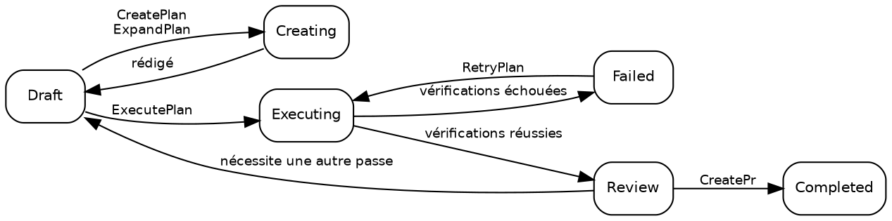

# Plans

## États d'un plan

Un plan se trouve systématiquement dans l'un de ces dix états exclusifs :

| État          | Description                                                                                                             |
| ------------- | ----------------------------------------------------------------------------------------------------------------------- |
| **Draft**     | État initial. Le plan existe mais l'exécution n'a pas commencé.                                                         |
| **Creating**  | [CreatePlan](02_Promptwares.md) ou [ExpandPlan](02_Promptwares.md) est en train de rédiger les détails techniques.      |
| **Updating**  | [UpdatePlan](02_Promptwares.md) affine un plan en fonction des annotations et retours.                                  |
| **Executing** | [ExecutePlan](02_Promptwares.md) implémente le code au sein d'un [Git worktree](https://git-scm.com/docs/git-worktree). |
| **Review**    | L'exécution est terminée et les barrières de vérification requises ont réussi. Prêt pour la revue du développeur.       |
| **Completed** | Examiné, validé et livré — généralement via une pull request ouverte par [CreatePr](02_Promptwares.md).                 |
| **Failed**    | Les vérifications ont échoué ou une exécution interrompue n'a pas pu être récupérée.                                    |
| **Blocked**   | Le plan ne peut pas continuer sans contexte manquant, identifiants ou arbitrages de l'utilisateur.                      |
| **Skipped**   | Abandonné, écarté ou jugé inutile.                                                                                      |
| **Icebox**    | Mis de côté pour un développement ultérieur.                                                                            |

Le cheminement classique du cycle de vie :



> [!NOTE]
> **Arrêter ou annuler un job en cours** restaure le plan dans l'état où il se trouvait avant le lancement du job — un
> [ExecutePlan](02_Promptwares.md) interrompu retourne en `Draft`, et un
> [RetryPlan](02_Promptwares.md) interrompu retourne en `Review`. Le travail réalisé et les worktrees
> sont conservés afin que vous puissiez examiner les diffs partiels ou reprendre les opérations.

## Créer un plan

Il existe quatre points d'entrée majeurs pour créer un plan :

1. **L'application de bureau** — rédigez une consigne ou un descriptif de fonctionnalité dans la boîte de dialogue **New Plan**, déclenchant
   [CreatePlan](02_Promptwares.md).
2. **L'API de boîte de réception (Inbox)** — un appel `POST /api/inbox` déclenche l'ingestion automatique à partir de tickets [GitHub](https://github.com)
   ou de rapports [Jam.dev](https://jam.dev). Cet accès est également mis à disposition des agents autonomes sous forme d'outil
   `tendril_inbox` via le [Model Context Protocol](https://modelcontextprotocol.io/) (MCP).
3. **Recommandations** — transformez des suggestions de suivi issues d'exécutions d'agents précédentes en plans autonomes.
4. **La CLI** — lancez `tendril plan create "<titre>" <projet>`.

Chaque plan est stocké sous la forme d'un dossier dans `$TENDRIL_HOME/Plans/` avec un identifiant numérique séquentiel et un nom normalisé
(par exemple, `00524-RelocateMultilingualRead/`).

## Structure d'un plan

Le répertoire d'un plan est parfaitement transparent, intelligible et local :

```
00524-RelocateMultilingualRead/
├── plan.yaml        # métadonnées : état, projet, dépôts, pull requests, commits, vérifications
├── Revisions/       # historique immuable des versions : 001.md, 002.md …
├── Verification/    # rapport individuel et sortie de tests pour chaque barrière de vérification
├── Artifacts/       # captures d'écran, diagrammes et fichiers binaires générés
├── Worktrees/       # worktrees git isolés par dépôt utilisés lors de l'exécution
└── costs.csv        # journal d'audit de consommation de jetons et des coûts financiers
```

Les journaux d'exécution et la télémétrie ne se trouvent **pas** dans le dossier du plan. Chaque exécution consigne ses transcriptions brutes, prompts
et sorties stdout/stderr directement dans `$TENDRIL_HOME/Jobs/{jobId}-{planId}-{promptware}/`.

Inspectez et gérez les plans directement à l'aide de la CLI :

```bash
# Lister tous les plans actifs et leurs états courants
tendril plan list

# Consulter les métadonnées détaillées et les dépôts rattachés
tendril plan get 00524

# Valider l'intégrité du répertoire et la conformité au schéma
tendril plan validate 00524

# Nettoyer les worktrees des plans terminés (--force outrepasse l'état)
tendril plan cleanup 00524 --force

# Diagnostiquer et faire migrer les plans vers les versions actuelles du schéma
tendril plan doctor --fix --prune-husks
```

## Révisions et annotations contextuelles

À chaque rédaction ou mise à jour de la spécification d'un plan, une nouvelle **révision** immuable est consignée dans
`Revisions/` sans remplacer le fichier précédent :

- **Problem (Problème)** — les besoins exprimés par l'utilisateur, les symptômes du bogue et l'analyse de cause racine.
- **Solution** — les choix d'architecture, le découpage par phases et les modifications de fichiers.
- **Tests & Acceptance (Tests et critères d'acceptation)** — les exigences explicites et les scénarios de test automatisés garantissant l'exactitude.

### Annotations de plan contextuelles

Dans l'application de bureau, les développeurs peuvent surligner n'importe quelle ligne d'un brouillon de plan et ajouter des annotations contextuelles.
Plutôt que de vous contraindre à réécrire votre consigne, Tendril regroupe ces annotations avec la révision active
et exécute [UpdatePlan](02_Promptwares.md). L'agent de flux de travail étudie vos remarques,
résout les contradictions et produit la révision numérotée suivante dans `Revisions/`.

Les contrôles de qualité conditionnant l'exécution sont définis dans `plan.yaml` sous la clé `verifications` — voir
[Cycle de vie et jobs](03_Lifecycle.md).

## Prochaines étapes

- [Promptwares](02_Promptwares.md) — explorer les définitions d'agents, la restriction d'outils et la mémoire.
- [Cycle de vie et jobs](03_Lifecycle.md) — étudier le déroulement des jobs, l'isolation par worktree et les vérifications.
