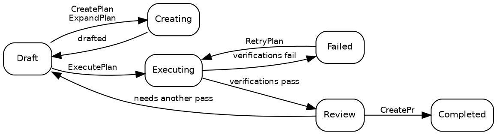

# योजनाएं (Plans)

## योजना की अवस्थाएं (Plan states)

एक योजना हमेशा दस अवस्थाओं में से ठीक एक अवस्था में होती है:

| अवस्था (State) | विवरण                                                                                                                                          |
| -------------- | ---------------------------------------------------------------------------------------------------------------------------------------------- |
| **Draft**      | प्रारंभिक अवस्था। योजना मौजूद है लेकिन निष्पादन शुरू नहीं हुआ है।                                                                              |
| **Creating**   | [CreatePlan](02_Promptwares.md) या [ExpandPlan](02_Promptwares.md) तकनीकी विवरण का मसौदा तैयार कर रहा है।                                      |
| **Updating**   | [UpdatePlan](02_Promptwares.md) टिप्पणियों और फ़ीडबैक के साथ योजना को परिष्कृत कर रहा है।                                                      |
| **Executing**  | [ExecutePlan](02_Promptwares.md) एक [Git worktree](https://git-scm.com/docs/git-worktree) में कोड लागू कर रहा है।                              |
| **Review**     | निष्पादन पूरा हो गया और आवश्यक सत्यापन चरण (verification gates) पास हो गए। डेवलपर समीक्षा के लिए तैयार।                                        |
| **Completed**  | समीक्षा की गई, स्वीकृत हुई, और शिप कर दी गई — आमतौर पर [CreatePr](02_Promptwares.md) द्वारा खोले गए एक पुल अनुरोध (pull request) के माध्यम से। |
| **Failed**     | सत्यापन विफल हो गया, या बाधित निष्पादन को पुनर्प्राप्त नहीं किया जा सका।                                                                       |
| **Blocked**    | लापता संदर्भ (context), क्रेडेंशियल्स, या उपयोगकर्ता के निर्णयों के बिना योजना आगे नहीं बढ़ सकती।                                              |
| **Skipped**    | छोड़ दिया गया, रद्द कर दिया गया, या अनावश्यक माना गया।                                                                                         |
| **Icebox**     | भविष्य के विकास के लिए टाल दिया गया।                                                                                                           |

सामान्य जीवनचक्र पथ:



> [!NOTE]
> **चल रहे कार्य (job) को रोकना या रद्द करना** योजना को उसकी पूर्व-कार्य अवस्था में पुनर्स्थापित कर देता है — रोका गया
> [ExecutePlan](02_Promptwares.md) `Draft` में वापस आ जाता है, और रोका गया
> [RetryPlan](02_Promptwares.md) `Review` में वापस आ जाता है। कार्य उत्पाद और worktrees
> सुरक्षित रहते हैं ताकि आप आंशिक diffs का निरीक्षण कर सकें या कार्य फिर से शुरू कर सकें।

## एक योजना बनाना (Creating a plan)

योजना बनाने के लिए चार प्राथमिक प्रवेश बिंदु हैं:

1. **डेस्कटॉप ऐप (The Desktop App)** — **New Plan** संवाद में एक प्रॉम्प्ट या फीचर विवरण लिखें, जो
   [CreatePlan](02_Promptwares.md) को ट्रिगर करता है।
2. **इनबॉक्स एपीआई (The Inbox API)** — `POST /api/inbox` [GitHub](https://github.com)
   इश्यू या [Jam.dev](https://jam.dev) बग रिपोर्ट से स्वचालित अंतर्ग्रहण (ingestion) को ट्रिगर करता है। यह स्वायत्त एजेंटों के लिए
   `tendril_inbox` [Model Context Protocol](https://modelcontextprotocol.io/) (MCP) टूल के रूप में भी उपलब्ध है।
3. **सिफारिशें (Recommendations)** — पिछले एजेंट रन द्वारा उत्पन्न फॉलो-अप सुझावों को स्वतंत्र योजनाओं में पदोन्नत करें।
4. **सीएलआई (The CLI)** — `tendril plan create "<title>" <project>` चलाएं।

प्रत्येक योजना `$TENDRIL_HOME/Plans/` के अंतर्गत एक अनुक्रमिक संख्यात्मक आईडी और एक स्लगिफ़ाइड (slugified)
नाम (उदा. `00524-RelocateMultilingualRead/`) के साथ एक फ़ोल्डर के रूप में संग्रहीत की जाती है।

## योजना की संरचना (Plan structure)

एक योजना निर्देशिका (directory) पूरी तरह से पारदर्शी, मानव-पठनीय और स्थानीय होती है:

```
00524-RelocateMultilingualRead/
├── plan.yaml        # metadata: state, project, repos, pull requests, commits, verifications
├── Revisions/       # immutable version history: 001.md, 002.md …
├── Verification/    # individual report and test output per verification gate
├── Artifacts/       # screenshots, diagrams, and generated binary assets
├── Worktrees/       # isolated git worktrees per repository used during execution
└── costs.csv        # token expenditure and dollar cost audit log
```

निष्पादन लॉग और टेलीमेट्री योजना फ़ोल्डर में **नहीं** रहते हैं। प्रत्येक रन सीधे
`$TENDRIL_HOME/Jobs/{jobId}-{planId}-{promptware}/` में रॉ ट्रांसक्रिप्ट, प्रॉम्प्ट, और stdout/stderr लॉग करता है।

सीएलआई के माध्यम से सीधे योजनाओं का निरीक्षण और प्रबंधन करें:

```bash
# List all active plans and their current states
tendril plan list

# Inspect detailed metadata and repository attachments
tendril plan get 00524

# Validate directory integrity and schema conformity
tendril plan validate 00524

# Clean up worktrees for completed or terminal plans (--force overrides state)
tendril plan cleanup 00524 --force

# Diagnose and migrate plans to current schema versions
tendril plan doctor --fix --prune-husks
```

## संशोधन और इनलाइन टिप्पणियां (Revisions & inline annotations)

हर बार जब किसी योजना विनिर्देश (specification) का मसौदा तैयार किया जाता है या उसे अपडेट किया जाता है, तो पिछली फ़ाइल को बदलने के बजाय
`Revisions/` में एक नया अपरिवर्तनीय **संशोधन (revision)** दर्ज किया जाता है:

- **Problem** — उपयोगकर्ता की आवश्यकताएं, बग के लक्षण, और मूल कारण विश्लेषण (root cause analysis)।
- **Solution** — वास्तुशिल्प निर्णय (architectural decisions), चरणबद्ध कार्यान्वयन कदम, और फ़ाइल संशोधन।
- **Tests & Acceptance** — स्पष्ट मानदंड और सटीकता को सत्यापित करने वाले स्वचालित परीक्षण मामले (test cases)।

### इनलाइन योजना टिप्पणियां (Inline plan annotations)

डेस्कटॉप ऐप में, डेवलपर्स ड्राफ्ट योजना में किसी भी पंक्ति को हाइलाइट कर सकते हैं और इनलाइन टिप्पणियां (annotations) जोड़ सकते हैं।
आपको अपने संक्षिप्त विवरण को फिर से लिखने के लिए मजबूर करने के बजाय, Tendril इन टिप्पणियों को सक्रिय
संशोधन के साथ पैकेज करता है और [UpdatePlan](02_Promptwares.md) को निष्पादित करता है। वर्कफ़्लो एजेंट आपकी
समीक्षाओं को पढ़ता है, विरोधाभासों को हल करता है, और `Revisions/` में अगला क्रमांकित संशोधन उत्पन्न करता है।

वास्तव में कौन से गुणवत्ता परीक्षण (quality checks) निष्पादन को नियंत्रित करते हैं, यह `plan.yaml` में `verifications` के अंतर्गत परिभाषित किया गया है — देखें
[जीवनचक्र और कार्य (Lifecycle & Jobs)](03_Lifecycle.md)।

## अगले कदम (Next steps)

- [Promptwares](02_Promptwares.md) — वर्कफ़्लो एजेंट परिभाषाएं, टूल स्कोपिंग, और मेमोरी का अन्वेषण करें।
- [जीवनचक्र और कार्य (Lifecycle & Jobs)](03_Lifecycle.md) — कार्य निष्पादन (job execution), worktree सैंडबॉक्सिंग, और सत्यापन की गहराई में जाएं।
