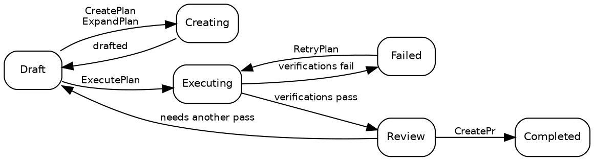

# 計画

## 計画の状態

計画は常に以下の 10 個の状態のいずれか 1 つにあります：

| 状態          | 説明                                                                                                                       |
| ------------- | -------------------------------------------------------------------------------------------------------------------------- |
| **Draft**     | 初期状態。計画は存在しますが、実行はまだ開始されていません。                                                               |
| **Creating**  | [CreatePlan](02_Promptwares.md) または [ExpandPlan](02_Promptwares.md) が技術的な詳細を下書きしています。                  |
| **Updating**  | [UpdatePlan](02_Promptwares.md) が注釈やフィードバックを取り入れて計画を改訂しています。                                   |
| **Executing** | [ExecutePlan](02_Promptwares.md) が [Git ワークツリー](https://git-scm.com/docs/git-worktree) 内でコードを実装しています。 |
| **Review**    | 実行が完了し、必要な検証ゲートに合格しました。開発者のレビュー待ちの状態です。                                             |
| **Completed** | レビューされ、承認され、出荷されました — 通常は [CreatePr](02_Promptwares.md) によって作成されたプルリクエスト経由。       |
| **Failed**    | 検証が失敗したか、中断された実行を回復できませんでした。                                                                   |
| **Blocked**   | コンテキスト、認証情報、またはユーザーの判断が不足しているため、計画を進めることができません。                             |
| **Skipped**   | 放棄、破棄、または不要と判断されました。                                                                                   |
| **Icebox**    | 将来の開発のために保留されました。                                                                                         |

通常のライフサイクルの流れ：



> [!NOTE]
> **実行中のジョブを停止またはキャンセル**すると、計画はジョブ開始前の状態に戻ります — 停止された [ExecutePlan](02_Promptwares.md) は `Draft` に戻り、停止された [RetryPlan](02_Promptwares.md) は `Review` に戻ります。成果物とワークツリーは保持されるため、部分的な差分を検査したり、作業を再開したりできます。

## 計画の作成

計画を作成するための主なエントリーポイントは 4 つあります：

1. **デスクトップアプリ** — **New Plan** ダイアログでプロンプトや機能概要を入力し、[CreatePlan](02_Promptwares.md) をトリガーします。
2. **Inbox API** — `POST /api/inbox` は、[GitHub](https://github.com) の issue や [Jam.dev](https://jam.dev) のバグレポートからの自動取り込みをトリガーします。自律エージェント向けには `tendril_inbox` [Model Context Protocol](https://modelcontextprotocol.io/) (MCP) ツールとしても公開されています。
3. **レコメンデーション** — 以前のエージェント実行で生成されたフォローアップ提案を、独立した計画に昇格させます。
4. **CLI** — `tendril plan create "<title>" <project>` を実行します。

各計画は、連番の数値 ID とスラッグ化された名前（例：`00524-RelocateMultilingualRead/`）を持つフォルダとして `$TENDRIL_HOME/Plans/` の下に保存されます。

## 計画のディレクトリ構成

計画ディレクトリは完全に透過的で、人間が読み取り可能なローカル構成となっています：

```
00524-RelocateMultilingualRead/
├── plan.yaml        # メタデータ：状態、プロジェクト、リポジトリ、プルリクエスト、コミット、検証
├── Revisions/       # 不変のバージョン履歴：001.md、002.md …
├── Verification/    # 各検証ゲートごとのレポートおよびテスト出力
├── Artifacts/       # スクリーンショット、図表、生成されたバイナリアセット
├── Worktrees/       # 実行中に使用されたリポジトリごとの分離された Git ワークツリー
└── costs.csv        # トークン消費と金額コストの監査ログ
```

実行ログとテレメトリは計画フォルダ内には**保存されません**。毎回の実行で生の文字起こし記録、プロンプト、標準出力/標準エラー出力が `$TENDRIL_HOME/Jobs/{jobId}-{planId}-{promptware}/` に直接記録されます。

CLI 経由で計画を直接検査および管理できます：

```bash
# すべてのアクティブな計画とその現在の状態を一覧表示
tendril plan list

# 詳細なメタデータと添付されたリポジトリを検査
tendril plan get 00524

# ディレクトリの整合性とスキーマ適合性を検証
tendril plan validate 00524

# 完了または終了した計画のワークツリーをクリーンアップ（--force で状態をオーバーライド）
tendril plan cleanup 00524 --force

# 計画を診断し、現在のスキーマバージョンに移行
tendril plan doctor --fix --prune-husks
```

## 改訂とインライン注釈

計画仕様が起草または更新されるたびに、前のファイルを上書きするのではなく、新しい不変の**改訂版 (revision)** が `Revisions/` に記録されます：

- **問題 (Problem)** — ユーザー要件、バグの症状、および根本原因分析。
- **解決策 (Solution)** — アーキテクチャの決定、段階的な実装手順、およびファイル変更。
- **テストと受け入れ基準 (Tests & Acceptance)** — 正確性を検証する明確な基準と自動テストケース。

### インライン計画注釈

デスクトップアプリでは、開発者は下書き計画内の任意の行をハイライトしてインライン注釈を追加できます。概要を最初から書き直す必要はなく、Tendril はこれらの注釈をアクティブな改訂版と一緒にパッケージ化し、[UpdatePlan](02_Promptwares.md) を実行します。ワークフローエージェントは指摘事項を読み、矛盾を解消し、`Revisions/` に次の番号の改訂版を生成します。

どの品質チェックが実際に実行をゲートするかは、`plan.yaml` の `verifications` で定義されます — [ライフサイクルとジョブ](03_Lifecycle.md) を参照してください。

## 次のステップ

- [プロンプトウェア](02_Promptwares.md) — ワークフローエージェントの定義、ツールスコープ、メモリの確認。
- [ライフサイクルとジョブ](03_Lifecycle.md) — ジョブの実行、ワークツリーのサンドボックス化、検証の詳細。
