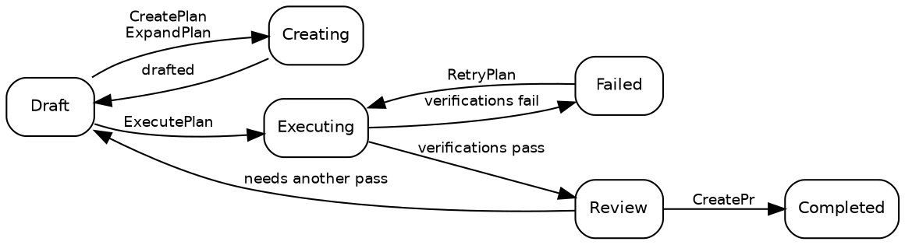

# Planos

## Estados do plano

Um plano está sempre em exatamente um de dez estados:

| Estado        | Descrição                                                                                                                |
| ------------- | ------------------------------------------------------------------------------------------------------------------------ |
| **Draft**     | Estado inicial. O plano existe, mas a execução ainda não começou.                                                        |
| **Creating**  | [CreatePlan](02_Promptwares.md) ou [ExpandPlan](02_Promptwares.md) está elaborando detalhes técnicos.                    |
| **Updating**  | [UpdatePlan](02_Promptwares.md) está refinando um plano com anotações e feedback.                                        |
| **Executing** | [ExecutePlan](02_Promptwares.md) está implementando código em uma [Git worktree](https://git-scm.com/docs/git-worktree). |
| **Review**    | A execução terminou e as etapas de verificação obrigatórias passaram. Pronto para a revisão do desenvolvedor.            |
| **Completed** | Revisado, aprovado e entregue — normalmente por meio de um pull request aberto por [CreatePr](02_Promptwares.md).        |
| **Failed**    | As verificações falharam ou uma execução interrompida não pôde ser recuperada.                                           |
| **Blocked**   | O plano não pode prosseguir sem contexto ausente, credenciais ou decisões do usuário.                                    |
| **Skipped**   | Abandonado, descartado ou considerado desnecessário.                                                                     |
| **Icebox**    | Engavetado para desenvolvimento futuro.                                                                                  |

O fluxo normal do ciclo de vida:



> [!NOTE]
> **Interromper ou cancelar uma tarefa em execução** restaura o plano para o estado anterior à tarefa — um
> [ExecutePlan](02_Promptwares.md) interrompido retorna para `Draft`, e um
> [RetryPlan](02_Promptwares.md) interrompido retorna para `Review`. O produto de trabalho e as worktrees
> são preservados para que você possa inspecionar diffs parciais ou retomar o trabalho.

## Criando um plano

Existem quatro pontos de entrada principais para criar um plano:

1. **O aplicativo Desktop** — escreva um prompt ou resumo de funcionalidade na caixa de diálogo **New Plan**, acionando
   [CreatePlan](02_Promptwares.md).
2. **A API Inbox** — `POST /api/inbox` aciona a ingestão automática a partir de issues do [GitHub](https://github.com)
   ou relatórios de bugs do [Jam.dev](https://jam.dev). Também está exposto a agentes autônomos como a
   ferramenta [Model Context Protocol](https://modelcontextprotocol.io/) (MCP) `tendril_inbox`.
3. **Recomendações** — promova sugestões de acompanhamento geradas por execuções anteriores de agentes em planos independentes.
4. **A CLI** — execute `tendril plan create "<title>" <project>`.

Cada plano é armazenado como uma pasta em `$TENDRIL_HOME/Plans/` com um ID numérico sequencial e um nome
simplificado em formato slug (por exemplo, `00524-RelocateMultilingualRead/`).

## Estrutura do plano

Um diretório de plano é completamente transparente, legível por humanos e local:

```
00524-RelocateMultilingualRead/
├── plan.yaml        # metadata: state, project, repos, pull requests, commits, verifications
├── Revisions/       # immutable version history: 001.md, 002.md …
├── Verification/    # individual report and test output per verification gate
├── Artifacts/       # screenshots, diagrams, and generated binary assets
├── Worktrees/       # isolated git worktrees per repository used during execution
└── costs.csv        # token expenditure and dollar cost audit log
```

Logs de execução e telemetria **não** ficam na pasta do plano. Cada execução registra transcrições brutas, prompts
e stdout/stderr diretamente em `$TENDRIL_HOME/Jobs/{jobId}-{planId}-{promptware}/`.

Inspecione e gerencie planos diretamente via CLI:

```bash
# List all active plans and their current states
tendril plan list

# Inspect detailed metadata and repository attachments
tendril plan get 00524

# Validate directory integrity and schema conformity
tendril plan validate 00524

# Clean up worktrees for completed or terminal plans (--force overrides state)
tendril plan cleanup 00524 --force

# Diagnose and migrate plans to current schema versions
tendril plan doctor --fix --prune-husks
```

## Revisões e anotações em linha

Cada vez que a especificação de um plano é elaborada ou atualizada, uma nova **revisão** imutável é gravada em
`Revisions/` em vez de substituir o arquivo anterior:

- **Problema** — os requisitos do usuário, sintomas de bugs e análise de causa raiz.
- **Solução** — decisões arquiteturais, etapas de implementação em fases e modificações de arquivos.
- **Testes e Aceitação** — critérios explícitos e casos de teste automatizados que verificam a exatidão.

### Anotações de plano em linha

No aplicativo desktop, os desenvolvedores podem destacar qualquer linha em um plano em rascunho e adicionar anotações em linha.
Em vez de forçar você a reescrever seu resumo, o Tendril empacota essas anotações junto com a revisão
ativa e executa [UpdatePlan](02_Promptwares.md). O agente de fluxo de trabalho lê suas
críticas, resolve contradições e gera a próxima revisão numerada em `Revisions/`.

Quais verificações de qualidade realmente controlam a execução é definido em `plan.yaml` sob `verifications` — consulte
[Lifecycle & Jobs](03_Lifecycle.md).

## Próximos passos

- [Promptwares](02_Promptwares.md) — explore definições de agentes de fluxo de trabalho, escopo de ferramentas e memória.
- [Lifecycle & Jobs](03_Lifecycle.md) — aprofunde-se na execução de tarefas, isolamento de worktree e verificações.
