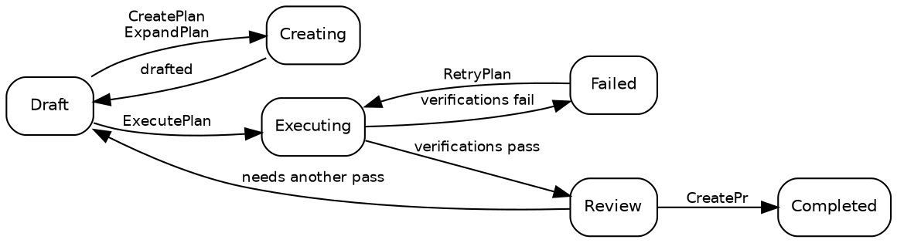

# Планы

## Состояния плана

План всегда находится ровно в одном из десяти состояний:

| Состояние     | Описание                                                                                                                 |
| ------------- | ------------------------------------------------------------------------------------------------------------------------ |
| **Draft**     | Начальное состояние. План существует, но выполнение ещё не началось.                                                     |
| **Creating**  | [CreatePlan](02_Promptwares.md) или [ExpandPlan](02_Promptwares.md) формирует технические детали.                        |
| **Updating**  | [UpdatePlan](02_Promptwares.md) обновляет план с учётом аннотаций и отзывов.                                             |
| **Executing** | [ExecutePlan](02_Promptwares.md) реализует код в [рабочем дереве Git (worktree)](https://git-scm.com/docs/git-worktree). |
| **Review**    | Выполнение завершено, и обязательные этапы верификации пройдены. План готов к ревью разработчиком.                       |
| **Completed** | Проверено, одобрено и отправлено — обычно через pull request, открытый [CreatePr](02_Promptwares.md).                    |
| **Failed**    | Верификация завершилась ошибкой, или прерванное выполнение не удалось восстановить.                                      |
| **Blocked**   | План не может продолжаться из-за отсутствия контекста, учётных данных или решений пользователя.                          |
| **Skipped**   | Отменено, отброшено или признано ненужным.                                                                               |
| **Icebox**    | Отложено для будущей разработки.                                                                                         |

Стандартный путь жизненного цикла:



> [!NOTE]
> **Остановка или отмена запущенного задания** возвращает план в состояние, предшествовавшее запуску: остановленный
> [ExecutePlan](02_Promptwares.md) возвращается в `Draft`, а остановленный
> [RetryPlan](02_Promptwares.md) — в `Review`. Результаты работы и рабочие деревья
> сохраняются, чтобы вы могли просмотреть частичные диффы или возобновить работу.

## Создание плана

Существует четыре основных способа создания плана:

1. **Десктопное приложение** — напишите промпт или краткое описание задачи в диалоговом окне **New Plan**, что запустит
   [CreatePlan](02_Promptwares.md).
2. **API входящих сообщений (Inbox API)** — запрос `POST /api/inbox` запускает автоматическое добавление из issue [GitHub](https://github.com)
   или отчётов об ошибках [Jam.dev](https://jam.dev). Он также доступен автономным агентам в виде инструмента
   `tendril_inbox` протокола [Model Context Protocol](https://modelcontextprotocol.io/) (MCP).
3. **Рекомендации** — преобразование сопутствующих предложений, созданных агентами при предыдущих запусках, в самостоятельные планы.
4. **CLI** — выполните `tendril plan create "<заголовок>" <проект>`.

Каждый план хранится в виде папки в `$TENDRIL_HOME/Plans/` с последовательным числовым ID и нормализованным
именем (например, `00524-RelocateMultilingualRead/`).

## Структура плана

Каталог плана полностью прозрачен, доступен для чтения человеком и хранится локально:

```
00524-RelocateMultilingualRead/
├── plan.yaml        # метаданные: состояние, проект, репозитории, pull requests, коммиты, верификации
├── Revisions/       # неизменяемая история версий: 001.md, 002.md …
├── Verification/    # отдельные отчёты и результаты тестов для каждого этапа верификации
├── Artifacts/       # скриншоты, диаграммы и созданные бинарные ресурсы
├── Worktrees/       # изолированные рабочие деревья git для каждого репозитория, используемые при выполнении
└── costs.csv        # журнал расхода токенов и стоимости в долларах
```

Логи выполнения и телеметрия **не** хранятся в папке плана. Каждый запуск записывает необработанные транскрипты, промпты
и потоки stdout/stderr непосредственно в `$TENDRIL_HOME/Jobs/{jobId}-{planId}-{promptware}/`.

Просматривайте планы и управляйте ими через CLI:

```bash
# Список всех активных планов и их текущих состояний
tendril plan list

# Просмотр подробных метаданных и прикреплённых репозиториев
tendril plan get 00524

# Проверка целостности каталога и соответствия схеме
tendril plan validate 00524

# Очистка рабочих деревьев для завершённых планов (--force переопределяет проверку состояния)
tendril plan cleanup 00524 --force

# Диагностика и миграция планов на текущие версии схемы
tendril plan doctor --fix --prune-husks
```

## Ревизии и встроенные аннотации

Каждый раз, когда спецификация плана составляется или обновляется, новая неизменяемая **ревизия** записывается в
папку `Revisions/`, а не перезаписывает предыдущий файл:

- **Проблема (Problem)** — требования пользователя, симптомы ошибки и анализ первопричины.
- **Решение (Solution)** — архитектурные решения, поэтапные шаги реализации и изменения файлов.
- **Тесты и приёмка (Tests & Acceptance)** — явные критерии и автоматические тесты, проверяющие корректность.

### Встроенные аннотации к плану

В десктопном приложении разработчики могут выделить любую строку в черновике плана и добавить контекстную аннотацию.
Вместо необходимости переписывать всё описание заново Tendril передаёт эти аннотации вместе с активной
ревизией агенту [UpdatePlan](02_Promptwares.md). Агент рабочего процесса изучает ваши
замечания, устраняет противоречия и создаёт следующую ревизию с новым номером в `Revisions/`.

То, какие именно проверки качества являются обязательными для перехода к завершению, определяется в файле `plan.yaml` в блоке `verifications` — см.
[Жизненный цикл и задания](03_Lifecycle.md).

## Следующие шаги

- [Промптвары](02_Promptwares.md) — определения агентов рабочих процессов, ограничение инструментов и память.
- [Жизненный цикл и задания](03_Lifecycle.md) — выполнение заданий, изолированные рабочие деревья и верификации.
