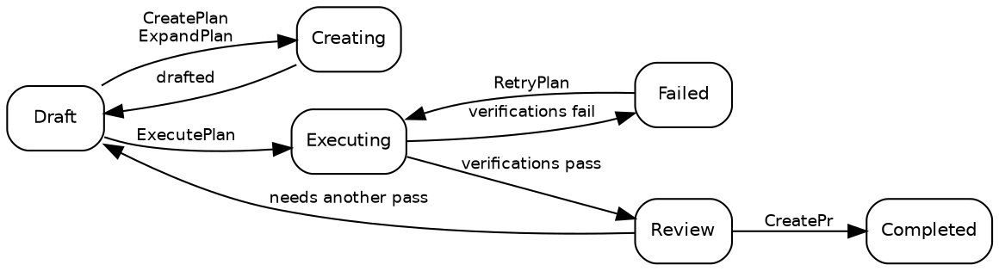

# Planer

## Plantillstånd

En plan befinner sig alltid i exakt ett av tio tillstånd:

| Tillstånd     | Beskrivning                                                                                                     |
| ------------- | --------------------------------------------------------------------------------------------------------------- |
| **Draft**     | Ursprungligt tillstånd. Planen finns men exekveringen har inte påbörjats.                                       |
| **Creating**  | [CreatePlan](02_Promptwares.md) eller [ExpandPlan](02_Promptwares.md) utformar tekniska detaljer.               |
| **Updating**  | [UpdatePlan](02_Promptwares.md) förfinar en plan med annoteringar och feedback.                                 |
| **Executing** | [ExecutePlan](02_Promptwares.md) implementerar kod i ett [Git-worktree](https://git-scm.com/docs/git-worktree). |
| **Review**    | Exekveringen är klar och obligatoriska verifieringsgrindar passerades. Redo för utvecklargranskning.            |
| **Completed** | Granskad, godkänd och levererad — vanligtvis via en pull request som öppnas av [CreatePr](02_Promptwares.md).   |
| **Failed**    | Verifieringar misslyckades eller en avbruten exekvering kunde inte återställas.                                 |
| **Blocked**   | Planen kan inte fortsätta på grund av saknad kontext, inloggningsuppgifter eller användarbeslut.                |
| **Skipped**   | Övergiven, kasserad eller bedömd som onödig.                                                                    |
| **Icebox**    | Lagd på is för framtida utveckling.                                                                             |

Den normala livscykelvägen:



> [!NOTE]
> **Att stoppa eller avbryta ett pågående jobb** återställer planen till dess tillstånd före jobbet — en stoppad
> [ExecutePlan](02_Promptwares.md) återgår till `Draft`, och en stoppad
> [RetryPlan](02_Promptwares.md) återgår till `Review`. Arbetsresultat och worktrees
> bevaras så att du kan inspektera partiella differenser eller återuppta arbetet.

## Skapa en plan

Det finns fyra huvudsakliga ingångspunkter för att skapa en plan:

1. **Skrivbordsappen** — skriv en prompt eller en funktionsbeskrivning i dialogrutan **New Plan**, vilket utlöser
   [CreatePlan](02_Promptwares.md).
2. **Inkorgs-API:et (Inbox API)** — `POST /api/inbox` utlöser automatisk inhämtning från [GitHub](https://github.com)-ärenden
   eller felrapporter från [Jam.dev](https://jam.dev). Det exponeras även för autonoma agenter som MCP-verktyget
   `tendril_inbox` via [Model Context Protocol](https://modelcontextprotocol.io/).
3. **Rekommendationer** — uppgradera uppföljningsförslag som genererats av tidigare agentkörningar till fristående planer.
4. **CLI:et** — kör `tendril plan create "<titel>" <projekt>`.

Varje plan lagras som en mapp under `$TENDRIL_HOME/Plans/` med ett sekventiellt numeriskt ID och ett slugifierat
namn (t.ex. `00524-RelocateMultilingualRead/`).

## Planstruktur

En plankatalog är helt transparent, lättläst för människor och lagras lokalt:

```
00524-RelocateMultilingualRead/
├── plan.yaml        # metadata: tillstånd, projekt, arkiv, pull requests, commits, verifieringar
├── Revisions/       # oföränderlig versionshistorik: 001.md, 002.md …
├── Verification/    # individuella rapporter och testutdata per verifieringsgrind
├── Artifacts/       # skärmdumpar, diagram och genererade binära tillgångar
├── Worktrees/       # isolerade git-worktrees per arkiv som använts under körning
└── costs.csv        # verifieringslogg över tokenförbrukning och dollarkostnad
```

Körningsloggar och telemetri finns **inte** i planmappen. Varje körning loggar råa transkriptioner, prompter
och stdout/stderr direkt till `$TENDRIL_HOME/Jobs/{jobId}-{planId}-{promptware}/`.

Inspektera och hantera planer direkt via CLI:et:

```bash
# Lista alla aktiva planer och deras aktuella tillstånd
tendril plan list

# Inspektera detaljerad metadata och kopplade arkiv
tendril plan get 00524

# Validera katalogintegritet och schemakonformitet
tendril plan validate 00524

# Rensa worktrees för slutförda planer (--force åsidosätter tillståndet)
tendril plan cleanup 00524 --force

# Diagnostisera och migrera planer till aktuella schemaversioner
tendril plan doctor --fix --prune-husks
```

## Revisioner & infogade annoteringar

Varje gång en planspecifikation utformas eller uppdateras registreras en ny oföränderlig **revision** i
`Revisions/` i stället för att ersätta föregående fil:

- **Problem** — användarkrav, felsymptom och grundorsaksanalys.
- **Lösning (Solution)** — arkitektoniska beslut, fasindelade implementeringssteg och filändringar.
- **Tester & Godkännande (Tests & Acceptance)** — explicita kriterier och automatiserade testfall som verifierar korrekthet.

### Infogade planannoteringar

I skrivbordsappen kan utvecklare markera valfri rad i ett planutkast och lägga till infogade annoteringar.
Istället för att tvinga dig att skriva om din beskrivning paketerar Tendril dessa annoteringar tillsammans med den aktiva
revisionen och kör [UpdatePlan](02_Promptwares.md). Arbetsflödesagenten läser din
feedback, löser motsägelser och genererar nästa numrerade revision i `Revisions/`.

Vilka kvalitetskontroller som faktiskt utgör grindar för exekveringen definieras i `plan.yaml` under `verifications` — se
[Livscykel & Jobb](03_Lifecycle.md).

## Nästa steg

- [Promptwares](02_Promptwares.md) — utforska definitioner av arbetsflödesagenter, verktygsbegränsningar och minne.
- [Livscykel & Jobb](03_Lifecycle.md) — djupdykning i jobbkörning, sandlådor i worktrees och verifieringar.
