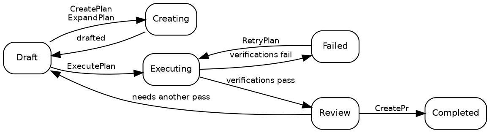

# 计划

## 计划状态

计划始终严格处于以下十个状态之一：

| 状态          | 描述                                                                                                                  |
| ------------- | --------------------------------------------------------------------------------------------------------------------- |
| **Draft**     | 初始状态。计划已存在，但尚未开始执行。                                                                                |
| **Creating**  | [CreatePlan](02_Promptwares.md) 或 [ExpandPlan](02_Promptwares.md) 正在起草技术细节。                                 |
| **Updating**  | [UpdatePlan](02_Promptwares.md) 正在结合批注和反馈进一步完善计划。                                                    |
| **Executing** | [ExecutePlan](02_Promptwares.md) 正在 [Git 工作区 (worktree)](https://git-scm.com/docs/git-worktree) 中实施代码修改。 |
| **Review**    | 执行已完成，且必需的验证门禁已通过。等待开发者审查。                                                                  |
| **Completed** | 已审查、已批准并已交付 —— 通常是通过由 [CreatePr](02_Promptwares.md) 创建的 Pull Request。                            |
| **Failed**    | 验证失败，或者中断的执行无法恢复。                                                                                    |
| **Blocked**   | 由于缺少上下文、凭证或用户决策，计划无法继续进行。                                                                    |
| **Skipped**   | 已放弃、丢弃或被认定为无需执行。                                                                                      |
| **Icebox**    | 搁置以备将来开发。                                                                                                    |

常规生命周期路径：



> [!NOTE]
> **停止或取消正在运行的任务**会将计划恢复到该任务启动前的状态 —— 停止的 [ExecutePlan](02_Promptwares.md) 会回到 `Draft`，而停止的 [RetryPlan](02_Promptwares.md) 会回到 `Review`。工作成果和工作区均予以保留，以便您检查部分 diff 或恢复工作。

## 创建计划

主要有四种创建计划的入口途径：

1. **桌面应用** — 在 **New Plan** 对话框中编写提示词或功能简报，触发 [CreatePlan](02_Promptwares.md)。
2. **收件箱 API (Inbox API)** — `POST /api/inbox` 触发从 [GitHub](https://github.com) Issue 或 [Jam.dev](https://jam.dev) 缺陷报告中自动摄取。它还作为 `tendril_inbox` [Model Context Protocol](https://modelcontextprotocol.io/) (MCP) 工具暴露给自主智能体。
3. **建议事项 (Recommendations)** — 将先前智能体运行中生成的后续建议提升为独立计划。
4. **CLI** — 运行 `tendril plan create "<title>" <project>`。

每个计划作为文件夹存储在 `$TENDRIL_HOME/Plans/` 下，带有递增的数字 ID 和 slug 化名称（例如 `00524-RelocateMultilingualRead/`）。

## 计划目录结构

计划目录完全透明、人类可读，且全部保存在本地：

```
00524-RelocateMultilingualRead/
├── plan.yaml        # 元数据：状态、项目、代码仓库、Pull Request、提交、验证门禁
├── Revisions/       # 不可变的版本历史：001.md, 002.md …
├── Verification/    # 每个验证门禁的独立报告与测试输出
├── Artifacts/       # 截图、图表和生成的二进制资产
├── Worktrees/       # 执行期间每个仓库所使用的隔离 Git 工作区
└── costs.csv        # Token 消耗与美元开销审计日志
```

执行日志和遥测数据**不会**存放在计划文件夹中。每次运行都会将原始转写记录、提示词和标准输出/标准错误输出直接记录到 `$TENDRIL_HOME/Jobs/{jobId}-{planId}-{promptware}/`。

通过 CLI 直接检查和管理计划：

```bash
# 列出所有活跃计划及其当前状态
tendril plan list

# 检查详细元数据和关联代码仓库
tendril plan get 00524

# 验证目录完整性与 schema 一致性
tendril plan validate 00524

# 清理已完成或终态计划的工作区（--force 可覆盖状态限制）
tendril plan cleanup 00524 --force

# 诊断并将计划迁移至当前 schema 版本
tendril plan doctor --fix --prune-husks
```

## 修订版本与内联批注

每次起草或更新计划规范时，都会在 `Revisions/` 中记录一个新的不可变**修订版本 (revision)**，而不是替换前一个文件：

- **问题 (Problem)** — 用户需求、缺陷症状及根本原因分析。
- **解决方案 (Solution)** — 架构决策、分阶段实施步骤和文件修改。
- **测试与验收 (Tests & Acceptance)** — 验证正确性的明确标准和自动化测试用例。

### 内联计划批注

在桌面应用中，开发者可以高亮草稿计划中的任意一行并添加内联批注。Tendril 不会强迫您重写需求简报，而是将这些批注与当前活跃的修订版本一起打包，并执行 [UpdatePlan](02_Promptwares.md)。工作流智能体会阅读您的评审意见、解决矛盾，并在 `Revisions/` 中生成下一个编号的修订版本。

哪些质量检查真正对执行起把关作用是在 `plan.yaml` 的 `verifications` 下定义的 —— 详见 [生命周期与任务](03_Lifecycle.md)。

## 后续步骤

- [Promptware](02_Promptwares.md) — 了解工作流智能体定义、工具范围和记忆机制。
- [生命周期与任务](03_Lifecycle.md) — 深入探究任务执行、工作区沙盒化和验证规则。
