# Tendril V1 vs V2: responsiveness, memory and size

<!-- Generated by `node src/benchmark/bin/tendril-bench.ts report --run 20260922-235629-quick` from the raw results. Do not edit by hand: edit analysis.md or the harness and regenerate. -->

**Run** `20260922-235629-quick` · **profile** `quick` · **status** complete · **machine** Apple M4 Max, macOS 27.0 · **V1** v1.2.4 (f6b1de3) · **V2** 2959bbb · **started** 2026-09-22 23:56

## Summary

**Of 26 headline comparisons with more than one sample per app, V2 is better in 21, V1 is better in 5, and 0 show no clear difference.** "Better" means a two-sided Mann-Whitney U test at p < 0.01 and at least 5% apart; sizes are exact. 17 of them rest on too few runs for such a test (2 to 4 per app); those are decided by value and only counted as "every run" when every run of the better app beat every run of the other. 3 more headline row(s) rest on a single sample per app and are shown as indicative only, not counted.

- **Responsiveness**: V2 better in 10 of 13, V1 better in 3.
  - Largest V2 advantages: Push: plan file edit to UI badge (small, 50 plans): 28,467 ms vs 540 ms (V2 52.8x faster; every run, n=3); CLI: plan list (small, 50 plans): 170 ms vs 7.92 ms (V2 21.5x faster); UI navigation to Jobs, revisit (small, 50 plans): 299 ms vs 24.5 ms (V2 12.2x faster; every run, n=3).
  - V1 better: Cold start to usable (large, 1,500 plans): 2,206 ms vs 7,679 ms (V2 3.5x slower; every run, n=3); API: update a plan field (small, 50 plans): 6.02 ms vs 9.89 ms (V2 1.6x slower); UI cold load to content (small, 50 plans): 484 ms vs 693 ms (V2 1.4x slower; every run, n=3).
- **Memory**: V2 better in 5 of 5, V1 better in 0 (plus 1 indicative, n=1).
  - Largest V2 advantages: Idle headless backend (V1 web server incl. server-side UI vs V2 daemon only, host excluded) (large, 1,500 plans): 217.8 MiB vs 32.5 MiB (V2 6.7x less; every run, n=2); Idle headless backend (V1 web server incl. server-side UI vs V2 daemon only, host excluded) (small, 50 plans): 155.5 MiB vs 38.7 MiB (V2 4.0x less; every run, n=2); Server peak footprint, API load (c=8, small, 50 plans): 166.5 MiB vs 54.8 MiB (V2 3.0x less; every run, n=3).
  - Indicative only (one sample per app): Page renderer footprint after UI flows (small, 50 plans): 191.6 MiB vs 186.9 MiB (about the same; n=1).
- **Size**: V2 better in 5 of 5, V1 better in 0.
  - Largest V2 advantages: Eager frontend JS, brotli 11 (V2 lazy landing chunks not included): 2.98 MB vs 0.428 MB (V2 7.0x smaller); Installed app: 1,167.9 MB vs 213.0 MB (V2 5.5x smaller); Installer download: 388.9 MB vs 71.23 MB (V2 5.5x smaller).
- **Network**: V2 better in 1 of 3, V1 better in 2 (plus 2 indicative, n=1).
  - Largest V2 advantages: UI to backend: cold load, assets (small, 50 plans): 12.77 MB vs 2.47 MB (V2 5.2x smaller; every run, n=3).
  - V1 better: UI to backend: cold load, data (small, 50 plans): 0.066 MB vs 0.108 MB (V2 1.6x larger; every run, n=3); UI to backend: one push, received (small, 50 plans): 6.2 KB vs 0.047 MB (V2 7.6x larger; every run, n=3).
  - Indicative only (one sample per app): UI to backend per minute: idle UI (small, 50 plans): 114 B vs 0.187 MB (V2 1644x larger; n=1, indicative); UI to backend: scripted session (small, 50 plans): 14.15 MB vs 2.87 MB (V2 4.9x smaller; n=1, indicative).

Run status: **complete**, 8 suite(s) with results, 771 compared metrics, 0 recorded failure(s). How the numbers were produced and what can bias them: [Methodology](#methodology) and [Threats to validity](#threats-to-validity).

## Headline results

| Area | Metric | V1 median | V2 median | Improvement (V2 vs V1) [95% CI] | p | Better |
| --- | --- | ---: | ---: | --- | ---: | :---: |
| Responsiveness | Cold start to usable (small, 50 plans) | 1,130 ms | 134 ms | 8.4x faster | no test (n=3) | V2 (every run) |
| Responsiveness | Cold start to usable (large, 1,500 plans) | 2,206 ms | 7,679 ms | 3.5x slower | no test (n=3) | V1 (every run) |
| Responsiveness | Warm restart to usable (small, 50 plans) | 1,103 ms | 104 ms | 10.6x faster | no test (n=3) | V2 (every run) |
| Responsiveness | API: list 50 plans (small, 50 plans) | 5.82 ms | 0.916 ms | 6.4x faster [6.2, 6.6] | <0.001 | **V2** |
| Responsiveness | API: list 50 plans (large, 1,500 plans) | 6.84 ms | 1.00 ms | 6.8x faster [6.4, 7.2] | <0.001 | **V2** |
| Responsiveness | API: get one plan (small, 50 plans) | 0.308 ms | 0.246 ms | 1.3x faster [1.2, 1.3] | <0.001 | **V2** |
| Responsiveness | API: update a plan field (small, 50 plans) | 6.02 ms | 9.89 ms | 1.6x slower [1.6, 1.7] | <0.001 | **V1** |
| Responsiveness | API throughput: list plans (c=8, small, 50 plans) | 374 req/s | 1,492 req/s | 4.0x more throughput | no test (n=3) | V2 (every run) |
| Responsiveness | UI cold load to content (small, 50 plans) | 484 ms | 693 ms | 1.4x slower | no test (n=3) | V1 (every run) |
| Responsiveness | UI navigation to Jobs, revisit (small, 50 plans) | 299 ms | 24.5 ms | 12.2x faster | no test (n=3) | V2 (every run) |
| Responsiveness | Push: REST write to UI badge (small, 50 plans) | 737 ms | 541 ms | 1.4x faster | no test (n=3) | V2 (every run) |
| Responsiveness | Push: plan file edit to UI badge (small, 50 plans) | 28,467 ms | 540 ms | 52.8x faster | no test (n=3) | V2 (every run) |
| Responsiveness | CLI: plan list (small, 50 plans) | 170 ms | 7.92 ms | 21.5x faster [19.5, 31.2] | 0.008 | **V2** |
| Memory | Desktop app, whole process tree (small, 50 plans) | 353.5 MiB | 178.4 MiB | 2.0x less | no test (n=3) | V2 (every run) |
| Memory | Idle headless backend (V1 web server incl. server-side UI vs V2 daemon only, host excluded) (small, 50 plans) | 155.5 MiB | 38.7 MiB | 4.0x less | no test (n=2) | V2 (every run) |
| Memory | Idle headless backend (V1 web server incl. server-side UI vs V2 daemon only, host excluded) (large, 1,500 plans) | 217.8 MiB | 32.5 MiB | 6.7x less | no test (n=2) | V2 (every run) |
| Memory | Idle headless backend CPU (small, 50 plans) | 0.50% | 0.24% | 2.1x less CPU | no test (n=2) | V2 (every run) |
| Memory | Server peak footprint, API load (c=8, small, 50 plans) | 166.5 MiB | 54.8 MiB | 3.0x less | no test (n=3) | V2 (every run) |
| Memory | Page renderer footprint after UI flows (small, 50 plans) | 191.6 MiB | 186.9 MiB | 1.03x less (about the same) | no test (n=1) | within 5% |
| Size | Installer download | 388.9 MB | 71.23 MB | 5.5x smaller | exact | **V2** |
| Size | Installed app | 1,167.9 MB | 213.0 MB | 5.5x smaller | exact | **V2** |
| Size | Installed app after first launch (V2 copies its sidecars into its home) | 1,167.9 MB | 397.2 MB | 2.9x smaller | exact | **V2** |
| Size | Frontend bytes loaded to first content (UI cold load) (small, 50 plans) | 12.74 MB | 2.44 MB | 5.2x smaller | no test (n=3) | V2 (every run) |
| Size | Eager frontend JS, brotli 11 (V2 lazy landing chunks not included) | 2.98 MB | 0.428 MB | 7.0x smaller | exact | **V2** |
| Network | UI to backend: cold load, data (small, 50 plans) | 0.066 MB | 0.108 MB | 1.6x larger | no test (n=3) | V1 (every run) |
| Network | UI to backend: cold load, assets (small, 50 plans) | 12.77 MB | 2.47 MB | 5.2x smaller | no test (n=3) | V2 (every run) |
| Network | UI to backend: one push, received (small, 50 plans) | 6.2 KB | 0.047 MB | 7.6x larger | no test (n=3) | V1 (every run) |
| Network | UI to backend per minute: idle UI (small, 50 plans) | 114 B | 0.187 MB | 1644x larger (indicative, n=1) | no test (n=1) | V1 (n=1, indicative) |
| Network | UI to backend: scripted session (small, 50 plans) | 14.15 MB | 2.87 MB | 4.9x smaller (indicative, n=1) | no test (n=1) | V2 (n=1, indicative) |

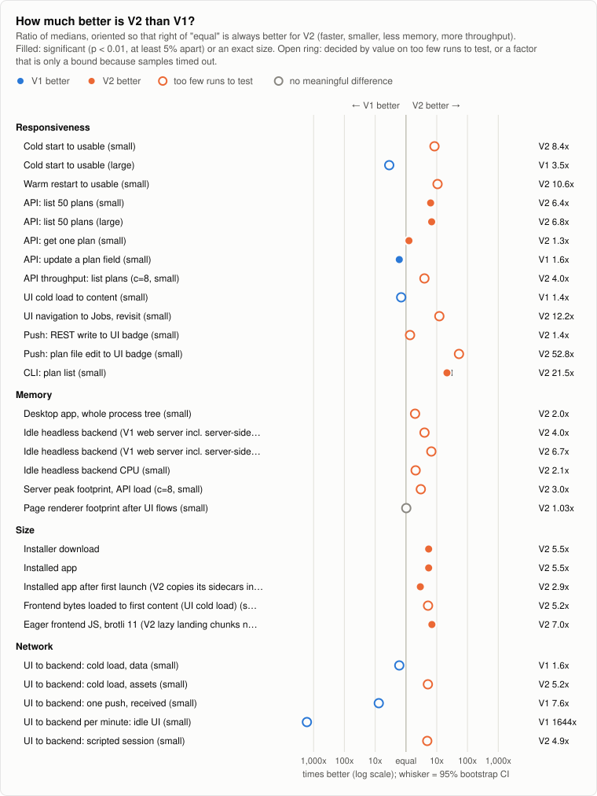

## Contents

- [Test environment](#test-environment)
- [Methodology](#methodology)
- [Results](#results)
  - [Bundle and install size](#bundle-and-install-size)
  - [One-shot CLI](#one-shot-cli)
  - [Server startup](#server-startup)
  - [Idle server](#idle-server)
  - [HTTP API](#http-api)
  - [Web UI in headless Chromium](#web-ui-in-headless-chromium)
  - [Network traffic](#network-traffic)
  - [Desktop apps (WKWebView)](#desktop-apps-wkwebview)
- [Findings](#findings)
- [Threats to validity](#threats-to-validity)
- [How to reproduce](#how-to-reproduce)
- [Appendix](#appendix)

## Test environment

| Item | Value |
| --- | --- |
| Machine | Apple M4 Max (Mac16,5), 16 CPUs (12 performance + 4 efficiency), 48 GiB memory |
| OS | macOS 27.0 (26A428), Darwin 27.0.0, arm64 |
| Power | AC Power |
| Thermal | no thermal warning recorded |
| Load at run start (1/5/15 min) | 5.02 / 7.40 / 7.73; memory free 91% |
| Node / pnpm | v26.0.0, pnpm 11.25.0 |
| Rust (V2 toolchain) | rustc 1.98.1 (48a229cea 2026-09-01), cargo 1.98.1 (797e8a9bc 2026-08-05) |
| .NET SDK on the host | 10.0.203 |
| Playwright / Chromium | playwright 1.63.0, Chromium 153.0.8010.12 (r1243), headless shell r1243 |
| Compressors | Apple gzip 487.0.1, brotli 1.2.0 |
| V1 under test | v1.2.4 at `f6b1de3dc299a4153d44e08409fe3aa6390f542b` |
| V1 binary | `~/Desktop/tendril-benchmark/builds/v1-publish/Ivy.Tendril`: 165,963,484 B, Tendril 1.2.4, bundles NETCore.App 10.0.7, AspNetCore.App 10.0.7 |
| V1 binary | `~/Desktop/tendril-benchmark/artifacts/v1/pkg-expanded/1.pkg/Payload/Ivy Tendril.app/Contents/MacOS/Ivy.Tendril`: 165,830,496 B, Tendril 1.2.4, bundles NETCore.App 10.0.12, AspNetCore.App 10.0.12 |
| V1 binary | `/Applications/Ivy Tendril.app/Contents/MacOS/Ivy.Tendril`: 165,830,496 B, Tendril 1.2.4, bundles NETCore.App 10.0.12, AspNetCore.App 10.0.12 |
| V2 under test | `2959bbb30050948c3e54bedc99323fc331f9ddf1`, `tendril 0.1.0` |
| V2 binary | `~/Desktop/tendril-benchmark/ivy-tendril-v2/target/release/tendril`: 39,740,624 B |
| Harness | benchmark at `3bc969805d88` |

Busiest processes when the run started (CPU % of one core): duetexpertd 97.2%, XprotectService 14.8%, node 9.5%, coreaudiod 6.7%, xprotectd 4.7%.

<details><summary>Build info (<code>build-info.json</code> at run start)</summary>

| Key | Value |
| --- | --- |
| `schemaVersion` | 1 |
| `generatedAt` | 2026-09-22T18:02:42.237+02:00 |
| `workspace` | ~/Desktop/tendril-benchmark |
| `harness.repo` | ~/Desktop/ivy-tendril-v2-benchmark |
| `harness.sha` | 986ac62cd46f2581c146d589ed95d8cd8b08975a |
| `harness.benchmarkDirty` | 1 |
| `pins.v1Ref` | v1.2.4 |
| `pins.v1Sha` | f6b1de3dc299a4153d44e08409fe3aa6390f542b |
| `pins.v2Ref` | 2959bbb30050948c3e54bedc99323fc331f9ddf1 |
| `pins.v2Sha` | 2959bbb30050948c3e54bedc99323fc331f9ddf1 |
| `tools.node` | v26.0.0 |
| `tools.pnpm` | 11.25.0 |
| `tools.rustc` | rustc 1.98.1 (48a229cea 2026-09-01) |
| `tools.cargo` | cargo 1.98.1 (797e8a9bc 2026-08-05) |
| `tools.rustup` | rustup 1.29.1 (d95a37b6a 2026-08-13) |
| `tools.dotnetSdk` | 10.0.203 |
| `tools.pwsh` | PowerShell 7.6.3 |
| `tools.gh` | gh version 2.91.0 (2026-04-22) |
| `tools.git` | git version 2.54.0 (Apple Git-157) |
| `tools.cc` | Apple clang version 21.0.0 (clang-2100.3.34.2) |
| `tools.xcode` | Xcode 27.0 |
| `tools.tauriCli` | tauri-cli 2.11.4 |
| `tools.macos` | 27.0 (26A428) |
| `tools.arch` | arm64 |
| `scrubbedBuildVars` |  |
| `v1.clone.dir` | ~/Desktop/tendril-benchmark/ivy-tendril-v1 |
| `v1.clone.repo` | https://github.com/Ivy-Interactive/Ivy-Tendril.git |
| `v1.clone.origin` | https://github.com/Ivy-Interactive/Ivy-Tendril.git |
| `v1.clone.ref` | v1.2.4 |
| `v1.clone.sha` | f6b1de3dc299a4153d44e08409fe3aa6390f542b |
| `v1.clone.cloned` | false |
| `v1.clone.fetched` | false |
| `v1.clone.checkedOut` | false |
| `v1.clone.headBefore` | f6b1de3dc299a4153d44e08409fe3aa6390f542b |
| `v1.clone.commitDate` | 2026-09-14T13:16:02+02:00 |
| `v1.clone.subject` | Merge pull request #2703 from Ivy-Interactive/feature/claude-code-usage |
| `v1.clone.modified` |  |
| `v1.clone.untracked` |  |
| `v1.clone.untrackedCount` | 0 |
| `v1.publish.dir` | ~/Desktop/tendril-benchmark/builds/v1-publish |

</details>

**Load during each suite.** The 1-minute load average is recorded at the start and end of each suite and every 5 s in between. Background load cannot be removed, only recorded; suites that started at or above 2 (or the run's `--quiet-load` threshold) are flagged in the findings.

| Suite | Status | Started | Duration | Load start → end | Load median / max | Quiet wait | Metrics | Failures |
| --- | --- | --- | ---: | ---: | ---: | ---: | ---: | ---: |
| size | ok | 23:56:31 | 18 s | 5.02 → 4.42 | 4.70 / 5.02 | 0 s | 114 | 0 |
| cli | ok | 23:56:48 | 31 s | 4.42 → 8.77 | 6.28 / 8.77 | 0 s | 48 | 0 |
| startup | ok | 23:57:19 | 1 min 46 s | 8.77 → 19.72 | 16.00 / 20.91 | 0 s | 92 | 0 |
| idle | ok | 23:59:05 | 6 min 39 s | 19.72 → 21.69 | 16.81 / 23.68 | 0 s | 54 | 0 |
| api | ok | 00:05:44 | 9 min 51 s | 21.69 → 23.24 | 9.12 / 24.75 | 0 s | 184 | 0 |
| ui | ok | 00:15:35 | 10 min 10 s | 23.24 → 10.14 | 3.61 / 23.24 | 0 s | 170 | 0 |
| network | ok | 00:25:45 | 13 min 06 s | 10.14 → 2.32 | 3.00 / 10.37 | 0 s | 777 | 0 |
| desktop | ok | 00:38:51 | 3 min 33 s | 2.32 → 1.38 | 1.59 / 2.32 | 0 s | 31 | 0 |

## Methodology

**Apps.** V1 is Tendril v1.2.4 (C#/.NET 10, Ivy Framework); V2 is the Rust daemon (axum) plus the Tauri 2 desktop shell with a React/Vite frontend, built from source at the pinned commit. The server suites run V1 as `Ivy.Tendril --web` and V2 as `tendril serve`. Each app gets its own copy of the same generated dataset, migrated by the app's own migration command, in an isolated home.

**Datasets.** Generated deterministically (seed 42), 2 revisions of about 8 KB per plan, state mix Draft 30%, Review 15%, Completed 35%, Failed 5%, Skipped 5%, Icebox 10%.

| Dataset | Plans | Jobs | Projects | Used in this run |
| --- | ---: | ---: | ---: | --- |
| empty | 0 | 0 | 1 | yes |
| small | 50 | 50 | 3 | yes |
| medium | 300 | 200 | 5 | no |
| large | 1,500 | 500 | 8 | yes |

**Iteration counts** (profile `quick`):

| Knob | Value |
| --- | --- |
| server suites: datasets | empty, small, large |
| desktop: datasets | small |
| cli: datasets | small, large |
| startup: first starts / warm restarts per dataset and app | 3 / 3 |
| idle: runs x (settling + measured window) | 2 x (20 s + 10 s) |
| api: independent server instances per dataset and app | 3 |
| api: sequential warmup / timed requests per scenario and instance | 100 / 30 |
| api: concurrency levels x duration (once per instance) | [1, 8] x 2 s (latency samples capped at 3,000 per level) |
| ui: independent sessions per dataset and app | 1 |
| ui: cold loads / navigation cycles / REST pushes / file pushes / cycles under load (per dataset and app, split across sessions) | 3 / 3 / 3 / 3 / 2 |
| desktop: warmup + measured runs x duration | 1 + 3 x 30 s |
| cli: warmup / measured runs | 1 / 5 |
| network: cold loads / pushes / idle windows / sessions (pushes each) / desktop sampling / real-host check | 3 / 3 / 1 x 20 s / 1 (2) / 30 s / 30 s |

**Order and replicates.** Suites run one at a time: size, cli, startup, idle, api, ui, network, desktop. In cli, startup, idle and desktop every repeated measurement (a command, a start, an idle run, a launch) is its own replicate, and the two apps alternate in ABBA order (V1, V2, V2, V1, ...), so a linear drift in machine state (thermals, caches, background load) affects both equally. The api and ui suites take many samples from one running server or browser session, and those are not independent of each other; there each app gets several independent **instances** per dataset (a fresh home, server and, for ui, browser each), run in ABBA order across instances with the starting app alternating per dataset, and the **instance is the replicate**: intervals resample instances before samples. Within one instance an app's samples are taken back to back. The network suite runs one session per app and dataset, alternating the first app per dataset. The 1-minute load average is recorded per instance (api: `meta.perInstance`, ui: `meta.sessions`).

**Memory.** Read with `proc_pid_rusage(RUSAGE_INFO_V4)` by a small native helper (identical to `footprint -p` for both apps).
- `footprint`: sum of `ri_phys_footprint` over the process set (dirty + compressed + swapped + IOKit-owned memory). This is the headline memory number: what Activity Monitor shows as "Memory" and what the kernel uses for jetsam limits, and it means the same thing for a .NET process, a Rust process, WebKit XPC services and Chromium helpers. Reported in MiB (2^20 bytes).
- `peak footprint`: sum of per-process `ri_interval_max_phys_footprint` after resetting the interval at the start of the scenario. A sum of per-process peaks is an upper bound on the simultaneous peak.
- `rss`: sum of resident sizes, for context only (double-counts shared clean pages, misses compressed memory).
- Process sets: the server process and all its descendants; for the desktop apps also the WebKit processes whose responsible pid is the app (they are not its children), and for V2 the daemon.

**CPU** is user + system time from the same call, as CPU-seconds or as the mean percent of one core over a window. Idle wakeups are package idle plus interrupt wakeups per second.

**Latency** is measured from just before the request is issued to the last byte of the body, on a keep-alive connection, uncompressed (no `Accept-Encoding`), after a warmup past .NET's tiered-compilation threshold and at least 20 s after the server was spawned (past V1's one-off +15 s pricing fetch). Readiness is polled every 5 ms: HTTP ready is the first successful health response (V1 `GET /api/ping`, V2 `GET /api/health`); data ready is V1's `Initial sync complete` log line, and for V2 the same as HTTP ready (its health endpoint only answers after the initial sync); **usable** is the later of the two, the moment both hold (V1's sync line can come before its HTTP). Throughput is a closed loop of `c` workers counting 2xx responses per second; `latency_ms_per_kb` divides latency by the response size and is shown for context only (a fixed per-request floor makes it favour the larger payload).

**UI** timings come from headless Chromium (Playwright). V1 serves its own web UI; V2's frontend runs against the real daemon through an IPC shim that executes the real Tauri command handlers, with the page's IPC carried over one loopback WebSocket (in the real app it is in-process). Times are taken inside the page by a MutationObserver and requestAnimationFrame watcher that checks at most once per frame on mutations plus a trailing check; every sample records how many checks ran and their cost. Push latency is measured in the page when the plans badge changes, against the wall-clock time the write was issued, corrected by the page-to-harness clock offset measured just before each write. Navigation under load offers both servers the same fixed open-loop request rate.

**Sizes** are apparent bytes (`lstat` sizes of regular files, symlinks not followed), never `du`; reported in MB (10^6 bytes) with exact bytes in the appendix. Compressed sizes are per file (gzip level 9, brotli quality 11).

**Statistics.** Medians with 95% percentile-bootstrap intervals (2,000 resamples, seeded per metric, so the report is reproducible byte for byte). Where a metric's samples come from several independent instances the bootstrap is hierarchical: each resample draws instances with replacement, then samples within them. V2 vs V1 is the ratio of medians with a bootstrap interval that resamples both groups the same way. A difference counts when a two-sided Mann-Whitney U test gives p < 0.01 **and** the medians differ by at least 5%. The test runs on the pooled samples (with instances this treats samples of one instance as independent, so its p-values are optimistic; the hierarchical intervals are the honest measure of precision), with the exact permutation distribution up to 60 pooled samples (ties handled with midranks) and the normal approximation with tie and continuity correction above that. Some metrics have too few samples for that test to ever reach p < 0.01 (one sample per app, or fewer than 5 per app: the smallest possible p is 0.33 with 2 and 0.10 with 3); they are decided by value and labelled "every run" when every sample of the better app beat every sample of the other ("unclear" otherwise). Comparisons on a single sample per app are shown as **indicative** and left out of every tally. File sizes are exact (a difference of at least 1% counts). Repeated runs with a coefficient of variation above 0.25, and per-request samples whose median has a 95% interval wider than 20% of it, are flagged as noisy.

**Multiple comparisons.** This report makes 70 tested comparisons at p < 0.01 each, so some "significant" results are expected by chance alone. With a Holm-Bonferroni correction over all of them (family-wise error 0.01), 45 of the 69 significant differences remain significant (the others are listed in the findings). Verdicts in the tables are per comparison, uncorrected.

**Timeouts are results.** A sample that did not complete within its limit (startup 300 s, UI waits 120 s, a click the page never accepted within 30 s, a server that exited, a desktop window that never appeared, CLI 300 s) is kept as a **censored** value: it is at least the limit. Censored samples take part in the rank test and in the median as values at their limit; a median or interval bound that lands on one is shown as ">= x", the improvement factor then becomes a bound (">= 13x faster"), and tables say how many samples timed out. Other failed samples (a harness error, a stale view) are listed as failures and left out.

**Isolation.** Every app process gets a per-run `TENDRIL_HOME` and an empty `CLAUDE_CONFIG_DIR`; these variables are removed from every child environment: `TENDRIL_HOME` `TENDRIL_CONFIG` `TENDRIL_PLANS` `PORT` `HOST` `VERBOSE` `BASE_PATH` `IVY_TLS` `TENDRIL_NOT_MASTER` `TENDRIL_BETA` `TENDRIL_AUTH_PASSWORD` `BasicAuth__Users` `RUST_LOG` `DOTNET_gcServer` `DOTNET_GCHeapHardLimit` `DOTNET_TieredPGO`. Ports are free loopback ports. Load is sampled every 5 s.

## Results

Every table gives medians with a 95% bootstrap confidence interval in brackets (hierarchical over instances where a metric has several). "Improvement (V2 vs V1)" says how many times better or worse V2 is than V1, from V2's side ("13x faster", "2.4x less", "6.1x slower"), computed from the medians, with the 95% bootstrap interval of that factor in brackets where the samples allow one; it adds "(n.s.)" when the difference is not significant, "(unclear)" when too few samples could not separate the apps, "(indicative, n=1)" for a single sample per app (never counted as a win) and "(context only, not judged)" for normalisations shown for reference. "p" is the two-sided Mann-Whitney U p-value, and "Better" names the app that is better with p < 0.01 and a difference of at least 5% ("n.s." when not significant, "within 5%" when significant but smaller). With 2 to 4 samples, parentheses give the range of the samples instead of an interval. Where the sample is too small for any test to reach p < 0.01, "p" says "no test" and "Better" says "every run", "unclear" or "n=1, indicative" (see [Statistics](#methodology)). Samples that timed out count at their limit: ">=" marks a median or bound that includes them, "n" says how many, and an improvement factor built on one reads ">= Nx". Full distributions are in the [appendix](#appendix).

### Bundle and install size

No processes are started. V1 is measured from the signed v1.2.4 release installer and its installed app; V2 from the `.app`/`.dmg` built at the pinned commit. Frontend groups are split into what loads before the shell renders ("eager") and everything shipped.

_Ran 23:56:31 to 23:56:48 (18 s), status ok, 1-min load 5.02 at start, max 5.02; 114 metrics, 0 failure(s)._

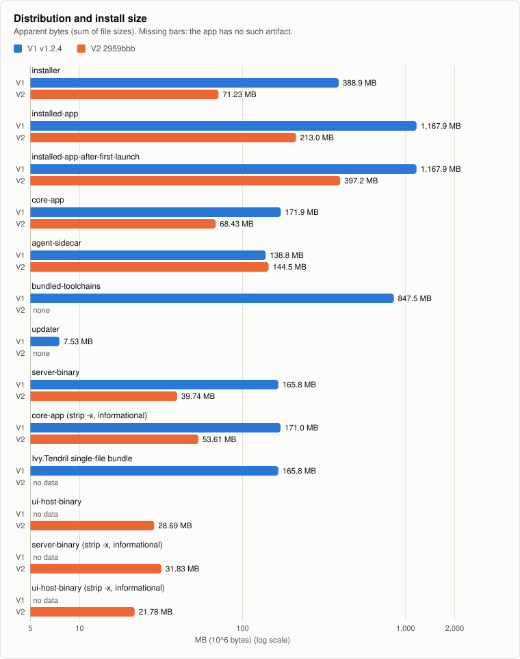

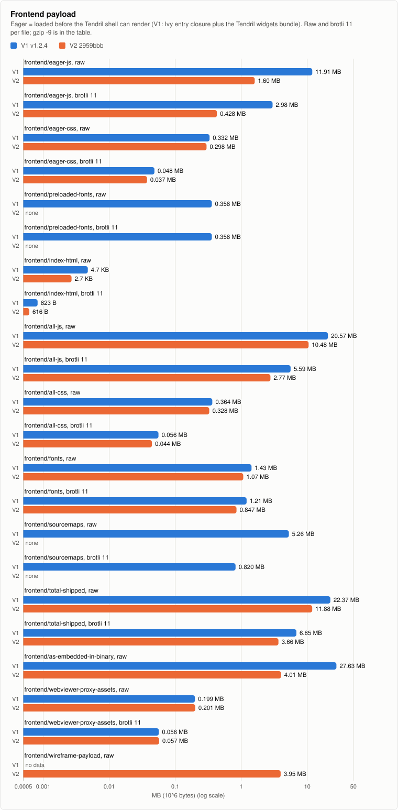

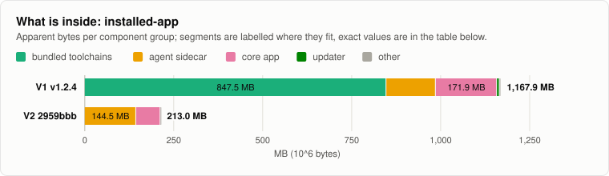

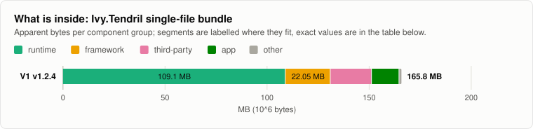

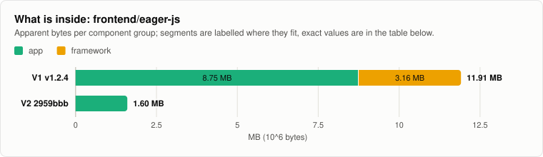

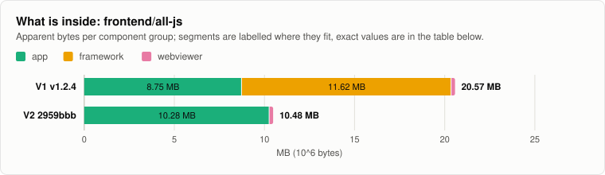

**Sizes** (MB = 10^6 bytes; exact bytes in [Appendix B](#b-exact-sizes)), smaller is better:

| Artifact | Encoding | V1 (MB) | V2 (MB) | Improvement (V2 vs V1) | Better |
| --- | --- | ---: | ---: | --- | :---: |
| `installer` | raw | 388.9 | 71.23 | 5.5x smaller | **V2** |
| `installed-app` | raw | 1,167.9 | 213.0 | 5.5x smaller | **V2** |
| `installed-app-after-first-launch` | raw | 1,167.9 | 397.2 | 2.9x smaller | **V2** |
| `core-app` | raw | 171.9 | 68.43 | 2.5x smaller | **V2** |
| `agent-sidecar` | raw | 138.8 | 144.5 | 1.04x larger | **V1** |
| `bundled-toolchains` | raw | 847.5 | none | V2 has none | **V2** |
| `updater` | raw | 7.53 | none | V2 has none | **V2** |
| `server-binary` | raw | 165.8 | 39.74 | 4.2x smaller | **V2** |
| `core-app (strip -x, informational)` | raw | 171.0 | 53.61 | 3.2x smaller | **V2** |
| `Ivy.Tendril single-file bundle` | raw | 165.8 | n/a | V1 only | V1 only |
| `frontend/eager-js` | raw | 11.91 | 1.60 | 7.4x smaller | **V2** |
|  | gzip -9 | 3.76 | 0.491 | 7.7x smaller | **V2** |
|  | brotli 11 | 2.98 | 0.428 | 7.0x smaller | **V2** |
| `frontend/eager-css` | raw | 0.332 | 0.298 | 1.1x smaller | **V2** |
|  | gzip -9 | 0.058 | 0.046 | 1.2x smaller | **V2** |
|  | brotli 11 | 0.048 | 0.037 | 1.3x smaller | **V2** |
| `frontend/preloaded-fonts` | raw | 0.358 | none | V2 has none | **V2** |
|  | gzip -9 | 0.359 | none | V2 has none | **V2** |
|  | brotli 11 | 0.358 | none | V2 has none | **V2** |
| `frontend/index-html` | raw | 0.005 | 0.003 | 1.8x smaller | **V2** |
|  | gzip -9 | 0.001 | 0.001 | 1.3x smaller | **V2** |
|  | brotli 11 | 0.001 | 0.001 | 1.3x smaller | **V2** |
| `frontend/all-js` | raw | 20.57 | 10.48 | 2.0x smaller | **V2** |
|  | gzip -9 | 6.73 | 3.28 | 2.1x smaller | **V2** |
|  | brotli 11 | 5.59 | 2.77 | 2.0x smaller | **V2** |
| `frontend/all-css` | raw | 0.364 | 0.328 | 1.1x smaller | **V2** |
|  | gzip -9 | 0.066 | 0.054 | 1.2x smaller | **V2** |
|  | brotli 11 | 0.056 | 0.044 | 1.3x smaller | **V2** |
| `frontend/fonts` | raw | 1.43 | 1.07 | 1.3x smaller | **V2** |
|  | gzip -9 | 1.23 | 0.866 | 1.4x smaller | **V2** |
|  | brotli 11 | 1.21 | 0.847 | 1.4x smaller | **V2** |
| `frontend/sourcemaps` | raw | 5.26 | none | V2 has none | **V2** |
|  | gzip -9 | 1.02 | none | V2 has none | **V2** |
|  | brotli 11 | 0.820 | none | V2 has none | **V2** |
| `frontend/total-shipped` | raw | 22.37 | 11.88 | 1.9x smaller | **V2** |
|  | gzip -9 | 8.02 | 4.20 | 1.9x smaller | **V2** |
|  | brotli 11 | 6.85 | 3.66 | 1.9x smaller | **V2** |
| `frontend/as-embedded-in-binary` | raw | 27.63 | 4.01 | 6.9x smaller | **V2** |
| `frontend/webviewer-proxy-assets` | raw | 0.199 | 0.201 | 1.01x larger | **V1** |
|  | gzip -9 | 0.065 | 0.066 | 1.01x larger (about the same) | same |
|  | brotli 11 | 0.056 | 0.057 | 1.01x larger | **V1** |
| `ui-host-binary` | raw | n/a | 28.69 | V2 only | V2 only |
| `server-binary (strip -x, informational)` | raw | n/a | 31.83 | V2 only | V2 only |
| `ui-host-binary (strip -x, informational)` | raw | n/a | 21.78 | V2 only | V2 only |
| `frontend/wireframe-payload` | raw | n/a | 3.95 | V2 only | V2 only |

**Files**:

| Scenario | V1 | V2 | Improvement (V2 vs V1) | Better |
| --- | ---: | ---: | --- | :---: |
| `installed-app` | 5,534 | 5 | 1107x fewer | **V2** |

**Breakdown of `installed-app`**:

| App | Component | Group | MB | Share |
| --- | --- | --- | ---: | ---: |
| V1 | `Resources/dotnet` | bundled toolchains | 651.3 | 55.8% |
| V1 | `Resources/PowerShell` | bundled toolchains | 196.2 | 16.8% |
| V1 | `MacOS/Ivy.Tendril` | core app | 165.8 | 14.2% |
| V1 | `MacOS/ivy-agent` | agent sidecar | 138.8 | 11.9% |
| V1 | `MacOS/UpdateMac` | updater | 7.53 | 0.6% |
| V1 | `MacOS/native dylibs` | core app | 6.04 | 0.5% |
| V1 | `other` | other | 2.18 | 0.2% |
| V2 | `MacOS/opencode` | agent sidecar | 144.5 | 67.8% |
| V2 | `MacOS/tendril` | core app | 39.74 | 18.7% |
| V2 | `MacOS/tendril-app` | core app | 28.69 | 13.5% |
| V2 | `other` | other | 0.067 | 0.0% |

**Breakdown of `Ivy.Tendril single-file bundle`**:

| App | Component | Group | MB | Share |
| --- | --- | --- | ---: | ---: |
| V1 | `.NET shared framework` | runtime | 98.55 | 59.4% |
| V1 | `Ivy framework` | framework | 22.05 | 13.3% |
| V1 | `third-party NuGet` | third-party | 20.22 | 12.2% |
| V1 | `Tendril assemblies` | app | 13.45 | 8.1% |
| V1 | `native host (singlefilehost, coreclr linked in)` | runtime | 10.51 | 6.3% |
| V1 | `manifest, padding and signature` | other | 1.05 | 0.6% |

**Breakdown of `frontend/eager-js`**:

| App | Component | Group | MB | Share |
| --- | --- | --- | ---: | ---: |
| V1 | `Tendril widgets IIFE` | app | 8.75 | 73.5% |
| V1 | `Ivy entry closure` | framework | 3.16 | 26.5% |
| V2 | `entry closure` | app | 1.60 | 100.0% |

**Breakdown of `frontend/all-js`**:

| App | Component | Group | MB | Share |
| --- | --- | --- | ---: | ---: |
| V1 | `Ivy assets/*.js` | framework | 10.32 | 50.1% |
| V1 | `Tendril widgets IIFE` | app | 8.75 | 42.5% |
| V1 | `Ivy external widgets` | framework | 1.31 | 6.4% |
| V1 | `webviewer proxy assets` | webviewer | 0.199 | 1.0% |
| V2 | `dist assets/*.js` | app | 8.05 | 76.8% |
| V2 | `dist *.mjs (pdf.js worker)` | app | 2.23 | 21.3% |
| V2 | `webviewer proxy assets` | webviewer | 0.201 | 1.9% |

<details><summary>Harness notes (4)</summary>

- V1: non-frontend resources left out of the frontend groups: Ivy.AGENTS.md (15587 B), RoutingConstants (415 B), Ivy.Agent.Filter.Filters.g4 (2486 B)
- V1: all 19 figures that the research also measured match it to the byte
- sizes are apparent bytes of regular files (symlinks not followed, never du); compressed sizes are per file (Node zlib: gzip level 9, brotli quality 11), which can differ from the gzip/brotli CLIs by a few bytes per file
- V2's cargo target dirs (including the IPC shim's, which holds tauri-build's copies of the sidecars) are never walked: only the bundled .app, the .dmg and the dist are counted

</details>

### One-shot CLI

One-shot commands of each app's CLI against a dataset home (1 unmeasured + 5 measured runs per command): wall time from spawn to exit and the peak physical footprint of the process. Only semantically equivalent commands are compared.

_Ran 23:56:48 to 23:57:19 (31 s), status ok, 1-min load 4.42 at start, max 8.77; 48 metrics, 0 failure(s)._

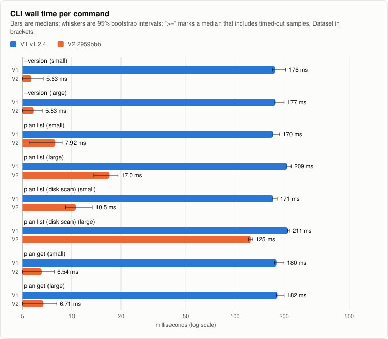

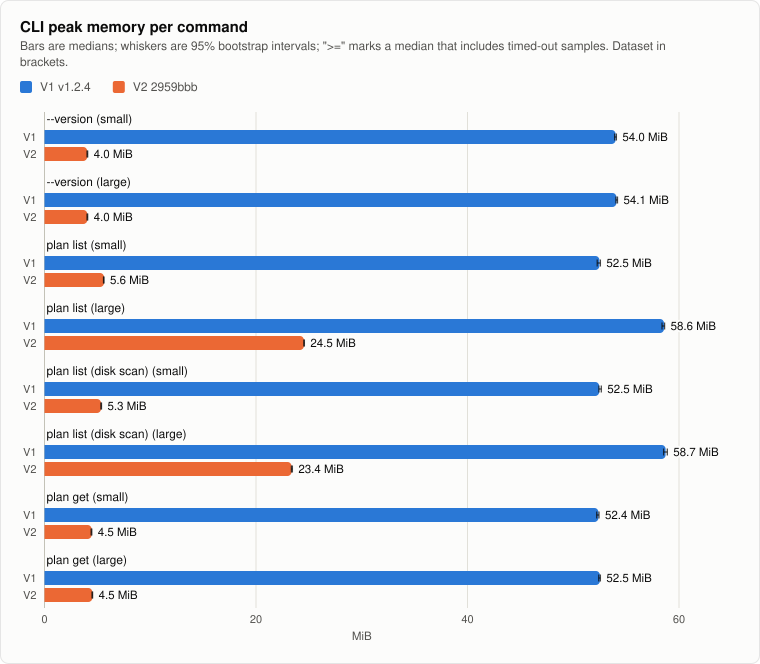

**Wall time** (ms), lower is better:

| Scenario | Dataset | n (V1 / V2) | V1 median [95% CI] | V2 median [95% CI] | Improvement (V2 vs V1) | p | Better |
| --- | --- | ---: | ---: | ---: | --- | ---: | :---: |
| `--version` | small (50) | 5 / 5 | 176 [169, 204] | 5.63 [4.29, 6.69] | 31.3x faster [25.7, 41.0] | 0.008 | **V2** |
| `--version` | large (1,500) | 5 / 5 | 177 [175, 200] | 5.83 [4.43, 6.60] | 30.3x faster [26.8, 39.8] | 0.008 | **V2** |
| `plan list` | small (50) | 5 / 5 | 170 [170, 188] | 7.92 [5.46, 8.72] | 21.5x faster [19.5, 31.2] | 0.008 | **V2** |
| `plan list` | large (1,500) | 5 / 5 | 209 [208, 221] | 17.0 [13.7, 19.2] | 12.3x faster [10.9, 15.3] | 0.008 | **V2** |
| `plan list (disk scan)` | small (50) | 5 / 5 | 171 [168, 181] | 10.5 [9.2, 13.4] | 16.2x faster [12.8, 18.7] | 0.008 | **V2** |
| `plan list (disk scan)` | large (1,500) | 5 / 5 | 211 [210, 215] | 125 [121, 128] | 1.7x faster [1.6, 1.7] | 0.008 | **V2** |
| `plan get` | small (50) | 5 / 5 | 180 [174, 200] | 6.54 [4.34, 7.80] | 27.5x faster [22.9, 41.3] | 0.008 | **V2** |
| `plan get` | large (1,500) | 5 / 5 | 182 [180, 200] | 6.71 [4.89, 8.09] | 27.1x faster [22.5, 37.2] | 0.008 | **V2** |

**Peak footprint** (MiB), lower is better:

| Scenario | Dataset | n (V1 / V2) | V1 median [95% CI] | V2 median [95% CI] | Improvement (V2 vs V1) | p | Better |
| --- | --- | ---: | ---: | ---: | --- | ---: | :---: |
| `--version` | small (50) | 5 / 5 | 54.0 [53.9, 54.1] | 4.0 [4.0, 4.1] | 13.4x less [13.2, 13.4] | 0.008 | **V2** |
| `--version` | large (1,500) | 5 / 5 | 54.1 [54.0, 54.2] | 4.0 [4.0, 4.1] | 13.4x less [13.3, 13.5] | 0.008 | **V2** |
| `plan list` | small (50) | 5 / 5 | 52.5 [52.3, 52.6] | 5.6 [5.6, 5.6] | 9.3x less [9.3, 9.4] | 0.008 | **V2** |
| `plan list` | large (1,500) | 5 / 5 | 58.6 [58.4, 58.6] | 24.5 [24.5, 24.6] | 2.4x less [2.4, 2.4] | 0.008 | **V2** |
| `plan list (disk scan)` | small (50) | 5 / 5 | 52.5 [52.4, 52.7] | 5.3 [5.3, 5.4] | 9.8x less [9.7, 9.9] | 0.008 | **V2** |
| `plan list (disk scan)` | large (1,500) | 5 / 5 | 58.7 [58.5, 58.9] | 23.4 [23.3, 23.4] | 2.5x less [2.5, 2.5] | 0.008 | **V2** |
| `plan get` | small (50) | 5 / 5 | 52.4 [52.2, 52.4] | 4.5 [4.4, 4.5] | 11.8x less [11.7, 11.9] | 0.008 | **V2** |
| `plan get` | large (1,500) | 5 / 5 | 52.5 [52.4, 52.6] | 4.5 [4.5, 4.5] | 11.6x less [11.5, 11.7] | 0.008 | **V2** |

**CPU time** (CPU s), lower is better:

| Scenario | Dataset | n (V1 / V2) | V1 median [95% CI] | V2 median [95% CI] | Improvement (V2 vs V1) | p | Better |
| --- | --- | ---: | ---: | ---: | --- | ---: | :---: |
| `--version` | small (50) | 5 / 5 | 0.165 [0.159, 0.191] | 0.004 [0.003, 0.005] | 38.2x less CPU [30.8, 53.7] | 0.008 | **V2** |
| `--version` | large (1,500) | 5 / 5 | 0.166 [0.164, 0.187] | 0.004 [0.003, 0.005] | 38.7x less CPU [31.3, 51.6] | 0.008 | **V2** |
| `plan list` | small (50) | 5 / 5 | 0.162 [0.159, 0.176] | 0.007 [0.005, 0.008] | 24.4x less CPU [20.9, 32.7] | 0.008 | **V2** |
| `plan list` | large (1,500) | 5 / 5 | 0.199 [0.198, 0.209] | 0.016 [0.012, 0.018] | 12.8x less CPU [11.2, 16.0] | 0.008 | **V2** |
| `plan list (disk scan)` | small (50) | 5 / 5 | 0.160 [0.159, 0.167] | 0.010 [0.008, 0.011] | 16.7x less CPU [14.1, 20.7] | 0.008 | **V2** |
| `plan list (disk scan)` | large (1,500) | 5 / 5 | 0.201 [0.199, 0.202] | 0.123 [0.119, 0.126] | 1.6x less CPU [1.6, 1.7] | 0.008 | **V2** |
| `plan get` | small (50) | 5 / 5 | 0.168 [0.165, 0.188] | 0.005 [0.004, 0.007] | 30.7x less CPU [25.5, 40.7] | 0.008 | **V2** |
| `plan get` | large (1,500) | 5 / 5 | 0.171 [0.170, 0.191] | 0.006 [0.004, 0.007] | 30.8x less CPU [24.9, 40.7] | 0.008 | **V2** |

<details><summary>Harness notes (2)</summary>

- measured with builds/bin/cliexec: wall = posix_spawn to exit; peak = the command process's lifetime max phys_footprint (its children, such as V1's short-lived which probes, are not included); cpu = user + system of the process plus the children it reaped (childCpuSMedian in meta)
- user CLI symlinks unchanged (/usr/local/bin/tendril -> absent, ~/.local/bin/tendril -> /Applications/Ivy Tendril.app/Contents/MacOS/Ivy.Tendril)

</details>

### Server startup

Server start from a freshly restored home ("first start") and restart on the already-synced home ("warm start"), 3 and 3 runs per dataset and app, interleaved. Readiness is polled every 5 ms.

_Ran 23:57:19 to 23:59:05 (1 min 46 s), status ok, 1-min load 8.77 at start, max 20.91; 92 metrics, 0 failure(s)._

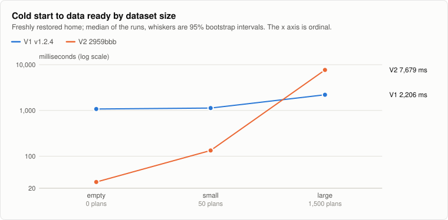

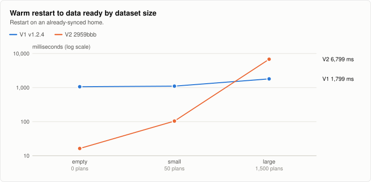

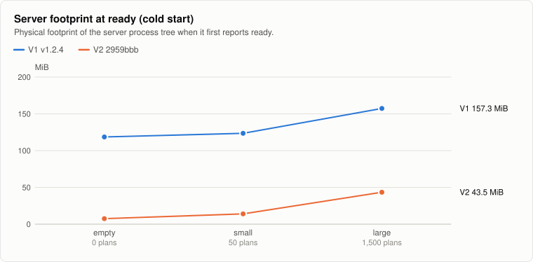

**HTTP ready** (ms), lower is better:

| Scenario | Dataset | n (V1 / V2) | V1 median (range) | V2 median (range) | Improvement (V2 vs V1) | p | Better |
| --- | --- | ---: | ---: | ---: | --- | ---: | :---: |
| `first-start` | empty (0) | 3 / 3 | 1,021 (1,021 to 1,027) | 27.4 (14.8 to 30.5) | 37.3x faster | no test (n=3) | V2 (every run) |
| `first-start` | small (50) | 3 / 3 | 1,028 (1,022 to 1,030) | 134 (132 to 147) | 7.7x faster | no test (n=3) | V2 (every run) |
| `first-start` | large (1,500) | 3 / 3 | 1,073 (1,065 to 1,091) | 7,679 (7,640 to 7,889) | 7.2x slower | no test (n=3) | V1 (every run) |
| `warm-start` | empty (0) | 3 / 3 | 1,008 (1,003 to 1,030) | 16.3 (13.4 to 16.4) | 61.8x faster | no test (n=3) | V2 (every run) |
| `warm-start` | small (50) | 3 / 3 | 1,006 (1,005 to 1,008) | 104 (102 to 117) | 9.7x faster | no test (n=3) | V2 (every run) |
| `warm-start` | large (1,500) | 3 / 3 | 1,080 (1,043 to 1,109) | 6,799 (6,796 to 6,895) | 6.3x slower | no test (n=3) | V1 (every run) |

**Data ready** (ms), lower is better:

| Scenario | Dataset | n (V1 / V2) | V1 median (range) | V2 median (range) | Improvement (V2 vs V1) | p | Better |
| --- | --- | ---: | ---: | ---: | --- | ---: | :---: |
| `first-start` | empty (0) | 3 / 3 | 1,078 (1,075 to 1,081) | 27.4 (14.8 to 30.5) | 39.4x faster | no test (n=3) | V2 (every run) |
| `first-start` | small (50) | 3 / 3 | 1,130 (1,125 to 1,130) | 134 (132 to 147) | 8.4x faster | no test (n=3) | V2 (every run) |
| `first-start` | large (1,500) | 3 / 3 | 2,206 (2,123 to 2,301) | 7,679 (7,640 to 7,889) | 3.5x slower | no test (n=3) | V1 (every run) |
| `warm-start` | empty (0) | 3 / 3 | 1,060 (1,057 to 1,063) | 16.3 (13.4 to 16.4) | 65.0x faster | no test (n=3) | V2 (every run) |
| `warm-start` | small (50) | 3 / 3 | 1,103 (1,101 to 1,107) | 104 (102 to 117) | 10.6x faster | no test (n=3) | V2 (every run) |
| `warm-start` | large (1,500) | 3 / 3 | 1,799 (1,725 to 1,813) | 6,799 (6,796 to 6,895) | 3.8x slower | no test (n=3) | V1 (every run) |

**Usable (API and data ready)** (ms), lower is better:

| Scenario | Dataset | n (V1 / V2) | V1 median (range) | V2 median (range) | Improvement (V2 vs V1) | p | Better |
| --- | --- | ---: | ---: | ---: | --- | ---: | :---: |
| `first-start` | empty (0) | 3 / 3 | 1,078 (1,075 to 1,081) | 27.4 (14.8 to 30.5) | 39.4x faster | no test (n=3) | V2 (every run) |
| `first-start` | small (50) | 3 / 3 | 1,130 (1,125 to 1,130) | 134 (132 to 147) | 8.4x faster | no test (n=3) | V2 (every run) |
| `first-start` | large (1,500) | 3 / 3 | 2,206 (2,123 to 2,301) | 7,679 (7,640 to 7,889) | 3.5x slower | no test (n=3) | V1 (every run) |
| `warm-start` | empty (0) | 3 / 3 | 1,060 (1,057 to 1,063) | 16.3 (13.4 to 16.4) | 65.0x faster | no test (n=3) | V2 (every run) |
| `warm-start` | small (50) | 3 / 3 | 1,103 (1,101 to 1,107) | 104 (102 to 117) | 10.6x faster | no test (n=3) | V2 (every run) |
| `warm-start` | large (1,500) | 3 / 3 | 1,799 (1,725 to 1,813) | 6,799 (6,796 to 6,895) | 3.8x slower | no test (n=3) | V1 (every run) |

**Footprint at ready** (MiB), lower is better:

| Scenario | Dataset | n (V1 / V2) | V1 median (range) | V2 median (range) | Improvement (V2 vs V1) | p | Better |
| --- | --- | ---: | ---: | ---: | --- | ---: | :---: |
| `first-start` | empty (0) | 3 / 3 | 118.5 (118.5 to 118.6) | 7.6 (7.5 to 7.6) | 15.7x less | no test (n=3) | V2 (every run) |
| `first-start` | small (50) | 3 / 3 | 123.5 (123.3 to 124.0) | 14.0 (10.0 to 32.7) | 8.8x less | no test (n=3) | V2 (every run) |
| `first-start` | large (1,500) | 3 / 3 | 157.3 (157.3 to 159.2) | 43.5 (43.0 to 43.7) | 3.6x less | no test (n=3) | V2 (every run) |
| `warm-start` | empty (0) | 3 / 3 | 118.1 (117.9 to 118.4) | 7.5 (7.4 to 7.6) | 15.8x less | no test (n=3) | V2 (every run) |
| `warm-start` | small (50) | 3 / 3 | 121.5 (121.3 to 121.6) | 10.1 (10.0 to 10.2) | 12.0x less | no test (n=3) | V2 (every run) |
| `warm-start` | large (1,500) | 3 / 3 | 148.3 (148.2 to 148.4) | 39.5 (38.9 to 42.2) | 3.8x less | no test (n=3) | V2 (every run) |

**Peak footprint during startup** (MiB), lower is better:

| Scenario | Dataset | n (V1 / V2) | V1 median (range) | V2 median (range) | Improvement (V2 vs V1) | p | Better |
| --- | --- | ---: | ---: | ---: | --- | ---: | :---: |
| `first-start` | empty (0) | 3 / 3 | 125.3 (124.5 to 128.7) | 7.6 (7.5 to 7.7) | 16.4x less | no test (n=3) | V2 (every run) |
| `first-start` | small (50) | 3 / 3 | 132.0 (129.9 to 133.0) | 14.0 (10.0 to 32.7) | 9.4x less | no test (n=3) | V2 (every run) |
| `first-start` | large (1,500) | 3 / 3 | 166.3 (165.5 to 169.2) | 43.5 (43.0 to 43.7) | 3.8x less | no test (n=3) | V2 (every run) |
| `warm-start` | empty (0) | 3 / 3 | 126.9 (125.1 to 129.6) | 7.5 (7.5 to 7.6) | 16.9x less | no test (n=3) | V2 (every run) |
| `warm-start` | small (50) | 3 / 3 | 130.5 (130.1 to 132.3) | 10.1 (10.0 to 10.2) | 12.9x less | no test (n=3) | V2 (every run) |
| `warm-start` | large (1,500) | 3 / 3 | 157.3 (157.0 to 163.4) | 39.5 (38.9 to 42.2) | 4.0x less | no test (n=3) | V2 (every run) |

**CPU time to ready** (CPU s), lower is better:

| Scenario | Dataset | n (V1 / V2) | V1 median (range) | V2 median (range) | Improvement (V2 vs V1) | p | Better |
| --- | --- | ---: | ---: | ---: | --- | ---: | :---: |
| `first-start` | empty (0) | 3 / 3 | 0.690 (0.688 to 0.694) | 0.014 (0.014 to 0.015) | 48.6x less CPU | no test (n=3) | V2 (every run) |
| `first-start` | small (50) | 3 / 3 | 0.744 (0.736 to 0.745) | 0.095 (0.094 to 0.104) | 7.8x less CPU | no test (n=3) | V2 (every run) |
| `first-start` | large (1,500) | 3 / 3 | 1.92 (1.81 to 2.10) | 3.73 (3.62 to 3.73) | 1.9x more CPU | no test (n=3) | V1 (every run) |
| `warm-start` | empty (0) | 3 / 3 | 0.680 (0.679 to 0.681) | 0.013 (0.012 to 0.013) | 54.0x less CPU | no test (n=3) | V2 (every run) |
| `warm-start` | small (50) | 3 / 3 | 0.719 (0.718 to 0.749) | 0.066 (0.065 to 0.067) | 10.9x less CPU | no test (n=3) | V2 (every run) |
| `warm-start` | large (1,500) | 3 / 3 | 1.38 (1.38 to 1.46) | 3.19 (3.10 to 3.20) | 2.3x more CPU | no test (n=3) | V1 (every run) |

**V2 phase: port bound** (ms), lower is better:

| Scenario | Dataset | n (V1 / V2) | V1 median (range) | V2 median (range) | Improvement (V2 vs V1) | p | Better |
| --- | --- | ---: | ---: | ---: | --- | ---: | :---: |
| `first-start` | empty (0) | 0 / 3 | n/a | 11.0 (11.0 to 12.0) | V2 only | n/a | V2 only |
| `first-start` | small (50) | 0 / 3 | n/a | 11.0 (11.0 to 11.0) | V2 only | n/a | V2 only |
| `first-start` | large (1,500) | 0 / 3 | n/a | 11.0 (11.0 to 12.0) | V2 only | n/a | V2 only |
| `warm-start` | empty (0) | 0 / 3 | n/a | 10.0 (9.0 to 10.0) | V2 only | n/a | V2 only |
| `warm-start` | small (50) | 0 / 3 | n/a | 10.0 (9.0 to 10.0) | V2 only | n/a | V2 only |
| `warm-start` | large (1,500) | 0 / 3 | n/a | 15.0 (14.0 to 15.0) | V2 only | n/a | V2 only |

**V2 phase: file watches registered** (ms), lower is better:

| Scenario | Dataset | n (V1 / V2) | V1 median (range) | V2 median (range) | Improvement (V2 vs V1) | p | Better |
| --- | --- | ---: | ---: | ---: | --- | ---: | :---: |
| `first-start` | empty (0) | 0 / 3 | n/a | 24.0 (12.0 to 27.0) | V2 only | n/a | V2 only |
| `first-start` | small (50) | 0 / 3 | n/a | 85.0 (83.0 to 99.0) | V2 only | n/a | V2 only |
| `first-start` | large (1,500) | 0 / 3 | n/a | 6,413 (6,407 to 6,652) | V2 only | n/a | V2 only |
| `warm-start` | empty (0) | 0 / 3 | n/a | 11.0 (10.0 to 11.0) | V2 only | n/a | V2 only |
| `warm-start` | small (50) | 0 / 3 | n/a | 85.0 (83.0 to 98.0) | V2 only | n/a | V2 only |
| `warm-start` | large (1,500) | 0 / 3 | n/a | 6,303 (6,287 to 6,381) | V2 only | n/a | V2 only |

**V2 phase: recommendations rebuilt** (ms), lower is better:

| Scenario | Dataset | n (V1 / V2) | V1 median (range) | V2 median (range) | Improvement (V2 vs V1) | p | Better |
| --- | --- | ---: | ---: | ---: | --- | ---: | :---: |
| `first-start` | empty (0) | 0 / 3 | n/a | 27.0 (15.0 to 30.0) | V2 only | n/a | V2 only |
| `first-start` | small (50) | 0 / 3 | n/a | 134 (132 to 147) | V2 only | n/a | V2 only |
| `first-start` | large (1,500) | 0 / 3 | n/a | 7,679 (7,640 to 7,888) | V2 only | n/a | V2 only |
| `warm-start` | empty (0) | 0 / 3 | n/a | 14.0 (13.0 to 14.0) | V2 only | n/a | V2 only |
| `warm-start` | small (50) | 0 / 3 | n/a | 104 (102 to 117) | V2 only | n/a | V2 only |
| `warm-start` | large (1,500) | 0 / 3 | n/a | 6,798 (6,796 to 6,895) | V2 only | n/a | V2 only |

**V2 phase: plans synced** (ms), lower is better:

| Dataset | n (V1 / V2) | V1 median (range) | V2 median (range) | Improvement (V2 vs V1) | p | Better |
| --- | ---: | ---: | ---: | --- | ---: | :---: |
| small (50) | 0 / 3 | n/a | 122 (121 to 136) | V2 only | n/a | V2 only |
| large (1,500) | 0 / 3 | n/a | 7,419 (7,377 to 7,629) | V2 only | n/a | V2 only |

<details><summary>Harness notes (2)</summary>

- startup timeout 300000 ms per start; tree sampled every 100 ms while starting
- user CLI symlinks unchanged (/usr/local/bin/tendril -> absent, ~/.local/bin/tendril -> /Applications/Ivy Tendril.app/Contents/MacOS/Ivy.Tendril)

</details>

### Idle server

**The headless backend alone, no clients: V1's web server (which also renders its UI on the server) against V2's daemon only (the tendril-app host is not running here; the desktop suite measures both apps' whole process trees).** 2 run(s) per dataset and app, sampled every second from ready: the first 20 s are the settling phase (both apps run one-off work after a start: V1's pricing fetch at +15 s and cost backfill at +60 s, V2's PR sync at +30 s and model enrichment), reported separately as `settling`; means, CPU and wakeups cover the 10 s window after it. Both apps rescan plans periodically, so the window includes rescans.

_Ran 23:59:05 to 00:05:44 (6 min 39 s), status ok, 1-min load 19.72 at start, max 23.68; 54 metrics, 0 failure(s)._

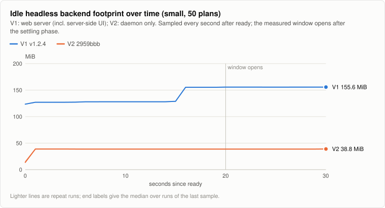

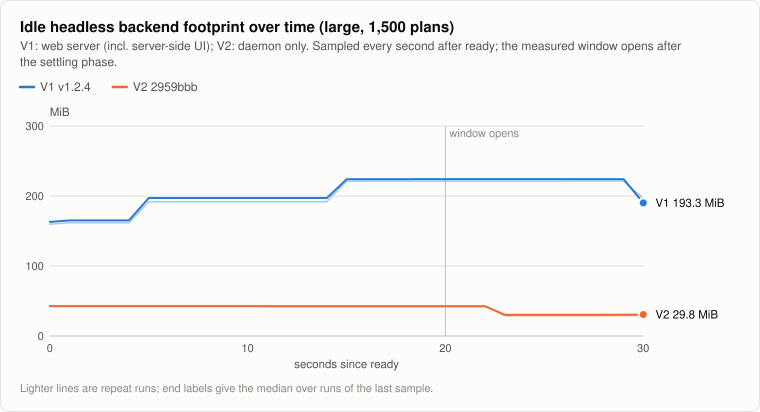

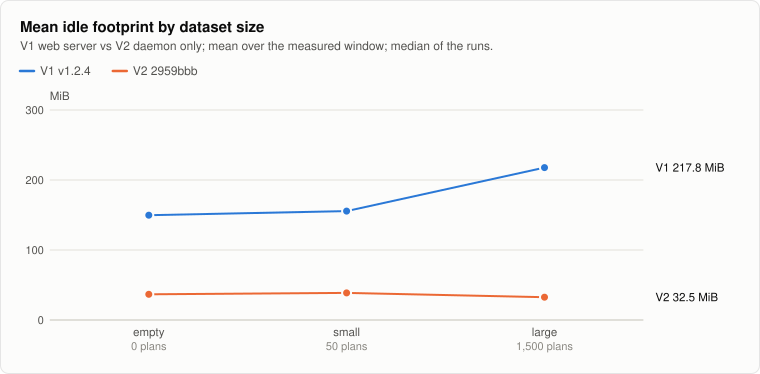

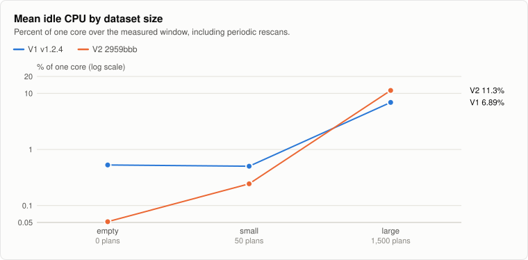

**Mean footprint** (MiB), lower is better:

| Dataset | n (V1 / V2) | V1 median (range) | V2 median (range) | Improvement (V2 vs V1) | p | Better |
| --- | ---: | ---: | ---: | --- | ---: | :---: |
| empty (0) | 2 / 2 | 149.7 (149.6 to 149.7) | 36.7 (36.7 to 36.8) | 4.1x less | no test (n=2) | V2 (every run) |
| small (50) | 2 / 2 | 155.5 (155.4 to 155.7) | 38.7 (38.7 to 38.8) | 4.0x less | no test (n=2) | V2 (every run) |
| large (1,500) | 2 / 2 | 217.8 (217.1 to 218.4) | 32.5 (32.5 to 32.6) | 6.7x less | no test (n=2) | V2 (every run) |

**Footprint when the idle window opens** (MiB), lower is better:

| Dataset | n (V1 / V2) | V1 median (range) | V2 median (range) | Improvement (V2 vs V1) | p | Better |
| --- | ---: | ---: | ---: | --- | ---: | :---: |
| empty (0) | 2 / 2 | 149.7 (149.6 to 149.8) | 36.7 (36.7 to 36.8) | 4.1x less | no test (n=2) | V2 (every run) |
| small (50) | 2 / 2 | 155.6 (155.5 to 155.7) | 38.7 (38.6 to 38.7) | 4.0x less | no test (n=2) | V2 (every run) |
| large (1,500) | 2 / 2 | 222.6 (221.1 to 224.1) | 43.0 (42.5 to 43.4) | 5.2x less | no test (n=2) | V2 (every run) |

**Footprint at end** (MiB), lower is better:

| Dataset | n (V1 / V2) | V1 median (range) | V2 median (range) | Improvement (V2 vs V1) | p | Better |
| --- | ---: | ---: | ---: | --- | ---: | :---: |
| empty (0) | 2 / 2 | 149.8 (149.8 to 149.9) | 36.8 (36.7 to 36.8) | 4.1x less | no test (n=2) | V2 (every run) |
| small (50) | 2 / 2 | 155.6 (155.4 to 155.7) | 38.8 (38.8 to 38.9) | 4.0x less | no test (n=2) | V2 (every run) |
| large (1,500) | 2 / 2 | 193.3 (190.1 to 196.5) | 29.8 (28.9 to 30.7) | 6.5x less | no test (n=2) | V2 (every run) |

**Peak footprint** (MiB), lower is better:

| Dataset | n (V1 / V2) | V1 median (range) | V2 median (range) | Improvement (V2 vs V1) | p | Better |
| --- | ---: | ---: | ---: | --- | ---: | :---: |
| empty (0) | 2 / 2 | 149.8 (149.8 to 149.9) | 36.8 (36.7 to 36.8) | 4.1x less | no test (n=2) | V2 (every run) |
| small (50) | 2 / 2 | 155.6 (155.5 to 155.8) | 38.9 (38.8 to 38.9) | 4.0x less | no test (n=2) | V2 (every run) |
| large (1,500) | 2 / 2 | 224.0 (222.8 to 225.3) | 43.0 (42.5 to 43.6) | 5.2x less | no test (n=2) | V2 (every run) |

**Mean CPU (% of one core)**, lower is better:

| Dataset | n (V1 / V2) | V1 median (range) | V2 median (range) | Improvement (V2 vs V1) | p | Better |
| --- | ---: | ---: | ---: | --- | ---: | :---: |
| empty (0) | 2 / 2 | 0.53 (0.48 to 0.58) | 0.05 (0.03 to 0.07) | 10.3x less CPU | no test (n=2) | V2 (every run) |
| small (50) | 2 / 2 | 0.50 (0.49 to 0.51) | 0.24 (0.24 to 0.25) | 2.1x less CPU | no test (n=2) | V2 (every run) |
| large (1,500) | 2 / 2 | 6.89 (6.66 to 7.13) | 11.3 (10.7 to 11.8) | 1.6x more CPU | no test (n=2) | V1 (every run) |

**Idle wakeups per second**, lower is better:

| Dataset | n (V1 / V2) | V1 median (range) | V2 median (range) | Improvement (V2 vs V1) | p | Better |
| --- | ---: | ---: | ---: | --- | ---: | :---: |
| empty (0) | 2 / 2 | 5.55 (5.49 to 5.60) | 0.45 (0.40 to 0.50) | 12.3x fewer | no test (n=2) | V2 (every run) |
| small (50) | 2 / 2 | 6.10 (6.09 to 6.10) | 0.60 (0.60 to 0.60) | 10.2x fewer | no test (n=2) | V2 (every run) |
| large (1,500) | 2 / 2 | 7.05 (6.80 to 7.30) | 1.96 (1.70 to 2.22) | 3.6x fewer | no test (n=2) | V2 (every run) |

**RSS (context only)** (MiB), lower is better:

| Dataset | n (V1 / V2) | V1 median (range) | V2 median (range) | Improvement (V2 vs V1) | p | Better |
| --- | ---: | ---: | ---: | --- | ---: | :---: |
| empty (0) | 2 / 2 | 202.8 (202.8 to 202.9) | 54.1 (54.1 to 54.1) | 3.7x less | no test (n=2) | V2 (every run) |
| small (50) | 2 / 2 | 209.4 (209.2 to 209.5) | 57.1 (57.1 to 57.2) | 3.7x less | no test (n=2) | V2 (every run) |
| large (1,500) | 2 / 2 | 271.6 (271.0 to 272.3) | 58.0 (57.4 to 58.6) | 4.7x less | no test (n=2) | V2 (every run) |

**CPU time while settling after start** (CPU s), lower is better:

| Dataset | n (V1 / V2) | V1 median (range) | V2 median (range) | Improvement (V2 vs V1) | p | Better |
| --- | ---: | ---: | ---: | --- | ---: | :---: |
| empty (0) | 2 / 2 | 0.541 (0.519 to 0.563) | 0.050 (0.042 to 0.059) | 10.8x less CPU | no test (n=2) | V2 (every run) |
| small (50) | 2 / 2 | 0.721 (0.711 to 0.731) | 0.016 (0.015 to 0.017) | 45.2x less CPU | no test (n=2) | V2 (every run) |
| large (1,500) | 2 / 2 | 0.888 (0.888 to 0.888) | 0.047 (0.043 to 0.051) | 18.8x less CPU | no test (n=2) | V2 (every run) |

**Peak footprint while settling after start** (MiB), lower is better:

| Dataset | n (V1 / V2) | V1 median (range) | V2 median (range) | Improvement (V2 vs V1) | p | Better |
| --- | ---: | ---: | ---: | --- | ---: | :---: |
| empty (0) | 2 / 2 | 149.6 (149.5 to 149.8) | 36.9 (36.8 to 36.9) | 4.1x less | no test (n=2) | V2 (every run) |
| small (50) | 2 / 2 | 155.2 (155.1 to 155.3) | 38.9 (38.8 to 38.9) | 4.0x less | no test (n=2) | V2 (every run) |
| large (1,500) | 2 / 2 | 222.7 (221.2 to 224.2) | 43.1 (42.7 to 43.5) | 5.2x less | no test (n=2) | V2 (every run) |

<details><summary>Harness notes (3)</summary>

- 2 run(s) per dataset and app, sampled every 1000 ms from ready: a settling phase of 20 s (reported as settling_cpu_s and settling_peak_footprint_mib), then the measured idle window of 10 s (+20 s to +30 s after ready) for means, CPU and wakeups
- process set: the headless backend only (V1 Ivy.Tendril --web, which includes its server-side UI; V2 tendril serve without the tendril-app host); whole desktop process trees are in the desktop suite
- user CLI symlinks unchanged (/usr/local/bin/tendril -> absent, ~/.local/bin/tendril -> /Applications/Ivy Tendril.app/Contents/MacOS/Ivy.Tendril)

</details>

### HTTP API

3 independent server instance(s) per dataset and app, one at a time, in ABBA order. Per instance: sequential latency per scenario on one keep-alive connection (100 warmup + 30 timed requests), then closed-loop load at c = 1, 8 for 2 s each, so every load level has one repeat per instance. **Payloads differ**: V2's plan list returns full plan objects including the latest revision text, V1's a thin summary; response sizes are shown next to latency, and latency per KB is context only.

_Ran 00:05:44 to 00:15:35 (9 min 51 s), status ok, 1-min load 21.69 at start, max 24.75; 184 metrics, 0 failure(s)._

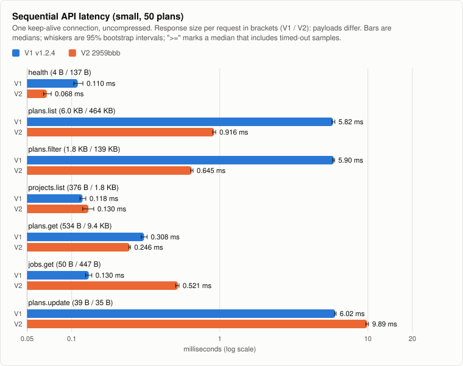

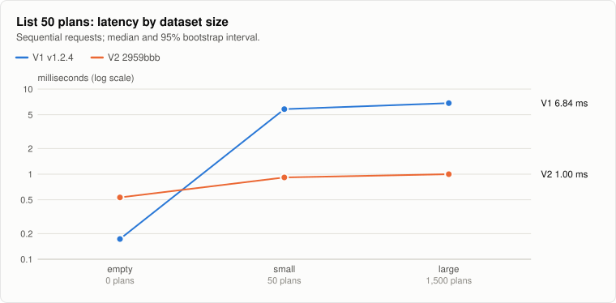

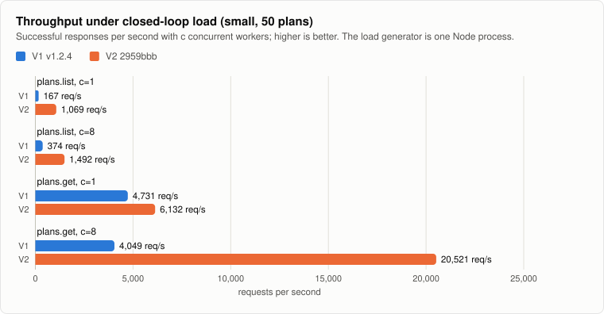

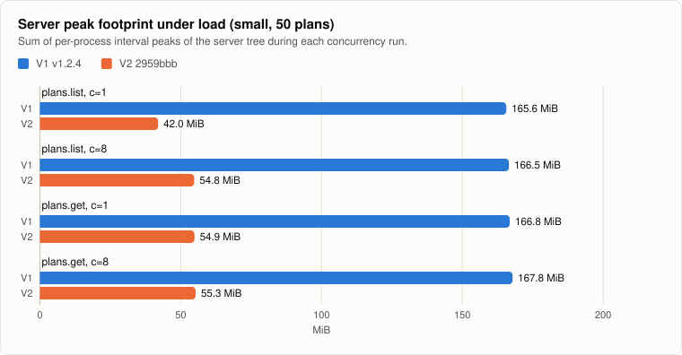

**Latency** (ms), lower is better:

| Scenario | Dataset | n (V1 / V2) | V1 median [95% CI] | V2 median [95% CI] | V1 p90 / p99 | V2 p90 / p99 | Response (V1 / V2) | Improvement (V2 vs V1) | p | Better |
| --- | --- | ---: | ---: | ---: | ---: | ---: | ---: | --- | ---: | :---: |
| `health` | empty (0) | 90 / 90 | 0.126 [0.122, 0.133] | 0.063 [0.062, 0.064] | 0.138 / 0.232 | 0.068 / 0.098 | 4 B / 137 B | 2.0x faster [1.9, 2.1] | <0.001 | **V2** |
| `health` | small (50) | 90 / 90 | 0.110 [0.103, 0.119] | 0.068 [0.065, 0.073] | 0.125 / 0.134 | 0.079 / 0.102 | 4 B / 137 B | 1.6x faster [1.5, 1.8] | <0.001 | **V2** |
| `health` | large (1,500) | 90 / 90 | 0.084 [0.079, 0.087] | 0.067 [0.064, 0.070] | 0.100 / 0.180 | 0.088 / 0.175 | 4 B / 137 B | 1.2x faster [1.1, 1.3] | <0.001 | **V2** |
| `plans.list` | empty (0) | 90 / 90 | 0.173 [0.167, 0.182] | 0.533 [0.506, 0.554] | 0.193 / 0.414 | 0.593 / 0.710 | 2 B / 2 B | 3.1x slower [2.9, 3.3] | <0.001 | **V1** |
| `plans.list` | small (50) | 90 / 90 | 5.82 [5.72, 5.99] | 0.916 [0.897, 0.939] | 6.50 / 7.03 | 1.01 / 1.36 | 6.0 KB / 464 KB | 6.4x faster [6.2, 6.6] | <0.001 | **V2** |
| `plans.list` | large (1,500) | 90 / 90 | 6.84 [6.73, 6.99] | 1.00 [0.96, 1.07] | 7.59 / 7.80 | 1.29 / 1.62 | 6.1 KB / 465 KB | 6.8x faster [6.4, 7.2] | <0.001 | **V2** |
| `plans.filter` | empty (0) | 90 / 90 | 0.174 [0.167, 0.182] | 0.591 [0.547, 0.609] | 0.195 / 0.254 | 0.642 / 0.733 | 2 B / 2 B | 3.4x slower [3.1, 3.6] | <0.001 | **V1** |
| `plans.filter` | small (50) | 90 / 90 | 5.90 [5.79, 5.97] | 0.645 [0.637, 0.660] | 6.55 / 6.90 | 0.696 / 0.795 | 1.8 KB / 139 KB | 9.1x faster [8.9, 9.3] | <0.001 | **V2** |
| `plans.filter` | large (1,500) | 90 / 90 | 19.4 [19.3, 19.6] | 1.04 [0.98, 1.09] | 20.3 / 21.4 | 1.20 / 1.63 | 6.0 KB / 464 KB | 18.7x faster [17.8, 19.9] | <0.001 | **V2** |
| `projects.list` | empty (0) | 90 / 90 | 0.134 [0.128, 0.141] | 0.117 [0.110, 0.124] | 0.156 / 0.328 | 0.135 / 0.156 | 125 B / 594 B | 1.2x faster [1.06, 1.3] | <0.001 | **V2** |
| `projects.list` | small (50) | 90 / 90 | 0.118 [0.114, 0.125] | 0.130 [0.119, 0.141] | 0.137 / 0.313 | 0.155 / 0.215 | 376 B / 1.8 KB | 1.10x slower [0.98, 1.2] | <0.001 | **V1** |
| `projects.list` | large (1,500) | 90 / 90 | 0.090 [0.085, 0.094] | 0.163 [0.153, 0.167] | 0.111 / 0.162 | 0.188 / 0.262 | 1.0 KB / 4.8 KB | 1.8x slower [1.7, 1.9] | <0.001 | **V1** |
| `plans.get` | small (50) | 90 / 90 | 0.308 [0.295, 0.323] | 0.246 [0.243, 0.250] | 0.383 / 0.733 | 0.294 / 0.313 | 534 B / 9.4 KB | 1.3x faster [1.2, 1.3] | <0.001 | **V2** |
| `plans.get` | large (1,500) | 90 / 90 | 0.731 [0.703, 0.751] | 0.409 [0.391, 0.424] | 0.840 / 1.38 | 0.481 / 0.561 | 540 B / 9.5 KB | 1.8x faster [1.7, 1.9] | <0.001 | **V2** |
| `jobs.get` | small (50) | 90 / 90 | 0.130 [0.124, 0.137] | 0.521 [0.504, 0.531] | 0.146 / 0.152 | 0.571 / 0.695 | 50 B / 447 B | 4.0x slower [3.8, 4.2] | <0.001 | **V1** |
| `jobs.get` | large (1,500) | 90 / 90 | 0.090 [0.085, 0.094] | 0.604 [0.565, 0.707] | 0.112 / 0.262 | 0.770 / 1.12 | 50 B / 444 B | 6.7x slower [6.1, 7.9] | <0.001 | **V1** |
| `plans.update` | small (50) | 90 / 90 | 6.02 [5.97, 6.10] | 9.89 [9.69, 10.10] | 7.50 / 9.09 | 11.2 / 25.4 | 39 B / 35 B | 1.6x slower [1.6, 1.7] | <0.001 | **V1** |
| `plans.update` | large (1,500) | 90 / 90 | 5.94 [5.85, 6.00] | 6.35 [6.12, 6.78] | 7.19 / 9.28 | 7.01 / 7.25 | 39 B / 35 B | 1.07x slower [1.03, 1.1] | <0.001 | **V1** |

**Latency under concurrent load** (ms), lower is better:

| Scenario | Dataset | n (V1 / V2) | V1 median [95% CI] | V2 median [95% CI] | V1 p90 / p99 | V2 p90 / p99 | Response (V1 / V2) | Improvement (V2 vs V1) | p | Better |
| --- | --- | ---: | ---: | ---: | ---: | ---: | ---: | --- | ---: | :---: |
| `plans.list@c1` | empty (0) | 3000 / 3000 | 0.088 [0.086, 0.089] | 0.579 [0.544, 0.602] | 0.107 / 0.126 | 0.649 / 0.771 | 2 B / 2 B | 6.6x slower [6.2, 6.9] | <0.001 | **V1** |
| `plans.list@c1` | small (50) | 1005 / 3000 | 5.86 [5.80, 5.93] | 0.922 [0.912, 0.931] | 6.55 / 7.08 | 0.989 / 1.15 | 6.0 KB / 464 KB | 6.4x faster [6.3, 6.5] | <0.001 | **V2** |
| `plans.list@c1` | large (1,500) | 878 / 3000 | 6.71 [6.66, 6.76] | 0.971 [0.966, 0.979] | 7.35 / 7.91 | 1.05 / 1.26 | 6.1 KB / 465 KB | 6.9x faster [6.8, 7.0] | <0.001 | **V2** |
| `plans.list@c8` | empty (0) | 3000 / 3000 | 0.121 [0.114, 0.127] | 4.43 [4.37, 4.51] | 0.158 / 0.226 | 5.22 / 6.21 | 2 B / 2 B | 36.7x slower [34.8, 38.9] | <0.001 | **V1** |
| `plans.list@c8` | small (50) | 2345 / 3000 | 12.7 [12.3, 13.5] | 5.31 [5.27, 5.36] | 19.4 / 213 | 6.19 / 6.97 | 6.0 KB / 464 KB | 2.4x faster [2.3, 2.5] | <0.001 | **V2** |
| `plans.list@c8` | large (1,500) | 1811 / 3000 | 13.3 [12.9, 13.7] | 5.32 [5.26, 5.40] | 113 / 218 | 6.21 / 7.00 | 6.1 KB / 465 KB | 2.5x faster [2.4, 2.6] | <0.001 | **V2** |
| `plans.get@c1` | small (50) | 3000 / 3000 | 0.197 [0.197, 0.198] | 0.159 [0.159, 0.160] | 0.241 / 0.482 | 0.169 / 0.185 | 534 B / 9.4 KB | 1.2x faster [1.2, 1.2] | <0.001 | **V2** |
| `plans.get@c1` | large (1,500) | 3000 / 3000 | 0.856 [0.852, 0.861] | 0.249 [0.248, 0.251] | 0.943 / 1.47 | 0.280 / 0.311 | 540 B / 9.5 KB | 3.4x faster [3.4, 3.5] | <0.001 | **V2** |
| `plans.get@c8` | small (50) | 3000 / 3000 | 0.212 [0.210, 0.214] | 0.376 [0.372, 0.380] | 0.263 / 101 | 0.470 / 0.583 | 534 B / 9.4 KB | 1.8x slower [1.8, 1.8] | <0.001 | **V1** |
| `plans.get@c8` | large (1,500) | 3000 / 3000 | 0.815 [0.789, 0.833] | 0.835 [0.824, 0.845] | 2.72 / 105 | 1.06 / 1.47 | 540 B / 9.5 KB | 1.03x slower [1.00, 1.06] (about the same) | <0.001 | within 5% |

**Time to first byte** (ms), lower is better:

| Scenario | Dataset | n (V1 / V2) | V1 median [95% CI] | V2 median [95% CI] | V1 p90 / p99 | V2 p90 / p99 | Improvement (V2 vs V1) | p | Better |
| --- | --- | ---: | ---: | ---: | ---: | ---: | --- | ---: | :---: |
| `health` | empty (0) | 90 / 90 | 0.113 [0.111, 0.118] | 0.057 [0.056, 0.058] | 0.126 / 0.218 | 0.061 / 0.076 | 2.0x faster [2.0, 2.1] | <0.001 | **V2** |
| `health` | small (50) | 90 / 90 | 0.100 [0.095, 0.106] | 0.062 [0.060, 0.067] | 0.113 / 0.124 | 0.069 / 0.093 | 1.6x faster [1.5, 1.7] | <0.001 | **V2** |
| `health` | large (1,500) | 90 / 90 | 0.072 [0.067, 0.075] | 0.061 [0.057, 0.063] | 0.087 / 0.164 | 0.077 / 0.164 | 1.2x faster [1.09, 1.3] | <0.001 | **V2** |
| `plans.list` | empty (0) | 90 / 90 | 0.160 [0.157, 0.165] | 0.527 [0.499, 0.547] | 0.176 / 0.405 | 0.583 / 0.704 | 3.3x slower [3.1, 3.4] | <0.001 | **V1** |
| `plans.list` | small (50) | 90 / 90 | 5.81 [5.72, 5.99] | 0.859 [0.839, 0.871] | 6.48 / 7.02 | 0.943 / 1.29 | 6.8x faster [6.6, 7.0] | <0.001 | **V2** |
| `plans.list` | large (1,500) | 90 / 90 | 6.82 [6.71, 6.99] | 0.937 [0.884, 1.004] | 7.58 / 7.78 | 1.15 / 1.54 | 7.3x faster [6.8, 7.8] | <0.001 | **V2** |
| `plans.filter` | empty (0) | 90 / 90 | 0.163 [0.157, 0.167] | 0.584 [0.537, 0.603] | 0.179 / 0.241 | 0.631 / 0.728 | 3.6x slower [3.3, 3.8] | <0.001 | **V1** |
| `plans.filter` | small (50) | 90 / 90 | 5.89 [5.77, 5.95] | 0.623 [0.617, 0.635] | 6.53 / 6.89 | 0.665 / 0.776 | 9.4x faster [9.2, 9.6] | <0.001 | **V2** |
| `plans.filter` | large (1,500) | 90 / 90 | 19.4 [19.3, 19.6] | 0.973 [0.910, 1.022] | 20.3 / 21.4 | 1.12 / 1.53 | 19.9x faster [19.0, 21.4] | <0.001 | **V2** |
| `projects.list` | empty (0) | 90 / 90 | 0.121 [0.119, 0.125] | 0.109 [0.104, 0.116] | 0.143 / 0.313 | 0.128 / 0.147 | 1.1x faster [1.04, 1.2] | <0.001 | **V2** |
| `projects.list` | small (50) | 90 / 90 | 0.108 [0.104, 0.112] | 0.123 [0.113, 0.132] | 0.126 / 0.303 | 0.140 / 0.205 | 1.1x slower [1.04, 1.2] | <0.001 | **V1** |
| `projects.list` | large (1,500) | 90 / 90 | 0.077 [0.072, 0.081] | 0.154 [0.146, 0.158] | 0.097 / 0.138 | 0.179 / 0.251 | 2.0x slower [1.9, 2.2] | <0.001 | **V1** |
| `plans.get` | small (50) | 90 / 90 | 0.298 [0.286, 0.312] | 0.239 [0.237, 0.243] | 0.372 / 0.720 | 0.282 / 0.307 | 1.2x faster [1.2, 1.3] | <0.001 | **V2** |
| `plans.get` | large (1,500) | 90 / 90 | 0.712 [0.692, 0.737] | 0.399 [0.382, 0.416] | 0.825 / 1.36 | 0.471 / 0.552 | 1.8x faster [1.7, 1.9] | <0.001 | **V2** |
| `jobs.get` | small (50) | 90 / 90 | 0.121 [0.114, 0.125] | 0.515 [0.499, 0.524] | 0.134 / 0.140 | 0.553 / 0.686 | 4.3x slower [4.1, 4.5] | <0.001 | **V1** |
| `jobs.get` | large (1,500) | 90 / 90 | 0.078 [0.074, 0.083] | 0.594 [0.557, 0.696] | 0.099 / 0.251 | 0.760 / 1.10 | 7.6x slower [6.8, 8.9] | <0.001 | **V1** |
| `plans.update` | small (50) | 90 / 90 | 6.00 [5.95, 6.09] | 9.85 [9.67, 10.05] | 7.43 / 8.96 | 11.2 / 25.4 | 1.6x slower [1.6, 1.7] | <0.001 | **V1** |
| `plans.update` | large (1,500) | 90 / 90 | 5.93 [5.83, 5.99] | 6.34 [6.11, 6.77] | 7.15 / 9.17 | 7.00 / 7.24 | 1.07x slower [1.03, 1.1] | <0.001 | **V1** |

**Latency per KB of response (derived)** (ms), lower is better:

| Scenario | Dataset | n (V1 / V2) | V1 median [95% CI] | V2 median [95% CI] | V1 p90 / p99 | V2 p90 / p99 | Improvement (V2 vs V1) | p | Better |
| --- | --- | ---: | ---: | ---: | ---: | ---: | --- | ---: | :---: |
| `plans.list` | small (50) | 90 / 90 | 0.977 [0.962, 1.004] | 0.002 [0.002, 0.002] | 1.09 / 1.18 | 0.002 / 0.003 | 495x faster [480, 514] (context only, not judged) | - | context only |
| `plans.list` | large (1,500) | 90 / 90 | 1.12 [1.11, 1.15] | 0.002 [0.002, 0.002] | 1.25 / 1.28 | 0.003 / 0.003 | 521x faster [489, 550] (context only, not judged) | - | context only |
| `plans.filter` | small (50) | 90 / 90 | 3.35 [3.28, 3.39] | 0.005 [0.005, 0.005] | 3.72 / 3.92 | 0.005 / 0.006 | 722x faster [701, 735] (context only, not judged) | - | context only |
| `plans.filter` | large (1,500) | 90 / 90 | 3.25 [3.23, 3.28] | 0.002 [0.002, 0.002] | 3.40 / 3.58 | 0.003 / 0.004 | 1450x faster [1384, 1543] (context only, not judged) | - | context only |
| `plans.get` | small (50) | 90 / 90 | 0.577 [0.551, 0.606] | 0.026 [0.026, 0.026] | 0.717 / 1.37 | 0.031 / 0.033 | 22.2x faster [21.1, 23.4] (context only, not judged) | - | context only |
| `plans.get` | large (1,500) | 90 / 90 | 1.35 [1.30, 1.39] | 0.043 [0.041, 0.045] | 1.55 / 2.55 | 0.051 / 0.059 | 31.3x faster [29.6, 32.8] (context only, not judged) | - | context only |

**Throughput (2xx responses) under concurrent load** (req/s), higher is better:

| Scenario | Dataset | n (V1 / V2) | V1 median (range) | V2 median (range) | Improvement (V2 vs V1) | p | Better |
| --- | --- | ---: | ---: | ---: | --- | ---: | :---: |
| `plans.list@c1` | empty (0) | 3 / 3 | 10,671 (10,430 to 10,956) | 1,660 (1,633 to 1,809) | 6.4x less throughput | no test (n=3) | V1 (every run) |
| `plans.list@c1` | small (50) | 3 / 3 | 167 (166 to 168) | 1,069 (1,056 to 1,078) | 6.4x more throughput | no test (n=3) | V2 (every run) |
| `plans.list@c1` | large (1,500) | 3 / 3 | 145 (145 to 148) | 1,013 (1,006 to 1,018) | 7.0x more throughput | no test (n=3) | V2 (every run) |
| `plans.list@c8` | empty (0) | 3 / 3 | 61,500 (57,483 to 64,368) | 1,778 (1,736 to 1,796) | 34.6x less throughput | no test (n=3) | V1 (every run) |
| `plans.list@c8` | small (50) | 3 / 3 | 374 (372 to 383) | 1,492 (1,480 to 1,497) | 4.0x more throughput | no test (n=3) | V2 (every run) |
| `plans.list@c8` | large (1,500) | 3 / 3 | 284 (281 to 297) | 1,487 (1,465 to 1,496) | 5.2x more throughput | no test (n=3) | V2 (every run) |
| `plans.get@c1` | small (50) | 3 / 3 | 4,731 (4,730 to 4,733) | 6,132 (6,131 to 6,176) | 1.3x more throughput | no test (n=3) | V2 (every run) |
| `plans.get@c1` | large (1,500) | 3 / 3 | 1,129 (1,095 to 1,137) | 3,887 (3,844 to 3,912) | 3.4x more throughput | no test (n=3) | V2 (every run) |
| `plans.get@c8` | small (50) | 3 / 3 | 4,049 (4,042 to 4,108) | 20,521 (20,508 to 20,671) | 5.1x more throughput | no test (n=3) | V2 (every run) |
| `plans.get@c8` | large (1,500) | 3 / 3 | 1,201 (1,165 to 1,221) | 9,462 (8,992 to 9,530) | 7.9x more throughput | no test (n=3) | V2 (every run) |

**Error rate under concurrent load** (%), lower is better:

| Scenario | Dataset | n (V1 / V2) | V1 median (range) | V2 median (range) | Improvement (V2 vs V1) | p | Better |
| --- | --- | ---: | ---: | ---: | --- | ---: | :---: |
| `plans.list@c1` | empty (0) | 3 / 3 | 0.00 (0.00 to 0.00) | 0.00 (0.00 to 0.00) | 1x (identical) (about the same) | no test (n=3) | within 5% |
| `plans.list@c1` | small (50) | 3 / 3 | 0.00 (0.00 to 0.00) | 0.00 (0.00 to 0.00) | 1x (identical) (about the same) | no test (n=3) | within 5% |
| `plans.list@c1` | large (1,500) | 3 / 3 | 0.00 (0.00 to 0.00) | 0.00 (0.00 to 0.00) | 1x (identical) (about the same) | no test (n=3) | within 5% |
| `plans.list@c8` | empty (0) | 3 / 3 | 0.00 (0.00 to 0.00) | 0.00 (0.00 to 0.00) | 1x (identical) (about the same) | no test (n=3) | within 5% |
| `plans.list@c8` | small (50) | 3 / 3 | 0.00 (0.00 to 0.00) | 0.00 (0.00 to 0.00) | 1x (identical) (about the same) | no test (n=3) | within 5% |
| `plans.list@c8` | large (1,500) | 3 / 3 | 0.00 (0.00 to 0.00) | 0.00 (0.00 to 0.00) | 1x (identical) (about the same) | no test (n=3) | within 5% |
| `plans.get@c1` | small (50) | 3 / 3 | 0.00 (0.00 to 0.00) | 0.00 (0.00 to 0.00) | 1x (identical) (about the same) | no test (n=3) | within 5% |
| `plans.get@c1` | large (1,500) | 3 / 3 | 0.00 (0.00 to 0.00) | 0.00 (0.00 to 0.00) | 1x (identical) (about the same) | no test (n=3) | within 5% |
| `plans.get@c8` | small (50) | 3 / 3 | 0.00 (0.00 to 0.00) | 0.00 (0.00 to 0.00) | 1x (identical) (about the same) | no test (n=3) | within 5% |
| `plans.get@c8` | large (1,500) | 3 / 3 | 0.00 (0.00 to 0.00) | 0.00 (0.00 to 0.00) | 1x (identical) (about the same) | no test (n=3) | within 5% |

**Server peak footprint under concurrent load** (MiB), lower is better:

| Scenario | Dataset | n (V1 / V2) | V1 median (range) | V2 median (range) | Improvement (V2 vs V1) | p | Better |
| --- | --- | ---: | ---: | ---: | --- | ---: | :---: |
| `plans.list@c1` | empty (0) | 3 / 3 | 160.1 (160.0 to 160.3) | 37.5 (37.2 to 37.6) | 4.3x less | no test (n=3) | V2 (every run) |
| `plans.list@c1` | small (50) | 3 / 3 | 165.6 (164.7 to 166.5) | 42.0 (41.5 to 42.0) | 3.9x less | no test (n=3) | V2 (every run) |
| `plans.list@c1` | large (1,500) | 3 / 3 | 224.0 (222.9 to 229.8) | 45.8 (45.6 to 46.0) | 4.9x less | no test (n=3) | V2 (every run) |
| `plans.list@c8` | empty (0) | 3 / 3 | 161.7 (161.4 to 162.3) | 39.4 (39.1 to 39.4) | 4.1x less | no test (n=3) | V2 (every run) |
| `plans.list@c8` | small (50) | 3 / 3 | 166.5 (165.5 to 167.3) | 54.8 (54.2 to 56.0) | 3.0x less | no test (n=3) | V2 (every run) |
| `plans.list@c8` | large (1,500) | 3 / 3 | 178.7 (177.9 to 184.6) | 56.6 (56.6 to 57.0) | 3.2x less | no test (n=3) | V2 (every run) |
| `plans.get@c1` | small (50) | 3 / 3 | 166.8 (165.8 to 167.5) | 54.9 (54.3 to 56.2) | 3.0x less | no test (n=3) | V2 (every run) |
| `plans.get@c1` | large (1,500) | 3 / 3 | 187.6 (187.3 to 199.0) | 56.7 (56.6 to 57.0) | 3.3x less | no test (n=3) | V2 (every run) |
| `plans.get@c8` | small (50) | 3 / 3 | 167.8 (166.9 to 168.8) | 55.3 (54.6 to 56.6) | 3.0x less | no test (n=3) | V2 (every run) |
| `plans.get@c8` | large (1,500) | 3 / 3 | 187.9 (187.6 to 199.2) | 41.2 (39.3 to 42.6) | 4.6x less | no test (n=3) | V2 (every run) |

**Server CPU time under concurrent load** (CPU s), lower is better:

| Scenario | Dataset | n (V1 / V2) | V1 median (range) | V2 median (range) | Improvement (V2 vs V1) | p | Better |
| --- | --- | ---: | ---: | ---: | --- | ---: | :---: |
| `plans.list@c1` | empty (0) | 3 / 3 | 4.46 (4.05 to 4.63) | 1.82 (1.81 to 1.82) | 2.5x less CPU | no test (n=3) | V2 (every run) |
| `plans.list@c1` | small (50) | 3 / 3 | 2.61 (2.55 to 2.62) | 1.88 (1.86 to 1.88) | 1.4x less CPU | no test (n=3) | V2 (every run) |
| `plans.list@c1` | large (1,500) | 3 / 3 | 2.09 (2.08 to 2.09) | 2.22 (2.20 to 2.78) | 1.06x more CPU | no test (n=3) | V1 (every run) |
| `plans.list@c8` | empty (0) | 3 / 3 | 17.9 (15.6 to 20.2) | 11.9 (11.8 to 11.9) | 1.5x less CPU | no test (n=3) | V2 (every run) |
| `plans.list@c8` | small (50) | 3 / 3 | 9.47 (9.21 to 9.61) | 11.3 (11.2 to 11.3) | 1.2x more CPU | no test (n=3) | V1 (every run) |
| `plans.list@c8` | large (1,500) | 3 / 3 | 7.12 (6.82 to 7.75) | 11.3 (11.3 to 11.3) | 1.6x more CPU | no test (n=3) | V1 (every run) |
| `plans.get@c1` | small (50) | 3 / 3 | 2.92 (2.76 to 2.94) | 1.61 (1.61 to 1.62) | 1.8x less CPU | no test (n=3) | V2 (every run) |
| `plans.get@c1` | large (1,500) | 3 / 3 | 2.76 (2.72 to 2.77) | 1.58 (1.57 to 1.59) | 1.7x less CPU | no test (n=3) | V2 (every run) |
| `plans.get@c8` | small (50) | 3 / 3 | 2.80 (2.77 to 2.80) | 13.1 (13.0 to 13.1) | 4.7x more CPU | no test (n=3) | V1 (every run) |
| `plans.get@c8` | large (1,500) | 3 / 3 | 2.66 (2.65 to 2.71) | 9.10 (9.04 to 9.11) | 3.4x more CPU | no test (n=3) | V1 (every run) |

**Server CPU per request (derived) under concurrent load** (ms), lower is better:

| Scenario | Dataset | n (V1 / V2) | V1 median (range) | V2 median (range) | Improvement (V2 vs V1) | p | Better |
| --- | --- | ---: | ---: | ---: | --- | ---: | :---: |
| `plans.list@c1` | empty (0) | 3 / 3 | 0.211 (0.190 to 0.214) | 0.548 (0.502 to 0.553) | 2.6x more CPU | no test (n=3) | V1 (every run) |
| `plans.list@c1` | small (50) | 3 / 3 | 7.80 (7.55 to 7.86) | 0.872 (0.871 to 0.888) | 9.0x less CPU | no test (n=3) | V2 (every run) |
| `plans.list@c1` | large (1,500) | 3 / 3 | 7.13 (7.07 to 7.17) | 1.10 (1.09 to 1.37) | 6.5x less CPU | no test (n=3) | V2 (every run) |
| `plans.list@c8` | empty (0) | 3 / 3 | 0.146 (0.121 to 0.176) | 3.32 (3.32 to 3.41) | 22.8x more CPU | no test (n=3) | V1 (every run) |
| `plans.list@c8` | small (50) | 3 / 3 | 12.0 (11.9 to 12.3) | 3.77 (3.76 to 3.80) | 3.2x less CPU | no test (n=3) | V2 (every run) |
| `plans.list@c8` | large (1,500) | 3 / 3 | 11.9 (11.5 to 12.4) | 3.78 (3.76 to 3.85) | 3.2x less CPU | no test (n=3) | V2 (every run) |
| `plans.get@c1` | small (50) | 3 / 3 | 0.308 (0.292 to 0.310) | 0.132 (0.131 to 0.132) | 2.3x less CPU | no test (n=3) | V2 (every run) |
| `plans.get@c1` | large (1,500) | 3 / 3 | 1.22 (1.22 to 1.24) | 0.204 (0.203 to 0.204) | 6.0x less CPU | no test (n=3) | V2 (every run) |
| `plans.get@c8` | small (50) | 3 / 3 | 0.322 (0.320 to 0.325) | 0.319 (0.314 to 0.319) | 1.01x less CPU (about the same) | no test (n=3) | within 5% |
| `plans.get@c8` | large (1,500) | 3 / 3 | 1.06 (1.06 to 1.09) | 0.481 (0.478 to 0.502) | 2.2x less CPU | no test (n=3) | V2 (every run) |

<details><summary>Harness notes (53)</summary>

- 3 independent server instance(s) per dataset and app (fresh home and process each), in ABBA order across instances with the starting app alternating per dataset (empty: v1#1 v2#1 v2#2 v1#2 v1#3 v2#3; small: v2#1 v1#1 v1#2 v2#2 v2#3 v1#3; large: v1#1 v2#1 v2#2 v1#2 v1#3 v2#3); only one server runs at a time, so no idle peer's background work lands in a measurement
- per server: settle until 20 s after spawn, sequential reads round-robin across scenarios (100 warmup + 30 timed per scenario and instance), closed-loop load for plans.list, plans.get at c=1, 8 (2 s each after a short warmup, once per instance), then sequential plans.update writes last
- load generator: up to 8 worker thread(s) (16 logical cores), keep-alive connections split across them; per-thread CPU and event-loop utilisation are in throughput_rps meta.perInstance[].client (limit: none, saturated or starved)
- payloads differ: V2 plans.list/plans.filter/plans.get return full PlanFile objects (including latest revision text), V1 returns thin summaries; response bytes are in meta.responseBytes, and latency_ms_per_kb is a derived normalisation shown for context only (no verdict)
- empty: skipped plans.get, plans.update, jobs.get on both apps: the dataset has no getPlanId/updatePlanId/jobId (both apps would answer 404)
- v1/empty instance 1: server /Applications/Ivy Tendril.app/Contents/MacOS/Ivy.Tendril (pid 19049) http-ready 1020 ms, data-ready 1076 ms; measurements start 20 s after spawn; 1-min load 21.69
- v1/empty instance 1 plans.list throughput scaling: c1 10956 req/s (client 0.44 cores, max ELU 0.46); c8 64368 req/s (client 3.09 cores, max ELU 0.41); c1->c8 x5.88
- v2/empty instance 1: server ~/Desktop/tendril-benchmark/ivy-tendril-v2/target/release/tendril (pid 19392) http-ready 23 ms, data-ready 23 ms; measurements start 20 s after spawn; 1-min load 16.78
- v2/empty instance 1 plans.list throughput scaling: c1 1633 req/s (client 0.07 cores, max ELU 0.07); c8 1736 req/s (client 0.23 cores, max ELU 0.02); c1->c8 x1.06
- v2/empty instance 2: server ~/Desktop/tendril-benchmark/ivy-tendril-v2/target/release/tendril (pid 19437) http-ready 28 ms, data-ready 28 ms; measurements start 20 s after spawn; 1-min load 12.38
- v2/empty instance 2 plans.list throughput scaling: c1 1660 req/s (client 0.07 cores, max ELU 0.07); c8 1778 req/s (client 0.23 cores, max ELU 0.02); c1->c8 x1.07
- v1/empty instance 2: server /Applications/Ivy Tendril.app/Contents/MacOS/Ivy.Tendril (pid 19488) http-ready 1040 ms, data-ready 1095 ms; measurements start 20 s after spawn; 1-min load 9.12
- v1/empty instance 2 plans.list throughput scaling: c1 10430 req/s (client 0.40 cores, max ELU 0.44); c8 61500 req/s (client 3.07 cores, max ELU 0.40); c1->c8 x5.90
- v1/empty instance 3: server /Applications/Ivy Tendril.app/Contents/MacOS/Ivy.Tendril (pid 19851) http-ready 1032 ms, data-ready 1090 ms; measurements start 20 s after spawn; 1-min load 9.35
- v1/empty instance 3 plans.list throughput scaling: c1 10671 req/s (client 0.41 cores, max ELU 0.45); c8 57483 req/s (client 2.94 cores, max ELU 0.38); c1->c8 x5.39
- v2/empty instance 3: server ~/Desktop/tendril-benchmark/ivy-tendril-v2/target/release/tendril (pid 20203) http-ready 20 ms, data-ready 20 ms; measurements start 20 s after spawn; 1-min load 8.53
- v2/empty instance 3 plans.list throughput scaling: c1 1809 req/s (client 0.08 cores, max ELU 0.08); c8 1796 req/s (client 0.24 cores, max ELU 0.02); c1->c8 x0.99
- v2/small instance 1: server ~/Desktop/tendril-benchmark/ivy-tendril-v2/target/release/tendril (pid 20261) http-ready 144 ms, data-ready 144 ms; measurements start 20 s after spawn; 1-min load 6.60
- v2/small instance 1 plans.list throughput scaling: c1 1056 req/s (client 0.18 cores, max ELU 0.12); c8 1492 req/s (client 0.46 cores, max ELU 0.05); c1->c8 x1.41
- v2/small instance 1 plans.get throughput scaling: c1 6132 req/s (client 0.20 cores, max ELU 0.24); c8 20671 req/s (client 0.96 cores, max ELU 0.13); c1->c8 x3.37
- v1/small instance 1: server /Applications/Ivy Tendril.app/Contents/MacOS/Ivy.Tendril (pid 20317) http-ready 1140 ms, data-ready 1251 ms; measurements start 20 s after spawn; 1-min load 6.16
- v1/small instance 1 plans.list throughput scaling: c1 168 req/s (client 0.02 cores, max ELU 0.02); c8 374 req/s (client 0.07 cores, max ELU 0.01); c1->c8 x2.22
- v1/small instance 1 plans.get throughput scaling: c1 4730 req/s (client 0.18 cores, max ELU 0.21); c8 4049 req/s (client 0.31 cores, max ELU 0.05); c1->c8 x0.86
- v1/small instance 2: server /Applications/Ivy Tendril.app/Contents/MacOS/Ivy.Tendril (pid 20667) http-ready 1043 ms, data-ready 1151 ms; measurements start 20 s after spawn; 1-min load 5.01
- v1/small instance 2 plans.list throughput scaling: c1 166 req/s (client 0.02 cores, max ELU 0.02); c8 383 req/s (client 0.07 cores, max ELU 0.01); c1->c8 x2.30
- v1/small instance 2 plans.get throughput scaling: c1 4733 req/s (client 0.18 cores, max ELU 0.21); c8 4042 req/s (client 0.30 cores, max ELU 0.04); c1->c8 x0.85
- v2/small instance 2: server ~/Desktop/tendril-benchmark/ivy-tendril-v2/target/release/tendril (pid 21023) http-ready 134 ms, data-ready 134 ms; measurements start 20 s after spawn; 1-min load 4.07
- v2/small instance 2 plans.list throughput scaling: c1 1078 req/s (client 0.20 cores, max ELU 0.13); c8 1480 req/s (client 0.46 cores, max ELU 0.04); c1->c8 x1.37
- v2/small instance 2 plans.get throughput scaling: c1 6131 req/s (client 0.21 cores, max ELU 0.24); c8 20521 req/s (client 0.94 cores, max ELU 0.13); c1->c8 x3.35
- v2/small instance 3: server ~/Desktop/tendril-benchmark/ivy-tendril-v2/target/release/tendril (pid 21076) http-ready 152 ms, data-ready 152 ms; measurements start 20 s after spawn; 1-min load 3.45
- v2/small instance 3 plans.list throughput scaling: c1 1069 req/s (client 0.21 cores, max ELU 0.14); c8 1497 req/s (client 0.45 cores, max ELU 0.04); c1->c8 x1.40
- v2/small instance 3 plans.get throughput scaling: c1 6176 req/s (client 0.20 cores, max ELU 0.24); c8 20508 req/s (client 0.94 cores, max ELU 0.13); c1->c8 x3.32
- v1/small instance 3: server /Applications/Ivy Tendril.app/Contents/MacOS/Ivy.Tendril (pid 21134) http-ready 1044 ms, data-ready 1148 ms; measurements start 20 s after spawn; 1-min load 5.88
- v1/small instance 3 plans.list throughput scaling: c1 167 req/s (client 0.02 cores, max ELU 0.02); c8 372 req/s (client 0.07 cores, max ELU 0.01); c1->c8 x2.22
- v1/small instance 3 plans.get throughput scaling: c1 4731 req/s (client 0.18 cores, max ELU 0.21); c8 4108 req/s (client 0.29 cores, max ELU 0.04); c1->c8 x0.87
- v1/large instance 1: server /Applications/Ivy Tendril.app/Contents/MacOS/Ivy.Tendril (pid 21490) http-ready 1115 ms, data-ready 2300 ms; measurements start 20 s after spawn; 1-min load 6.26
- v1/large instance 1 plans.list throughput scaling: c1 145 req/s (client 0.02 cores, max ELU 0.01); c8 284 req/s (client 0.06 cores, max ELU 0.01); c1->c8 x1.95
- v1/large instance 1 plans.get throughput scaling: c1 1129 req/s (client 0.06 cores, max ELU 0.06); c8 1201 req/s (client 0.13 cores, max ELU 0.03); c1->c8 x1.06
- v2/large instance 1: server ~/Desktop/tendril-benchmark/ivy-tendril-v2/target/release/tendril (pid 21851) http-ready 7372 ms, data-ready 7372 ms; measurements start 20 s after spawn; 1-min load 15.17
- v2/large instance 1 plans.list throughput scaling: c1 1013 req/s (client 0.19 cores, max ELU 0.12); c8 1487 req/s (client 0.46 cores, max ELU 0.04); c1->c8 x1.47
- v2/large instance 1 plans.get throughput scaling: c1 3912 req/s (client 0.14 cores, max ELU 0.16); c8 9462 req/s (client 0.57 cores, max ELU 0.07); c1->c8 x2.42
- v2/large instance 2: server ~/Desktop/tendril-benchmark/ivy-tendril-v2/target/release/tendril (pid 21921) http-ready 7519 ms, data-ready 7519 ms; measurements start 20 s after spawn; 1-min load 17.84
- v2/large instance 2 plans.list throughput scaling: c1 1006 req/s (client 0.19 cores, max ELU 0.13); c8 1496 req/s (client 0.48 cores, max ELU 0.04); c1->c8 x1.49
- v2/large instance 2 plans.get throughput scaling: c1 3844 req/s (client 0.14 cores, max ELU 0.16); c8 8992 req/s (client 0.53 cores, max ELU 0.07); c1->c8 x2.34
- v1/large instance 2: server /Applications/Ivy Tendril.app/Contents/MacOS/Ivy.Tendril (pid 21978) http-ready 1115 ms, data-ready 2306 ms; measurements start 20 s after spawn; 1-min load 18.01
- v1/large instance 2 plans.list throughput scaling: c1 145 req/s (client 0.02 cores, max ELU 0.01); c8 297 req/s (client 0.07 cores, max ELU 0.01); c1->c8 x2.04
- v1/large instance 2 plans.get throughput scaling: c1 1137 req/s (client 0.06 cores, max ELU 0.06); c8 1221 req/s (client 0.14 cores, max ELU 0.03); c1->c8 x1.07
- v1/large instance 3: server /Applications/Ivy Tendril.app/Contents/MacOS/Ivy.Tendril (pid 22346) http-ready 1098 ms, data-ready 2178 ms; measurements start 20 s after spawn; 1-min load 19.44
- v1/large instance 3 plans.list throughput scaling: c1 148 req/s (client 0.02 cores, max ELU 0.01); c8 281 req/s (client 0.06 cores, max ELU 0.01); c1->c8 x1.90
- v1/large instance 3 plans.get throughput scaling: c1 1095 req/s (client 0.06 cores, max ELU 0.06); c8 1165 req/s (client 0.13 cores, max ELU 0.03); c1->c8 x1.06
- v2/large instance 3: server ~/Desktop/tendril-benchmark/ivy-tendril-v2/target/release/tendril (pid 22713) http-ready 7626 ms, data-ready 7626 ms; measurements start 20 s after spawn; 1-min load 22.95
- v2/large instance 3 plans.list throughput scaling: c1 1018 req/s (client 0.20 cores, max ELU 0.13); c8 1465 req/s (client 0.45 cores, max ELU 0.04); c1->c8 x1.44
- v2/large instance 3 plans.get throughput scaling: c1 3887 req/s (client 0.14 cores, max ELU 0.16); c8 9530 req/s (client 0.56 cores, max ELU 0.07); c1->c8 x2.45

</details>

### Web UI in headless Chromium

Headless Chromium, same flags and viewport for both, 1 independent session(s) per dataset and app. Cold load in a fresh browser context, navigation between views (first visit and revisits), push latency from a REST write and from a file edit to the UI, navigation under a fixed background API load, and memory after the flows. The V2 frontend runs through the IPC shim, so V2 page timings include one loopback WebSocket message per command. **The server-side memory of V2 here is the daemon plus the shim, a stand-in for the tendril-app host, not the Tauri binary**; the real host is measured in the desktop suite.

_Ran 00:15:35 to 00:25:45 (10 min 10 s), status ok, 1-min load 23.24 at start, max 23.24; 170 metrics, 0 failure(s)._

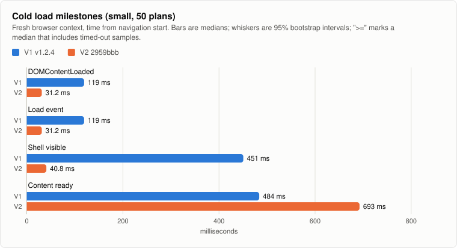

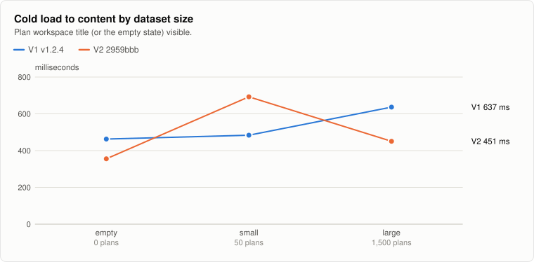

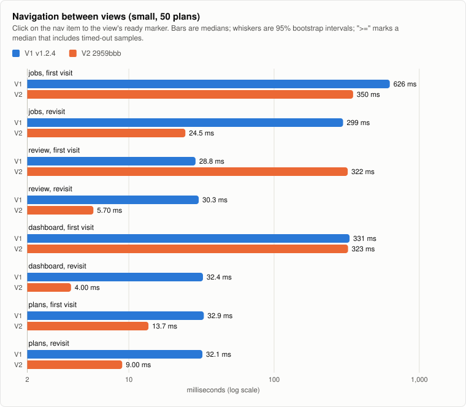

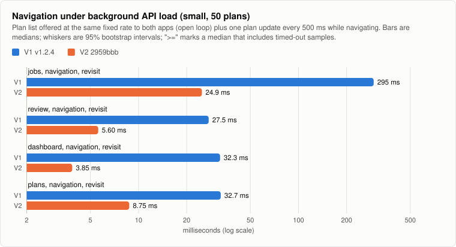

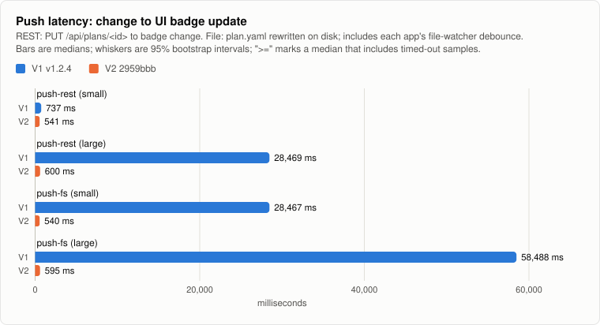

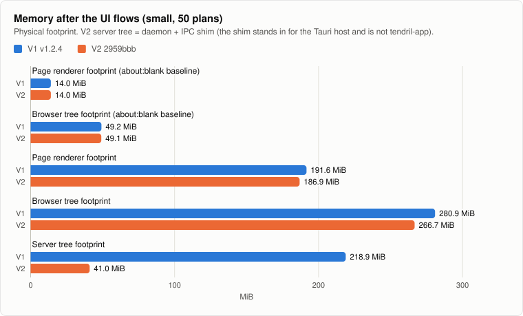

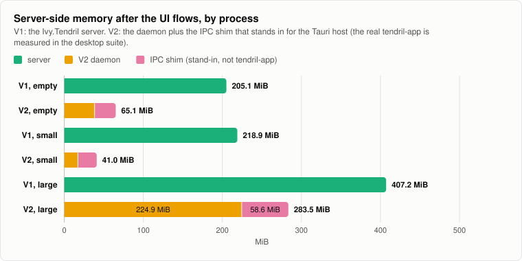

**Page renderer footprint** (MiB), lower is better:

| Scenario | Dataset | V1 | V2 | Improvement (V2 vs V1) | Better |
| --- | --- | ---: | ---: | --- | :---: |
| `about-blank-baseline` | empty (0) | 13.9 | 14.0 | 1.01x more (about the same) | within 5% |
| `about-blank-baseline` | small (50) | 14.0 | 14.0 | 1.00x more (about the same) | within 5% |
| `about-blank-baseline` | large (1,500) | 14.0 | 14.0 | 1.00x more (about the same) | within 5% |
| `memory-after-flows` | empty (0) | 221.1 | 126.6 | 1.7x less (indicative, n=1) | V2 (n=1, indicative) |
| `memory-after-flows` | small (50) | 191.6 | 186.9 | 1.03x less (about the same) | within 5% |
| `memory-after-flows` | large (1,500) | 170.3 | 241.4 | 1.4x more (indicative, n=1) | V1 (n=1, indicative) |

**Browser tree footprint** (MiB), lower is better:

| Scenario | Dataset | V1 | V2 | Improvement (V2 vs V1) | Better |
| --- | --- | ---: | ---: | --- | :---: |
| `about-blank-baseline` | empty (0) | 48.7 | 49.2 | 1.01x more (about the same) | within 5% |
| `about-blank-baseline` | small (50) | 49.2 | 49.1 | 1.00x less (about the same) | within 5% |
| `about-blank-baseline` | large (1,500) | 49.0 | 48.9 | 1.00x less (about the same) | within 5% |
| `memory-after-flows` | empty (0) | 323.5 | 197.4 | 1.6x less (indicative, n=1) | V2 (n=1, indicative) |
| `memory-after-flows` | small (50) | 280.9 | 266.7 | 1.05x less (indicative, n=1) | V2 (n=1, indicative) |
| `memory-after-flows` | large (1,500) | 242.3 | 321.3 | 1.3x more (indicative, n=1) | V1 (n=1, indicative) |

**DOMContentLoaded** (ms), lower is better:

| Dataset | n (V1 / V2) | V1 median (range) | V2 median (range) | Improvement (V2 vs V1) | p | Better |
| --- | ---: | ---: | ---: | --- | ---: | :---: |
| empty (0) | 3 / 3 | 121 (121 to 145) | 32.6 (32.5 to 34.8) | 3.7x faster | no test (n=3) | V2 (every run) |
| small (50) | 3 / 3 | 119 (118 to 140) | 31.2 (31.1 to 35.8) | 3.8x faster | no test (n=3) | V2 (every run) |
| large (1,500) | 3 / 3 | 121 (119 to 140) | 31.8 (31.7 to 36.1) | 3.8x faster | no test (n=3) | V2 (every run) |

**Load event** (ms), lower is better:

| Dataset | n (V1 / V2) | V1 median (range) | V2 median (range) | Improvement (V2 vs V1) | p | Better |
| --- | ---: | ---: | ---: | --- | ---: | :---: |
| empty (0) | 3 / 3 | 121 (121 to 146) | 32.6 (32.5 to 34.8) | 3.7x faster | no test (n=3) | V2 (every run) |
| small (50) | 3 / 3 | 119 (118 to 140) | 31.2 (31.1 to 35.8) | 3.8x faster | no test (n=3) | V2 (every run) |
| large (1,500) | 3 / 3 | 121 (119 to 140) | 31.8 (31.7 to 36.1) | 3.8x faster | no test (n=3) | V2 (every run) |

**Shell visible** (ms), lower is better:

| Dataset | n (V1 / V2) | V1 median (range) | V2 median (range) | Improvement (V2 vs V1) | p | Better |
| --- | ---: | ---: | ---: | --- | ---: | :---: |
| empty (0) | 3 / 3 | 457 (456 to 551) | 42.6 (42.6 to 45.0) | 10.7x faster | no test (n=3) | V2 (every run) |
| small (50) | 3 / 3 | 451 (448 to 535) | 40.8 (40.8 to 46.2) | 11.0x faster | no test (n=3) | V2 (every run) |
| large (1,500) | 3 / 3 | 452 (450 to 530) | 41.5 (41.3 to 46.5) | 10.9x faster | no test (n=3) | V2 (every run) |

**Content ready** (ms), lower is better:

| Dataset | n (V1 / V2) | V1 median (range) | V2 median (range) | Improvement (V2 vs V1) | p | Better |
| --- | ---: | ---: | ---: | --- | ---: | :---: |
| empty (0) | 3 / 3 | 463 (461 to 571) | 356 (355 to 357) | 1.3x faster | no test (n=3) | V2 (every run) |
| small (50) | 3 / 3 | 484 (482 to 617) | 693 (693 to 701) | 1.4x slower | no test (n=3) | V1 (every run) |
| large (1,500) | 3 / 3 | 637 (621 to 903) | 451 (425 to 455) | 1.4x faster | no test (n=3) | V2 (every run) |

**Transferred bytes** (MB), lower is better:

| Dataset | n (V1 / V2) | V1 median (range) | V2 median (range) | Improvement (V2 vs V1) | p | Better |
| --- | ---: | ---: | ---: | --- | ---: | :---: |
| empty (0) | 3 / 3 | 12.74 (12.74 to 12.74) | 1.92 (1.92 to 1.92) | 6.6x smaller | no test (n=3) | V2 (every run) |
| small (50) | 3 / 3 | 12.74 (12.74 to 12.74) | 2.44 (2.44 to 2.44) | 5.2x smaller | no test (n=3) | V2 (every run) |
| large (1,500) | 3 / 3 | 12.74 (12.74 to 12.74) | 2.44 (2.44 to 2.44) | 5.2x smaller | no test (n=3) | V2 (every run) |

**Requests**, lower is better:

| Dataset | n (V1 / V2) | V1 median (range) | V2 median (range) | Improvement (V2 vs V1) | p | Better |
| --- | ---: | ---: | ---: | --- | ---: | :---: |
| empty (0) | 3 / 3 | 57 (57 to 57) | 35 (35 to 35) | 1.6x fewer | no test (n=3) | V2 (every run) |
| small (50) | 3 / 3 | 57 (57 to 57) | 58 (58 to 58) | 1.02x more (about the same) | no test (n=3) | within 5% |
| large (1,500) | 3 / 3 | 57 (57 to 57) | 58 (58 to 58) | 1.02x more (about the same) | no test (n=3) | within 5% |

**JS heap used** (MiB), lower is better:

| Scenario | Dataset | n (V1 / V2) | V1 median (range) | V2 median (range) | Improvement (V2 vs V1) | p | Better |
| --- | --- | ---: | ---: | ---: | --- | ---: | :---: |
| `cold-load` | empty (0) | 3 / 3 | 19.7 (19.7 to 19.8) | 4.9 (4.9 to 4.9) | 4.0x less | no test (n=3) | V2 (every run) |
| `cold-load` | small (50) | 3 / 3 | 20.5 (20.5 to 20.5) | 7.4 (7.4 to 7.4) | 2.8x less | no test (n=3) | V2 (every run) |
| `cold-load` | large (1,500) | 3 / 3 | 21.4 (21.4 to 21.4) | 9.9 (9.9 to 9.9) | 2.2x less | no test (n=3) | V2 (every run) |
| `memory-after-flows` | empty (0) | 1 / 1 | 35.6 | 13.5 | 2.6x less (indicative, n=1) | no test (n=1) | V2 (n=1, indicative) |
| `memory-after-flows` | small (50) | 1 / 1 | 43.0 | 16.9 | 2.5x less (indicative, n=1) | no test (n=1) | V2 (n=1, indicative) |
| `memory-after-flows` | large (1,500) | 1 / 1 | 29.1 | 23.1 | 1.3x less (indicative, n=1) | no test (n=1) | V2 (n=1, indicative) |

**DOM nodes**, lower is better:

| Scenario | Dataset | n (V1 / V2) | V1 median (range) | V2 median (range) | Improvement (V2 vs V1) | p | Better |
| --- | --- | ---: | ---: | ---: | --- | ---: | :---: |
| `cold-load` | empty (0) | 3 / 3 | 358 (358 to 358) | 295 (295 to 295) | 1.2x fewer | no test (n=3) | V2 (every run) |
| `cold-load` | small (50) | 3 / 3 | 614 (614 to 614) | 574 (574 to 574) | 1.07x fewer | no test (n=3) | V2 (every run) |
| `cold-load` | large (1,500) | 3 / 3 | 5,399 (5,399 to 5,399) | 5,359 (5,359 to 5,359) | 1.01x fewer (about the same) | no test (n=3) | within 5% |
| `memory-after-flows` | empty (0) | 1 / 1 | 2,569 | 4,320 | 1.7x more (indicative, n=1) | no test (n=1) | V1 (n=1, indicative) |
| `memory-after-flows` | small (50) | 1 / 1 | 3,266 | 743 | 4.4x fewer (indicative, n=1) | no test (n=1) | V2 (n=1, indicative) |
| `memory-after-flows` | large (1,500) | 1 / 1 | 5,852 | 20,791 | 3.6x more (indicative, n=1) | no test (n=1) | V1 (n=1, indicative) |

**Navigation, first visit** (ms), lower is better:

| Scenario | Dataset | n (V1 / V2) | V1 median (range) | V2 median (range) | Improvement (V2 vs V1) | p | Better |
| --- | --- | ---: | ---: | ---: | --- | ---: | :---: |
| `navigate:jobs` | empty (0) | 4 / 4 | 362 (354 to 396) | 328 (327 to 329) | 1.1x faster | no test (n=4) | V2 (every run) |
| `navigate:jobs` | small (50) | 4 / 4 | 626 (613 to 656) | 350 (347 to 351) | 1.8x faster | no test (n=4) | V2 (every run) |
| `navigate:jobs` | large (1,500) | 4 / 4 | 642 (623 to 672) | 364 (363 to 365) | 1.8x faster | no test (n=4) | V2 (every run) |
| `navigate:review` | empty (0) | 4 / 4 | 30.8 (30.1 to 31.4) | 304 (303 to 305) | 9.9x slower | no test (n=4) | V1 (every run) |
| `navigate:review` | small (50) | 4 / 4 | 28.8 (24.3 to 32.3) | 322 (315 to 325) | 11.2x slower | no test (n=4) | V1 (every run) |
| `navigate:review` | large (1,500) | 4 / 4 | 109 (104 to 109) | 325 (318 to 325) | 3.0x slower | no test (n=4) | V1 (every run) |
| `navigate:dashboard` | empty (0) | 4 / 4 | 327 (325 to 350) | 324 (322 to 325) | 1.01x faster (about the same) | no test (n=4) | within 5% |
| `navigate:dashboard` | small (50) | 4 / 4 | 331 (327 to 352) | 323 (320 to 324) | 1.02x faster (about the same) | no test (n=4) | within 5% |
| `navigate:dashboard` | large (1,500) | 4 / 4 | 334 (328 to 379) | 345 (342 to 346) | 1.03x slower (about the same) | no test (n=4) | within 5% |
| `navigate:plans` | empty (0) | 4 / 4 | 32.4 (31.5 to 32.6) | 2.35 (2.20 to 2.50) | 13.8x faster | no test (n=4) | V2 (every run) |
| `navigate:plans` | small (50) | 4 / 4 | 32.9 (31.7 to 33.1) | 13.7 (13.1 to 14.5) | 2.4x faster | no test (n=4) | V2 (every run) |
| `navigate:plans` | large (1,500) | 4 / 4 | 116 (99 to 121) | 26.7 (26.1 to 27.0) | 4.3x faster | no test (n=4) | V2 (every run) |

**Navigation, revisit** (ms), lower is better:

| Scenario | Dataset | n (V1 / V2) | V1 median (range) | V2 median (range) | Improvement (V2 vs V1) | p | Better |
| --- | --- | ---: | ---: | ---: | --- | ---: | :---: |
| `navigate:jobs` | empty (0) | 3 / 3 | 48.5 (46.9 to 49.8) | 17.7 (17.5 to 19.1) | 2.7x faster | no test (n=3) | V2 (every run) |
| `navigate:jobs` | small (50) | 3 / 3 | 299 (298 to 301) | 24.5 (24.0 to 25.9) | 12.2x faster | no test (n=3) | V2 (every run) |
| `navigate:jobs` | large (1,500) | 3 / 3 | 321 (309 to 328) | 28.5 (28.1 to 29.0) | 11.3x faster | no test (n=3) | V2 (every run) |
| `navigate:review` | empty (0) | 3 / 3 | 31.7 (31.4 to 31.8) | 2.10 (1.80 to 2.30) | 15.1x faster | no test (n=3) | V2 (every run) |
| `navigate:review` | small (50) | 3 / 3 | 30.3 (30.0 to 39.6) | 5.70 (5.60 to 6.00) | 5.3x faster | no test (n=3) | V2 (every run) |
| `navigate:review` | large (1,500) | 3 / 3 | 111 (110 to 113) | 7.80 (7.30 to 7.90) | 14.3x faster | no test (n=3) | V2 (every run) |
| `navigate:dashboard` | empty (0) | 3 / 3 | 33.0 (31.3 to 34.1) | 4.40 (4.30 to 4.50) | 7.5x faster | no test (n=3) | V2 (every run) |
| `navigate:dashboard` | small (50) | 3 / 3 | 32.4 (31.9 to 33.6) | 4.00 (3.80 to 4.30) | 8.1x faster | no test (n=3) | V2 (every run) |
| `navigate:dashboard` | large (1,500) | 3 / 3 | 34.4 (32.6 to 40.6) | 5.70 (5.40 to 6.10) | 6.0x faster | no test (n=3) | V2 (every run) |
| `navigate:plans` | empty (0) | 3 / 3 | 31.5 (31.5 to 31.6) | 1.70 (1.60 to 1.80) | 18.5x faster | no test (n=3) | V2 (every run) |
| `navigate:plans` | small (50) | 3 / 3 | 32.1 (31.7 to 34.0) | 9.00 (9.00 to 9.40) | 3.6x faster | no test (n=3) | V2 (every run) |
| `navigate:plans` | large (1,500) | 3 / 3 | 105 (100 to 106) | 20.9 (20.1 to 21.0) | 5.0x faster | no test (n=3) | V2 (every run) |
| `nav-under-load:jobs` | empty (0) | 2 / 2 | 48.0 (47.2 to 48.7) | 18.5 (16.2 to 20.7) | 2.6x faster | no test (n=2) | V2 (every run) |
| `nav-under-load:jobs` | small (50) | 2 / 2 | 295 (295 to 296) | 24.9 (23.7 to 26.1) | 11.9x faster | no test (n=2) | V2 (every run) |
| `nav-under-load:jobs` | large (1,500) | 2 / 2 | 310 (308 to 313) | 29.0 (28.6 to 29.4) | 10.7x faster | no test (n=2) | V2 (every run) |
| `nav-under-load:review` | empty (0) | 2 / 2 | 32.3 (31.7 to 33.0) | 2.20 (1.90 to 2.50) | 14.7x faster | no test (n=2) | V2 (every run) |
| `nav-under-load:review` | small (50) | 2 / 2 | 27.5 (25.5 to 29.4) | 5.60 (5.10 to 6.10) | 4.9x faster | no test (n=2) | V2 (every run) |
| `nav-under-load:review` | large (1,500) | 2 / 2 | 128 (113 to 143) | 7.45 (7.10 to 7.80) | 17.2x faster | no test (n=2) | V2 (every run) |
| `nav-under-load:dashboard` | empty (0) | 2 / 2 | 32.3 (31.2 to 33.4) | 4.20 (3.90 to 4.50) | 7.7x faster | no test (n=2) | V2 (every run) |
| `nav-under-load:dashboard` | small (50) | 2 / 2 | 32.3 (31.2 to 33.5) | 3.85 (3.60 to 4.10) | 8.4x faster | no test (n=2) | V2 (every run) |
| `nav-under-load:dashboard` | large (1,500) | 2 / 2 | 46.2 (44.2 to 48.2) | 5.30 (4.80 to 5.80) | 8.7x faster | no test (n=2) | V2 (every run) |
| `nav-under-load:plans` | empty (0) | 2 / 2 | 32.1 (31.1 to 33.1) | 1.70 (1.60 to 1.80) | 18.9x faster | no test (n=2) | V2 (every run) |
| `nav-under-load:plans` | small (50) | 2 / 2 | 32.7 (32.5 to 32.8) | 8.75 (8.10 to 9.40) | 3.7x faster | no test (n=2) | V2 (every run) |
| `nav-under-load:plans` | large (1,500) | 2 / 2 | 112 (98 to 126) | 20.1 (19.2 to 21.0) | 5.6x faster | no test (n=2) | V2 (every run) |

**Server tree footprint** (MiB), lower is better:

| Dataset | V1 | V2 | Improvement (V2 vs V1) | Better |
| --- | ---: | ---: | --- | :---: |
| empty (0) | 205.1 | 65.1 | 3.2x less (indicative, n=1) | V2 (n=1, indicative) |
| small (50) | 218.9 | 41.0 | 5.3x less (indicative, n=1) | V2 (n=1, indicative) |
| large (1,500) | 407.2 | 283.5 | 1.4x less (indicative, n=1) | V2 (n=1, indicative) |

**Push latency** (ms), lower is better:

| Scenario | Dataset | n (V1 / V2) | V1 median (range) | V2 median (range) | Improvement (V2 vs V1) | p | Better |
| --- | --- | ---: | ---: | ---: | --- | ---: | :---: |
| `push-rest` | small (50) | 3 / 3 | 737 (729 to 740) | 541 (540 to 544) | 1.4x faster | no test (n=3) | V2 (every run) |
| `push-rest` | large (1,500) | 3 / 3 | 28,469 (13,401 to 28,485) | 600 (595 to 604) | 47.4x faster | no test (n=3) | V2 (every run) |
| `push-fs` | small (50) | 3 / 3 | 28,467 (7,423 to 28,472) | 540 (537 to 544) | 52.8x faster | no test (n=3) | V2 (every run) |
| `push-fs` | large (1,500) | 3 / 3 | 58,488 (58,478 to 58,496) | 595 (595 to 598) | 98.3x faster | no test (n=3) | V2 (every run) |

<details><summary>Harness notes (18)</summary>

- Chromium headless (Playwright chromium.launch headless:true, --enable-precise-memory-info), viewport 1280x800. Per dataset and app: 1 independent session(s) (fresh home, server, V2 shim and browser each), in ABBA order with the starting app alternating per dataset (empty: v1#1 v2#1; small: v2#1 v1#1; large: v1#1 v2#1); in total 3 cold loads, 3 revisit cycles, 3 REST pushes, 3 file pushes and 2 cycles under load, split across the sessions. Each session's load average and duration are in meta.sessions.
- Times are measured inside the page: cold-load milestones from navigation start (performance.timeOrigin); navigation from the click event to the view's ready marker (MutationObserver + requestAnimationFrame watcher installed before the app's scripts, at most one check per frame on mutations plus a trailing one, and one every 50 ms otherwise; meta.perSample[].watcherChecks/watcherCheckMs record its cost); push from the harness's Date.now() at the write to the page's timeOrigin + now() when the plans badge shows the new count, corrected by the page-to-harness clock offset measured just before each write (meta.perSample[].pageClockOffsetMs).
- View order in navigation loops is jobs, review, dashboard, plans (V1 uses the same ready marker for plans and review, so they are never visited back to back). nav_first_ms samples are first visits in fresh contexts: one per cold load plus one on each session's warm page.
- transfer_bytes / request_count cover HTTP responses finished by content ready (CDP encodedDataLength, headers included); WebSocket traffic is in meta (V1's SignalR, V2's shim IPC socket).
- V2 runs through the IPC shim; its memory is reported under role v2-shim: IPC shim (stand-in for the tendril-app host; not the Tauri binary). The real tendril-app is measured in the desktop suite.
- push-fs rewrites plan.yaml's state line via a temp file outside Plans/ and a rename; it includes each app's file-watcher debounce.
- nav-under-load offers plans.list at 25 requests per second to both apps (open loop, at most 8 in flight) plus one plans.update every 500 ms.
- A sample that could not complete because of the app (a wait that timed out, a page that stopped taking clicks, a server that exited) is kept as a censored value at its limit (Metric.censored, reasons in meta.censoredWhy) as well as listed in failures.
- V2 views are React.lazy inside one Suspense boundary, and React 19 holds revealed Suspense content until 300 ms after its fallback was shown (FALLBACK_THROTTLE_MS, present in the built vendor-react chunk). V2 first visits and cold loads therefore sit near 300 ms after the fallback, or well below it when the chunk arrives before the fallback commits; this is what a user sees, and it makes those V2 samples bimodal across runs.
- push-rest skipped for v1/empty: the dataset has no Draft plan besides the auto-opened one
- push-fs skipped for v1/empty: the dataset has no Draft plan besides the auto-opened one
- nav-under-load for v1/empty: no plan to update, so the background load is plans.list only
- push-rest skipped for v2/empty: the dataset has no Draft plan besides the auto-opened one
- push-fs skipped for v2/empty: the dataset has no Draft plan besides the auto-opened one
- nav-under-load for v2/empty: no plan to update, so the background load is plans.list only
- V2 known bug F1 reproduced: cmd_list_all_recommendations is not registered (1 failed call(s) on the empty warm page); the app falls back to one cmd_list_recommendations per plan (0 calls). Measured as is.
- V2 known bug F1 reproduced: cmd_list_all_recommendations is not registered (1 failed call(s) on the small warm page); the app falls back to one cmd_list_recommendations per plan (37 calls). Measured as is.
- V2 known bug F1 reproduced: cmd_list_all_recommendations is not registered (1 failed call(s) on the large warm page); the app falls back to one cmd_list_recommendations per plan (545 calls). Measured as is.

</details>

### Network traffic

How many bytes each app moves while its UI is used, counted on the wire by a byte-counting TCP proxy that follows HTTP/1.1 and WebSocket framing: application-layer bytes (HTTP heads and bodies, WebSocket frames, SSE streams), TCP/IP headers excluded. The two apps put their sockets in different places, so there are two legs:

- **UI to backend** (`ui_*`, the like-for-like comparison and the headline numbers): what the page exchanges with whatever serves it, with assets (documents, scripts, styles, fonts, images) and data counted separately. **V1**: the page and the V1 server over loopback HTTP and SignalR WebSockets; the V1 desktop app's WKWebView talks to the same local server the same way. **V2**: Chromium and the IPC shim, IPC messages plus the frontend assets. **In the real V2 app none of this touches a socket**: Tauri IPC is in-process and the assets load from the app bundle. It compares how much data each UI moves, not network traffic.
- **Architecture-internal sockets** (`net_*`): what really crosses a loopback socket in each shipped architecture, which is not like for like. **V1**: the same leg as above (page and server, so it includes the assets). **V2**: only the Tauri host and the daemon, over loopback REST, one WebSocket and one SSE change stream (no assets, no IPC). The host is played by the IPC shim, which runs the real `tendril-app` command handlers and bridges; it reaches the daemon through the proxy via a shadow `TENDRIL_HOME` whose `.master` names the proxy's port (the daemon's own `.master` is left alone). A check against the real `Tendril.app` behind the same kind of proxy is at the end of this section.

Scenarios (3 cold loads, 3 pushes, 1 idle window(s) of 20 s and 1 session(s) per dataset and app): `cold-load` (fresh browser context until the traffic settles after content), `nav:<view>` (first visit of each view in that context), `push` (a REST state change sent straight to the server, not through the proxy, and what the UI side then receives), `idle` (a settled page left alone, per minute) and `session` (load, every view and a few pushes, as one total). A window closes once no byte has moved on either leg for 1.5 s, so background traffic inside it (V2's 5 s job poll, SignalR keep-alives) is included; `idle` measures that background alone. Byte counts barely vary between runs, so most differences below are exact rather than statistical.

_Ran 00:25:45 to 00:38:51 (13 min 06 s), status ok, 1-min load 10.14 at start, max 10.37; 777 metrics, 0 failure(s)._

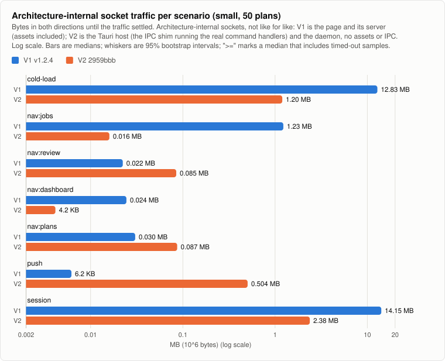

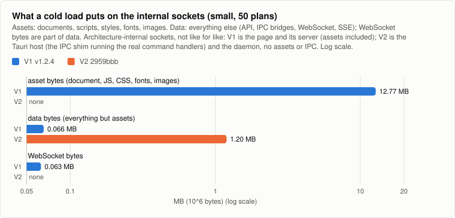

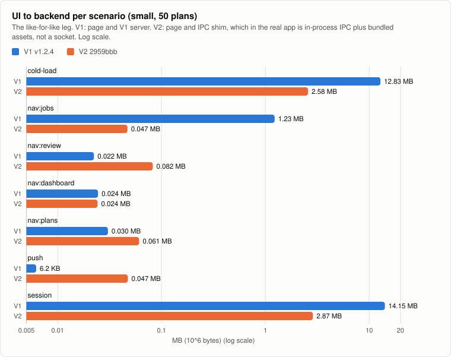

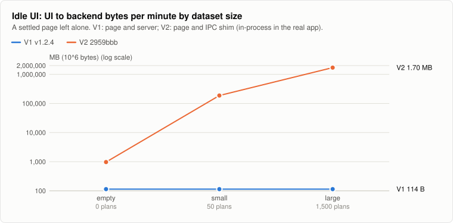

**UI to backend per scenario** (KB = 1,000 bytes, both directions; lower is better). V1: page and V1 server. V2: Chromium and the IPC shim, which in the real app is in-process IPC plus assets from the bundle, not a socket.

| Scenario | Dataset | n (V1 / V2) | V1 median (range) | V2 median (range) | Improvement (V2 vs V1) | p | Better |
| --- | --- | ---: | ---: | ---: | --- | ---: | :---: |
| `cold-load` | empty (0) | 3 / 3 | 12,808 (12,808 to 12,808) | 1,948 (1,948 to 1,948) | 6.6x smaller | no test (n=3) | V2 (every run) |
| `cold-load` | small (50) | 3 / 3 | 12,834 (12,834 to 12,834) | 2,577 (2,577 to 2,577) | 5.0x smaller | no test (n=3) | V2 (every run) |
| `cold-load` | large (1,500) | 3 / 3 | 12,947 (12,947 to 12,947) | 3,656 (3,656 to 4,162) | 3.5x smaller | no test (n=3) | V2 (every run) |
| `nav:jobs` | empty (0) | 3 / 3 | 1,190 (1,190 to 1,191) | 396 (396 to 396) | 3.0x smaller | no test (n=3) | V2 (every run) |
| `nav:jobs` | small (50) | 3 / 3 | 1,228 (1,228 to 1,228) | 47 (47 to 47) | 26.1x smaller | no test (n=3) | V2 (every run) |
| `nav:jobs` | large (1,500) | 3 / 3 | 1,277 (1,277 to 1,277) | 47 (47 to 47) | 27.1x smaller | no test (n=3) | V2 (every run) |
| `nav:review` | empty (0) | 3 / 3 | 4.1 (4.1 to 4.1) | 166 (166 to 166) | 40.7x larger | no test (n=3) | V1 (every run) |
| `nav:review` | small (50) | 3 / 3 | 22 (22 to 22) | 82 (82 to 82) | 3.7x larger | no test (n=3) | V1 (every run) |
| `nav:review` | large (1,500) | 3 / 3 | 99 (99 to 99) | 84 (84 to 84) | 1.2x smaller | no test (n=3) | V2 (every run) |
| `nav:dashboard` | empty (0) | 3 / 3 | 24 (24 to 24) | 24 (24 to 24) | 1.02x larger (about the same) | no test (n=3) | within 5% |
| `nav:dashboard` | small (50) | 3 / 3 | 24 (24 to 24) | 24 (24 to 24) | 1.01x smaller (about the same) | no test (n=3) | within 5% |
| `nav:dashboard` | large (1,500) | 3 / 3 | 44 (44 to 44) | 25 (25 to 25) | 1.7x smaller | no test (n=3) | V2 (every run) |
| `nav:plans` | empty (0) | 3 / 3 | 4.0 (4.0 to 4.0) | 2.1 (2.1 to 2.1) | 1.9x smaller | no test (n=3) | V2 (every run) |
| `nav:plans` | small (50) | 3 / 3 | 30 (30 to 30) | 61 (61 to 61) | 2.0x larger | no test (n=3) | V1 (every run) |
| `nav:plans` | large (1,500) | 3 / 3 | 144 (144 to 144) | 68 (68 to 68) | 2.1x smaller | no test (n=3) | V2 (every run) |
| `push` | small (50) | 3 / 3 | 6.2 (5.8 to 6.4) | 47 (32 to 47) | 7.6x larger | no test (n=3) | V1 (every run) |
| `push` | large (1,500) | 3 / 3 | 211 (211 to 211) | 496 (496 to 512) | 2.3x larger | no test (n=3) | V1 (every run) |
| `session` | empty (0) | 1 / 1 | 14,030 | 2,536 | 5.5x smaller (indicative, n=1) | no test (n=1) | V2 (n=1, indicative) |
| `session` | small (50) | 1 / 1 | 14,151 | 2,871 | 4.9x smaller (indicative, n=1) | no test (n=1) | V2 (n=1, indicative) |
| `session` | large (1,500) | 1 / 1 | 14,931 | 4,898 | 3.0x smaller (indicative, n=1) | no test (n=1) | V2 (n=1, indicative) |

**What a cold load exchanges between UI and backend (small, 50 plans):** bytes in KB, assets and data separately.

| Metric | Dataset | n (V1 / V2) | V1 median (range) | V2 median (range) | Improvement (V2 vs V1) | p | Better |
| --- | --- | ---: | ---: | ---: | --- | ---: | :---: |
| asset bytes (document, JS, CSS, fonts, images) | small (50) | 3 / 3 | 12,769 (12,769 to 12,769) | 2,470 (2,470 to 2,470) | 5.2x smaller | no test (n=3) | V2 (every run) |
| data bytes (everything but assets) | small (50) | 3 / 3 | 66 (66 to 66) | 108 (107 to 108) | 1.6x larger | no test (n=3) | V1 (every run) |
| WebSocket bytes | small (50) | 3 / 3 | 63 (63 to 63) | 107 (107 to 107) | 1.7x larger | no test (n=3) | V1 (every run) |
| bytes received (server to client) | small (50) | 3 / 3 | 12,800 (12,800 to 12,800) | 2,540 (2,539 to 2,540) | 5.0x smaller | no test (n=3) | V2 (every run) |
| bytes sent (client to server) | small (50) | 3 / 3 | 34 (34 to 34) | 38 (38 to 38) | 1.1x larger | no test (n=3) | V1 (every run) |

| Metric | Dataset | n (V1 / V2) | V1 median (range) | V2 median (range) | Improvement (V2 vs V1) | p | Better |
| --- | --- | ---: | ---: | ---: | --- | ---: | :---: |
| HTTP requests | small (50) | 3 / 3 | 59 (59 to 59) | 59 (59 to 59) | 1x (identical) (about the same) | no test (n=3) | within 5% |
| WebSocket messages | small (50) | 3 / 3 | 28 (28 to 29) | 100 (100 to 100) | 3.6x more | no test (n=3) | V1 (every run) |
| TCP connections opened | small (50) | 3 / 3 | 8 (8 to 8) | 7 (7 to 7) | 1.1x fewer | no test (n=3) | V2 (every run) |

**One push, UI to backend (small, 50 plans):** The state change itself goes straight to the server; these are the bytes (in KB) it causes on the UI side until the badge has changed and traffic has settled.

| Metric | Dataset | n (V1 / V2) | V1 median (range) | V2 median (range) | Improvement (V2 vs V1) | p | Better |
| --- | --- | ---: | ---: | ---: | --- | ---: | :---: |
| bytes received (server to client) | small (50) | 3 / 3 | 6.2 (5.8 to 6.4) | 47 (32 to 47) | 7.6x larger | no test (n=3) | V1 (every run) |
| bytes sent (client to server) | small (50) | 3 / 3 | 0.0 (0.0 to 0.0) | 0.1 (0.1 to 0.1) | V1 has none | no test (n=3) | V1 (every run) |
| total bytes | small (50) | 3 / 3 | 6.2 (5.8 to 6.4) | 47 (32 to 47) | 7.6x larger | no test (n=3) | V1 (every run) |

| Metric | Dataset | n (V1 / V2) | V1 median (range) | V2 median (range) | Improvement (V2 vs V1) | p | Better |
| --- | --- | ---: | ---: | ---: | --- | ---: | :---: |
| HTTP requests | small (50) | 3 / 3 | 0 (0 to 0) | 0 (0 to 0) | 1x (identical) (about the same) | no test (n=3) | within 5% |
| WebSocket messages | small (50) | 3 / 3 | 4 (4 to 4) | 6 (4 to 6) | 1.5x more (unclear) | no test (n=3) | unclear |

**Idle UI, UI to backend:** a settled page left alone; KB per minute, per dataset.

| Dataset | V1 | V2 | Improvement (V2 vs V1) | Better |
| --- | ---: | ---: | --- | :---: |
| empty (0) | 0.1 | 1.0 | 8.5x larger (indicative, n=1) | V1 (n=1, indicative) |
| small (50) | 0.1 | 187 | 1644x larger (indicative, n=1) | V1 (n=1, indicative) |
| large (1,500) | 0.1 | 1,703 | 14943x larger (indicative, n=1) | V1 (n=1, indicative) |

| Metric | Dataset | V1 | V2 | Improvement (V2 vs V1) | Better |
| --- | --- | ---: | ---: | --- | :---: |
| HTTP requests per minute | small (50) | 0 | 0 | 1x (identical) (about the same) | within 5% |
| WebSocket messages per minute | small (50) | 18.0 | 24.0 | 1.3x more (indicative, n=1) | V1 (n=1, indicative) |

**Architecture-internal sockets per scenario** (KB; not like for like: V1 is the page and its server, assets included; V2 is host and daemon only, no assets and no IPC).

| Scenario | Dataset | n (V1 / V2) | V1 median (range) | V2 median (range) | Improvement (V2 vs V1) | p | Better |
| --- | --- | ---: | ---: | ---: | --- | ---: | :---: |
| `cold-load` | empty (0) | 3 / 3 | 12,808 (12,808 to 12,808) | 11 (11 to 11) | 1125x smaller | no test (n=3) | V2 (every run) |
| `cold-load` | small (50) | 3 / 3 | 12,834 (12,834 to 12,834) | 1,196 (1,196 to 1,196) | 10.7x smaller | no test (n=3) | V2 (every run) |
| `cold-load` | large (1,500) | 3 / 3 | 12,947 (12,947 to 12,947) | 29,450 (29,440 to 43,404) | 2.3x larger | no test (n=3) | V1 (every run) |
| `nav:jobs` | empty (0) | 3 / 3 | 1,190 (1,190 to 1,191) | 2.0 (2.0 to 2.0) | 583x smaller | no test (n=3) | V2 (every run) |
| `nav:jobs` | small (50) | 3 / 3 | 1,228 (1,228 to 1,228) | 16 (16 to 16) | 76.8x smaller | no test (n=3) | V2 (every run) |
| `nav:jobs` | large (1,500) | 3 / 3 | 1,277 (1,277 to 1,277) | 16 (16 to 16) | 79.4x smaller | no test (n=3) | V2 (every run) |
| `nav:review` | empty (0) | 3 / 3 | 4.1 (4.1 to 4.1) | 0.3 (0.3 to 0.3) | 12.0x smaller | no test (n=3) | V2 (every run) |
| `nav:review` | small (50) | 3 / 3 | 22 (22 to 22) | 85 (85 to 85) | 3.8x larger | no test (n=3) | V1 (every run) |
| `nav:review` | large (1,500) | 3 / 3 | 99 (99 to 99) | 91 (91 to 91) | 1.10x smaller | no test (n=3) | V2 (every run) |
| `nav:dashboard` | empty (0) | 3 / 3 | 24 (24 to 24) | 4.1 (4.1 to 4.1) | 5.8x smaller | no test (n=3) | V2 (every run) |
| `nav:dashboard` | small (50) | 3 / 3 | 24 (24 to 24) | 4.2 (4.2 to 4.2) | 5.9x smaller | no test (n=3) | V2 (every run) |
| `nav:dashboard` | large (1,500) | 3 / 3 | 44 (44 to 44) | 5.4 (5.4 to 5.4) | 8.1x smaller | no test (n=3) | V2 (every run) |
| `nav:plans` | empty (0) | 3 / 3 | 4.0 (4.0 to 4.0) | 2.1 (2.1 to 2.1) | 1.9x smaller | no test (n=3) | V2 (every run) |
| `nav:plans` | small (50) | 3 / 3 | 30 (30 to 30) | 87 (87 to 87) | 2.9x larger | no test (n=3) | V1 (every run) |
| `nav:plans` | large (1,500) | 3 / 3 | 144 (144 to 144) | 96 (96 to 96) | 1.5x smaller | no test (n=3) | V2 (every run) |
| `push` | small (50) | 3 / 3 | 6.2 (5.8 to 6.4) | 504 (484 to 504) | 81.2x larger | no test (n=3) | V1 (every run) |
| `push` | large (1,500) | 3 / 3 | 211 (211 to 211) | 13,954 (13,954 to 13,973) | 66.0x larger | no test (n=3) | V1 (every run) |
| `session` | empty (0) | 1 / 1 | 14,030 | 20 | 702x smaller (indicative, n=1) | no test (n=1) | V2 (n=1, indicative) |
| `session` | small (50) | 1 / 1 | 14,151 | 2,376 | 6.0x smaller (indicative, n=1) | no test (n=1) | V2 (n=1, indicative) |
| `session` | large (1,500) | 1 / 1 | 14,931 | 57,575 | 3.9x larger (indicative, n=1) | no test (n=1) | V1 (n=1, indicative) |

| Metric | Dataset | n (V1 / V2) | V1 median (range) | V2 median (range) | Improvement (V2 vs V1) | p | Better |
| --- | --- | ---: | ---: | ---: | --- | ---: | :---: |
| asset bytes (document, JS, CSS, fonts, images) | small (50) | 3 / 3 | 12,769 (12,769 to 12,769) | 0.0 (0.0 to 0.0) | V2 has none | no test (n=3) | V2 (every run) |
| data bytes (everything but assets) | small (50) | 3 / 3 | 66 (66 to 66) | 1,196 (1,196 to 1,196) | 18.3x larger | no test (n=3) | V1 (every run) |
| HTTP requests | small (50) | 3 / 3 | 0.1 (0.1 to 0.1) | 0.0 (0.0 to 0.0) | 1.6x fewer | no test (n=3) | V2 (every run) |
| TCP connections opened | small (50) | 3 / 3 | 0.0 (0.0 to 0.0) | 0.0 (0.0 to 0.0) | 4.8x more | no test (n=3) | V1 (every run) |

| Dataset | V1 | V2 | Improvement (V2 vs V1) | Better |
| --- | ---: | ---: | --- | :---: |
| empty (0) | 0.1 | 4.1 | 35.9x larger (indicative, n=1) | V1 (n=1, indicative) |
| small (50) | 0.1 | 236 | 2071x larger (indicative, n=1) | V1 (n=1, indicative) |
| large (1,500) | 0.1 | 42,148 | 369751x larger (indicative, n=1) | V1 (n=1, indicative) |

**Where the bytes go** (small, 50 plans, first sample of each scenario, largest routes first; idle is per window, not per minute). Routes collapse ids; `asset .js` is every JavaScript file.

| Scenario | Leg | App | Largest routes |
| --- | --- | :---: | --- |
| `cold-load` | UI to backend | V2 | `asset .js` 2.14 MB (52 req); `asset .css` 331 KB (4 req); `WS /__shim/ws` 107 KB (1 req); `asset document` 3.5 KB (1 req) |
| `cold-load` | internal sockets | V1 | `asset .js` 12.04 MB (42 req); `asset .woff2` 366 KB (8 req); `asset .css` 334 KB (3 req); `WS /ivy/messages` 63 KB (2 req) |
| `cold-load` | internal sockets | V2 | `GET /api/plans` 929 KB (2 req); `GET /api/plans/:id` 196 KB (20 req); `GET /api/agents` 29 KB (1 req); `GET /api/jobs` 20 KB (1 req) |
| `push` | UI to backend | V2 | `WS /__shim/ws` 47 KB; `GET /__shim/events` 137 B |
| `push` | internal sockets | V1 | `WS /ivy/messages` 6.2 KB |
| `push` | internal sockets | V2 | `GET /api/plans` 465 KB (1 req); `GET /api/jobs` 39 KB (2 req); `GET /api/changes/events` 116 B |
| `idle` | UI to backend | V2 | `WS /__shim/ws` 62 KB; `GET /__shim/events` 8 B |
| `idle` | internal sockets | V1 | `WS /ivy/messages` 38 B |
| `idle` | internal sockets | V2 | `GET /api/jobs` 79 KB (4 req); `GET /api/changes/events` 8 B |

**External traffic of the real desktop apps** (KB): `nettop` (non-loopback TCP only) over every process from before the app (and V2's daemon) was spawned, filtered to the app's process tree afterwards. Both apps run their shipped background fetches. A lower bound: `nettop` sees only sockets still open at a 1 s sample. Remote addresses are shown as resolved by reverse DNS where that works (CDN-fronted hosts usually do not).

| Metric | Dataset | V1 | V2 | Improvement (V2 vs V1) | Better |
| --- | --- | ---: | ---: | --- | :---: |
| External bytes received | small (50) | 4,880 | 349 | 14.0x smaller (indicative, n=1) | V2 (n=1, indicative) |
| External bytes sent | small (50) | 2.9 | 0.4 | 7.1x smaller (indicative, n=1) | V2 (n=1, indicative) |

| Metric | Dataset | V1 | V2 | Improvement (V2 vs V1) | Better |
| --- | --- | ---: | ---: | --- | :---: |
| External TCP connections | small (50) | 2 | 1 | 2.0x fewer (indicative, n=1) | V2 (n=1, indicative) |

- V1: `172.67.69.147:443` from `Ivy.Tendril`, 4.87 MB in / 369 B out; `151.101.65.229:443` from `com.apple.WebKi`, 6.7 KB in / 2.6 KB out
- V2: `104.26.9.108:443` from `tendril`, 349 KB in / 416 B out

**Check of the IPC shim against the real V2 host** (small, 50 plans). The real `Tendril.app` ran with a shadow `TENDRIL_HOME` whose `.master` pointed at a counting proxy in front of its daemon; its host to daemon traffic from the launch until the first burst settled is compared with the shim's cold load (median of its samples) on the same dataset. The real host's window also contains its WebSocket and SSE bridge setup, which the shim does before its cold-load window.

| Host | Bytes (both directions) | Requests | Real / shim |
| --- | ---: | ---: | ---: |
| real `tendril-app`, launch to settled | 1.20 MB | 40 | 1.00x |
| IPC shim, cold load | 1.20 MB | 38 |  |
| real `tendril-app`, first 30 s | 1.22 MB | 41 |  |

<details><summary>Harness notes (11)</summary>

- Bytes are counted on the wire by a TCP proxy (lib/tcpproxy.ts) that follows HTTP/1.1 and WebSocket framing: application-layer bytes in each direction (HTTP heads and bodies, WebSocket frame headers and payloads, SSE streams), TCP/IP headers excluded. Assets are requests the browser marks Sec-Fetch-Dest document/script/style/font/image (or GET of a static file extension); data is everything else (total minus assets).
- Leg "ui" (the like-for-like comparison) = what the page exchanges with its backend, assets and data counted separately: for V1 browser <-> V1 server; for V2 browser <-> shim, which in the real Tauri app is in-process IPC plus assets from the app bundle and never touches a socket. Leg "net" = architecture-internal loopback sockets: for V1 the same leg as "ui"; for V2 host <-> daemon only (the host is the IPC shim running the real tendril-app command handlers and bridges, reaching the daemon through a shadow TENDRIL_HOME whose .master points at the proxy), so it carries no assets and no IPC.
- Per dataset and app: 3 cold loads (fresh context) each followed by first visits of jobs, review, dashboard, plans; 1 idle window(s) of 20 s on a warm page; 3 REST pushes (the PUT itself goes straight to the server and is not counted); 1 scripted session(s) of load + every view + 2 pushes. A window ends when no byte has moved on either leg for 1500 ms (at most 20 s), so background traffic inside it (V2's 5 s job poll, SignalR keep-alives) is included; the idle scenario measures that background alone. Headless Chromium 1280x800, as in the ui suite.
- push skipped for v1/empty: the dataset has no Draft plan besides the auto-opened one
- push skipped for v2/empty: the dataset has no Draft plan besides the auto-opened one
- V2/empty: shim bridged through the host->daemon proxy via a shadow TENDRIL_HOME (symlinks to the daemon's home, own .master); failed IPC commands across all pages: cmd_list_all_recommendations x5 (cmd_list_all_recommendations is known V2 bug F1; cmd_get_verification_report finds no report file in the generated plans; both fail the same way in the ui suite, where the shim uses the real home).
- V2/small: shim bridged through the host->daemon proxy via a shadow TENDRIL_HOME (symlinks to the daemon's home, own .master); failed IPC commands across all pages: cmd_list_all_recommendations x5, cmd_get_verification_report x4 (cmd_list_all_recommendations is known V2 bug F1; cmd_get_verification_report finds no report file in the generated plans; both fail the same way in the ui suite, where the shim uses the real home).
- V2/large: shim bridged through the host->daemon proxy via a shadow TENDRIL_HOME (symlinks to the daemon's home, own .master); failed IPC commands across all pages: cmd_list_all_recommendations x5, cmd_list_recommendations x1882, cmd_get_verification_report x4 (cmd_list_all_recommendations is known V2 bug F1; cmd_get_verification_report finds no report file in the generated plans; both fail the same way in the ui suite, where the shim uses the real home).
- desktop-external: each real desktop app (small dataset) watched with `nettop -s 1 -m tcp -t external` over every process, started before the app (and V2's daemon) was spawned and run for 30 s, then filtered to the app, its WebKit processes, (V2) the daemon and their descendants; loopback excluded. Both apps run their shipped background fetches (V1's model pricing warmup, V2's model enrichment). A lower bound: a socket opened and closed between two 1 s samples is missed.
- real-host-cold-load: tendril-app was connected to the daemon through the proxy (shadow home; 40 request(s) in the cold-load window)
- V2 "ui" leg: role of the far end is the IPC shim (stand-in for the tendril-app host; not the Tauri binary).

</details>

### Desktop apps (WKWebView)

The real desktop apps, both rendering with WKWebView, 1 discarded warmup + 3 measured launch(es) of 30 s per dataset. The process set is the app, its WebKit processes (found by responsible pid) and, for V2, the daemon. `launch` is timed from the launch command, when V2's daemon is already running; `cold-launch` is the same launches timed from the moment the backend was spawned (V1: the launch command, its server is in-process; V2: the daemon's spawn), which is the like-for-like start from nothing. Launch milestones are process events, not content: V1 shows its window only once its in-process server answers, Tauri shows V2's window before the page has loaded. Window sizes differ, as observed: V1 810x566 pt (3x); V2 1152x721 pt (3x). V1 has the smaller window (55% of the other's area), so its WebKit backing stores are smaller.

_Ran 00:38:51 to 00:42:24 (3 min 33 s), status ok, 1-min load 2.32 at start, max 2.32; 31 metrics, 0 failure(s)._

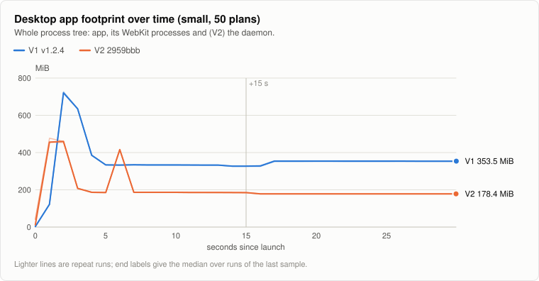

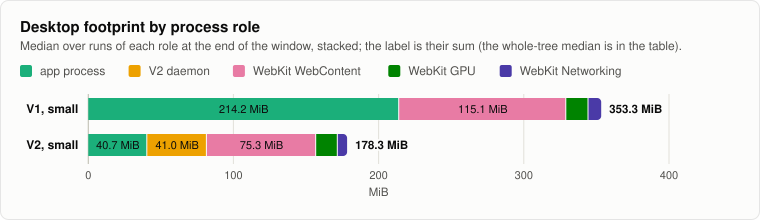

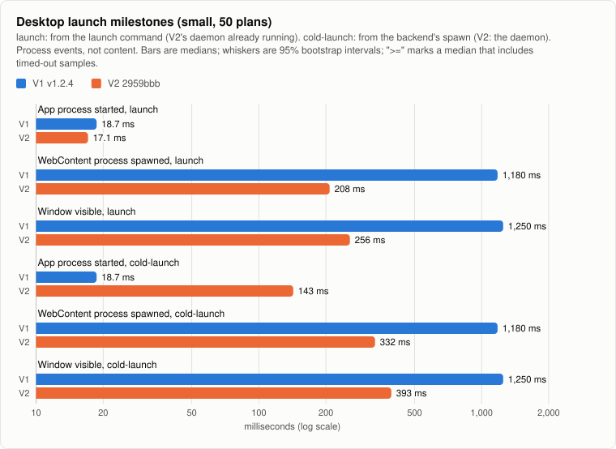

**App process started** (ms), lower is better:

| Scenario | Dataset | n (V1 / V2) | V1 median (range) | V2 median (range) | Improvement (V2 vs V1) | p | Better |
| --- | --- | ---: | ---: | ---: | --- | ---: | :---: |
| `launch` | small (50) | 3 / 3 | 18.7 (18.4 to 19.5) | 17.1 (14.9 to 19.9) | 1.09x faster (unclear) | no test (n=3) | unclear |
| `cold-launch` | small (50) | 3 / 3 | 18.7 (18.4 to 19.5) | 143 (141 to 152) | 7.6x slower | no test (n=3) | V1 (every run) |

**WebContent process spawned** (ms), lower is better:

| Scenario | Dataset | n (V1 / V2) | V1 median (range) | V2 median (range) | Improvement (V2 vs V1) | p | Better |
| --- | --- | ---: | ---: | ---: | --- | ---: | :---: |
| `launch` | small (50) | 3 / 3 | 1,180 (1,160 to 1,188) | 208 (197 to 210) | 5.7x faster | no test (n=3) | V2 (every run) |
| `cold-launch` | small (50) | 3 / 3 | 1,180 (1,160 to 1,188) | 332 (331 to 334) | 3.5x faster | no test (n=3) | V2 (every run) |

**Window visible** (ms), lower is better:

| Scenario | Dataset | n (V1 / V2) | V1 median (range) | V2 median (range) | Improvement (V2 vs V1) | p | Better |
| --- | --- | ---: | ---: | ---: | --- | ---: | :---: |
| `launch` | small (50) | 3 / 3 | 1,250 (1,222 to 1,252) | 256 (247 to 272) | 4.9x faster | no test (n=3) | V2 (every run) |
| `cold-launch` | small (50) | 3 / 3 | 1,250 (1,222 to 1,252) | 393 (371 to 395) | 3.2x faster | no test (n=3) | V2 (every run) |

**CPU time to +15 s** (CPU s), lower is better:

| Scenario | Dataset | n (V1 / V2) | V1 median (range) | V2 median (range) | Improvement (V2 vs V1) | p | Better |
| --- | --- | ---: | ---: | ---: | --- | ---: | :---: |
| `launch` | small (50) | 3 / 3 | 3.95 (3.77 to 3.97) | 1.30 (1.09 to 1.30) | 3.0x less CPU | no test (n=3) | V2 (every run) |
| `cold-launch` | small (50) | 3 / 3 | 3.95 (3.77 to 3.97) | 1.39 (1.20 to 1.41) | 2.8x less CPU | no test (n=3) | V2 (every run) |

**Backend (daemon) ready** (ms), lower is better:

| Dataset | n (V1 / V2) | V1 median (range) | V2 median (range) | Improvement (V2 vs V1) | p | Better |
| --- | ---: | ---: | ---: | --- | ---: | :---: |
| small (50) | 0 / 3 | n/a | 122 (122 to 136) | V2 only | n/a | V2 only |

**Footprint at +15 s** (MiB), lower is better:

| Dataset | n (V1 / V2) | V1 median (range) | V2 median (range) | Improvement (V2 vs V1) | p | Better |
| --- | ---: | ---: | ---: | --- | ---: | :---: |
| small (50) | 3 / 3 | 326.4 (325.7 to 327.1) | 185.3 (183.6 to 185.3) | 1.8x less | no test (n=3) | V2 (every run) |

**Footprint at end** (MiB), lower is better:

| Dataset | n (V1 / V2) | V1 median (range) | V2 median (range) | Improvement (V2 vs V1) | p | Better |
| --- | ---: | ---: | ---: | --- | ---: | :---: |
| small (50) | 3 / 3 | 353.5 (351.6 to 354.1) | 178.4 (177.1 to 178.5) | 2.0x less | no test (n=3) | V2 (every run) |

**Mean footprint** (MiB), lower is better:

| Dataset | n (V1 / V2) | V1 median (range) | V2 median (range) | Improvement (V2 vs V1) | p | Better |
| --- | ---: | ---: | ---: | --- | ---: | :---: |
| small (50) | 3 / 3 | 349.7 (348.5 to 350.9) | 178.8 (177.5 to 178.9) | 2.0x less | no test (n=3) | V2 (every run) |

**Peak footprint** (MiB), lower is better:

| Dataset | n (V1 / V2) | V1 median (range) | V2 median (range) | Improvement (V2 vs V1) | p | Better |
| --- | ---: | ---: | ---: | --- | ---: | :---: |
| small (50) | 3 / 3 | 810.7 (808.9 to 812.0) | 476.4 (475.8 to 478.2) | 1.7x less | no test (n=3) | V2 (every run) |

**RSS at end (context only)** (MiB), lower is better:

| Dataset | n (V1 / V2) | V1 median (range) | V2 median (range) | Improvement (V2 vs V1) | p | Better |
| --- | ---: | ---: | ---: | --- | ---: | :---: |
| small (50) | 3 / 3 | 763.1 (756.7 to 765.9) | 345.9 (337.4 to 346.8) | 2.2x less | no test (n=3) | V2 (every run) |

**Mean CPU (% of one core)**, lower is better:

| Dataset | n (V1 / V2) | V1 median (range) | V2 median (range) | Improvement (V2 vs V1) | p | Better |
| --- | ---: | ---: | ---: | --- | ---: | :---: |
| small (50) | 3 / 3 | 6.35 (5.96 to 6.51) | 0.21 (0.21 to 0.23) | 29.5x less CPU | no test (n=3) | V2 (every run) |

**Idle wakeups per second**, lower is better:

| Dataset | n (V1 / V2) | V1 median (range) | V2 median (range) | Improvement (V2 vs V1) | p | Better |
| --- | ---: | ---: | ---: | --- | ---: | :---: |
| small (50) | 3 / 3 | 139.5 (138.8 to 140.3) | 2.14 (2.08 to 2.21) | 65.2x fewer | no test (n=3) | V2 (every run) |

<details><summary>Harness notes (7)</summary>

- Each launch: pristine home restored outside ~/Desktop (~/Library/Caches/tendril-benchmark/<runId>/homes), 1 discarded warmup launch(es) per app and dataset (quit 15 s after launch), then 3 measured launch(es) of 30 s interleaved ABBA. Process set sampled every 1000 ms: the app and its descendants, the WebKit XPC processes whose responsible pid is the app, and (V2) the daemon the adapter started before the app. CPU and wakeups are averaged from +15 s to the end. Windows are kept visible (no open -g); other windows on screen may occlude them.
- V1 desktop app: /Applications/Ivy Tendril.app (build-info.json v1.desktopApp, version 1.2.4), launched with open -n -F --args --desktop --port <free> and IVY_TLS=0 (the shipped app uses TLS); quit with SIGINT (SIGTERM does not exit it).
- V2 desktop app: ~/Desktop/tendril-benchmark/artifacts/v2/Tendril.app (build-info.json v2.appPath), launched with open -n -F and TENDRIL_SKIP_SERVICE_PROVISION=1, TENDRIL_SKIP_SERVICE_AUTOSTART=1 after its daemon (tendril serve) answered /api/health; the daemon is part of the measured set (role daemon).
- warmup v1/small: window at 1250 ms, footprint 327 MiB after 15 s (discarded)
- warmup v2/small: window at 237 ms, footprint 185 MiB after 15 s (discarded)
- window sizes observed at the end of each measured run (points; 2x pixels on a Retina display): V1 810x566 pt (3x); V2 1152x721 pt (3x). V1 has the smaller window (55% of the other's area), so its WebKit backing stores are smaller. Each app opens at its own default size; resizing from outside needs Accessibility access, which is not granted.
- WARNING: the screen was locked during 6 of 6 measured run(s) (v1/small run 1, v2/small run 1, v2/small run 2, v1/small run 2, v1/small run 3, v2/small run 3). The lock screen occludes the app windows (WebKit throttles occluded views) and new windows came up at 90% size, so memory and CPU are not representative of an app in use. Rerun with the screen unlocked.

</details>

## Findings

Detected automatically from the results; the hand-written interpretation follows under [Analysis](#analysis).

- **Suite `size` started under load**: 1-min load 5.02 at start (threshold 2 on 16 CPUs), max 5.02 during the suite. Treat small differences in this suite with caution.
- **Suite `cli` started under load**: 1-min load 4.42 at start (threshold 2 on 16 CPUs), max 8.77 during the suite. Treat small differences in this suite with caution.
- **Suite `startup` started under load**: 1-min load 8.77 at start (threshold 2 on 16 CPUs), max 20.91 during the suite. Treat small differences in this suite with caution.
- **Suite `idle` started under load**: 1-min load 19.72 at start (threshold 2 on 16 CPUs), max 23.68 during the suite. Treat small differences in this suite with caution.
- **Suite `api` started under load**: 1-min load 21.69 at start (threshold 2 on 16 CPUs), max 24.75 during the suite. Treat small differences in this suite with caution.
- **Suite `ui` started under load**: 1-min load 23.24 at start (threshold 2 on 16 CPUs), max 23.24 during the suite. Treat small differences in this suite with caution.
- **Suite `network` started under load**: 1-min load 10.14 at start (threshold 2 on 16 CPUs), max 10.37 during the suite. Treat small differences in this suite with caution.
- **Suite `desktop` started under load**: 1-min load 2.32 at start (threshold 2 on 16 CPUs), max 2.32 during the suite. Treat small differences in this suite with caution.
- **11 noisy measurement(s)** (repeated runs with CV > 0.25, or a median whose interval is wider than 20% of it); medians and rank tests are robust to noise, but treat small differences here with care:
  - startup `first-start` on empty, V2 HTTP ready: CV 0.34 over 3 runs
  - startup `first-start` on empty, V2 data ready: CV 0.34 over 3 runs
  - startup `first-start` on empty, V2 usable (API and data ready): CV 0.34 over 3 runs
  - startup `first-start` on empty, V2 v2 phase: file watches registered: CV 0.38 over 3 runs
  - startup `first-start` on empty, V2 v2 phase: recommendations rebuilt: CV 0.33 over 3 runs
  - startup `first-start` on small, V2 footprint at ready: CV 0.64 over 3 runs
  - startup `first-start` on small, V2 peak footprint during startup: CV 0.64 over 3 runs
  - api `jobs.get` on large, V2 latency: 95% interval of the median spans 24% of it (n=90)
  - api `jobs.get` on large, V2 time to first byte: 95% interval of the median spans 23% of it (n=90)
  - ui `push-rest` on large, V1 push latency: CV 0.37 over 3 runs
  - ui `push-fs` on small, V1 push latency: CV 0.57 over 3 runs
- **V1 is better in 140 comparison(s):**
  - size `agent-sidecar`, size: 138.8 MB vs 144.5 MB (V2 1.04x larger)
  - size `frontend/webviewer-proxy-assets`, size: 0.199 MB vs 0.201 MB (V2 1.01x larger)
  - size `frontend/webviewer-proxy-assets`, size, brotli 11: 0.056 MB vs 0.057 MB (V2 1.01x larger)
  - startup `first-start` on large, HTTP ready: 1,073 ms vs 7,679 ms (V2 7.2x slower; every run, n=3)
  - startup `first-start` on large, data ready: 2,206 ms vs 7,679 ms (V2 3.5x slower; every run, n=3)
  - startup `first-start` on large, usable (API and data ready): 2,206 ms vs 7,679 ms (V2 3.5x slower; every run, n=3)
  - startup `first-start` on large, CPU time to ready: 1.92 CPU s vs 3.73 CPU s (V2 1.9x more CPU; every run, n=3)
  - startup `warm-start` on large, HTTP ready: 1,080 ms vs 6,799 ms (V2 6.3x slower; every run, n=3)
  - startup `warm-start` on large, data ready: 1,799 ms vs 6,799 ms (V2 3.8x slower; every run, n=3)
  - startup `warm-start` on large, usable (API and data ready): 1,799 ms vs 6,799 ms (V2 3.8x slower; every run, n=3)
  - startup `warm-start` on large, CPU time to ready: 1.38 CPU s vs 3.19 CPU s (V2 2.3x more CPU; every run, n=3)
  - idle `idle` on large, mean CPU (% of one core): 6.89% vs 11.3% (V2 1.6x more CPU; every run, n=2)
  - api `plans.list`, latency, 3 cases (plans.list empty, plans.list@c1 empty, plans.list@c8 empty): V1 better by 3.1x to 36.7x
  - api `plans.list` on empty, time to first byte: 0.160 ms vs 0.527 ms (V2 3.3x slower)
  - api `plans.filter` on empty, latency: 0.174 ms vs 0.591 ms (V2 3.4x slower)
  - api `plans.filter` on empty, time to first byte: 0.163 ms vs 0.584 ms (V2 3.6x slower)
  - api `projects.list` on small, latency: 0.118 ms vs 0.130 ms (V2 1.10x slower)
  - api `projects.list` on large, latency: 0.090 ms vs 0.163 ms (V2 1.8x slower)
  - api `projects.list` on small, time to first byte: 0.108 ms vs 0.123 ms (V2 1.1x slower)
  - api `projects.list` on large, time to first byte: 0.077 ms vs 0.154 ms (V2 2.0x slower)
  - api `plans.list@c1` on empty, throughput (2xx responses): 10,671 req/s vs 1,660 req/s (V2 6.4x less throughput; every run, n=3)
  - api `plans.list@c8` on empty, throughput (2xx responses): 61,500 req/s vs 1,778 req/s (V2 34.6x less throughput; every run, n=3)
  - api `plans.list@c1` on empty, server CPU per request (derived): 0.211 ms vs 0.548 ms (V2 2.6x more CPU; every run, n=3)
  - api `plans.list@c8` on empty, server CPU per request (derived): 0.146 ms vs 3.32 ms (V2 22.8x more CPU; every run, n=3)
  - ... more in the tables
- **2 comparison(s) are not significant** (p >= 0.01) and **65 are within 5%** (or identical sizes); they are marked "n.s." and "within 5%" in the tables.
- **102 comparison(s) rest on one sample per app** (for example a single load window or one memory reading per session); they are shown with "indicative, n=1" and never counted as a win for either app.
- **6 comparison(s) are context only** (`latency_ms_per_kb`): shown for reference, never judged.
- **24 of 69 significant difference(s) do not survive a Holm-Bonferroni correction** over all 70 tested comparisons:
  - cli `--version` on large, CPU time (p 0.008, V2 38.7x less CPU)
  - cli `--version` on large, peak footprint (p 0.008, V2 13.4x less)
  - cli `--version` on large, wall time (p 0.008, V2 30.3x faster)
  - cli `--version` on small, CPU time (p 0.008, V2 38.2x less CPU)
  - cli `--version` on small, peak footprint (p 0.008, V2 13.4x less)
  - cli `--version` on small, wall time (p 0.008, V2 31.3x faster)
  - cli `plan get` on large, CPU time (p 0.008, V2 30.8x less CPU)
  - cli `plan get` on large, peak footprint (p 0.008, V2 11.6x less)
  - cli `plan get` on large, wall time (p 0.008, V2 27.1x faster)
  - cli `plan get` on small, CPU time (p 0.008, V2 30.7x less CPU)
  - cli `plan get` on small, peak footprint (p 0.008, V2 11.8x less)
  - cli `plan get` on small, wall time (p 0.008, V2 27.5x faster)
  - ... 12 more
- **The better app changes with dataset size** in 8 case(s):
  - api `plans.list` latency: empty V1, small V2, large V2
  - api `plans.list` time to first byte: empty V1, small V2, large V2
  - api `plans.filter` latency: empty V1, small V2, large V2
  - api `plans.filter` time to first byte: empty V1, small V2, large V2
  - api `projects.list` latency: empty V2, small V1, large V1
  - api `projects.list` time to first byte: empty V2, small V1, large V1
  - api `plans.list@c1` latency: empty V1, small V2, large V2
  - api `plans.list@c8` latency: empty V1, small V2, large V2
- **The apps scale differently** (growth of the median with dataset size differs by 3x or more):
  - startup `warm-start` HTTP ready from small to large: V1 x1.07, V2 x65.4
  - startup `first-start` HTTP ready from small to large: V1 x1.04, V2 x57.4
  - startup `warm-start` data ready from small to large: V1 x1.6, V2 x65.4
  - startup `warm-start` usable (API and data ready) from small to large: V1 x1.6, V2 x65.4
  - ui `push-rest` push latency from small to large: V1 x38.6, V2 x1.1
  - startup `first-start` data ready from small to large: V1 x2.0, V2 x57.4
  - startup `first-start` usable (API and data ready) from small to large: V1 x2.0, V2 x57.4
  - cli `plan list (disk scan)` wall time from small to large: V1 x1.2, V2 x11.8
  - cli `plan list` peak footprint from small to large: V1 x1.1, V2 x4.4
  - cli `plan list (disk scan)` peak footprint from small to large: V1 x1.1, V2 x4.4
  - ui `navigate:review` navigation, first visit from small to large: V1 x3.8, V2 x1.01
  - ui `memory-after-flows` server tree footprint from small to large: V1 x1.9, V2 x6.9
- **Response sizes differ by 10x or more**, so these latencies compare different amounts of work:
  - `health`: V1 4 B, V2 137 B per response (empty, small, large)
  - `plans.list`: V1 6.0 KB, V2 464 KB per response (small)
  - `plans.list`: V1 6.1 KB, V2 465 KB per response (large)
  - `plans.filter`: V1 1.8 KB, V2 139 KB per response (small)
  - `plans.filter`: V1 6.0 KB, V2 464 KB per response (large)
  - `plans.get`: V1 534 B, V2 9.4 KB per response (small)
  - `plans.get`: V1 540 B, V2 9.5 KB per response (large)
- **8 metric(s) exist for only one app** (not compared): size `Ivy.Tendril single-file bundle` bytes (V1), size `ui-host-binary` bytes (V2), size `server-binary (strip -x, informational)` bytes (V2), size `ui-host-binary (strip -x, informational)` bytes (V2), size `frontend/wireframe-payload` bytes (V2), network `real-host-cold-load` net_total_bytes (V2), network `real-host-cold-load` net_requests (V2), network `real-host-cold-load` net_connections (V2).
- **Harness notes worth checking:**
  - desktop: WARNING: the screen was locked during 6 of 6 measured run(s) (v1/small run 1, v2/small run 1, v2/small run 2, v1/small run 2, v1/small run 3, v2/small run 3). The lock screen occludes the app windows (WebKit throttles occluded views) and new windows came up at 90% size, so memory and CPU are not representative of an app in use. Rerun with the screen unlocked.
- **20 headline metric(s) rest on too few samples for a significance test**: Cold start to usable (small, 50 plans) (n=3); Cold start to usable (large, 1,500 plans) (n=3); Warm restart to usable (small, 50 plans) (n=3); API throughput: list plans (c=8, small, 50 plans) (n=3); UI cold load to content (small, 50 plans) (n=3); UI navigation to Jobs, revisit (small, 50 plans) (n=3); Push: REST write to UI badge (small, 50 plans) (n=3); Push: plan file edit to UI badge (small, 50 plans) (n=3); Desktop app, whole process tree (small, 50 plans) (n=3); Idle headless backend (V1 web server incl. server-side UI vs V2 daemon only, host excluded) (small, 50 plans) (n=2); Idle headless backend (V1 web server incl. server-side UI vs V2 daemon only, host excluded) (large, 1,500 plans) (n=2); Idle headless backend CPU (small, 50 plans) (n=2); Server peak footprint, API load (c=8, small, 50 plans) (n=3); Page renderer footprint after UI flows (small, 50 plans) (n=1); Frontend bytes loaded to first content (UI cold load) (small, 50 plans) (n=3); UI to backend: cold load, data (small, 50 plans) (n=3); UI to backend: cold load, assets (small, 50 plans) (n=3); UI to backend: one push, received (small, 50 plans) (n=3); UI to backend per minute: idle UI (small, 50 plans) (n=1); UI to backend: scripted session (small, 50 plans) (n=1). With 2 to 4 samples per app they are decided by value, only when every sample of one app beat every sample of the other; with one sample they are indicative and not counted.

### Analysis

_Hand-written for this run (`src/benchmark/analysis.md`), included verbatim._

#### Bottom line

V2 is much smaller and lighter than V1. It is also faster on almost every interactive path people
feel day to day: navigation, CLI calls, API reads, and seeing a plan change that an agent made on disk.
It is **not** better everywhere. This run shows four V2 regressions: startup on large homes, plan
writes, first content on small homes, and chatty UI traffic. It also found one correctness bug:
on large homes V2 silently drops about 60% of the per-plan recommendation lookups (315 to 333 of
525 per cold load). All of these should be fixed before V2 replaces V1. None of them looks
architectural. Each one points at a specific piece of code, listed under "What V2 should fix" below.

| | V1 | V2 | Improvement (V2 vs V1) |
|---|---:|---:|---|
| macOS installer | 388.9 MB | 71.2 MB | 5.5x smaller |
| Installed app, after first launch | 1,167.9 MB | 397.2 MB | 2.9x smaller |
| Desktop app, whole process tree (50 plans; screen locked, see caveats) | 353.5 MiB | 178.4 MiB | 2.0x less |
| Idle backend, 1,500 plans (V1 web server vs V2 daemon, host excluded) | 217.8 MiB | 32.5 MiB | 6.7x less |
| UI navigation to Jobs, revisit | 299 ms | 24.5 ms | 12.2x faster |
| CLI `plan list` | 170 ms | 7.9 ms | 21.5x faster |
| API: list 50 plans, 1,500-plan home | 6.84 ms | 1.00 ms | 6.8x faster |
| Plan file edited on disk until the UI shows it | 28,467 ms | 540 ms | 52.8x faster |
| Cold start to usable, 1,500 plans | 2,206 ms | 7,679 ms | **3.5x slower** |
| API: update a plan field | 6.02 ms | 9.89 ms | **1.6x slower** |
| UI cold load to content, 50 plans | 484 ms | 693 ms | **1.4x slower** |
| UI traffic for one push update | 6.2 KB | 47 KB (504 KB host to daemon) | **7.6x larger** |

#### Why V2 wins where it wins

- **Size.** V1 ships a self-contained .NET runtime (the 166 MB single-file binary), a full .NET SDK
  (651 MB) and PowerShell (196 MB). V2 needs none of them, so the installer and the installed app are
  both about 5.5x smaller. The fair comparison is "after first launch": V2 then copies its
  `tendril` and `opencode` sidecars into its home, which brings it to 397 MB. That is still 2.9x
  smaller.
- **Memory.** V1's backend is one .NET process that also holds the server-side UI (a widget tree
  per connection). V2's daemon holds only data. Note the idle row compares V1's web server with
  V2's daemon *without* the Tauri host. The whole-desktop-tree row includes everything on both sides
  (app, WebKit processes, and V2's daemon), and there V2 uses 2x less. That 2x is the number to quote.
- **Navigation.** V1 renders every view on the server and streams it over SignalR, so each click
  is a round trip plus a re-render (about 300 ms). V2 renders in the page from data it already has,
  so a revisit takes about 25 ms.
- **CLI.** Agents call `tendril plan ...` constantly. A V1 call pays .NET startup (about 170 ms and
  53 MiB peak per call on this machine). A V2 call is a native binary (8 ms, 6 MiB).
- **Edits made outside the app.** V1's plan watcher listens for directory changes only
  (`NotifyFilter = DirectoryName` in `PlanWatcherService.cs`), so a `plan.yaml` edited in place is
  only noticed by the 30 s full rescan. V2 sees the edit in about 540 ms, most of which is its
  500 ms debounce. This is the biggest user-visible gain in the run, because agents edit plan files.
  One limit: V2 watches only the 500 newest plan folders ("1500 plan folders exceed the 500 watch
  cap; the 1000 oldest rely on the 30s rescan"). An edit to an older plan on a large home waits for
  the rescan just as it does in V1. The push scenarios edit recent plans.

#### What V2 should fix

1. **Startup on large homes (3.5x slower at 1,500 plans).** Nearly all of it is registering file
   watches, about 1,500 of them. The cost grows faster than the plan count and depends on how busy
   `fseventsd` is. During development, with other sessions loading the machine, the same start took
   34 to 46 s. One recursive watch on `Plans/`, or watching only active plans, should remove most
   of it.
2. **Plan writes (1.6x slower) and per-request DB setup.** `GET /api/plans` and the write paths
   open a fresh SQLite connection and run the migration check on every request (`open_database`
   in `routes/plans/crud.rs`). A pooled connection would help every endpoint.
3. **First content on small homes (1.4x slower).** The lazily loaded views hit React 19's 300 ms
   Suspense fallback throttle, so first visits land either well under 300 ms or just above it. On the
   1,500-plan home V2 is already faster (about 450 ms vs 640 ms). Preloading the landing view's chunk,
   or not showing a fallback for it, should flip the small case too.
4. **UI traffic.**
   - Every push makes the host re-fetch the whole plan list: 504 KB host to daemon for one state
     change on a 50-plan home, against 6 KB for V1.
   - The Jobs view polls every 5 s, about 187 KB per idle minute. V1 sends 114 B per minute, just
     its keep-alives.
   - The host opens a new TCP connection for every command: 38 for one cold load.

   Per-plan change events over the existing SSE stream, push-based job updates and one shared
   keep-alive HTTP client would fix all three. On loopback this costs CPU and battery rather than
   bandwidth. It would matter for remote use (tunnels).
5. **Recommendations are silently lost on large homes (a correctness bug, not just speed).**
   `cmd_list_all_recommendations` is not registered in `src-tauri/src/lib.rs`, so the frontend
   (`api/bridge.ts`, `listCrossPlanRecommendations`) falls back to one `cmd_list_recommendations`
   call per plan, all fired at once with `Promise.all`. Each call opens a new HTTP connection to the
   daemon. On the 1,500-plan home, 315 to 333 of those calls failed on every cold load in this run.
   Reproduced by hand: 525 simultaneous calls give about 230 failures (44%), every one "error sending
   request". The same calls in batches of 64 all succeed. That fits the burst overflowing the daemon's
   listen queue (`kern.ipc.somaxconn` is 128 here). The fallback's `catch` ignores the failures, so
   the Recommendations view and the startup "Pending" count drop those plans without an error.
   Registering the command, and reusing one HTTP client, fixes it.
6. **List payloads.** `GET /api/plans?limit=50` returns full plan objects, including the latest
   revision text: 464 KB against V1's 6 KB. That is fine on loopback. A summary shape for list views
   would shrink both the list and the push re-fetch in item 4.

#### V1 problems the run surfaced

- Pushes are slow on larger homes. A REST write on the 1,500-plan home took 13 to 28 s to reach the
  UI, because it falls back to the 30 s rescan. An edit made on disk always does.
- V1 serves its 12.8 MB of UI assets uncompressed on every cold load.
- It downloads about 4.9 MB from a CDN within 30 s of starting (the model-pricing warmup, which
  runs at +15 s). V2's shipped model enrichment downloads 0.35 MB in the same window.
- During development one V1 server aborted under load on the 1,500-plan home, with an unhandled
  `ObjectDisposedException` in `Ivy.Core.WidgetTree.RefreshRequested`. It did not recur in the
  published run.

#### How much to trust these numbers

- **This is the quick profile.** Most headline rows have 2 or 3 runs per app. They count as a
  difference only when every run of one app beat every run of the other, which held for every row
  above. The per-request rows (API, CLI) are proper tests at p < 0.01. Treat factors as
  approximate, but do not doubt their direction.
- **The machine was shared.** Other sessions kept the 1-minute load average at 9 to 25 during the
  server suites. V1 and V2 were interleaved, so both saw the same noise. Absolute times would be
  lower on a quiet machine.
- **The desktop suite ran with the screen locked.** New windows opened at 90% size and WebKit
  throttles covered views. The 2x memory ratio matches unlocked development runs (V1 396 to 423 MiB,
  V2 174 to 188 MiB). The absolute values are not representative of an app in use.
  Window-visible times are not comparable either: V2's window appears before its content, V1's only
  after its server is up.
- **V2 memory includes its shipped background work.** Both apps run on shipped defaults, so V2's
  model enrichment is on. That is why its idle daemon sits at 33 to 39 MiB rather than the 8 MiB seen
  with enrichment off.
- **The V2 UI suites use an IPC shim.** It runs the real `tendril-app` command handlers. The
  network suite checked it against the real `Tendril.app` behind a proxy: the real app moved 1.20 MB
  in 40 host-to-daemon requests on cold load, and the shim 1.20 MB in 38.
- **Code version.** The published run used harness commit `84e6141c`. The two commits after it only
  keep the Mac awake and bound page calls; they do not change any measurement.

## Threats to validity

- **The V2 UI runs through an IPC shim, not the Tauri host.** The shim executes the real `tendril-app` command handlers, but the page reaches it over one loopback WebSocket instead of in-process IPC, and its memory is not `tendril-app` memory (the desktop suite measures the real app; the ui suite's V2 server-side memory is daemon plus shim). The network suite checks the shim's host to daemon traffic against the real `Tendril.app` behind a proxy.
- **Blink is not WKWebView.** UI timings come from headless Chromium for both apps; the desktop apps render with WKWebView, where only process-level launch milestones and memory are measured.
- **Desktop launch milestones are process events, not content, and V2's backend starts first.** V2's daemon is started and healthy before its app is launched (the app reads `.master` once), so the `launch` scenario leaves V2's daemon startup out; the `cold-launch` scenario times the same launches from the backend's spawn and includes it. V1's window appears only after its in-process server answers, while Tauri shows V2's window before its page has loaded, so `window_visible_ms` is not comparable as "ready" and is not used for claims. No content milestone is measured in the desktop apps.
- **Desktop windows differ in size.** Window sizes differ, as observed: V1 810x566 pt (3x); V2 1152x721 pt (3x). V1 has the smaller window (55% of the other's area), so its WebKit backing stores are smaller. Window size changes WebKit layer and backing-store memory.
- **The idle and api suites compare different process sets.** The headless V1 server (`--web`) includes its server-side UI rendering; the V2 daemon alone does not include the `tendril-app` host that V2 needs to show a UI. The whole desktop process tree (app, WebKit, V2 daemon) is the like-for-like memory number and leads the memory headline.
- **Both apps run on their shipped defaults**, background work included: V1's model pricing warmup (+15 s, then every 6 h) and worktree cleanup, V2's model enrichment fetch at start and worktree reaper. Their network fetches add noise to CPU and to external traffic, and the idle window starts after a settling phase so one-off post-start work is reported separately. Telemetry, inbox polling and desktop notifications are off for both.
- **V1 desktop runs without TLS** (`IVY_TLS=0`), while the shipped V1 app serves its UI over TLS; this favours V1 slightly (no TLS handshake or encryption on the loopback).
- **Eager frontend JS undercounts V2's landing view.** V2's eager closure excludes the React.lazy chunks its landing view loads right after; the UI cold-load bytes transferred to first content (a headline row) include them and are the fairer size comparison.
- **API payloads differ.** V2's plan list returns full plan objects including the latest revision text, V1's a thin summary; latency is shown next to response bytes, latency per KB is context only, and neither app is asked to do the other's work.
- **Replicates.** In the api and ui suites the independent unit is the server or browser instance; intervals are hierarchical over instances, but the Mann-Whitney U test runs on pooled samples and its p-values are optimistic for small differences. Within one instance an app's samples are taken back to back, so a burst of background load can hit one app's instance and not the other's (the load is recorded per instance).
- **Build provenance differs.** V1 is the signed v1.2.4 release (or a local publish of the same tag); V2 is built from source at the pinned commit with the default release profile. Neither is the other's shipping artifact type.
- **The V1 binaries on this machine bundle different .NET runtimes** (`~/Desktop/tendril-benchmark/builds/v1-publish/Ivy.Tendril`: 10.0.7, 10.0.7; `~/Desktop/tendril-benchmark/artifacts/v1/pkg-expanded/1.pkg/Payload/Ivy Tendril.app/Contents/MacOS/Ivy.Tendril`: 10.0.12, 10.0.12; `/Applications/Ivy Tendril.app/Contents/MacOS/Ivy.Tendril`: 10.0.12, 10.0.12); results depend on which one served each suite (see the suite notes).
- **Peak footprint of a process set is a sum of per-process peaks**, an upper bound on the simultaneous peak.
- **Many comparisons.** 70 comparisons are tested at p < 0.01 each; see [Methodology](#methodology) for how many survive a Holm-Bonferroni correction.
- **V1 startup spawns short-lived child processes** (login shells, `which`, `sort`, ...); they are part of its process tree and are counted in startup CPU and memory.
- **V2 starts from an empty working directory**, so it deploys stub promptwares (as a launchd-managed install would).
- **Machine noise.** Other processes shared the machine: the 1-minute load average during the suites had median 5.14 and max 24.75 on 16 CPUs. ABBA interleaving cancels linear drift, not bursts.
- **This is a `quick` run**: small sample counts (for example 3 cold starts and 3 cold UI loads per dataset and app) make most differences untestable at p < 0.01.
- **600 comparison(s) have too few samples for a Mann-Whitney U test to ever reach p < 0.01** (startup 36, idle 27, api 50, ui 85, network 387, desktop 15): with 2 samples per app the smallest possible p is 0.33, with 3 it is 0.10, and at least 5 per app are needed. These are decided by value and marked "every run" (or "indicative, n=1", which is never counted); more runs or instances per app (the profile knobs) would make them testable.
- **Network bytes: what is and is not a socket.** The like-for-like numbers are UI to backend; V2's are IPC and bundled assets that never touch a socket in the real app. The architecture-internal legs differ by design (V1: page and server, assets included; V2: host and daemon only), and V2's comes from the IPC shim standing in for the Tauri host (it runs the real command handlers and bridges; the real-host check at the end of the network section compares the two). Counts are application-layer bytes on loopback (no TCP/IP headers, no TLS), and a scenario window includes whatever background traffic ran during it. External traffic from `nettop` is a lower bound.
- **Warm WebKit caches for V1 desktop runs.** The user's real V1 WebKit data directory is never wiped, so V1 desktop runs may start with a warm cache.

## How to reproduce

On an Apple Silicon Mac with Node 26, pnpm, Rust (the V2 repo's toolchain), .NET 10, `gh` and Xcode command line tools, from the repo root at `3bc969805d88`:

```sh
node src/benchmark/bin/tendril-bench.ts doctor
node src/benchmark/bin/tendril-bench.ts setup --v2-ref 2959bbb30050948c3e54bedc99323fc331f9ddf1
node src/benchmark/bin/tendril-bench.ts datasets
node src/benchmark/bin/tendril-bench.ts run --profile quick --suite all
node src/benchmark/bin/tendril-bench.ts report --run <runId>
```

The `run` line is exactly what produced this run. The pins are V1 `v1.2.4` (`f6b1de3dc299a4153d44e08409fe3aa6390f542b`) and V2 `2959bbb30050948c3e54bedc99323fc331f9ddf1`; `setup` clones and builds both into the workspace and records what it built in `build-info.json`. Raw results of this run are in [`results/20260922-235629-quick/`](results/20260922-235629-quick/) (published with home directories shortened to `~` and the hostname removed); `report --run` on the run directory regenerates this file byte for byte.

## Appendix

### A. Full statistics

Every metric, per app: sample count (of which timed out: censored samples, counted at their limit), distribution and coefficient of variation (CV = sd / mean). Values in the unit named in the metric column (sizes in MB).

<details><summary>Bundle and install size (71 metrics)</summary>

| Scenario | Dataset | Metric | App | n | timed out | min | p5 | p25 | median | p75 | p90 | p95 | p99 | max | mean | sd | CV |
| --- | --- | --- | --- | ---: | ---: | ---: | ---: | ---: | ---: | ---: | ---: | ---: | ---: | ---: | ---: | ---: | ---: |
| `installer` | - | bytes (MB) | V1 | 1 |  | 388.9 | 388.9 | 388.9 | 388.9 | 388.9 | 388.9 | 388.9 | 388.9 | 388.9 | 388.9 |  |  |
| `installer` | - | bytes (MB) | V2 | 1 |  | 71.23 | 71.23 | 71.23 | 71.23 | 71.23 | 71.23 | 71.23 | 71.23 | 71.23 | 71.23 |  |  |
| `installed-app` | - | bytes (MB) | V1 | 1 |  | 1,167.9 | 1,167.9 | 1,167.9 | 1,167.9 | 1,167.9 | 1,167.9 | 1,167.9 | 1,167.9 | 1,167.9 | 1,167.9 |  |  |
| `installed-app` | - | bytes (MB) | V2 | 1 |  | 213.0 | 213.0 | 213.0 | 213.0 | 213.0 | 213.0 | 213.0 | 213.0 | 213.0 | 213.0 |  |  |
| `installed-app` | - | files | V1 | 1 |  | 5,534 | 5,534 | 5,534 | 5,534 | 5,534 | 5,534 | 5,534 | 5,534 | 5,534 | 5,534 |  |  |
| `installed-app` | - | files | V2 | 1 |  | 5 | 5 | 5 | 5 | 5 | 5 | 5 | 5 | 5 | 5 |  |  |
| `installed-app/Resources/dotnet` | - | bytes (MB) | V1 | 1 |  | 651.3 | 651.3 | 651.3 | 651.3 | 651.3 | 651.3 | 651.3 | 651.3 | 651.3 | 651.3 |  |  |
| `installed-app/Resources/PowerShell` | - | bytes (MB) | V1 | 1 |  | 196.2 | 196.2 | 196.2 | 196.2 | 196.2 | 196.2 | 196.2 | 196.2 | 196.2 | 196.2 |  |  |
| `installed-app/MacOS/Ivy.Tendril` | - | bytes (MB) | V1 | 1 |  | 165.8 | 165.8 | 165.8 | 165.8 | 165.8 | 165.8 | 165.8 | 165.8 | 165.8 | 165.8 |  |  |
| `installed-app/MacOS/ivy-agent` | - | bytes (MB) | V1 | 1 |  | 138.8 | 138.8 | 138.8 | 138.8 | 138.8 | 138.8 | 138.8 | 138.8 | 138.8 | 138.8 |  |  |
| `installed-app/MacOS/UpdateMac` | - | bytes (MB) | V1 | 1 |  | 7.53 | 7.53 | 7.53 | 7.53 | 7.53 | 7.53 | 7.53 | 7.53 | 7.53 | 7.53 |  |  |
| `installed-app/MacOS/native dylibs` | - | bytes (MB) | V1 | 1 |  | 6.04 | 6.04 | 6.04 | 6.04 | 6.04 | 6.04 | 6.04 | 6.04 | 6.04 | 6.04 |  |  |
| `installed-app/other` | - | bytes (MB) | V1 | 1 |  | 2.18 | 2.18 | 2.18 | 2.18 | 2.18 | 2.18 | 2.18 | 2.18 | 2.18 | 2.18 |  |  |
| `installed-app/other` | - | bytes (MB) | V2 | 1 |  | 0.067 | 0.067 | 0.067 | 0.067 | 0.067 | 0.067 | 0.067 | 0.067 | 0.067 | 0.067 |  |  |
| `installed-app-after-first-launch` | - | bytes (MB) | V1 | 1 |  | 1,167.9 | 1,167.9 | 1,167.9 | 1,167.9 | 1,167.9 | 1,167.9 | 1,167.9 | 1,167.9 | 1,167.9 | 1,167.9 |  |  |
| `installed-app-after-first-launch` | - | bytes (MB) | V2 | 1 |  | 397.2 | 397.2 | 397.2 | 397.2 | 397.2 | 397.2 | 397.2 | 397.2 | 397.2 | 397.2 |  |  |
| `core-app` | - | bytes (MB) | V1 | 1 |  | 171.9 | 171.9 | 171.9 | 171.9 | 171.9 | 171.9 | 171.9 | 171.9 | 171.9 | 171.9 |  |  |
| `core-app` | - | bytes (MB) | V2 | 1 |  | 68.43 | 68.43 | 68.43 | 68.43 | 68.43 | 68.43 | 68.43 | 68.43 | 68.43 | 68.43 |  |  |
| `agent-sidecar` | - | bytes (MB) | V1 | 1 |  | 138.8 | 138.8 | 138.8 | 138.8 | 138.8 | 138.8 | 138.8 | 138.8 | 138.8 | 138.8 |  |  |
| `agent-sidecar` | - | bytes (MB) | V2 | 1 |  | 144.5 | 144.5 | 144.5 | 144.5 | 144.5 | 144.5 | 144.5 | 144.5 | 144.5 | 144.5 |  |  |
| `bundled-toolchains` | - | bytes (MB) | V1 | 1 |  | 847.5 | 847.5 | 847.5 | 847.5 | 847.5 | 847.5 | 847.5 | 847.5 | 847.5 | 847.5 |  |  |
| `bundled-toolchains` | - | bytes (MB) | V2 | 1 |  | 0.000 | 0.000 | 0.000 | 0.000 | 0.000 | 0.000 | 0.000 | 0.000 | 0.000 | 0.000 |  |  |
| `updater` | - | bytes (MB) | V1 | 1 |  | 7.53 | 7.53 | 7.53 | 7.53 | 7.53 | 7.53 | 7.53 | 7.53 | 7.53 | 7.53 |  |  |
| `updater` | - | bytes (MB) | V2 | 1 |  | 0.000 | 0.000 | 0.000 | 0.000 | 0.000 | 0.000 | 0.000 | 0.000 | 0.000 | 0.000 |  |  |
| `server-binary` | - | bytes (MB) | V1 | 1 |  | 165.8 | 165.8 | 165.8 | 165.8 | 165.8 | 165.8 | 165.8 | 165.8 | 165.8 | 165.8 |  |  |
| `server-binary` | - | bytes (MB) | V2 | 1 |  | 39.74 | 39.74 | 39.74 | 39.74 | 39.74 | 39.74 | 39.74 | 39.74 | 39.74 | 39.74 |  |  |
| `core-app (strip -x, informational)` | - | bytes (MB) | V1 | 1 |  | 171.0 | 171.0 | 171.0 | 171.0 | 171.0 | 171.0 | 171.0 | 171.0 | 171.0 | 171.0 |  |  |
| `core-app (strip -x, informational)` | - | bytes (MB) | V2 | 1 |  | 53.61 | 53.61 | 53.61 | 53.61 | 53.61 | 53.61 | 53.61 | 53.61 | 53.61 | 53.61 |  |  |
| `Ivy.Tendril single-file bundle` | - | bytes (MB) | V1 | 1 |  | 165.8 | 165.8 | 165.8 | 165.8 | 165.8 | 165.8 | 165.8 | 165.8 | 165.8 | 165.8 |  |  |
| `Ivy.Tendril single-file bundle/native host (singlefilehost, coreclr linked in)` | - | bytes (MB) | V1 | 1 |  | 10.51 | 10.51 | 10.51 | 10.51 | 10.51 | 10.51 | 10.51 | 10.51 | 10.51 | 10.51 |  |  |
| `Ivy.Tendril single-file bundle/.NET shared framework` | - | bytes (MB) | V1 | 1 |  | 98.55 | 98.55 | 98.55 | 98.55 | 98.55 | 98.55 | 98.55 | 98.55 | 98.55 | 98.55 |  |  |
| `Ivy.Tendril single-file bundle/Ivy framework` | - | bytes (MB) | V1 | 1 |  | 22.05 | 22.05 | 22.05 | 22.05 | 22.05 | 22.05 | 22.05 | 22.05 | 22.05 | 22.05 |  |  |
| `Ivy.Tendril single-file bundle/Tendril assemblies` | - | bytes (MB) | V1 | 1 |  | 13.45 | 13.45 | 13.45 | 13.45 | 13.45 | 13.45 | 13.45 | 13.45 | 13.45 | 13.45 |  |  |
| `Ivy.Tendril single-file bundle/third-party NuGet` | - | bytes (MB) | V1 | 1 |  | 20.22 | 20.22 | 20.22 | 20.22 | 20.22 | 20.22 | 20.22 | 20.22 | 20.22 | 20.22 |  |  |
| `Ivy.Tendril single-file bundle/manifest, padding and signature` | - | bytes (MB) | V1 | 1 |  | 1.05 | 1.05 | 1.05 | 1.05 | 1.05 | 1.05 | 1.05 | 1.05 | 1.05 | 1.05 |  |  |
| `frontend/eager-js` | - | bytes (MB) | V1 | 1 |  | 11.91 | 11.91 | 11.91 | 11.91 | 11.91 | 11.91 | 11.91 | 11.91 | 11.91 | 11.91 |  |  |
| `frontend/eager-js` | - | bytes (MB) | V2 | 1 |  | 1.60 | 1.60 | 1.60 | 1.60 | 1.60 | 1.60 | 1.60 | 1.60 | 1.60 | 1.60 |  |  |
| `frontend/eager-js` | - | bytes_gzip9 (MB) | V1 | 1 |  | 3.76 | 3.76 | 3.76 | 3.76 | 3.76 | 3.76 | 3.76 | 3.76 | 3.76 | 3.76 |  |  |
| `frontend/eager-js` | - | bytes_gzip9 (MB) | V2 | 1 |  | 0.491 | 0.491 | 0.491 | 0.491 | 0.491 | 0.491 | 0.491 | 0.491 | 0.491 | 0.491 |  |  |
| `frontend/eager-js` | - | bytes_brotli11 (MB) | V1 | 1 |  | 2.98 | 2.98 | 2.98 | 2.98 | 2.98 | 2.98 | 2.98 | 2.98 | 2.98 | 2.98 |  |  |
| `frontend/eager-js` | - | bytes_brotli11 (MB) | V2 | 1 |  | 0.428 | 0.428 | 0.428 | 0.428 | 0.428 | 0.428 | 0.428 | 0.428 | 0.428 | 0.428 |  |  |
| `frontend/eager-js/Ivy entry closure` | - | bytes (MB) | V1 | 1 |  | 3.16 | 3.16 | 3.16 | 3.16 | 3.16 | 3.16 | 3.16 | 3.16 | 3.16 | 3.16 |  |  |
| `frontend/eager-js/Tendril widgets IIFE` | - | bytes (MB) | V1 | 1 |  | 8.75 | 8.75 | 8.75 | 8.75 | 8.75 | 8.75 | 8.75 | 8.75 | 8.75 | 8.75 |  |  |
| `frontend/eager-css` | - | bytes (MB) | V1 | 1 |  | 0.332 | 0.332 | 0.332 | 0.332 | 0.332 | 0.332 | 0.332 | 0.332 | 0.332 | 0.332 |  |  |
| `frontend/eager-css` | - | bytes (MB) | V2 | 1 |  | 0.298 | 0.298 | 0.298 | 0.298 | 0.298 | 0.298 | 0.298 | 0.298 | 0.298 | 0.298 |  |  |
| `frontend/eager-css` | - | bytes_gzip9 (MB) | V1 | 1 |  | 0.058 | 0.058 | 0.058 | 0.058 | 0.058 | 0.058 | 0.058 | 0.058 | 0.058 | 0.058 |  |  |
| `frontend/eager-css` | - | bytes_gzip9 (MB) | V2 | 1 |  | 0.046 | 0.046 | 0.046 | 0.046 | 0.046 | 0.046 | 0.046 | 0.046 | 0.046 | 0.046 |  |  |
| `frontend/eager-css` | - | bytes_brotli11 (MB) | V1 | 1 |  | 0.048 | 0.048 | 0.048 | 0.048 | 0.048 | 0.048 | 0.048 | 0.048 | 0.048 | 0.048 |  |  |
| `frontend/eager-css` | - | bytes_brotli11 (MB) | V2 | 1 |  | 0.037 | 0.037 | 0.037 | 0.037 | 0.037 | 0.037 | 0.037 | 0.037 | 0.037 | 0.037 |  |  |
| `frontend/preloaded-fonts` | - | bytes (MB) | V1 | 1 |  | 0.358 | 0.358 | 0.358 | 0.358 | 0.358 | 0.358 | 0.358 | 0.358 | 0.358 | 0.358 |  |  |
| `frontend/preloaded-fonts` | - | bytes (MB) | V2 | 1 |  | 0.000 | 0.000 | 0.000 | 0.000 | 0.000 | 0.000 | 0.000 | 0.000 | 0.000 | 0.000 |  |  |
| `frontend/preloaded-fonts` | - | bytes_gzip9 (MB) | V1 | 1 |  | 0.359 | 0.359 | 0.359 | 0.359 | 0.359 | 0.359 | 0.359 | 0.359 | 0.359 | 0.359 |  |  |
| `frontend/preloaded-fonts` | - | bytes_gzip9 (MB) | V2 | 1 |  | 0.000 | 0.000 | 0.000 | 0.000 | 0.000 | 0.000 | 0.000 | 0.000 | 0.000 | 0.000 |  |  |
| `frontend/preloaded-fonts` | - | bytes_brotli11 (MB) | V1 | 1 |  | 0.358 | 0.358 | 0.358 | 0.358 | 0.358 | 0.358 | 0.358 | 0.358 | 0.358 | 0.358 |  |  |
| `frontend/preloaded-fonts` | - | bytes_brotli11 (MB) | V2 | 1 |  | 0.000 | 0.000 | 0.000 | 0.000 | 0.000 | 0.000 | 0.000 | 0.000 | 0.000 | 0.000 |  |  |
| `frontend/index-html` | - | bytes (MB) | V1 | 1 |  | 0.005 | 0.005 | 0.005 | 0.005 | 0.005 | 0.005 | 0.005 | 0.005 | 0.005 | 0.005 |  |  |
| `frontend/index-html` | - | bytes (MB) | V2 | 1 |  | 0.003 | 0.003 | 0.003 | 0.003 | 0.003 | 0.003 | 0.003 | 0.003 | 0.003 | 0.003 |  |  |
| `frontend/index-html` | - | bytes_gzip9 (MB) | V1 | 1 |  | 0.001 | 0.001 | 0.001 | 0.001 | 0.001 | 0.001 | 0.001 | 0.001 | 0.001 | 0.001 |  |  |
| `frontend/index-html` | - | bytes_gzip9 (MB) | V2 | 1 |  | 0.001 | 0.001 | 0.001 | 0.001 | 0.001 | 0.001 | 0.001 | 0.001 | 0.001 | 0.001 |  |  |
| `frontend/index-html` | - | bytes_brotli11 (MB) | V1 | 1 |  | 0.001 | 0.001 | 0.001 | 0.001 | 0.001 | 0.001 | 0.001 | 0.001 | 0.001 | 0.001 |  |  |
| `frontend/index-html` | - | bytes_brotli11 (MB) | V2 | 1 |  | 0.001 | 0.001 | 0.001 | 0.001 | 0.001 | 0.001 | 0.001 | 0.001 | 0.001 | 0.001 |  |  |
| `frontend/all-js` | - | bytes (MB) | V1 | 1 |  | 20.57 | 20.57 | 20.57 | 20.57 | 20.57 | 20.57 | 20.57 | 20.57 | 20.57 | 20.57 |  |  |
| `frontend/all-js` | - | bytes (MB) | V2 | 1 |  | 10.48 | 10.48 | 10.48 | 10.48 | 10.48 | 10.48 | 10.48 | 10.48 | 10.48 | 10.48 |  |  |
| `frontend/all-js` | - | bytes_gzip9 (MB) | V1 | 1 |  | 6.73 | 6.73 | 6.73 | 6.73 | 6.73 | 6.73 | 6.73 | 6.73 | 6.73 | 6.73 |  |  |
| `frontend/all-js` | - | bytes_gzip9 (MB) | V2 | 1 |  | 3.28 | 3.28 | 3.28 | 3.28 | 3.28 | 3.28 | 3.28 | 3.28 | 3.28 | 3.28 |  |  |
| `frontend/all-js` | - | bytes_brotli11 (MB) | V1 | 1 |  | 5.59 | 5.59 | 5.59 | 5.59 | 5.59 | 5.59 | 5.59 | 5.59 | 5.59 | 5.59 |  |  |
| `frontend/all-js` | - | bytes_brotli11 (MB) | V2 | 1 |  | 2.77 | 2.77 | 2.77 | 2.77 | 2.77 | 2.77 | 2.77 | 2.77 | 2.77 | 2.77 |  |  |
| `frontend/all-js/Ivy assets/*.js` | - | bytes (MB) | V1 | 1 |  | 10.32 | 10.32 | 10.32 | 10.32 | 10.32 | 10.32 | 10.32 | 10.32 | 10.32 | 10.32 |  |  |
| `frontend/all-js/Ivy external widgets` | - | bytes (MB) | V1 | 1 |  | 1.31 | 1.31 | 1.31 | 1.31 | 1.31 | 1.31 | 1.31 | 1.31 | 1.31 | 1.31 |  |  |
| `frontend/all-js/Tendril widgets IIFE` | - | bytes (MB) | V1 | 1 |  | 8.75 | 8.75 | 8.75 | 8.75 | 8.75 | 8.75 | 8.75 | 8.75 | 8.75 | 8.75 |  |  |
| `frontend/all-js/webviewer proxy assets` | - | bytes (MB) | V1 | 1 |  | 0.199 | 0.199 | 0.199 | 0.199 | 0.199 | 0.199 | 0.199 | 0.199 | 0.199 | 0.199 |  |  |
| `frontend/all-js/webviewer proxy assets` | - | bytes (MB) | V2 | 1 |  | 0.201 | 0.201 | 0.201 | 0.201 | 0.201 | 0.201 | 0.201 | 0.201 | 0.201 | 0.201 |  |  |
| `frontend/all-css` | - | bytes (MB) | V1 | 1 |  | 0.364 | 0.364 | 0.364 | 0.364 | 0.364 | 0.364 | 0.364 | 0.364 | 0.364 | 0.364 |  |  |
| `frontend/all-css` | - | bytes (MB) | V2 | 1 |  | 0.328 | 0.328 | 0.328 | 0.328 | 0.328 | 0.328 | 0.328 | 0.328 | 0.328 | 0.328 |  |  |
| `frontend/all-css` | - | bytes_gzip9 (MB) | V1 | 1 |  | 0.066 | 0.066 | 0.066 | 0.066 | 0.066 | 0.066 | 0.066 | 0.066 | 0.066 | 0.066 |  |  |
| `frontend/all-css` | - | bytes_gzip9 (MB) | V2 | 1 |  | 0.054 | 0.054 | 0.054 | 0.054 | 0.054 | 0.054 | 0.054 | 0.054 | 0.054 | 0.054 |  |  |
| `frontend/all-css` | - | bytes_brotli11 (MB) | V1 | 1 |  | 0.056 | 0.056 | 0.056 | 0.056 | 0.056 | 0.056 | 0.056 | 0.056 | 0.056 | 0.056 |  |  |
| `frontend/all-css` | - | bytes_brotli11 (MB) | V2 | 1 |  | 0.044 | 0.044 | 0.044 | 0.044 | 0.044 | 0.044 | 0.044 | 0.044 | 0.044 | 0.044 |  |  |
| `frontend/fonts` | - | bytes (MB) | V1 | 1 |  | 1.43 | 1.43 | 1.43 | 1.43 | 1.43 | 1.43 | 1.43 | 1.43 | 1.43 | 1.43 |  |  |
| `frontend/fonts` | - | bytes (MB) | V2 | 1 |  | 1.07 | 1.07 | 1.07 | 1.07 | 1.07 | 1.07 | 1.07 | 1.07 | 1.07 | 1.07 |  |  |
| `frontend/fonts` | - | bytes_gzip9 (MB) | V1 | 1 |  | 1.23 | 1.23 | 1.23 | 1.23 | 1.23 | 1.23 | 1.23 | 1.23 | 1.23 | 1.23 |  |  |
| `frontend/fonts` | - | bytes_gzip9 (MB) | V2 | 1 |  | 0.866 | 0.866 | 0.866 | 0.866 | 0.866 | 0.866 | 0.866 | 0.866 | 0.866 | 0.866 |  |  |
| `frontend/fonts` | - | bytes_brotli11 (MB) | V1 | 1 |  | 1.21 | 1.21 | 1.21 | 1.21 | 1.21 | 1.21 | 1.21 | 1.21 | 1.21 | 1.21 |  |  |
| `frontend/fonts` | - | bytes_brotli11 (MB) | V2 | 1 |  | 0.847 | 0.847 | 0.847 | 0.847 | 0.847 | 0.847 | 0.847 | 0.847 | 0.847 | 0.847 |  |  |
| `frontend/sourcemaps` | - | bytes (MB) | V1 | 1 |  | 5.26 | 5.26 | 5.26 | 5.26 | 5.26 | 5.26 | 5.26 | 5.26 | 5.26 | 5.26 |  |  |
| `frontend/sourcemaps` | - | bytes (MB) | V2 | 1 |  | 0.000 | 0.000 | 0.000 | 0.000 | 0.000 | 0.000 | 0.000 | 0.000 | 0.000 | 0.000 |  |  |
| `frontend/sourcemaps` | - | bytes_gzip9 (MB) | V1 | 1 |  | 1.02 | 1.02 | 1.02 | 1.02 | 1.02 | 1.02 | 1.02 | 1.02 | 1.02 | 1.02 |  |  |
| `frontend/sourcemaps` | - | bytes_gzip9 (MB) | V2 | 1 |  | 0.000 | 0.000 | 0.000 | 0.000 | 0.000 | 0.000 | 0.000 | 0.000 | 0.000 | 0.000 |  |  |
| `frontend/sourcemaps` | - | bytes_brotli11 (MB) | V1 | 1 |  | 0.820 | 0.820 | 0.820 | 0.820 | 0.820 | 0.820 | 0.820 | 0.820 | 0.820 | 0.820 |  |  |
| `frontend/sourcemaps` | - | bytes_brotli11 (MB) | V2 | 1 |  | 0.000 | 0.000 | 0.000 | 0.000 | 0.000 | 0.000 | 0.000 | 0.000 | 0.000 | 0.000 |  |  |
| `frontend/total-shipped` | - | bytes (MB) | V1 | 1 |  | 22.37 | 22.37 | 22.37 | 22.37 | 22.37 | 22.37 | 22.37 | 22.37 | 22.37 | 22.37 |  |  |
| `frontend/total-shipped` | - | bytes (MB) | V2 | 1 |  | 11.88 | 11.88 | 11.88 | 11.88 | 11.88 | 11.88 | 11.88 | 11.88 | 11.88 | 11.88 |  |  |
| `frontend/total-shipped` | - | bytes_gzip9 (MB) | V1 | 1 |  | 8.02 | 8.02 | 8.02 | 8.02 | 8.02 | 8.02 | 8.02 | 8.02 | 8.02 | 8.02 |  |  |
| `frontend/total-shipped` | - | bytes_gzip9 (MB) | V2 | 1 |  | 4.20 | 4.20 | 4.20 | 4.20 | 4.20 | 4.20 | 4.20 | 4.20 | 4.20 | 4.20 |  |  |
| `frontend/total-shipped` | - | bytes_brotli11 (MB) | V1 | 1 |  | 6.85 | 6.85 | 6.85 | 6.85 | 6.85 | 6.85 | 6.85 | 6.85 | 6.85 | 6.85 |  |  |
| `frontend/total-shipped` | - | bytes_brotli11 (MB) | V2 | 1 |  | 3.66 | 3.66 | 3.66 | 3.66 | 3.66 | 3.66 | 3.66 | 3.66 | 3.66 | 3.66 |  |  |
| `frontend/as-embedded-in-binary` | - | bytes (MB) | V1 | 1 |  | 27.63 | 27.63 | 27.63 | 27.63 | 27.63 | 27.63 | 27.63 | 27.63 | 27.63 | 27.63 |  |  |
| `frontend/as-embedded-in-binary` | - | bytes (MB) | V2 | 1 |  | 4.01 | 4.01 | 4.01 | 4.01 | 4.01 | 4.01 | 4.01 | 4.01 | 4.01 | 4.01 |  |  |
| `frontend/webviewer-proxy-assets` | - | bytes (MB) | V1 | 1 |  | 0.199 | 0.199 | 0.199 | 0.199 | 0.199 | 0.199 | 0.199 | 0.199 | 0.199 | 0.199 |  |  |
| `frontend/webviewer-proxy-assets` | - | bytes (MB) | V2 | 1 |  | 0.201 | 0.201 | 0.201 | 0.201 | 0.201 | 0.201 | 0.201 | 0.201 | 0.201 | 0.201 |  |  |
| `frontend/webviewer-proxy-assets` | - | bytes_gzip9 (MB) | V1 | 1 |  | 0.065 | 0.065 | 0.065 | 0.065 | 0.065 | 0.065 | 0.065 | 0.065 | 0.065 | 0.065 |  |  |
| `frontend/webviewer-proxy-assets` | - | bytes_gzip9 (MB) | V2 | 1 |  | 0.066 | 0.066 | 0.066 | 0.066 | 0.066 | 0.066 | 0.066 | 0.066 | 0.066 | 0.066 |  |  |
| `frontend/webviewer-proxy-assets` | - | bytes_brotli11 (MB) | V1 | 1 |  | 0.056 | 0.056 | 0.056 | 0.056 | 0.056 | 0.056 | 0.056 | 0.056 | 0.056 | 0.056 |  |  |
| `frontend/webviewer-proxy-assets` | - | bytes_brotli11 (MB) | V2 | 1 |  | 0.057 | 0.057 | 0.057 | 0.057 | 0.057 | 0.057 | 0.057 | 0.057 | 0.057 | 0.057 |  |  |
| `installed-app/MacOS/tendril-app` | - | bytes (MB) | V2 | 1 |  | 28.69 | 28.69 | 28.69 | 28.69 | 28.69 | 28.69 | 28.69 | 28.69 | 28.69 | 28.69 |  |  |
| `installed-app/MacOS/tendril` | - | bytes (MB) | V2 | 1 |  | 39.74 | 39.74 | 39.74 | 39.74 | 39.74 | 39.74 | 39.74 | 39.74 | 39.74 | 39.74 |  |  |
| `installed-app/MacOS/opencode` | - | bytes (MB) | V2 | 1 |  | 144.5 | 144.5 | 144.5 | 144.5 | 144.5 | 144.5 | 144.5 | 144.5 | 144.5 | 144.5 |  |  |
| `ui-host-binary` | - | bytes (MB) | V2 | 1 |  | 28.69 | 28.69 | 28.69 | 28.69 | 28.69 | 28.69 | 28.69 | 28.69 | 28.69 | 28.69 |  |  |
| `server-binary (strip -x, informational)` | - | bytes (MB) | V2 | 1 |  | 31.83 | 31.83 | 31.83 | 31.83 | 31.83 | 31.83 | 31.83 | 31.83 | 31.83 | 31.83 |  |  |
| `ui-host-binary (strip -x, informational)` | - | bytes (MB) | V2 | 1 |  | 21.78 | 21.78 | 21.78 | 21.78 | 21.78 | 21.78 | 21.78 | 21.78 | 21.78 | 21.78 |  |  |
| `frontend/eager-js/entry closure` | - | bytes (MB) | V2 | 1 |  | 1.60 | 1.60 | 1.60 | 1.60 | 1.60 | 1.60 | 1.60 | 1.60 | 1.60 | 1.60 |  |  |
| `frontend/all-js/dist assets/*.js` | - | bytes (MB) | V2 | 1 |  | 8.05 | 8.05 | 8.05 | 8.05 | 8.05 | 8.05 | 8.05 | 8.05 | 8.05 | 8.05 |  |  |
| `frontend/all-js/dist *.mjs (pdf.js worker)` | - | bytes (MB) | V2 | 1 |  | 2.23 | 2.23 | 2.23 | 2.23 | 2.23 | 2.23 | 2.23 | 2.23 | 2.23 | 2.23 |  |  |
| `frontend/wireframe-payload` | - | bytes (MB) | V2 | 1 |  | 3.95 | 3.95 | 3.95 | 3.95 | 3.95 | 3.95 | 3.95 | 3.95 | 3.95 | 3.95 |  |  |

</details>

<details><summary>One-shot CLI (24 metrics)</summary>

| Scenario | Dataset | Metric | App | n | timed out | min | p5 | p25 | median | p75 | p90 | p95 | p99 | max | mean | sd | CV |
| --- | --- | --- | --- | ---: | ---: | ---: | ---: | ---: | ---: | ---: | ---: | ---: | ---: | ---: | ---: | ---: | ---: |
| `--version` | small | wall_ms (ms) | V1 | 5 |  | 169 | 169 | 172 | 176 | 195 | 201 | 202 | 204 | 204 | 183 | 15.6 | 0.085 |
| `--version` | small | wall_ms (ms) | V2 | 5 |  | 4.29 | 4.51 | 5.39 | 5.63 | 6.67 | 6.68 | 6.69 | 6.69 | 6.69 | 5.74 | 0.999 | 0.174 |
| `--version` | small | peak_footprint_mib (MiB) | V1 | 5 |  | 53.9 | 53.9 | 53.9 | 54.0 | 54.0 | 54.1 | 54.1 | 54.1 | 54.1 | 54.0 | 0.08 | 0.001 |
| `--version` | small | peak_footprint_mib (MiB) | V2 | 5 |  | 4.0 | 4.0 | 4.0 | 4.0 | 4.1 | 4.1 | 4.1 | 4.1 | 4.1 | 4.0 | 0.03 | 0.007 |
| `--version` | small | cpu_s (CPU s) | V1 | 5 |  | 0.159 | 0.159 | 0.161 | 0.165 | 0.183 | 0.188 | 0.189 | 0.190 | 0.191 | 0.172 | 0.014 | 0.083 |
| `--version` | small | cpu_s (CPU s) | V2 | 5 |  | 0.003 | 0.003 | 0.004 | 0.004 | 0.005 | 0.005 | 0.005 | 0.005 | 0.005 | 0.004 | 0.001 | 0.202 |
| `--version` | large | wall_ms (ms) | V1 | 5 |  | 175 | 175 | 176 | 177 | 196 | 198 | 199 | 200 | 200 | 185 | 12.2 | 0.066 |
| `--version` | large | wall_ms (ms) | V2 | 5 |  | 4.43 | 4.67 | 5.59 | 5.83 | 6.26 | 6.46 | 6.53 | 6.59 | 6.60 | 5.74 | 0.828 | 0.144 |
| `--version` | large | peak_footprint_mib (MiB) | V1 | 5 |  | 54.0 | 54.0 | 54.1 | 54.1 | 54.1 | 54.2 | 54.2 | 54.2 | 54.2 | 54.1 | 0.06 | 0.001 |
| `--version` | large | peak_footprint_mib (MiB) | V2 | 5 |  | 4.0 | 4.0 | 4.0 | 4.0 | 4.1 | 4.1 | 4.1 | 4.1 | 4.1 | 4.1 | 0.03 | 0.006 |
| `--version` | large | cpu_s (CPU s) | V1 | 5 |  | 0.164 | 0.164 | 0.166 | 0.166 | 0.187 | 0.187 | 0.187 | 0.187 | 0.187 | 0.174 | 0.012 | 0.069 |
| `--version` | large | cpu_s (CPU s) | V2 | 5 |  | 0.003 | 0.003 | 0.004 | 0.004 | 0.005 | 0.005 | 0.005 | 0.005 | 0.005 | 0.004 | 0.001 | 0.183 |
| `plan list` | small | wall_ms (ms) | V1 | 5 |  | 170 | 170 | 170 | 170 | 187 | 188 | 188 | 188 | 188 | 177 | 9.59 | 0.054 |
| `plan list` | small | wall_ms (ms) | V2 | 5 |  | 5.46 | 5.90 | 7.68 | 7.92 | 8.48 | 8.62 | 8.67 | 8.71 | 8.72 | 7.65 | 1.30 | 0.169 |
| `plan list` | small | peak_footprint_mib (MiB) | V1 | 5 |  | 52.3 | 52.3 | 52.3 | 52.5 | 52.5 | 52.5 | 52.6 | 52.6 | 52.6 | 52.4 | 0.12 | 0.002 |
| `plan list` | small | peak_footprint_mib (MiB) | V2 | 5 |  | 5.6 | 5.6 | 5.6 | 5.6 | 5.6 | 5.6 | 5.6 | 5.6 | 5.6 | 5.6 | 0.02 | 0.004 |
| `plan list` | small | cpu_s (CPU s) | V1 | 5 |  | 0.159 | 0.159 | 0.160 | 0.162 | 0.176 | 0.176 | 0.176 | 0.176 | 0.176 | 0.167 | 0.009 | 0.053 |
| `plan list` | small | cpu_s (CPU s) | V2 | 5 |  | 0.005 | 0.005 | 0.006 | 0.007 | 0.008 | 0.008 | 0.008 | 0.008 | 0.008 | 0.007 | 0.001 | 0.168 |
| `plan list` | large | wall_ms (ms) | V1 | 5 |  | 208 | 208 | 209 | 209 | 215 | 219 | 220 | 221 | 221 | 212 | 5.59 | 0.026 |
| `plan list` | large | wall_ms (ms) | V2 | 5 |  | 13.7 | 14.3 | 16.8 | 17.0 | 19.0 | 19.1 | 19.2 | 19.2 | 19.2 | 17.1 | 2.23 | 0.130 |
| `plan list` | large | peak_footprint_mib (MiB) | V1 | 5 |  | 58.4 | 58.4 | 58.5 | 58.6 | 58.6 | 58.6 | 58.6 | 58.6 | 58.6 | 58.5 | 0.10 | 0.002 |
| `plan list` | large | peak_footprint_mib (MiB) | V2 | 5 |  | 24.5 | 24.5 | 24.5 | 24.5 | 24.5 | 24.6 | 24.6 | 24.6 | 24.6 | 24.5 | 0.03 | 0.001 |
| `plan list` | large | cpu_s (CPU s) | V1 | 5 |  | 0.198 | 0.198 | 0.198 | 0.199 | 0.207 | 0.208 | 0.209 | 0.209 | 0.209 | 0.202 | 0.005 | 0.027 |
| `plan list` | large | cpu_s (CPU s) | V2 | 5 |  | 0.012 | 0.013 | 0.015 | 0.016 | 0.017 | 0.018 | 0.018 | 0.018 | 0.018 | 0.016 | 0.002 | 0.133 |
| `plan list (disk scan)` | small | wall_ms (ms) | V1 | 5 |  | 168 | 169 | 171 | 171 | 176 | 179 | 180 | 181 | 181 | 173 | 5.20 | 0.030 |
| `plan list (disk scan)` | small | wall_ms (ms) | V2 | 5 |  | 9.16 | 9.37 | 10.2 | 10.5 | 12.5 | 13.0 | 13.2 | 13.3 | 13.4 | 11.1 | 1.72 | 0.154 |
| `plan list (disk scan)` | small | peak_footprint_mib (MiB) | V1 | 5 |  | 52.4 | 52.4 | 52.4 | 52.5 | 52.6 | 52.6 | 52.6 | 52.7 | 52.7 | 52.5 | 0.10 | 0.002 |
| `plan list (disk scan)` | small | peak_footprint_mib (MiB) | V2 | 5 |  | 5.3 | 5.3 | 5.3 | 5.3 | 5.4 | 5.4 | 5.4 | 5.4 | 5.4 | 5.4 | 0.02 | 0.004 |
| `plan list (disk scan)` | small | cpu_s (CPU s) | V1 | 5 |  | 0.159 | 0.159 | 0.160 | 0.160 | 0.165 | 0.166 | 0.167 | 0.167 | 0.167 | 0.162 | 0.004 | 0.023 |
| `plan list (disk scan)` | small | cpu_s (CPU s) | V2 | 5 |  | 0.008 | 0.008 | 0.009 | 0.010 | 0.010 | 0.011 | 0.011 | 0.011 | 0.011 | 0.010 | 0.001 | 0.143 |
| `plan list (disk scan)` | large | wall_ms (ms) | V1 | 5 |  | 210 | 210 | 211 | 211 | 211 | 214 | 215 | 215 | 215 | 212 | 2.11 | 0.010 |
| `plan list (disk scan)` | large | wall_ms (ms) | V2 | 5 |  | 121 | 121 | 124 | 125 | 126 | 128 | 128 | 128 | 128 | 125 | 2.80 | 0.022 |
| `plan list (disk scan)` | large | peak_footprint_mib (MiB) | V1 | 5 |  | 58.5 | 58.6 | 58.7 | 58.7 | 58.8 | 58.9 | 58.9 | 58.9 | 58.9 | 58.7 | 0.13 | 0.002 |
| `plan list (disk scan)` | large | peak_footprint_mib (MiB) | V2 | 5 |  | 23.3 | 23.3 | 23.3 | 23.4 | 23.4 | 23.4 | 23.4 | 23.4 | 23.4 | 23.4 | 0.04 | 0.002 |
| `plan list (disk scan)` | large | cpu_s (CPU s) | V1 | 5 |  | 0.199 | 0.199 | 0.200 | 0.201 | 0.201 | 0.202 | 0.202 | 0.202 | 0.202 | 0.201 | 0.001 | 0.006 |
| `plan list (disk scan)` | large | cpu_s (CPU s) | V2 | 5 |  | 0.119 | 0.120 | 0.123 | 0.123 | 0.124 | 0.125 | 0.125 | 0.126 | 0.126 | 0.123 | 0.002 | 0.019 |
| `plan get` | small | wall_ms (ms) | V1 | 5 |  | 174 | 174 | 176 | 180 | 196 | 198 | 199 | 199 | 200 | 185 | 11.8 | 0.064 |
| `plan get` | small | wall_ms (ms) | V2 | 5 |  | 4.34 | 4.75 | 6.37 | 6.54 | 7.60 | 7.72 | 7.76 | 7.79 | 7.80 | 6.53 | 1.37 | 0.210 |
| `plan get` | small | peak_footprint_mib (MiB) | V1 | 5 |  | 52.2 | 52.2 | 52.3 | 52.4 | 52.4 | 52.4 | 52.4 | 52.4 | 52.4 | 52.3 | 0.09 | 0.002 |
| `plan get` | small | peak_footprint_mib (MiB) | V2 | 5 |  | 4.4 | 4.4 | 4.4 | 4.5 | 4.5 | 4.5 | 4.5 | 4.5 | 4.5 | 4.4 | 0.03 | 0.007 |
| `plan get` | small | cpu_s (CPU s) | V1 | 5 |  | 0.165 | 0.166 | 0.168 | 0.168 | 0.187 | 0.187 | 0.188 | 0.188 | 0.188 | 0.175 | 0.011 | 0.063 |
| `plan get` | small | cpu_s (CPU s) | V2 | 5 |  | 0.004 | 0.004 | 0.005 | 0.005 | 0.007 | 0.007 | 0.007 | 0.007 | 0.007 | 0.006 | 0.001 | 0.188 |
| `plan get` | large | wall_ms (ms) | V1 | 5 |  | 180 | 180 | 182 | 182 | 200 | 200 | 200 | 200 | 200 | 189 | 10.3 | 0.054 |
| `plan get` | large | wall_ms (ms) | V2 | 5 |  | 4.89 | 5.20 | 6.46 | 6.71 | 7.69 | 7.93 | 8.01 | 8.07 | 8.09 | 6.77 | 1.25 | 0.184 |
| `plan get` | large | peak_footprint_mib (MiB) | V1 | 5 |  | 52.4 | 52.4 | 52.4 | 52.5 | 52.6 | 52.6 | 52.6 | 52.6 | 52.6 | 52.5 | 0.08 | 0.001 |
| `plan get` | large | peak_footprint_mib (MiB) | V2 | 5 |  | 4.5 | 4.5 | 4.5 | 4.5 | 4.5 | 4.5 | 4.5 | 4.5 | 4.5 | 4.5 | 0.02 | 0.005 |
| `plan get` | large | cpu_s (CPU s) | V1 | 5 |  | 0.170 | 0.170 | 0.171 | 0.171 | 0.188 | 0.190 | 0.190 | 0.191 | 0.191 | 0.178 | 0.010 | 0.058 |
| `plan get` | large | cpu_s (CPU s) | V2 | 5 |  | 0.004 | 0.004 | 0.005 | 0.006 | 0.006 | 0.007 | 0.007 | 0.007 | 0.007 | 0.006 | 0.001 | 0.181 |

</details>

<details><summary>Server startup (56 metrics)</summary>

| Scenario | Dataset | Metric | App | n | timed out | min | p5 | p25 | median | p75 | p90 | p95 | p99 | max | mean | sd | CV |
| --- | --- | --- | --- | ---: | ---: | ---: | ---: | ---: | ---: | ---: | ---: | ---: | ---: | ---: | ---: | ---: | ---: |
| `first-start` | empty | http_ready_ms (ms) | V1 | 3 |  | 1,021 | 1,021 | 1,021 | 1,021 | 1,024 | 1,026 | 1,027 | 1,027 | 1,027 | 1,023 | 3.75 | 0.004 |
| `first-start` | empty | http_ready_ms (ms) | V2 | 3 |  | 14.8 | 16.1 | 21.1 | 27.4 | 28.9 | 29.8 | 30.1 | 30.4 | 30.5 | 24.2 | 8.27 | 0.341 |
| `first-start` | empty | data_ready_ms (ms) | V1 | 3 |  | 1,075 | 1,075 | 1,076 | 1,078 | 1,080 | 1,080 | 1,081 | 1,081 | 1,081 | 1,078 | 3.29 | 0.003 |
| `first-start` | empty | data_ready_ms (ms) | V2 | 3 |  | 14.8 | 16.1 | 21.1 | 27.4 | 28.9 | 29.8 | 30.1 | 30.4 | 30.5 | 24.2 | 8.27 | 0.341 |
| `first-start` | empty | usable_ms (ms) | V1 | 3 |  | 1,075 | 1,075 | 1,076 | 1,078 | 1,080 | 1,080 | 1,081 | 1,081 | 1,081 | 1,078 | 3.29 | 0.003 |
| `first-start` | empty | usable_ms (ms) | V2 | 3 |  | 14.8 | 16.1 | 21.1 | 27.4 | 28.9 | 29.8 | 30.1 | 30.4 | 30.5 | 24.2 | 8.27 | 0.341 |
| `first-start` | empty | footprint_at_ready_mib (MiB) | V1 | 3 |  | 118.5 | 118.5 | 118.5 | 118.5 | 118.6 | 118.6 | 118.6 | 118.6 | 118.6 | 118.5 | 0.02 | 0.000 |
| `first-start` | empty | footprint_at_ready_mib (MiB) | V2 | 3 |  | 7.5 | 7.5 | 7.5 | 7.6 | 7.6 | 7.6 | 7.6 | 7.6 | 7.6 | 7.6 | 0.05 | 0.007 |
| `first-start` | empty | peak_footprint_startup_mib (MiB) | V1 | 3 |  | 124.5 | 124.6 | 124.9 | 125.3 | 127.0 | 128.0 | 128.3 | 128.6 | 128.7 | 126.1 | 2.2 | 0.018 |
| `first-start` | empty | peak_footprint_startup_mib (MiB) | V2 | 3 |  | 7.5 | 7.5 | 7.6 | 7.6 | 7.6 | 7.7 | 7.7 | 7.7 | 7.7 | 7.6 | 0.07 | 0.010 |
| `first-start` | empty | cpu_s_to_ready (CPU s) | V1 | 3 |  | 0.688 | 0.688 | 0.689 | 0.690 | 0.692 | 0.693 | 0.693 | 0.694 | 0.694 | 0.691 | 0.003 | 0.004 |
| `first-start` | empty | cpu_s_to_ready (CPU s) | V2 | 3 |  | 0.014 | 0.014 | 0.014 | 0.014 | 0.014 | 0.015 | 0.015 | 0.015 | 0.015 | 0.014 | 0.000 | 0.025 |
| `first-start` | empty | phase_bound_ms (ms) | V2 | 3 |  | 11.0 | 11.0 | 11.0 | 11.0 | 11.5 | 11.8 | 11.9 | 12.0 | 12.0 | 11.3 | 0.577 | 0.051 |
| `first-start` | empty | phase_watcher_registered_ms (ms) | V2 | 3 |  | 12.0 | 13.2 | 18.0 | 24.0 | 25.5 | 26.4 | 26.7 | 26.9 | 27.0 | 21.0 | 7.94 | 0.378 |
| `first-start` | empty | phase_recommendations_rebuilt_ms (ms) | V2 | 3 |  | 15.0 | 16.2 | 21.0 | 27.0 | 28.5 | 29.4 | 29.7 | 29.9 | 30.0 | 24.0 | 7.94 | 0.331 |
| `first-start` | small | http_ready_ms (ms) | V1 | 3 |  | 1,022 | 1,023 | 1,025 | 1,028 | 1,029 | 1,030 | 1,030 | 1,030 | 1,030 | 1,027 | 4.16 | 0.004 |
| `first-start` | small | http_ready_ms (ms) | V2 | 3 |  | 132 | 132 | 133 | 134 | 141 | 145 | 146 | 147 | 147 | 138 | 8.34 | 0.061 |
| `first-start` | small | data_ready_ms (ms) | V1 | 3 |  | 1,125 | 1,125 | 1,127 | 1,130 | 1,130 | 1,130 | 1,130 | 1,130 | 1,130 | 1,128 | 3.09 | 0.003 |
| `first-start` | small | data_ready_ms (ms) | V2 | 3 |  | 132 | 132 | 133 | 134 | 141 | 145 | 146 | 147 | 147 | 138 | 8.34 | 0.061 |
| `first-start` | small | usable_ms (ms) | V1 | 3 |  | 1,125 | 1,125 | 1,127 | 1,130 | 1,130 | 1,130 | 1,130 | 1,130 | 1,130 | 1,128 | 3.09 | 0.003 |
| `first-start` | small | usable_ms (ms) | V2 | 3 |  | 132 | 132 | 133 | 134 | 141 | 145 | 146 | 147 | 147 | 138 | 8.34 | 0.061 |
| `first-start` | small | footprint_at_ready_mib (MiB) | V1 | 3 |  | 123.3 | 123.4 | 123.4 | 123.5 | 123.8 | 123.9 | 124.0 | 124.0 | 124.0 | 123.6 | 0.35 | 0.003 |
| `first-start` | small | footprint_at_ready_mib (MiB) | V2 | 3 |  | 10.0 | 10.4 | 12.0 | 14.0 | 23.3 | 28.9 | 30.8 | 32.3 | 32.7 | 18.9 | 12.1 | 0.639 |
| `first-start` | small | peak_footprint_startup_mib (MiB) | V1 | 3 |  | 129.9 | 130.1 | 130.9 | 132.0 | 132.5 | 132.8 | 132.9 | 133.0 | 133.0 | 131.6 | 1.6 | 0.012 |
| `first-start` | small | peak_footprint_startup_mib (MiB) | V2 | 3 |  | 10.0 | 10.4 | 12.0 | 14.0 | 23.3 | 28.9 | 30.8 | 32.3 | 32.7 | 18.9 | 12.1 | 0.639 |
| `first-start` | small | cpu_s_to_ready (CPU s) | V1 | 3 |  | 0.736 | 0.737 | 0.740 | 0.744 | 0.744 | 0.745 | 0.745 | 0.745 | 0.745 | 0.742 | 0.005 | 0.007 |
| `first-start` | small | cpu_s_to_ready (CPU s) | V2 | 3 |  | 0.094 | 0.094 | 0.095 | 0.095 | 0.100 | 0.103 | 0.104 | 0.104 | 0.104 | 0.098 | 0.006 | 0.059 |
| `first-start` | small | phase_bound_ms (ms) | V2 | 3 |  | 11.0 | 11.0 | 11.0 | 11.0 | 11.0 | 11.0 | 11.0 | 11.0 | 11.0 | 11.0 | 0.000 | 0.000 |
| `first-start` | small | phase_watcher_registered_ms (ms) | V2 | 3 |  | 83.0 | 83.2 | 84.0 | 85.0 | 92.0 | 96.2 | 97.6 | 98.7 | 99.0 | 89.0 | 8.72 | 0.098 |
| `first-start` | small | phase_recommendations_rebuilt_ms (ms) | V2 | 3 |  | 132 | 132 | 133 | 134 | 141 | 144 | 146 | 147 | 147 | 138 | 8.14 | 0.059 |
| `first-start` | small | phase_plans_synced_ms (ms) | V2 | 3 |  | 121 | 121 | 122 | 122 | 129 | 133 | 135 | 136 | 136 | 126 | 8.39 | 0.066 |
| `first-start` | large | http_ready_ms (ms) | V1 | 3 |  | 1,065 | 1,066 | 1,069 | 1,073 | 1,082 | 1,087 | 1,089 | 1,090 | 1,091 | 1,076 | 13.1 | 0.012 |
| `first-start` | large | http_ready_ms (ms) | V2 | 3 |  | 7,640 | 7,644 | 7,660 | 7,679 | 7,784 | 7,847 | 7,868 | 7,885 | 7,889 | 7,736 | 134 | 0.017 |
| `first-start` | large | data_ready_ms (ms) | V1 | 3 |  | 2,123 | 2,131 | 2,165 | 2,206 | 2,254 | 2,282 | 2,292 | 2,300 | 2,301 | 2,210 | 89.3 | 0.040 |
| `first-start` | large | data_ready_ms (ms) | V2 | 3 |  | 7,640 | 7,644 | 7,660 | 7,679 | 7,784 | 7,847 | 7,868 | 7,885 | 7,889 | 7,736 | 134 | 0.017 |
| `first-start` | large | usable_ms (ms) | V1 | 3 |  | 2,123 | 2,131 | 2,165 | 2,206 | 2,254 | 2,282 | 2,292 | 2,300 | 2,301 | 2,210 | 89.3 | 0.040 |
| `first-start` | large | usable_ms (ms) | V2 | 3 |  | 7,640 | 7,644 | 7,660 | 7,679 | 7,784 | 7,847 | 7,868 | 7,885 | 7,889 | 7,736 | 134 | 0.017 |
| `first-start` | large | footprint_at_ready_mib (MiB) | V1 | 3 |  | 157.3 | 157.3 | 157.3 | 157.3 | 158.3 | 158.8 | 159.0 | 159.2 | 159.2 | 157.9 | 1.1 | 0.007 |
| `first-start` | large | footprint_at_ready_mib (MiB) | V2 | 3 |  | 43.0 | 43.0 | 43.2 | 43.5 | 43.6 | 43.6 | 43.7 | 43.7 | 43.7 | 43.4 | 0.37 | 0.008 |
| `first-start` | large | peak_footprint_startup_mib (MiB) | V1 | 3 |  | 165.5 | 165.6 | 165.9 | 166.3 | 167.7 | 168.6 | 168.9 | 169.1 | 169.2 | 167.0 | 1.9 | 0.011 |
| `first-start` | large | peak_footprint_startup_mib (MiB) | V2 | 3 |  | 43.0 | 43.0 | 43.2 | 43.5 | 43.6 | 43.6 | 43.7 | 43.7 | 43.7 | 43.4 | 0.37 | 0.008 |
| `first-start` | large | cpu_s_to_ready (CPU s) | V1 | 3 |  | 1.81 | 1.82 | 1.87 | 1.92 | 2.01 | 2.07 | 2.08 | 2.10 | 2.10 | 1.95 | 0.147 | 0.075 |
| `first-start` | large | cpu_s_to_ready (CPU s) | V2 | 3 |  | 3.62 | 3.63 | 3.67 | 3.73 | 3.73 | 3.73 | 3.73 | 3.73 | 3.73 | 3.69 | 0.069 | 0.019 |
| `first-start` | large | phase_bound_ms (ms) | V2 | 3 |  | 11.0 | 11.0 | 11.0 | 11.0 | 11.5 | 11.8 | 11.9 | 12.0 | 12.0 | 11.3 | 0.577 | 0.051 |
| `first-start` | large | phase_watcher_registered_ms (ms) | V2 | 3 |  | 6,407 | 6,408 | 6,410 | 6,413 | 6,533 | 6,604 | 6,628 | 6,647 | 6,652 | 6,491 | 140 | 0.022 |
| `first-start` | large | phase_recommendations_rebuilt_ms (ms) | V2 | 3 |  | 7,640 | 7,644 | 7,660 | 7,679 | 7,784 | 7,846 | 7,867 | 7,884 | 7,888 | 7,736 | 133 | 0.017 |
| `first-start` | large | phase_plans_synced_ms (ms) | V2 | 3 |  | 7,377 | 7,381 | 7,398 | 7,419 | 7,524 | 7,587 | 7,608 | 7,625 | 7,629 | 7,475 | 135 | 0.018 |
| `warm-start` | empty | http_ready_ms (ms) | V1 | 3 |  | 1,003 | 1,004 | 1,006 | 1,008 | 1,019 | 1,026 | 1,028 | 1,030 | 1,030 | 1,014 | 14.3 | 0.014 |
| `warm-start` | empty | http_ready_ms (ms) | V2 | 3 |  | 13.4 | 13.7 | 14.9 | 16.3 | 16.4 | 16.4 | 16.4 | 16.4 | 16.4 | 15.4 | 1.70 | 0.111 |
| `warm-start` | empty | data_ready_ms (ms) | V1 | 3 |  | 1,057 | 1,057 | 1,059 | 1,060 | 1,061 | 1,062 | 1,062 | 1,062 | 1,063 | 1,060 | 2.89 | 0.003 |
| `warm-start` | empty | data_ready_ms (ms) | V2 | 3 |  | 13.4 | 13.7 | 14.9 | 16.3 | 16.4 | 16.4 | 16.4 | 16.4 | 16.4 | 15.4 | 1.70 | 0.111 |
| `warm-start` | empty | usable_ms (ms) | V1 | 3 |  | 1,057 | 1,057 | 1,059 | 1,060 | 1,061 | 1,062 | 1,062 | 1,062 | 1,063 | 1,060 | 2.89 | 0.003 |
| `warm-start` | empty | usable_ms (ms) | V2 | 3 |  | 13.4 | 13.7 | 14.9 | 16.3 | 16.4 | 16.4 | 16.4 | 16.4 | 16.4 | 15.4 | 1.70 | 0.111 |
| `warm-start` | empty | footprint_at_ready_mib (MiB) | V1 | 3 |  | 117.9 | 117.9 | 118.0 | 118.1 | 118.3 | 118.3 | 118.4 | 118.4 | 118.4 | 118.1 | 0.24 | 0.002 |
| `warm-start` | empty | footprint_at_ready_mib (MiB) | V2 | 3 |  | 7.4 | 7.4 | 7.4 | 7.5 | 7.5 | 7.6 | 7.6 | 7.6 | 7.6 | 7.5 | 0.12 | 0.015 |
| `warm-start` | empty | peak_footprint_startup_mib (MiB) | V1 | 3 |  | 125.1 | 125.3 | 126.0 | 126.9 | 128.3 | 129.1 | 129.3 | 129.5 | 129.6 | 127.2 | 2.2 | 0.018 |
| `warm-start` | empty | peak_footprint_startup_mib (MiB) | V2 | 3 |  | 7.5 | 7.5 | 7.5 | 7.5 | 7.6 | 7.6 | 7.6 | 7.6 | 7.6 | 7.5 | 0.08 | 0.011 |
| `warm-start` | empty | cpu_s_to_ready (CPU s) | V1 | 3 |  | 0.679 | 0.680 | 0.680 | 0.680 | 0.681 | 0.681 | 0.681 | 0.681 | 0.681 | 0.680 | 0.001 | 0.002 |
| `warm-start` | empty | cpu_s_to_ready (CPU s) | V2 | 3 |  | 0.012 | 0.012 | 0.012 | 0.013 | 0.013 | 0.013 | 0.013 | 0.013 | 0.013 | 0.013 | 0.000 | 0.021 |
| `warm-start` | empty | phase_bound_ms (ms) | V2 | 3 |  | 9.00 | 9.10 | 9.50 | 10.0 | 10.0 | 10.0 | 10.0 | 10.0 | 10.0 | 9.67 | 0.577 | 0.060 |
| `warm-start` | empty | phase_watcher_registered_ms (ms) | V2 | 3 |  | 10.0 | 10.1 | 10.5 | 11.0 | 11.0 | 11.0 | 11.0 | 11.0 | 11.0 | 10.7 | 0.577 | 0.054 |
| `warm-start` | empty | phase_recommendations_rebuilt_ms (ms) | V2 | 3 |  | 13.0 | 13.1 | 13.5 | 14.0 | 14.0 | 14.0 | 14.0 | 14.0 | 14.0 | 13.7 | 0.577 | 0.042 |
| `warm-start` | small | http_ready_ms (ms) | V1 | 3 |  | 1,005 | 1,005 | 1,006 | 1,006 | 1,007 | 1,007 | 1,007 | 1,008 | 1,008 | 1,006 | 1.49 | 0.001 |
| `warm-start` | small | http_ready_ms (ms) | V2 | 3 |  | 102 | 102 | 103 | 104 | 111 | 114 | 116 | 117 | 117 | 108 | 8.11 | 0.075 |
| `warm-start` | small | data_ready_ms (ms) | V1 | 3 |  | 1,101 | 1,101 | 1,102 | 1,103 | 1,105 | 1,106 | 1,106 | 1,107 | 1,107 | 1,104 | 2.78 | 0.003 |
| `warm-start` | small | data_ready_ms (ms) | V2 | 3 |  | 102 | 102 | 103 | 104 | 111 | 114 | 116 | 117 | 117 | 108 | 8.11 | 0.075 |
| `warm-start` | small | usable_ms (ms) | V1 | 3 |  | 1,101 | 1,101 | 1,102 | 1,103 | 1,105 | 1,106 | 1,106 | 1,107 | 1,107 | 1,104 | 2.78 | 0.003 |
| `warm-start` | small | usable_ms (ms) | V2 | 3 |  | 102 | 102 | 103 | 104 | 111 | 114 | 116 | 117 | 117 | 108 | 8.11 | 0.075 |
| `warm-start` | small | footprint_at_ready_mib (MiB) | V1 | 3 |  | 121.3 | 121.4 | 121.4 | 121.5 | 121.5 | 121.5 | 121.6 | 121.6 | 121.6 | 121.5 | 0.11 | 0.001 |
| `warm-start` | small | footprint_at_ready_mib (MiB) | V2 | 3 |  | 10.0 | 10.0 | 10.0 | 10.1 | 10.1 | 10.1 | 10.2 | 10.2 | 10.2 | 10.1 | 0.08 | 0.008 |
| `warm-start` | small | peak_footprint_startup_mib (MiB) | V1 | 3 |  | 130.1 | 130.2 | 130.3 | 130.5 | 131.4 | 132.0 | 132.1 | 132.3 | 132.3 | 131.0 | 1.2 | 0.009 |
| `warm-start` | small | peak_footprint_startup_mib (MiB) | V2 | 3 |  | 10.0 | 10.0 | 10.0 | 10.1 | 10.1 | 10.1 | 10.2 | 10.2 | 10.2 | 10.1 | 0.08 | 0.008 |
| `warm-start` | small | cpu_s_to_ready (CPU s) | V1 | 3 |  | 0.718 | 0.718 | 0.718 | 0.719 | 0.734 | 0.743 | 0.746 | 0.748 | 0.749 | 0.728 | 0.018 | 0.024 |
| `warm-start` | small | cpu_s_to_ready (CPU s) | V2 | 3 |  | 0.065 | 0.065 | 0.066 | 0.066 | 0.067 | 0.067 | 0.067 | 0.067 | 0.067 | 0.066 | 0.001 | 0.015 |
| `warm-start` | small | phase_bound_ms (ms) | V2 | 3 |  | 9.00 | 9.10 | 9.50 | 10.0 | 10.0 | 10.0 | 10.0 | 10.0 | 10.0 | 9.67 | 0.577 | 0.060 |
| `warm-start` | small | phase_watcher_registered_ms (ms) | V2 | 3 |  | 83.0 | 83.2 | 84.0 | 85.0 | 91.5 | 95.4 | 96.7 | 97.7 | 98.0 | 88.7 | 8.14 | 0.092 |
| `warm-start` | small | phase_recommendations_rebuilt_ms (ms) | V2 | 3 |  | 102 | 102 | 103 | 104 | 111 | 114 | 116 | 117 | 117 | 108 | 8.14 | 0.076 |
| `warm-start` | large | http_ready_ms (ms) | V1 | 3 |  | 1,043 | 1,047 | 1,062 | 1,080 | 1,095 | 1,104 | 1,106 | 1,109 | 1,109 | 1,078 | 33.2 | 0.031 |
| `warm-start` | large | http_ready_ms (ms) | V2 | 3 |  | 6,796 | 6,796 | 6,797 | 6,799 | 6,847 | 6,876 | 6,885 | 6,893 | 6,895 | 6,830 | 56.5 | 0.008 |
| `warm-start` | large | data_ready_ms (ms) | V1 | 3 |  | 1,725 | 1,732 | 1,762 | 1,799 | 1,806 | 1,810 | 1,811 | 1,812 | 1,813 | 1,779 | 47.2 | 0.027 |
| `warm-start` | large | data_ready_ms (ms) | V2 | 3 |  | 6,796 | 6,796 | 6,797 | 6,799 | 6,847 | 6,876 | 6,885 | 6,893 | 6,895 | 6,830 | 56.5 | 0.008 |
| `warm-start` | large | usable_ms (ms) | V1 | 3 |  | 1,725 | 1,732 | 1,762 | 1,799 | 1,806 | 1,810 | 1,811 | 1,812 | 1,813 | 1,779 | 47.2 | 0.027 |
| `warm-start` | large | usable_ms (ms) | V2 | 3 |  | 6,796 | 6,796 | 6,797 | 6,799 | 6,847 | 6,876 | 6,885 | 6,893 | 6,895 | 6,830 | 56.5 | 0.008 |
| `warm-start` | large | footprint_at_ready_mib (MiB) | V1 | 3 |  | 148.2 | 148.2 | 148.3 | 148.3 | 148.4 | 148.4 | 148.4 | 148.4 | 148.4 | 148.3 | 0.11 | 0.001 |
| `warm-start` | large | footprint_at_ready_mib (MiB) | V2 | 3 |  | 38.9 | 39.0 | 39.2 | 39.5 | 40.9 | 41.7 | 41.9 | 42.2 | 42.2 | 40.2 | 1.8 | 0.044 |
| `warm-start` | large | peak_footprint_startup_mib (MiB) | V1 | 3 |  | 157.0 | 157.1 | 157.2 | 157.3 | 160.4 | 162.2 | 162.8 | 163.3 | 163.4 | 159.3 | 3.6 | 0.023 |
| `warm-start` | large | peak_footprint_startup_mib (MiB) | V2 | 3 |  | 38.9 | 39.0 | 39.2 | 39.5 | 40.9 | 41.7 | 41.9 | 42.2 | 42.2 | 40.2 | 1.8 | 0.044 |
| `warm-start` | large | cpu_s_to_ready (CPU s) | V1 | 3 |  | 1.38 | 1.38 | 1.38 | 1.38 | 1.42 | 1.44 | 1.45 | 1.46 | 1.46 | 1.41 | 0.045 | 0.032 |
| `warm-start` | large | cpu_s_to_ready (CPU s) | V2 | 3 |  | 3.10 | 3.11 | 3.15 | 3.19 | 3.19 | 3.20 | 3.20 | 3.20 | 3.20 | 3.16 | 0.052 | 0.017 |
| `warm-start` | large | phase_bound_ms (ms) | V2 | 3 |  | 14.0 | 14.1 | 14.5 | 15.0 | 15.0 | 15.0 | 15.0 | 15.0 | 15.0 | 14.7 | 0.577 | 0.039 |
| `warm-start` | large | phase_watcher_registered_ms (ms) | V2 | 3 |  | 6,287 | 6,289 | 6,295 | 6,303 | 6,342 | 6,365 | 6,373 | 6,379 | 6,381 | 6,324 | 50.3 | 0.008 |
| `warm-start` | large | phase_recommendations_rebuilt_ms (ms) | V2 | 3 |  | 6,796 | 6,796 | 6,797 | 6,798 | 6,847 | 6,876 | 6,885 | 6,893 | 6,895 | 6,830 | 56.6 | 0.008 |

</details>

<details><summary>Idle server (27 metrics)</summary>

| Scenario | Dataset | Metric | App | n | timed out | min | p5 | p25 | median | p75 | p90 | p95 | p99 | max | mean | sd | CV |
| --- | --- | --- | --- | ---: | ---: | ---: | ---: | ---: | ---: | ---: | ---: | ---: | ---: | ---: | ---: | ---: | ---: |
| `idle` | empty | footprint_mean_mib (MiB) | V1 | 2 |  | 149.6 | 149.6 | 149.6 | 149.7 | 149.7 | 149.7 | 149.7 | 149.7 | 149.7 | 149.7 | 0.09 | 0.001 |
| `idle` | empty | footprint_mean_mib (MiB) | V2 | 2 |  | 36.7 | 36.7 | 36.7 | 36.7 | 36.8 | 36.8 | 36.8 | 36.8 | 36.8 | 36.7 | 0.06 | 0.002 |
| `idle` | empty | footprint_window_start_mib (MiB) | V1 | 2 |  | 149.6 | 149.6 | 149.6 | 149.7 | 149.7 | 149.7 | 149.8 | 149.8 | 149.8 | 149.7 | 0.13 | 0.001 |
| `idle` | empty | footprint_window_start_mib (MiB) | V2 | 2 |  | 36.7 | 36.7 | 36.7 | 36.7 | 36.7 | 36.8 | 36.8 | 36.8 | 36.8 | 36.7 | 0.06 | 0.002 |
| `idle` | empty | footprint_end_mib (MiB) | V1 | 2 |  | 149.8 | 149.8 | 149.8 | 149.8 | 149.9 | 149.9 | 149.9 | 149.9 | 149.9 | 149.8 | 0.10 | 0.001 |
| `idle` | empty | footprint_end_mib (MiB) | V2 | 2 |  | 36.7 | 36.7 | 36.8 | 36.8 | 36.8 | 36.8 | 36.8 | 36.8 | 36.8 | 36.8 | 0.06 | 0.001 |
| `idle` | empty | peak_footprint_mib (MiB) | V1 | 2 |  | 149.8 | 149.8 | 149.8 | 149.8 | 149.9 | 149.9 | 149.9 | 149.9 | 149.9 | 149.8 | 0.09 | 0.001 |
| `idle` | empty | peak_footprint_mib (MiB) | V2 | 2 |  | 36.7 | 36.7 | 36.8 | 36.8 | 36.8 | 36.8 | 36.8 | 36.8 | 36.8 | 36.8 | 0.06 | 0.001 |
| `idle` | empty | cpu_percent_mean (%) | V1 | 2 |  | 0.48 | 0.48 | 0.50 | 0.53 | 0.56 | 0.57 | 0.58 | 0.58 | 0.58 | 0.53 | 0.07 | 0.140 |
| `idle` | empty | cpu_percent_mean (%) | V2 | 2 |  | 0.03 | 0.03 | 0.04 | 0.05 | 0.06 | 0.07 | 0.07 | 0.07 | 0.07 | 0.05 | 0.03 | 0.557 |
| `idle` | empty | idle_wakeups_per_s | V1 | 2 |  | 5.49 | 5.50 | 5.52 | 5.55 | 5.57 | 5.59 | 5.59 | 5.60 | 5.60 | 5.55 | 0.07 | 0.013 |
| `idle` | empty | idle_wakeups_per_s | V2 | 2 |  | 0.40 | 0.41 | 0.43 | 0.45 | 0.47 | 0.49 | 0.49 | 0.50 | 0.50 | 0.45 | 0.07 | 0.157 |
| `idle` | empty | rss_mib (MiB) | V1 | 2 |  | 202.8 | 202.8 | 202.8 | 202.8 | 202.9 | 202.9 | 202.9 | 202.9 | 202.9 | 202.8 | 0.09 | 0.000 |
| `idle` | empty | rss_mib (MiB) | V2 | 2 |  | 54.1 | 54.1 | 54.1 | 54.1 | 54.1 | 54.1 | 54.1 | 54.1 | 54.1 | 54.1 | 0.06 | 0.001 |
| `idle` | small | footprint_mean_mib (MiB) | V1 | 2 |  | 155.4 | 155.4 | 155.5 | 155.5 | 155.6 | 155.7 | 155.7 | 155.7 | 155.7 | 155.5 | 0.21 | 0.001 |
| `idle` | small | footprint_mean_mib (MiB) | V2 | 2 |  | 38.7 | 38.7 | 38.7 | 38.7 | 38.7 | 38.8 | 38.8 | 38.8 | 38.8 | 38.7 | 0.07 | 0.002 |
| `idle` | small | footprint_window_start_mib (MiB) | V1 | 2 |  | 155.5 | 155.5 | 155.5 | 155.6 | 155.7 | 155.7 | 155.7 | 155.7 | 155.7 | 155.6 | 0.20 | 0.001 |
| `idle` | small | footprint_window_start_mib (MiB) | V2 | 2 |  | 38.6 | 38.6 | 38.7 | 38.7 | 38.7 | 38.7 | 38.7 | 38.7 | 38.7 | 38.7 | 0.07 | 0.002 |
| `idle` | small | footprint_end_mib (MiB) | V1 | 2 |  | 155.4 | 155.5 | 155.5 | 155.6 | 155.6 | 155.7 | 155.7 | 155.7 | 155.7 | 155.6 | 0.20 | 0.001 |
| `idle` | small | footprint_end_mib (MiB) | V2 | 2 |  | 38.8 | 38.8 | 38.8 | 38.8 | 38.9 | 38.9 | 38.9 | 38.9 | 38.9 | 38.8 | 0.09 | 0.002 |
| `idle` | small | peak_footprint_mib (MiB) | V1 | 2 |  | 155.5 | 155.5 | 155.6 | 155.6 | 155.7 | 155.8 | 155.8 | 155.8 | 155.8 | 155.6 | 0.21 | 0.001 |
| `idle` | small | peak_footprint_mib (MiB) | V2 | 2 |  | 38.8 | 38.8 | 38.9 | 38.9 | 38.9 | 38.9 | 38.9 | 38.9 | 38.9 | 38.9 | 0.06 | 0.001 |
| `idle` | small | cpu_percent_mean (%) | V1 | 2 |  | 0.49 | 0.49 | 0.50 | 0.50 | 0.51 | 0.51 | 0.51 | 0.51 | 0.51 | 0.50 | 0.02 | 0.032 |
| `idle` | small | cpu_percent_mean (%) | V2 | 2 |  | 0.24 | 0.24 | 0.24 | 0.24 | 0.24 | 0.25 | 0.25 | 0.25 | 0.25 | 0.24 | 0.00 | 0.007 |
| `idle` | small | idle_wakeups_per_s | V1 | 2 |  | 6.09 | 6.09 | 6.09 | 6.10 | 6.10 | 6.10 | 6.10 | 6.10 | 6.10 | 6.10 | 0.00 | 0.000 |
| `idle` | small | idle_wakeups_per_s | V2 | 2 |  | 0.60 | 0.60 | 0.60 | 0.60 | 0.60 | 0.60 | 0.60 | 0.60 | 0.60 | 0.60 | 0.00 | 0.001 |
| `idle` | small | rss_mib (MiB) | V1 | 2 |  | 209.2 | 209.3 | 209.3 | 209.4 | 209.5 | 209.5 | 209.5 | 209.5 | 209.5 | 209.4 | 0.21 | 0.001 |
| `idle` | small | rss_mib (MiB) | V2 | 2 |  | 57.1 | 57.1 | 57.1 | 57.1 | 57.2 | 57.2 | 57.2 | 57.2 | 57.2 | 57.1 | 0.07 | 0.001 |
| `idle` | large | footprint_mean_mib (MiB) | V1 | 2 |  | 217.1 | 217.2 | 217.4 | 217.8 | 218.1 | 218.3 | 218.4 | 218.4 | 218.4 | 217.8 | 0.95 | 0.004 |
| `idle` | large | footprint_mean_mib (MiB) | V2 | 2 |  | 32.5 | 32.5 | 32.5 | 32.5 | 32.5 | 32.6 | 32.6 | 32.6 | 32.6 | 32.5 | 0.08 | 0.003 |
| `idle` | large | footprint_window_start_mib (MiB) | V1 | 2 |  | 221.1 | 221.3 | 221.9 | 222.6 | 223.4 | 223.8 | 224.0 | 224.1 | 224.1 | 222.6 | 2.1 | 0.010 |
| `idle` | large | footprint_window_start_mib (MiB) | V2 | 2 |  | 42.5 | 42.5 | 42.7 | 43.0 | 43.2 | 43.3 | 43.4 | 43.4 | 43.4 | 43.0 | 0.66 | 0.015 |
| `idle` | large | footprint_end_mib (MiB) | V1 | 2 |  | 190.1 | 190.5 | 191.7 | 193.3 | 194.9 | 195.9 | 196.2 | 196.4 | 196.5 | 193.3 | 4.5 | 0.023 |
| `idle` | large | footprint_end_mib (MiB) | V2 | 2 |  | 28.9 | 29.0 | 29.4 | 29.8 | 30.2 | 30.5 | 30.6 | 30.7 | 30.7 | 29.8 | 1.2 | 0.041 |
| `idle` | large | peak_footprint_mib (MiB) | V1 | 2 |  | 222.8 | 222.9 | 223.4 | 224.0 | 224.7 | 225.1 | 225.2 | 225.3 | 225.3 | 224.0 | 1.8 | 0.008 |
| `idle` | large | peak_footprint_mib (MiB) | V2 | 2 |  | 42.5 | 42.6 | 42.8 | 43.0 | 43.3 | 43.5 | 43.5 | 43.6 | 43.6 | 43.0 | 0.75 | 0.017 |
| `idle` | large | cpu_percent_mean (%) | V1 | 2 |  | 6.66 | 6.68 | 6.78 | 6.89 | 7.01 | 7.08 | 7.11 | 7.13 | 7.13 | 6.89 | 0.33 | 0.048 |
| `idle` | large | cpu_percent_mean (%) | V2 | 2 |  | 10.7 | 10.7 | 11.0 | 11.3 | 11.5 | 11.7 | 11.8 | 11.8 | 11.8 | 11.3 | 0.80 | 0.071 |
| `idle` | large | idle_wakeups_per_s | V1 | 2 |  | 6.80 | 6.82 | 6.92 | 7.05 | 7.17 | 7.25 | 7.27 | 7.29 | 7.30 | 7.05 | 0.35 | 0.050 |
| `idle` | large | idle_wakeups_per_s | V2 | 2 |  | 1.70 | 1.73 | 1.83 | 1.96 | 2.09 | 2.17 | 2.20 | 2.22 | 2.22 | 1.96 | 0.37 | 0.189 |
| `idle` | large | rss_mib (MiB) | V1 | 2 |  | 271.0 | 271.0 | 271.3 | 271.6 | 271.9 | 272.1 | 272.2 | 272.2 | 272.3 | 271.6 | 0.92 | 0.003 |
| `idle` | large | rss_mib (MiB) | V2 | 2 |  | 57.4 | 57.5 | 57.7 | 58.0 | 58.3 | 58.5 | 58.6 | 58.6 | 58.6 | 58.0 | 0.86 | 0.015 |
| `settling` | empty | settling_cpu_s (CPU s) | V1 | 2 |  | 0.519 | 0.521 | 0.530 | 0.541 | 0.552 | 0.559 | 0.561 | 0.563 | 0.563 | 0.541 | 0.031 | 0.058 |
| `settling` | empty | settling_cpu_s (CPU s) | V2 | 2 |  | 0.042 | 0.042 | 0.046 | 0.050 | 0.054 | 0.057 | 0.058 | 0.058 | 0.059 | 0.050 | 0.012 | 0.239 |
| `settling` | empty | settling_peak_footprint_mib (MiB) | V1 | 2 |  | 149.5 | 149.5 | 149.5 | 149.6 | 149.7 | 149.7 | 149.8 | 149.8 | 149.8 | 149.6 | 0.22 | 0.001 |
| `settling` | empty | settling_peak_footprint_mib (MiB) | V2 | 2 |  | 36.8 | 36.8 | 36.9 | 36.9 | 36.9 | 36.9 | 36.9 | 36.9 | 36.9 | 36.9 | 0.06 | 0.002 |
| `settling` | small | settling_cpu_s (CPU s) | V1 | 2 |  | 0.711 | 0.712 | 0.716 | 0.721 | 0.726 | 0.729 | 0.730 | 0.731 | 0.731 | 0.721 | 0.014 | 0.020 |
| `settling` | small | settling_cpu_s (CPU s) | V2 | 2 |  | 0.015 | 0.015 | 0.016 | 0.016 | 0.016 | 0.017 | 0.017 | 0.017 | 0.017 | 0.016 | 0.001 | 0.075 |
| `settling` | small | settling_peak_footprint_mib (MiB) | V1 | 2 |  | 155.1 | 155.1 | 155.1 | 155.2 | 155.3 | 155.3 | 155.3 | 155.3 | 155.3 | 155.2 | 0.20 | 0.001 |
| `settling` | small | settling_peak_footprint_mib (MiB) | V2 | 2 |  | 38.8 | 38.8 | 38.8 | 38.9 | 38.9 | 38.9 | 38.9 | 38.9 | 38.9 | 38.9 | 0.06 | 0.001 |
| `settling` | large | settling_cpu_s (CPU s) | V1 | 2 |  | 0.888 | 0.888 | 0.888 | 0.888 | 0.888 | 0.888 | 0.888 | 0.888 | 0.888 | 0.888 | 0.000 | 0.000 |
| `settling` | large | settling_cpu_s (CPU s) | V2 | 2 |  | 0.043 | 0.043 | 0.045 | 0.047 | 0.049 | 0.051 | 0.051 | 0.051 | 0.051 | 0.047 | 0.006 | 0.130 |
| `settling` | large | settling_peak_footprint_mib (MiB) | V1 | 2 |  | 221.2 | 221.3 | 221.9 | 222.7 | 223.4 | 223.9 | 224.0 | 224.1 | 224.2 | 222.7 | 2.1 | 0.010 |
| `settling` | large | settling_peak_footprint_mib (MiB) | V2 | 2 |  | 42.7 | 42.7 | 42.9 | 43.1 | 43.3 | 43.5 | 43.5 | 43.5 | 43.5 | 43.1 | 0.62 | 0.014 |

</details>

<details><summary>HTTP API (102 metrics)</summary>

| Scenario | Dataset | Metric | App | n | timed out | min | p5 | p25 | median | p75 | p90 | p95 | p99 | max | mean | sd | CV |
| --- | --- | --- | --- | ---: | ---: | ---: | ---: | ---: | ---: | ---: | ---: | ---: | ---: | ---: | ---: | ---: | ---: |
| `health` | empty | latency_ms (ms) | V1 | 90 |  | 0.098 | 0.109 | 0.119 | 0.126 | 0.134 | 0.138 | 0.152 | 0.232 | 0.318 | 0.130 | 0.026 | 0.202 |
| `health` | empty | latency_ms (ms) | V2 | 90 |  | 0.056 | 0.059 | 0.061 | 0.063 | 0.064 | 0.068 | 0.072 | 0.098 | 0.112 | 0.064 | 0.007 | 0.109 |
| `health` | empty | ttfb_ms (ms) | V1 | 90 |  | 0.090 | 0.098 | 0.108 | 0.113 | 0.120 | 0.126 | 0.141 | 0.218 | 0.255 | 0.117 | 0.022 | 0.190 |
| `health` | empty | ttfb_ms (ms) | V2 | 90 |  | 0.051 | 0.054 | 0.056 | 0.057 | 0.059 | 0.061 | 0.065 | 0.076 | 0.088 | 0.058 | 0.005 | 0.079 |
| `health` | small | latency_ms (ms) | V1 | 90 |  | 0.076 | 0.091 | 0.100 | 0.110 | 0.120 | 0.125 | 0.128 | 0.134 | 0.136 | 0.110 | 0.013 | 0.116 |
| `health` | small | latency_ms (ms) | V2 | 90 |  | 0.056 | 0.060 | 0.064 | 0.068 | 0.072 | 0.079 | 0.081 | 0.102 | 0.102 | 0.069 | 0.008 | 0.115 |
| `health` | small | ttfb_ms (ms) | V1 | 90 |  | 0.069 | 0.083 | 0.091 | 0.100 | 0.109 | 0.113 | 0.118 | 0.124 | 0.126 | 0.100 | 0.012 | 0.118 |
| `health` | small | ttfb_ms (ms) | V2 | 90 |  | 0.051 | 0.055 | 0.059 | 0.062 | 0.066 | 0.069 | 0.073 | 0.093 | 0.095 | 0.063 | 0.007 | 0.108 |
| `health` | large | latency_ms (ms) | V1 | 90 |  | 0.061 | 0.070 | 0.077 | 0.084 | 0.091 | 0.100 | 0.117 | 0.180 | 0.184 | 0.087 | 0.019 | 0.214 |
| `health` | large | latency_ms (ms) | V2 | 90 |  | 0.041 | 0.049 | 0.063 | 0.067 | 0.075 | 0.088 | 0.117 | 0.175 | 0.412 | 0.075 | 0.040 | 0.542 |
| `health` | large | ttfb_ms (ms) | V1 | 90 |  | 0.052 | 0.059 | 0.066 | 0.072 | 0.077 | 0.087 | 0.096 | 0.164 | 0.168 | 0.075 | 0.017 | 0.230 |
| `health` | large | ttfb_ms (ms) | V2 | 90 |  | 0.034 | 0.039 | 0.056 | 0.061 | 0.067 | 0.077 | 0.107 | 0.164 | 0.398 | 0.067 | 0.040 | 0.594 |
| `plans.list` | empty | latency_ms (ms) | V1 | 90 |  | 0.147 | 0.155 | 0.166 | 0.173 | 0.182 | 0.193 | 0.210 | 0.414 | 1.09 | 0.186 | 0.099 | 0.530 |
| `plans.list` | empty | latency_ms (ms) | V2 | 90 |  | 0.464 | 0.475 | 0.499 | 0.533 | 0.558 | 0.593 | 0.617 | 0.710 | 0.890 | 0.538 | 0.059 | 0.110 |
| `plans.list` | empty | ttfb_ms (ms) | V1 | 90 |  | 0.137 | 0.145 | 0.155 | 0.160 | 0.166 | 0.176 | 0.195 | 0.405 | 1.07 | 0.174 | 0.098 | 0.561 |
| `plans.list` | empty | ttfb_ms (ms) | V2 | 90 |  | 0.459 | 0.468 | 0.492 | 0.527 | 0.550 | 0.583 | 0.610 | 0.704 | 0.883 | 0.530 | 0.059 | 0.111 |
| `plans.list` | small | latency_ms (ms) | V1 | 90 |  | 5.51 | 5.59 | 5.68 | 5.82 | 6.23 | 6.50 | 6.67 | 7.03 | 7.03 | 5.98 | 0.382 | 0.064 |
| `plans.list` | small | latency_ms (ms) | V2 | 90 |  | 0.851 | 0.860 | 0.891 | 0.916 | 0.951 | 1.01 | 1.05 | 1.36 | 1.61 | 0.939 | 0.099 | 0.105 |
| `plans.list` | small | ttfb_ms (ms) | V1 | 90 |  | 5.50 | 5.58 | 5.67 | 5.81 | 6.22 | 6.48 | 6.66 | 7.02 | 7.02 | 5.97 | 0.381 | 0.064 |
| `plans.list` | small | ttfb_ms (ms) | V2 | 90 |  | 0.798 | 0.805 | 0.836 | 0.859 | 0.886 | 0.943 | 0.979 | 1.29 | 1.50 | 0.878 | 0.093 | 0.105 |
| `plans.list` | small | latency_ms_per_kb (ms) | V1 | 90 |  | 0.926 | 0.939 | 0.953 | 0.977 | 1.05 | 1.09 | 1.12 | 1.18 | 1.18 | 1.00 | 0.064 | 0.064 |
| `plans.list` | small | latency_ms_per_kb (ms) | V2 | 90 |  | 0.002 | 0.002 | 0.002 | 0.002 | 0.002 | 0.002 | 0.002 | 0.003 | 0.003 | 0.002 | 0.000 | 0.105 |
| `plans.list` | large | latency_ms (ms) | V1 | 90 |  | 6.32 | 6.40 | 6.57 | 6.84 | 7.26 | 7.59 | 7.67 | 7.80 | 7.89 | 6.92 | 0.414 | 0.060 |
| `plans.list` | large | latency_ms (ms) | V2 | 90 |  | 0.911 | 0.924 | 0.955 | 1.00 | 1.07 | 1.29 | 1.44 | 1.62 | 1.85 | 1.05 | 0.167 | 0.158 |
| `plans.list` | large | ttfb_ms (ms) | V1 | 90 |  | 6.31 | 6.39 | 6.55 | 6.82 | 7.25 | 7.58 | 7.65 | 7.78 | 7.87 | 6.91 | 0.413 | 0.060 |
| `plans.list` | large | ttfb_ms (ms) | V2 | 90 |  | 0.838 | 0.850 | 0.883 | 0.937 | 1.00 | 1.15 | 1.28 | 1.54 | 1.78 | 0.979 | 0.160 | 0.164 |
| `plans.list` | large | latency_ms_per_kb (ms) | V1 | 90 |  | 1.04 | 1.05 | 1.08 | 1.12 | 1.19 | 1.25 | 1.26 | 1.28 | 1.30 | 1.14 | 0.068 | 0.060 |
| `plans.list` | large | latency_ms_per_kb (ms) | V2 | 90 |  | 0.002 | 0.002 | 0.002 | 0.002 | 0.002 | 0.003 | 0.003 | 0.003 | 0.004 | 0.002 | 0.000 | 0.158 |
| `plans.filter` | empty | latency_ms (ms) | V1 | 90 |  | 0.148 | 0.156 | 0.165 | 0.174 | 0.182 | 0.195 | 0.204 | 0.254 | 0.328 | 0.177 | 0.022 | 0.125 |
| `plans.filter` | empty | latency_ms (ms) | V2 | 90 |  | 0.500 | 0.511 | 0.557 | 0.591 | 0.612 | 0.642 | 0.693 | 0.733 | 0.751 | 0.591 | 0.052 | 0.088 |
| `plans.filter` | empty | ttfb_ms (ms) | V1 | 90 |  | 0.139 | 0.146 | 0.154 | 0.163 | 0.168 | 0.179 | 0.190 | 0.241 | 0.290 | 0.165 | 0.019 | 0.118 |
| `plans.filter` | empty | ttfb_ms (ms) | V2 | 90 |  | 0.492 | 0.504 | 0.551 | 0.584 | 0.604 | 0.631 | 0.686 | 0.728 | 0.746 | 0.584 | 0.052 | 0.089 |
| `plans.filter` | small | latency_ms (ms) | V1 | 90 |  | 5.52 | 5.56 | 5.68 | 5.90 | 6.24 | 6.55 | 6.75 | 6.90 | 6.97 | 6.00 | 0.377 | 0.063 |
| `plans.filter` | small | latency_ms (ms) | V2 | 90 |  | 0.598 | 0.612 | 0.631 | 0.645 | 0.665 | 0.696 | 0.743 | 0.795 | 0.803 | 0.655 | 0.039 | 0.060 |
| `plans.filter` | small | ttfb_ms (ms) | V1 | 90 |  | 5.51 | 5.55 | 5.67 | 5.89 | 6.23 | 6.53 | 6.73 | 6.89 | 6.96 | 5.99 | 0.376 | 0.063 |
| `plans.filter` | small | ttfb_ms (ms) | V2 | 90 |  | 0.578 | 0.590 | 0.611 | 0.623 | 0.644 | 0.665 | 0.715 | 0.776 | 0.778 | 0.632 | 0.038 | 0.060 |
| `plans.filter` | small | latency_ms_per_kb (ms) | V1 | 90 |  | 3.13 | 3.16 | 3.22 | 3.35 | 3.54 | 3.72 | 3.83 | 3.92 | 3.96 | 3.40 | 0.214 | 0.063 |
| `plans.filter` | small | latency_ms_per_kb (ms) | V2 | 90 |  | 0.004 | 0.004 | 0.005 | 0.005 | 0.005 | 0.005 | 0.005 | 0.006 | 0.006 | 0.005 | 0.000 | 0.060 |
| `plans.filter` | large | latency_ms (ms) | V1 | 90 |  | 18.3 | 18.5 | 19.0 | 19.4 | 19.9 | 20.3 | 20.9 | 21.4 | 21.9 | 19.5 | 0.721 | 0.037 |
| `plans.filter` | large | latency_ms (ms) | V2 | 90 |  | 0.929 | 0.949 | 0.978 | 1.04 | 1.09 | 1.20 | 1.31 | 1.63 | 1.68 | 1.07 | 0.141 | 0.131 |
| `plans.filter` | large | ttfb_ms (ms) | V1 | 90 |  | 18.3 | 18.4 | 18.9 | 19.4 | 19.8 | 20.3 | 20.9 | 21.4 | 21.9 | 19.5 | 0.718 | 0.037 |
| `plans.filter` | large | ttfb_ms (ms) | V2 | 90 |  | 0.865 | 0.875 | 0.905 | 0.973 | 1.02 | 1.12 | 1.23 | 1.53 | 1.61 | 0.999 | 0.139 | 0.139 |
| `plans.filter` | large | latency_ms_per_kb (ms) | V1 | 90 |  | 3.06 | 3.09 | 3.17 | 3.25 | 3.33 | 3.40 | 3.50 | 3.58 | 3.66 | 3.26 | 0.121 | 0.037 |
| `plans.filter` | large | latency_ms_per_kb (ms) | V2 | 90 |  | 0.002 | 0.002 | 0.002 | 0.002 | 0.002 | 0.003 | 0.003 | 0.004 | 0.004 | 0.002 | 0.000 | 0.131 |
| `projects.list` | empty | latency_ms (ms) | V1 | 90 |  | 0.115 | 0.117 | 0.127 | 0.134 | 0.141 | 0.156 | 0.178 | 0.328 | 0.419 | 0.142 | 0.041 | 0.288 |
| `projects.list` | empty | latency_ms (ms) | V2 | 90 |  | 0.097 | 0.100 | 0.108 | 0.117 | 0.124 | 0.135 | 0.139 | 0.156 | 0.167 | 0.117 | 0.013 | 0.113 |
| `projects.list` | empty | ttfb_ms (ms) | V1 | 90 |  | 0.105 | 0.107 | 0.116 | 0.121 | 0.128 | 0.143 | 0.167 | 0.313 | 0.406 | 0.130 | 0.040 | 0.306 |
| `projects.list` | empty | ttfb_ms (ms) | V2 | 90 |  | 0.092 | 0.095 | 0.102 | 0.109 | 0.116 | 0.128 | 0.132 | 0.147 | 0.162 | 0.111 | 0.012 | 0.113 |
| `projects.list` | small | latency_ms (ms) | V1 | 90 |  | 0.083 | 0.099 | 0.112 | 0.118 | 0.126 | 0.137 | 0.146 | 0.313 | 0.986 | 0.129 | 0.093 | 0.719 |
| `projects.list` | small | latency_ms (ms) | V2 | 90 |  | 0.106 | 0.112 | 0.121 | 0.130 | 0.141 | 0.155 | 0.162 | 0.215 | 0.250 | 0.133 | 0.021 | 0.155 |
| `projects.list` | small | ttfb_ms (ms) | V1 | 90 |  | 0.076 | 0.089 | 0.101 | 0.108 | 0.115 | 0.126 | 0.133 | 0.303 | 0.972 | 0.119 | 0.093 | 0.779 |
| `projects.list` | small | ttfb_ms (ms) | V2 | 90 |  | 0.101 | 0.107 | 0.114 | 0.123 | 0.133 | 0.140 | 0.149 | 0.205 | 0.235 | 0.126 | 0.019 | 0.148 |
| `projects.list` | large | latency_ms (ms) | V1 | 90 |  | 0.069 | 0.075 | 0.082 | 0.090 | 0.097 | 0.111 | 0.131 | 0.162 | 0.168 | 0.093 | 0.018 | 0.191 |
| `projects.list` | large | latency_ms (ms) | V2 | 90 |  | 0.131 | 0.138 | 0.147 | 0.163 | 0.171 | 0.188 | 0.200 | 0.262 | 0.283 | 0.164 | 0.025 | 0.153 |
| `projects.list` | large | ttfb_ms (ms) | V1 | 90 |  | 0.059 | 0.064 | 0.071 | 0.077 | 0.085 | 0.097 | 0.110 | 0.138 | 0.140 | 0.080 | 0.015 | 0.188 |
| `projects.list` | large | ttfb_ms (ms) | V2 | 90 |  | 0.120 | 0.127 | 0.138 | 0.154 | 0.162 | 0.179 | 0.186 | 0.251 | 0.272 | 0.155 | 0.024 | 0.157 |
| `plans.list@c1` | empty | latency_ms (ms) | V1 | 3000 |  | 0.063 | 0.072 | 0.080 | 0.088 | 0.098 | 0.107 | 0.113 | 0.126 | 0.426 | 0.090 | 0.017 | 0.193 |
| `plans.list@c1` | empty | latency_ms (ms) | V2 | 3000 |  | 0.480 | 0.509 | 0.547 | 0.579 | 0.612 | 0.649 | 0.685 | 0.771 | 1.40 | 0.585 | 0.058 | 0.099 |
| `plans.list@c1` | empty | throughput_rps (req/s) | V1 | 3 |  | 10,430 | 10,454 | 10,551 | 10,671 | 10,813 | 10,899 | 10,927 | 10,950 | 10,956 | 10,686 | 263 | 0.025 |
| `plans.list@c1` | empty | throughput_rps (req/s) | V2 | 3 |  | 1,633 | 1,636 | 1,647 | 1,660 | 1,735 | 1,779 | 1,794 | 1,806 | 1,809 | 1,701 | 95.0 | 0.056 |
| `plans.list@c1` | empty | error_rate (%) | V1 | 3 |  | 0.00 | 0.00 | 0.00 | 0.00 | 0.00 | 0.00 | 0.00 | 0.00 | 0.00 | 0.00 | 0.00 |  |
| `plans.list@c1` | empty | error_rate (%) | V2 | 3 |  | 0.00 | 0.00 | 0.00 | 0.00 | 0.00 | 0.00 | 0.00 | 0.00 | 0.00 | 0.00 | 0.00 |  |
| `plans.list@c1` | empty | server_peak_footprint_mib (MiB) | V1 | 3 |  | 160.0 | 160.0 | 160.0 | 160.1 | 160.2 | 160.3 | 160.3 | 160.3 | 160.3 | 160.1 | 0.17 | 0.001 |
| `plans.list@c1` | empty | server_peak_footprint_mib (MiB) | V2 | 3 |  | 37.2 | 37.2 | 37.4 | 37.5 | 37.6 | 37.6 | 37.6 | 37.6 | 37.6 | 37.5 | 0.21 | 0.006 |
| `plans.list@c1` | empty | server_cpu_s (CPU s) | V1 | 3 |  | 4.05 | 4.09 | 4.25 | 4.46 | 4.55 | 4.60 | 4.61 | 4.63 | 4.63 | 4.38 | 0.301 | 0.069 |
| `plans.list@c1` | empty | server_cpu_s (CPU s) | V2 | 3 |  | 1.81 | 1.81 | 1.81 | 1.82 | 1.82 | 1.82 | 1.82 | 1.82 | 1.82 | 1.81 | 0.008 | 0.004 |
| `plans.list@c1` | empty | server_cpu_ms_per_request (ms) | V1 | 3 |  | 0.190 | 0.192 | 0.200 | 0.211 | 0.213 | 0.213 | 0.213 | 0.214 | 0.214 | 0.205 | 0.013 | 0.065 |
| `plans.list@c1` | empty | server_cpu_ms_per_request (ms) | V2 | 3 |  | 0.502 | 0.507 | 0.525 | 0.548 | 0.550 | 0.552 | 0.552 | 0.553 | 0.553 | 0.534 | 0.028 | 0.052 |
| `plans.list@c1` | small | latency_ms (ms) | V1 | 1005 |  | 5.40 | 5.48 | 5.61 | 5.86 | 6.25 | 6.55 | 6.72 | 7.08 | 7.32 | 5.96 | 0.409 | 0.069 |
| `plans.list@c1` | small | latency_ms (ms) | V2 | 3000 |  | 0.828 | 0.870 | 0.898 | 0.922 | 0.954 | 0.989 | 1.03 | 1.15 | 1.96 | 0.933 | 0.059 | 0.064 |
| `plans.list@c1` | small | throughput_rps (req/s) | V1 | 3 |  | 166 | 167 | 167 | 167 | 168 | 168 | 168 | 168 | 168 | 167 | 1.0 | 0.006 |
| `plans.list@c1` | small | throughput_rps (req/s) | V2 | 3 |  | 1,056 | 1,057 | 1,063 | 1,069 | 1,073 | 1,076 | 1,077 | 1,077 | 1,078 | 1,068 | 10.8 | 0.010 |
| `plans.list@c1` | small | error_rate (%) | V1 | 3 |  | 0.00 | 0.00 | 0.00 | 0.00 | 0.00 | 0.00 | 0.00 | 0.00 | 0.00 | 0.00 | 0.00 |  |
| `plans.list@c1` | small | error_rate (%) | V2 | 3 |  | 0.00 | 0.00 | 0.00 | 0.00 | 0.00 | 0.00 | 0.00 | 0.00 | 0.00 | 0.00 | 0.00 |  |
| `plans.list@c1` | small | server_peak_footprint_mib (MiB) | V1 | 3 |  | 164.7 | 164.8 | 165.1 | 165.6 | 166.1 | 166.3 | 166.4 | 166.5 | 166.5 | 165.6 | 0.91 | 0.006 |
| `plans.list@c1` | small | server_peak_footprint_mib (MiB) | V2 | 3 |  | 41.5 | 41.6 | 41.7 | 42.0 | 42.0 | 42.0 | 42.0 | 42.0 | 42.0 | 41.8 | 0.26 | 0.006 |
| `plans.list@c1` | small | server_cpu_s (CPU s) | V1 | 3 |  | 2.55 | 2.55 | 2.58 | 2.61 | 2.62 | 2.62 | 2.62 | 2.62 | 2.62 | 2.59 | 0.040 | 0.016 |
| `plans.list@c1` | small | server_cpu_s (CPU s) | V2 | 3 |  | 1.86 | 1.87 | 1.87 | 1.88 | 1.88 | 1.88 | 1.88 | 1.88 | 1.88 | 1.87 | 0.008 | 0.004 |
| `plans.list@c1` | small | server_cpu_ms_per_request (ms) | V1 | 3 |  | 7.55 | 7.58 | 7.68 | 7.80 | 7.83 | 7.85 | 7.85 | 7.86 | 7.86 | 7.74 | 0.162 | 0.021 |
| `plans.list@c1` | small | server_cpu_ms_per_request (ms) | V2 | 3 |  | 0.871 | 0.872 | 0.872 | 0.872 | 0.880 | 0.885 | 0.887 | 0.888 | 0.888 | 0.877 | 0.010 | 0.011 |
| `plans.list@c1` | large | latency_ms (ms) | V1 | 878 |  | 6.27 | 6.37 | 6.49 | 6.71 | 7.04 | 7.35 | 7.50 | 7.91 | 17.4 | 6.83 | 0.670 | 0.098 |
| `plans.list@c1` | large | latency_ms (ms) | V2 | 3000 |  | 0.847 | 0.912 | 0.941 | 0.971 | 1.00 | 1.05 | 1.09 | 1.26 | 2.01 | 0.983 | 0.069 | 0.071 |
| `plans.list@c1` | large | throughput_rps (req/s) | V1 | 3 |  | 145 | 145 | 145 | 145 | 147 | 147 | 148 | 148 | 148 | 146 | 1.5 | 0.010 |
| `plans.list@c1` | large | throughput_rps (req/s) | V2 | 3 |  | 1,006 | 1,007 | 1,010 | 1,013 | 1,016 | 1,017 | 1,017 | 1,018 | 1,018 | 1,012 | 6.0 | 0.006 |
| `plans.list@c1` | large | error_rate (%) | V1 | 3 |  | 0.00 | 0.00 | 0.00 | 0.00 | 0.00 | 0.00 | 0.00 | 0.00 | 0.00 | 0.00 | 0.00 |  |
| `plans.list@c1` | large | error_rate (%) | V2 | 3 |  | 0.00 | 0.00 | 0.00 | 0.00 | 0.00 | 0.00 | 0.00 | 0.00 | 0.00 | 0.00 | 0.00 |  |
| `plans.list@c1` | large | server_peak_footprint_mib (MiB) | V1 | 3 |  | 222.9 | 223.0 | 223.4 | 224.0 | 226.9 | 228.7 | 229.2 | 229.7 | 229.8 | 225.6 | 3.7 | 0.017 |
| `plans.list@c1` | large | server_peak_footprint_mib (MiB) | V2 | 3 |  | 45.6 | 45.6 | 45.7 | 45.8 | 45.9 | 45.9 | 46.0 | 46.0 | 46.0 | 45.8 | 0.18 | 0.004 |
| `plans.list@c1` | large | server_cpu_s (CPU s) | V1 | 3 |  | 2.08 | 2.08 | 2.08 | 2.09 | 2.09 | 2.09 | 2.09 | 2.09 | 2.09 | 2.09 | 0.009 | 0.005 |
| `plans.list@c1` | large | server_cpu_s (CPU s) | V2 | 3 |  | 2.20 | 2.20 | 2.21 | 2.22 | 2.50 | 2.67 | 2.73 | 2.77 | 2.78 | 2.40 | 0.329 | 0.137 |
| `plans.list@c1` | large | server_cpu_ms_per_request (ms) | V1 | 3 |  | 7.07 | 7.08 | 7.10 | 7.13 | 7.15 | 7.16 | 7.17 | 7.17 | 7.17 | 7.13 | 0.048 | 0.007 |
| `plans.list@c1` | large | server_cpu_ms_per_request (ms) | V2 | 3 |  | 1.09 | 1.09 | 1.10 | 1.10 | 1.23 | 1.31 | 1.34 | 1.36 | 1.37 | 1.19 | 0.156 | 0.132 |
| `plans.list@c8` | empty | latency_ms (ms) | V1 | 3000 |  | 0.074 | 0.093 | 0.107 | 0.121 | 0.137 | 0.158 | 0.176 | 0.226 | 0.729 | 0.128 | 0.046 | 0.361 |
| `plans.list@c8` | empty | latency_ms (ms) | V2 | 3000 |  | 2.25 | 3.68 | 4.08 | 4.43 | 4.84 | 5.22 | 5.54 | 6.21 | 6.87 | 4.49 | 0.573 | 0.128 |
| `plans.list@c8` | empty | throughput_rps (req/s) | V1 | 3 |  | 57,483 | 57,884 | 59,491 | 61,500 | 62,934 | 63,794 | 64,081 | 64,311 | 64,368 | 61,117 | 3,459 | 0.057 |
| `plans.list@c8` | empty | throughput_rps (req/s) | V2 | 3 |  | 1,736 | 1,740 | 1,757 | 1,778 | 1,787 | 1,792 | 1,794 | 1,795 | 1,796 | 1,770 | 30.6 | 0.017 |
| `plans.list@c8` | empty | error_rate (%) | V1 | 3 |  | 0.00 | 0.00 | 0.00 | 0.00 | 0.00 | 0.00 | 0.00 | 0.00 | 0.00 | 0.00 | 0.00 |  |
| `plans.list@c8` | empty | error_rate (%) | V2 | 3 |  | 0.00 | 0.00 | 0.00 | 0.00 | 0.00 | 0.00 | 0.00 | 0.00 | 0.00 | 0.00 | 0.00 |  |
| `plans.list@c8` | empty | server_peak_footprint_mib (MiB) | V1 | 3 |  | 161.4 | 161.5 | 161.6 | 161.7 | 162.0 | 162.1 | 162.2 | 162.2 | 162.3 | 161.8 | 0.41 | 0.003 |
| `plans.list@c8` | empty | server_peak_footprint_mib (MiB) | V2 | 3 |  | 39.1 | 39.1 | 39.3 | 39.4 | 39.4 | 39.4 | 39.4 | 39.4 | 39.4 | 39.3 | 0.17 | 0.004 |
| `plans.list@c8` | empty | server_cpu_s (CPU s) | V1 | 3 |  | 15.6 | 15.9 | 16.8 | 17.9 | 19.1 | 19.7 | 20.0 | 20.1 | 20.2 | 17.9 | 2.28 | 0.127 |
| `plans.list@c8` | empty | server_cpu_s (CPU s) | V2 | 3 |  | 11.8 | 11.8 | 11.9 | 11.9 | 11.9 | 11.9 | 11.9 | 11.9 | 11.9 | 11.9 | 0.050 | 0.004 |
| `plans.list@c8` | empty | server_cpu_ms_per_request (ms) | V1 | 3 |  | 0.121 | 0.124 | 0.134 | 0.146 | 0.161 | 0.170 | 0.173 | 0.175 | 0.176 | 0.148 | 0.027 | 0.184 |
| `plans.list@c8` | empty | server_cpu_ms_per_request (ms) | V2 | 3 |  | 3.32 | 3.32 | 3.32 | 3.32 | 3.37 | 3.39 | 3.40 | 3.41 | 3.41 | 3.35 | 0.053 | 0.016 |
| `plans.list@c8` | small | latency_ms (ms) | V1 | 2345 |  | 5.59 | 9.57 | 11.3 | 12.7 | 15.1 | 19.4 | 112 | 213 | 424 | 20.8 | 34.1 | 1.642 |
| `plans.list@c8` | small | latency_ms (ms) | V2 | 3000 |  | 1.65 | 4.49 | 4.96 | 5.31 | 5.74 | 6.19 | 6.46 | 6.97 | 7.79 | 5.37 | 0.617 | 0.115 |
| `plans.list@c8` | small | throughput_rps (req/s) | V1 | 3 |  | 372 | 372 | 373 | 374 | 379 | 381 | 382 | 383 | 383 | 376 | 6.1 | 0.016 |
| `plans.list@c8` | small | throughput_rps (req/s) | V2 | 3 |  | 1,480 | 1,481 | 1,486 | 1,492 | 1,494 | 1,496 | 1,496 | 1,497 | 1,497 | 1,490 | 8.5 | 0.006 |
| `plans.list@c8` | small | error_rate (%) | V1 | 3 |  | 0.00 | 0.00 | 0.00 | 0.00 | 0.00 | 0.00 | 0.00 | 0.00 | 0.00 | 0.00 | 0.00 |  |
| `plans.list@c8` | small | error_rate (%) | V2 | 3 |  | 0.00 | 0.00 | 0.00 | 0.00 | 0.00 | 0.00 | 0.00 | 0.00 | 0.00 | 0.00 | 0.00 |  |
| `plans.list@c8` | small | server_peak_footprint_mib (MiB) | V1 | 3 |  | 165.5 | 165.6 | 166.0 | 166.5 | 166.9 | 167.2 | 167.2 | 167.3 | 167.3 | 166.5 | 0.90 | 0.005 |
| `plans.list@c8` | small | server_peak_footprint_mib (MiB) | V2 | 3 |  | 54.2 | 54.3 | 54.5 | 54.8 | 55.4 | 55.8 | 55.9 | 56.0 | 56.0 | 55.0 | 0.93 | 0.017 |
| `plans.list@c8` | small | server_cpu_s (CPU s) | V1 | 3 |  | 9.21 | 9.24 | 9.34 | 9.47 | 9.54 | 9.58 | 9.60 | 9.61 | 9.61 | 9.43 | 0.202 | 0.021 |
| `plans.list@c8` | small | server_cpu_s (CPU s) | V2 | 3 |  | 11.2 | 11.2 | 11.2 | 11.3 | 11.3 | 11.3 | 11.3 | 11.3 | 11.3 | 11.3 | 0.034 | 0.003 |
| `plans.list@c8` | small | server_cpu_ms_per_request (ms) | V1 | 3 |  | 11.9 | 11.9 | 11.9 | 12.0 | 12.1 | 12.2 | 12.3 | 12.3 | 12.3 | 12.1 | 0.208 | 0.017 |
| `plans.list@c8` | small | server_cpu_ms_per_request (ms) | V2 | 3 |  | 3.76 | 3.76 | 3.76 | 3.77 | 3.78 | 3.79 | 3.80 | 3.80 | 3.80 | 3.78 | 0.024 | 0.006 |
| `plans.list@c8` | large | latency_ms (ms) | V1 | 1811 |  | 6.39 | 9.01 | 11.6 | 13.3 | 16.2 | 113 | 117 | 218 | 423 | 27.1 | 42.9 | 1.583 |
| `plans.list@c8` | large | latency_ms (ms) | V2 | 3000 |  | 1.43 | 4.47 | 4.95 | 5.32 | 5.78 | 6.21 | 6.51 | 7.00 | 7.81 | 5.38 | 0.635 | 0.118 |
| `plans.list@c8` | large | throughput_rps (req/s) | V1 | 3 |  | 281 | 281 | 282 | 284 | 290 | 294 | 295 | 296 | 297 | 287 | 8.4 | 0.029 |
| `plans.list@c8` | large | throughput_rps (req/s) | V2 | 3 |  | 1,465 | 1,467 | 1,476 | 1,487 | 1,492 | 1,494 | 1,495 | 1,496 | 1,496 | 1,483 | 16.1 | 0.011 |
| `plans.list@c8` | large | error_rate (%) | V1 | 3 |  | 0.00 | 0.00 | 0.00 | 0.00 | 0.00 | 0.00 | 0.00 | 0.00 | 0.00 | 0.00 | 0.00 |  |
| `plans.list@c8` | large | error_rate (%) | V2 | 3 |  | 0.00 | 0.00 | 0.00 | 0.00 | 0.00 | 0.00 | 0.00 | 0.00 | 0.00 | 0.00 | 0.00 |  |
| `plans.list@c8` | large | server_peak_footprint_mib (MiB) | V1 | 3 |  | 177.9 | 178.0 | 178.3 | 178.7 | 181.6 | 183.4 | 184.0 | 184.5 | 184.6 | 180.4 | 3.6 | 0.020 |
| `plans.list@c8` | large | server_peak_footprint_mib (MiB) | V2 | 3 |  | 56.6 | 56.6 | 56.6 | 56.6 | 56.8 | 57.0 | 57.0 | 57.0 | 57.0 | 56.8 | 0.24 | 0.004 |
| `plans.list@c8` | large | server_cpu_s (CPU s) | V1 | 3 |  | 6.82 | 6.85 | 6.97 | 7.12 | 7.43 | 7.62 | 7.68 | 7.73 | 7.75 | 7.23 | 0.473 | 0.065 |
| `plans.list@c8` | large | server_cpu_s (CPU s) | V2 | 3 |  | 11.3 | 11.3 | 11.3 | 11.3 | 11.3 | 11.3 | 11.3 | 11.3 | 11.3 | 11.3 | 0.020 | 0.002 |
| `plans.list@c8` | large | server_cpu_ms_per_request (ms) | V1 | 3 |  | 11.5 | 11.6 | 11.7 | 11.9 | 12.2 | 12.3 | 12.4 | 12.4 | 12.4 | 12.0 | 0.448 | 0.037 |
| `plans.list@c8` | large | server_cpu_ms_per_request (ms) | V2 | 3 |  | 3.76 | 3.76 | 3.77 | 3.78 | 3.81 | 3.83 | 3.84 | 3.85 | 3.85 | 3.80 | 0.046 | 0.012 |
| `plans.get` | small | latency_ms (ms) | V1 | 90 |  | 0.254 | 0.270 | 0.291 | 0.308 | 0.338 | 0.383 | 0.566 | 0.733 | 0.763 | 0.337 | 0.099 | 0.295 |
| `plans.get` | small | latency_ms (ms) | V2 | 90 |  | 0.218 | 0.227 | 0.239 | 0.246 | 0.263 | 0.294 | 0.299 | 0.313 | 0.316 | 0.253 | 0.023 | 0.089 |
| `plans.get` | small | ttfb_ms (ms) | V1 | 90 |  | 0.244 | 0.260 | 0.281 | 0.298 | 0.328 | 0.372 | 0.555 | 0.720 | 0.754 | 0.326 | 0.099 | 0.304 |
| `plans.get` | small | ttfb_ms (ms) | V2 | 90 |  | 0.208 | 0.222 | 0.232 | 0.239 | 0.257 | 0.282 | 0.291 | 0.307 | 0.311 | 0.246 | 0.022 | 0.090 |
| `plans.get` | small | latency_ms_per_kb (ms) | V1 | 90 |  | 0.476 | 0.505 | 0.546 | 0.577 | 0.632 | 0.717 | 1.06 | 1.37 | 1.43 | 0.631 | 0.186 | 0.295 |
| `plans.get` | small | latency_ms_per_kb (ms) | V2 | 90 |  | 0.023 | 0.024 | 0.025 | 0.026 | 0.028 | 0.031 | 0.032 | 0.033 | 0.033 | 0.027 | 0.002 | 0.089 |
| `plans.get` | large | latency_ms (ms) | V1 | 90 |  | 0.640 | 0.665 | 0.690 | 0.731 | 0.769 | 0.840 | 0.916 | 1.38 | 4.15 | 0.782 | 0.367 | 0.469 |
| `plans.get` | large | latency_ms (ms) | V2 | 90 |  | 0.355 | 0.357 | 0.387 | 0.409 | 0.432 | 0.481 | 0.528 | 0.561 | 0.605 | 0.419 | 0.050 | 0.118 |
| `plans.get` | large | ttfb_ms (ms) | V1 | 90 |  | 0.627 | 0.652 | 0.677 | 0.712 | 0.754 | 0.825 | 0.902 | 1.36 | 4.14 | 0.767 | 0.367 | 0.478 |
| `plans.get` | large | ttfb_ms (ms) | V2 | 90 |  | 0.343 | 0.347 | 0.377 | 0.399 | 0.421 | 0.471 | 0.520 | 0.552 | 0.595 | 0.409 | 0.050 | 0.122 |
| `plans.get` | large | latency_ms_per_kb (ms) | V1 | 90 |  | 1.18 | 1.23 | 1.28 | 1.35 | 1.42 | 1.55 | 1.70 | 2.55 | 7.69 | 1.45 | 0.679 | 0.469 |
| `plans.get` | large | latency_ms_per_kb (ms) | V2 | 90 |  | 0.037 | 0.038 | 0.041 | 0.043 | 0.046 | 0.051 | 0.056 | 0.059 | 0.064 | 0.044 | 0.005 | 0.118 |
| `jobs.get` | small | latency_ms (ms) | V1 | 90 |  | 0.099 | 0.110 | 0.122 | 0.130 | 0.137 | 0.146 | 0.149 | 0.152 | 0.154 | 0.130 | 0.012 | 0.092 |
| `jobs.get` | small | latency_ms (ms) | V2 | 90 |  | 0.475 | 0.493 | 0.504 | 0.521 | 0.538 | 0.571 | 0.628 | 0.695 | 0.699 | 0.529 | 0.041 | 0.078 |
| `jobs.get` | small | ttfb_ms (ms) | V1 | 90 |  | 0.091 | 0.099 | 0.112 | 0.121 | 0.127 | 0.134 | 0.136 | 0.140 | 0.143 | 0.119 | 0.011 | 0.094 |
| `jobs.get` | small | ttfb_ms (ms) | V2 | 90 |  | 0.470 | 0.486 | 0.498 | 0.515 | 0.530 | 0.553 | 0.619 | 0.686 | 0.687 | 0.522 | 0.041 | 0.078 |
| `jobs.get` | large | latency_ms (ms) | V1 | 90 |  | 0.065 | 0.075 | 0.084 | 0.090 | 0.100 | 0.112 | 0.126 | 0.262 | 0.352 | 0.097 | 0.035 | 0.357 |
| `jobs.get` | large | latency_ms (ms) | V2 | 90 |  | 0.494 | 0.506 | 0.555 | 0.604 | 0.694 | 0.770 | 0.837 | 1.12 | 1.51 | 0.641 | 0.141 | 0.221 |
| `jobs.get` | large | ttfb_ms (ms) | V1 | 90 |  | 0.056 | 0.064 | 0.073 | 0.078 | 0.086 | 0.099 | 0.111 | 0.251 | 0.342 | 0.085 | 0.034 | 0.403 |
| `jobs.get` | large | ttfb_ms (ms) | V2 | 90 |  | 0.485 | 0.498 | 0.546 | 0.594 | 0.682 | 0.760 | 0.826 | 1.10 | 1.48 | 0.631 | 0.139 | 0.220 |
| `plans.get@c1` | small | latency_ms (ms) | V1 | 3000 |  | 0.179 | 0.185 | 0.191 | 0.197 | 0.216 | 0.241 | 0.249 | 0.482 | 0.610 | 0.209 | 0.041 | 0.195 |
| `plans.get@c1` | small | latency_ms (ms) | V2 | 3000 |  | 0.135 | 0.147 | 0.154 | 0.159 | 0.164 | 0.169 | 0.173 | 0.185 | 0.443 | 0.160 | 0.010 | 0.063 |
| `plans.get@c1` | small | throughput_rps (req/s) | V1 | 3 |  | 4,730 | 4,730 | 4,731 | 4,731 | 4,732 | 4,733 | 4,733 | 4,733 | 4,733 | 4,732 | 1.5 | 0.000 |
| `plans.get@c1` | small | throughput_rps (req/s) | V2 | 3 |  | 6,131 | 6,131 | 6,131 | 6,132 | 6,154 | 6,167 | 6,172 | 6,175 | 6,176 | 6,146 | 25.9 | 0.004 |
| `plans.get@c1` | small | error_rate (%) | V1 | 3 |  | 0.00 | 0.00 | 0.00 | 0.00 | 0.00 | 0.00 | 0.00 | 0.00 | 0.00 | 0.00 | 0.00 |  |
| `plans.get@c1` | small | error_rate (%) | V2 | 3 |  | 0.00 | 0.00 | 0.00 | 0.00 | 0.00 | 0.00 | 0.00 | 0.00 | 0.00 | 0.00 | 0.00 |  |
| `plans.get@c1` | small | server_peak_footprint_mib (MiB) | V1 | 3 |  | 165.8 | 165.9 | 166.3 | 166.8 | 167.2 | 167.4 | 167.4 | 167.5 | 167.5 | 166.7 | 0.88 | 0.005 |
| `plans.get@c1` | small | server_peak_footprint_mib (MiB) | V2 | 3 |  | 54.3 | 54.4 | 54.6 | 54.9 | 55.5 | 55.9 | 56.0 | 56.1 | 56.2 | 55.1 | 0.95 | 0.017 |
| `plans.get@c1` | small | server_cpu_s (CPU s) | V1 | 3 |  | 2.76 | 2.78 | 2.84 | 2.92 | 2.93 | 2.93 | 2.94 | 2.94 | 2.94 | 2.87 | 0.097 | 0.034 |
| `plans.get@c1` | small | server_cpu_s (CPU s) | V2 | 3 |  | 1.61 | 1.61 | 1.61 | 1.61 | 1.62 | 1.62 | 1.62 | 1.62 | 1.62 | 1.61 | 0.002 | 0.001 |
| `plans.get@c1` | small | server_cpu_ms_per_request (ms) | V1 | 3 |  | 0.292 | 0.293 | 0.300 | 0.308 | 0.309 | 0.310 | 0.310 | 0.310 | 0.310 | 0.304 | 0.010 | 0.034 |
| `plans.get@c1` | small | server_cpu_ms_per_request (ms) | V2 | 3 |  | 0.131 | 0.131 | 0.131 | 0.132 | 0.132 | 0.132 | 0.132 | 0.132 | 0.132 | 0.131 | 0.001 | 0.005 |
| `plans.get@c1` | large | latency_ms (ms) | V1 | 3000 |  | 0.597 | 0.814 | 0.837 | 0.856 | 0.888 | 0.943 | 1.06 | 1.47 | 5.46 | 0.890 | 0.169 | 0.190 |
| `plans.get@c1` | large | latency_ms (ms) | V2 | 3000 |  | 0.227 | 0.236 | 0.242 | 0.249 | 0.265 | 0.280 | 0.289 | 0.311 | 0.571 | 0.255 | 0.019 | 0.075 |
| `plans.get@c1` | large | throughput_rps (req/s) | V1 | 3 |  | 1,095 | 1,098 | 1,112 | 1,129 | 1,133 | 1,136 | 1,137 | 1,137 | 1,137 | 1,120 | 22.6 | 0.020 |
| `plans.get@c1` | large | throughput_rps (req/s) | V2 | 3 |  | 3,844 | 3,849 | 3,866 | 3,887 | 3,899 | 3,907 | 3,909 | 3,911 | 3,912 | 3,881 | 34.1 | 0.009 |
| `plans.get@c1` | large | error_rate (%) | V1 | 3 |  | 0.00 | 0.00 | 0.00 | 0.00 | 0.00 | 0.00 | 0.00 | 0.00 | 0.00 | 0.00 | 0.00 |  |
| `plans.get@c1` | large | error_rate (%) | V2 | 3 |  | 0.00 | 0.00 | 0.00 | 0.00 | 0.00 | 0.00 | 0.00 | 0.00 | 0.00 | 0.00 | 0.00 |  |
| `plans.get@c1` | large | server_peak_footprint_mib (MiB) | V1 | 3 |  | 187.3 | 187.3 | 187.5 | 187.6 | 193.3 | 196.7 | 197.9 | 198.8 | 199.0 | 191.3 | 6.7 | 0.035 |
| `plans.get@c1` | large | server_peak_footprint_mib (MiB) | V2 | 3 |  | 56.6 | 56.6 | 56.6 | 56.7 | 56.9 | 57.0 | 57.0 | 57.0 | 57.0 | 56.8 | 0.25 | 0.004 |
| `plans.get@c1` | large | server_cpu_s (CPU s) | V1 | 3 |  | 2.72 | 2.72 | 2.74 | 2.76 | 2.76 | 2.77 | 2.77 | 2.77 | 2.77 | 2.75 | 0.027 | 0.010 |
| `plans.get@c1` | large | server_cpu_s (CPU s) | V2 | 3 |  | 1.57 | 1.57 | 1.58 | 1.58 | 1.58 | 1.59 | 1.59 | 1.59 | 1.59 | 1.58 | 0.008 | 0.005 |
| `plans.get@c1` | large | server_cpu_ms_per_request (ms) | V1 | 3 |  | 1.22 | 1.22 | 1.22 | 1.22 | 1.23 | 1.24 | 1.24 | 1.24 | 1.24 | 1.23 | 0.013 | 0.010 |
| `plans.get@c1` | large | server_cpu_ms_per_request (ms) | V2 | 3 |  | 0.203 | 0.203 | 0.203 | 0.204 | 0.204 | 0.204 | 0.204 | 0.204 | 0.204 | 0.204 | 0.001 | 0.004 |
| `plans.get@c8` | small | latency_ms (ms) | V1 | 3000 |  | 0.181 | 0.192 | 0.200 | 0.212 | 0.238 | 0.263 | 0.294 | 101 | 508 | 2.19 | 20.7 | 9.470 |
| `plans.get@c8` | small | latency_ms (ms) | V2 | 3000 |  | 0.200 | 0.290 | 0.338 | 0.376 | 0.424 | 0.470 | 0.506 | 0.583 | 0.686 | 0.384 | 0.067 | 0.174 |
| `plans.get@c8` | small | throughput_rps (req/s) | V1 | 3 |  | 4,042 | 4,043 | 4,046 | 4,049 | 4,079 | 4,096 | 4,102 | 4,107 | 4,108 | 4,067 | 36.3 | 0.009 |
| `plans.get@c8` | small | throughput_rps (req/s) | V2 | 3 |  | 20,508 | 20,509 | 20,514 | 20,521 | 20,596 | 20,641 | 20,656 | 20,668 | 20,671 | 20,566 | 90.6 | 0.004 |
| `plans.get@c8` | small | error_rate (%) | V1 | 3 |  | 0.00 | 0.00 | 0.00 | 0.00 | 0.00 | 0.00 | 0.00 | 0.00 | 0.00 | 0.00 | 0.00 |  |
| `plans.get@c8` | small | error_rate (%) | V2 | 3 |  | 0.00 | 0.00 | 0.00 | 0.00 | 0.00 | 0.00 | 0.00 | 0.00 | 0.00 | 0.00 | 0.00 |  |
| `plans.get@c8` | small | server_peak_footprint_mib (MiB) | V1 | 3 |  | 166.9 | 167.0 | 167.4 | 167.8 | 168.3 | 168.6 | 168.7 | 168.8 | 168.8 | 167.9 | 0.94 | 0.006 |
| `plans.get@c8` | small | server_peak_footprint_mib (MiB) | V2 | 3 |  | 54.6 | 54.6 | 54.9 | 55.3 | 55.9 | 56.3 | 56.4 | 56.5 | 56.6 | 55.5 | 1.0 | 0.018 |
| `plans.get@c8` | small | server_cpu_s (CPU s) | V1 | 3 |  | 2.77 | 2.78 | 2.79 | 2.80 | 2.80 | 2.80 | 2.80 | 2.80 | 2.80 | 2.79 | 0.014 | 0.005 |
| `plans.get@c8` | small | server_cpu_s (CPU s) | V2 | 3 |  | 13.0 | 13.0 | 13.0 | 13.1 | 13.1 | 13.1 | 13.1 | 13.1 | 13.1 | 13.1 | 0.070 | 0.005 |
| `plans.get@c8` | small | server_cpu_ms_per_request (ms) | V1 | 3 |  | 0.320 | 0.321 | 0.321 | 0.322 | 0.324 | 0.324 | 0.325 | 0.325 | 0.325 | 0.323 | 0.002 | 0.007 |
| `plans.get@c8` | small | server_cpu_ms_per_request (ms) | V2 | 3 |  | 0.314 | 0.314 | 0.317 | 0.319 | 0.319 | 0.319 | 0.319 | 0.319 | 0.319 | 0.317 | 0.003 | 0.010 |
| `plans.get@c8` | large | latency_ms (ms) | V1 | 3000 |  | 0.652 | 0.709 | 0.753 | 0.815 | 1.58 | 2.72 | 4.40 | 105 | 211 | 6.33 | 24.5 | 3.873 |
| `plans.get@c8` | large | latency_ms (ms) | V2 | 3000 |  | 0.322 | 0.605 | 0.744 | 0.835 | 0.941 | 1.06 | 1.14 | 1.47 | 2.13 | 0.852 | 0.178 | 0.209 |
| `plans.get@c8` | large | throughput_rps (req/s) | V1 | 3 |  | 1,165 | 1,169 | 1,183 | 1,201 | 1,211 | 1,217 | 1,219 | 1,221 | 1,221 | 1,196 | 28.2 | 0.024 |
| `plans.get@c8` | large | throughput_rps (req/s) | V2 | 3 |  | 8,992 | 9,039 | 9,227 | 9,462 | 9,496 | 9,516 | 9,523 | 9,529 | 9,530 | 9,328 | 293 | 0.031 |
| `plans.get@c8` | large | error_rate (%) | V1 | 3 |  | 0.00 | 0.00 | 0.00 | 0.00 | 0.00 | 0.00 | 0.00 | 0.00 | 0.00 | 0.00 | 0.00 |  |
| `plans.get@c8` | large | error_rate (%) | V2 | 3 |  | 0.00 | 0.00 | 0.00 | 0.00 | 0.00 | 0.00 | 0.00 | 0.00 | 0.00 | 0.00 | 0.00 |  |
| `plans.get@c8` | large | server_peak_footprint_mib (MiB) | V1 | 3 |  | 187.6 | 187.6 | 187.8 | 187.9 | 193.6 | 197.0 | 198.1 | 199.0 | 199.2 | 191.6 | 6.6 | 0.035 |
| `plans.get@c8` | large | server_peak_footprint_mib (MiB) | V2 | 3 |  | 39.3 | 39.4 | 40.2 | 41.2 | 41.9 | 42.3 | 42.5 | 42.6 | 42.6 | 41.0 | 1.7 | 0.041 |
| `plans.get@c8` | large | server_cpu_s (CPU s) | V1 | 3 |  | 2.65 | 2.65 | 2.65 | 2.66 | 2.68 | 2.70 | 2.71 | 2.71 | 2.71 | 2.67 | 0.035 | 0.013 |
| `plans.get@c8` | large | server_cpu_s (CPU s) | V2 | 3 |  | 9.04 | 9.05 | 9.07 | 9.10 | 9.11 | 9.11 | 9.11 | 9.11 | 9.11 | 9.08 | 0.038 | 0.004 |
| `plans.get@c8` | large | server_cpu_ms_per_request (ms) | V1 | 3 |  | 1.06 | 1.06 | 1.06 | 1.06 | 1.07 | 1.08 | 1.08 | 1.09 | 1.09 | 1.07 | 0.014 | 0.013 |
| `plans.get@c8` | large | server_cpu_ms_per_request (ms) | V2 | 3 |  | 0.478 | 0.478 | 0.479 | 0.481 | 0.492 | 0.498 | 0.500 | 0.502 | 0.502 | 0.487 | 0.013 | 0.028 |
| `plans.update` | small | latency_ms (ms) | V1 | 90 |  | 4.98 | 5.79 | 5.94 | 6.02 | 6.38 | 7.50 | 7.83 | 9.09 | 9.75 | 6.31 | 0.777 | 0.123 |
| `plans.update` | small | latency_ms (ms) | V2 | 90 |  | 7.43 | 7.89 | 9.59 | 9.89 | 10.3 | 11.2 | 11.5 | 25.4 | 113 | 11.0 | 10.9 | 0.989 |
| `plans.update` | small | ttfb_ms (ms) | V1 | 90 |  | 4.96 | 5.77 | 5.92 | 6.00 | 6.31 | 7.43 | 7.77 | 8.96 | 9.61 | 6.28 | 0.752 | 0.120 |
| `plans.update` | small | ttfb_ms (ms) | V2 | 90 |  | 7.36 | 7.82 | 9.57 | 9.85 | 10.3 | 11.2 | 11.5 | 25.4 | 113 | 11.0 | 10.9 | 0.993 |
| `plans.update` | large | latency_ms (ms) | V1 | 90 |  | 4.84 | 4.90 | 5.10 | 5.94 | 6.79 | 7.19 | 7.99 | 9.28 | 9.84 | 6.05 | 1.04 | 0.171 |
| `plans.update` | large | latency_ms (ms) | V2 | 90 |  | 5.80 | 5.98 | 6.08 | 6.35 | 6.86 | 7.01 | 7.04 | 7.25 | 7.76 | 6.48 | 0.423 | 0.065 |
| `plans.update` | large | ttfb_ms (ms) | V1 | 90 |  | 4.83 | 4.89 | 5.08 | 5.93 | 6.77 | 7.15 | 7.97 | 9.17 | 9.74 | 6.03 | 1.02 | 0.169 |
| `plans.update` | large | ttfb_ms (ms) | V2 | 90 |  | 5.79 | 5.96 | 6.07 | 6.34 | 6.85 | 7.00 | 7.03 | 7.24 | 7.75 | 6.47 | 0.424 | 0.065 |

</details>

<details><summary>Web UI in headless Chromium (85 metrics)</summary>

| Scenario | Dataset | Metric | App | n | timed out | min | p5 | p25 | median | p75 | p90 | p95 | p99 | max | mean | sd | CV |
| --- | --- | --- | --- | ---: | ---: | ---: | ---: | ---: | ---: | ---: | ---: | ---: | ---: | ---: | ---: | ---: | ---: |
| `about-blank-baseline` | empty | renderer_footprint_mib (MiB) | V1 | 1 |  | 13.9 | 13.9 | 13.9 | 13.9 | 13.9 | 13.9 | 13.9 | 13.9 | 13.9 | 13.9 |  |  |
| `about-blank-baseline` | empty | renderer_footprint_mib (MiB) | V2 | 1 |  | 14.0 | 14.0 | 14.0 | 14.0 | 14.0 | 14.0 | 14.0 | 14.0 | 14.0 | 14.0 |  |  |
| `about-blank-baseline` | empty | browser_tree_footprint_mib (MiB) | V1 | 1 |  | 48.7 | 48.7 | 48.7 | 48.7 | 48.7 | 48.7 | 48.7 | 48.7 | 48.7 | 48.7 |  |  |
| `about-blank-baseline` | empty | browser_tree_footprint_mib (MiB) | V2 | 1 |  | 49.2 | 49.2 | 49.2 | 49.2 | 49.2 | 49.2 | 49.2 | 49.2 | 49.2 | 49.2 |  |  |
| `about-blank-baseline` | small | renderer_footprint_mib (MiB) | V1 | 1 |  | 14.0 | 14.0 | 14.0 | 14.0 | 14.0 | 14.0 | 14.0 | 14.0 | 14.0 | 14.0 |  |  |
| `about-blank-baseline` | small | renderer_footprint_mib (MiB) | V2 | 1 |  | 14.0 | 14.0 | 14.0 | 14.0 | 14.0 | 14.0 | 14.0 | 14.0 | 14.0 | 14.0 |  |  |
| `about-blank-baseline` | small | browser_tree_footprint_mib (MiB) | V1 | 1 |  | 49.2 | 49.2 | 49.2 | 49.2 | 49.2 | 49.2 | 49.2 | 49.2 | 49.2 | 49.2 |  |  |
| `about-blank-baseline` | small | browser_tree_footprint_mib (MiB) | V2 | 1 |  | 49.1 | 49.1 | 49.1 | 49.1 | 49.1 | 49.1 | 49.1 | 49.1 | 49.1 | 49.1 |  |  |
| `about-blank-baseline` | large | renderer_footprint_mib (MiB) | V1 | 1 |  | 14.0 | 14.0 | 14.0 | 14.0 | 14.0 | 14.0 | 14.0 | 14.0 | 14.0 | 14.0 |  |  |
| `about-blank-baseline` | large | renderer_footprint_mib (MiB) | V2 | 1 |  | 14.0 | 14.0 | 14.0 | 14.0 | 14.0 | 14.0 | 14.0 | 14.0 | 14.0 | 14.0 |  |  |
| `about-blank-baseline` | large | browser_tree_footprint_mib (MiB) | V1 | 1 |  | 49.0 | 49.0 | 49.0 | 49.0 | 49.0 | 49.0 | 49.0 | 49.0 | 49.0 | 49.0 |  |  |
| `about-blank-baseline` | large | browser_tree_footprint_mib (MiB) | V2 | 1 |  | 48.9 | 48.9 | 48.9 | 48.9 | 48.9 | 48.9 | 48.9 | 48.9 | 48.9 | 48.9 |  |  |
| `cold-load` | empty | dom_content_loaded_ms (ms) | V1 | 3 |  | 121 | 121 | 121 | 121 | 133 | 140 | 143 | 145 | 145 | 129 | 13.9 | 0.108 |
| `cold-load` | empty | dom_content_loaded_ms (ms) | V2 | 3 |  | 32.5 | 32.5 | 32.5 | 32.6 | 33.7 | 34.4 | 34.6 | 34.8 | 34.8 | 33.3 | 1.30 | 0.039 |
| `cold-load` | empty | load_ms (ms) | V1 | 3 |  | 121 | 121 | 121 | 121 | 134 | 141 | 144 | 146 | 146 | 130 | 14.6 | 0.113 |
| `cold-load` | empty | load_ms (ms) | V2 | 3 |  | 32.5 | 32.5 | 32.5 | 32.6 | 33.7 | 34.4 | 34.6 | 34.8 | 34.8 | 33.3 | 1.30 | 0.039 |
| `cold-load` | empty | shell_visible_ms (ms) | V1 | 3 |  | 456 | 456 | 456 | 457 | 504 | 533 | 542 | 550 | 551 | 488 | 54.8 | 0.112 |
| `cold-load` | empty | shell_visible_ms (ms) | V2 | 3 |  | 42.6 | 42.6 | 42.6 | 42.6 | 43.8 | 44.5 | 44.8 | 45.0 | 45.0 | 43.4 | 1.39 | 0.032 |
| `cold-load` | empty | content_ready_ms (ms) | V1 | 3 |  | 461 | 461 | 462 | 463 | 517 | 549 | 560 | 569 | 571 | 498 | 63.1 | 0.127 |
| `cold-load` | empty | content_ready_ms (ms) | V2 | 3 |  | 355 | 355 | 355 | 356 | 356 | 357 | 357 | 357 | 357 | 356 | 1.03 | 0.003 |
| `cold-load` | empty | transfer_bytes (MB) | V1 | 3 |  | 12.74 | 12.74 | 12.74 | 12.74 | 12.74 | 12.74 | 12.74 | 12.74 | 12.74 | 12.74 | 0.000 | 0.000 |
| `cold-load` | empty | transfer_bytes (MB) | V2 | 3 |  | 1.92 | 1.92 | 1.92 | 1.92 | 1.92 | 1.92 | 1.92 | 1.92 | 1.92 | 1.92 | 0.000 | 0.000 |
| `cold-load` | empty | request_count | V1 | 3 |  | 57 | 57 | 57 | 57 | 57 | 57 | 57 | 57 | 57 | 57 | 0 | 0.000 |
| `cold-load` | empty | request_count | V2 | 3 |  | 35 | 35 | 35 | 35 | 35 | 35 | 35 | 35 | 35 | 35 | 0 | 0.000 |
| `cold-load` | empty | js_heap_used_mib (MiB) | V1 | 3 |  | 19.7 | 19.7 | 19.7 | 19.7 | 19.8 | 19.8 | 19.8 | 19.8 | 19.8 | 19.8 | 0.04 | 0.002 |
| `cold-load` | empty | js_heap_used_mib (MiB) | V2 | 3 |  | 4.9 | 4.9 | 4.9 | 4.9 | 4.9 | 4.9 | 4.9 | 4.9 | 4.9 | 4.9 | 0.00 | 0.000 |
| `cold-load` | empty | dom_nodes | V1 | 3 |  | 358 | 358 | 358 | 358 | 358 | 358 | 358 | 358 | 358 | 358 | 0 | 0.000 |
| `cold-load` | empty | dom_nodes | V2 | 3 |  | 295 | 295 | 295 | 295 | 295 | 295 | 295 | 295 | 295 | 295 | 0 | 0.000 |
| `cold-load` | small | dom_content_loaded_ms (ms) | V1 | 3 |  | 118 | 119 | 119 | 119 | 130 | 136 | 138 | 139 | 140 | 126 | 12.1 | 0.096 |
| `cold-load` | small | dom_content_loaded_ms (ms) | V2 | 3 |  | 31.1 | 31.1 | 31.2 | 31.2 | 33.5 | 34.9 | 35.3 | 35.7 | 35.8 | 32.7 | 2.69 | 0.082 |
| `cold-load` | small | load_ms (ms) | V1 | 3 |  | 118 | 119 | 119 | 119 | 130 | 136 | 138 | 139 | 140 | 126 | 12.1 | 0.096 |
| `cold-load` | small | load_ms (ms) | V2 | 3 |  | 31.1 | 31.1 | 31.2 | 31.2 | 33.5 | 34.9 | 35.3 | 35.7 | 35.8 | 32.7 | 2.69 | 0.082 |
| `cold-load` | small | shell_visible_ms (ms) | V1 | 3 |  | 448 | 449 | 449 | 451 | 493 | 518 | 527 | 534 | 535 | 478 | 49.6 | 0.104 |
| `cold-load` | small | shell_visible_ms (ms) | V2 | 3 |  | 40.8 | 40.8 | 40.8 | 40.8 | 43.5 | 45.1 | 45.7 | 46.1 | 46.2 | 42.6 | 3.12 | 0.073 |
| `cold-load` | small | content_ready_ms (ms) | V1 | 3 |  | 482 | 482 | 483 | 484 | 551 | 591 | 604 | 615 | 617 | 528 | 77.7 | 0.147 |
| `cold-load` | small | content_ready_ms (ms) | V2 | 3 |  | 693 | 693 | 693 | 693 | 697 | 699 | 700 | 700 | 701 | 695 | 4.62 | 0.007 |
| `cold-load` | small | transfer_bytes (MB) | V1 | 3 |  | 12.74 | 12.74 | 12.74 | 12.74 | 12.74 | 12.74 | 12.74 | 12.74 | 12.74 | 12.74 | 0.000 | 0.000 |
| `cold-load` | small | transfer_bytes (MB) | V2 | 3 |  | 2.44 | 2.44 | 2.44 | 2.44 | 2.44 | 2.44 | 2.44 | 2.44 | 2.44 | 2.44 | 0.000 | 0.000 |
| `cold-load` | small | request_count | V1 | 3 |  | 57 | 57 | 57 | 57 | 57 | 57 | 57 | 57 | 57 | 57 | 0 | 0.000 |
| `cold-load` | small | request_count | V2 | 3 |  | 58 | 58 | 58 | 58 | 58 | 58 | 58 | 58 | 58 | 58 | 0 | 0.000 |
| `cold-load` | small | js_heap_used_mib (MiB) | V1 | 3 |  | 20.5 | 20.5 | 20.5 | 20.5 | 20.5 | 20.5 | 20.5 | 20.5 | 20.5 | 20.5 | 0.01 | 0.001 |
| `cold-load` | small | js_heap_used_mib (MiB) | V2 | 3 |  | 7.4 | 7.4 | 7.4 | 7.4 | 7.4 | 7.4 | 7.4 | 7.4 | 7.4 | 7.4 | 0.00 | 0.000 |
| `cold-load` | small | dom_nodes | V1 | 3 |  | 614 | 614 | 614 | 614 | 614 | 614 | 614 | 614 | 614 | 614 | 0 | 0.000 |
| `cold-load` | small | dom_nodes | V2 | 3 |  | 574 | 574 | 574 | 574 | 574 | 574 | 574 | 574 | 574 | 574 | 0 | 0.000 |
| `cold-load` | large | dom_content_loaded_ms (ms) | V1 | 3 |  | 119 | 119 | 120 | 121 | 131 | 136 | 138 | 140 | 140 | 127 | 11.8 | 0.093 |
| `cold-load` | large | dom_content_loaded_ms (ms) | V2 | 3 |  | 31.7 | 31.7 | 31.7 | 31.8 | 33.9 | 35.2 | 35.7 | 36.0 | 36.1 | 33.2 | 2.51 | 0.076 |
| `cold-load` | large | load_ms (ms) | V1 | 3 |  | 119 | 119 | 120 | 121 | 131 | 136 | 138 | 140 | 140 | 127 | 11.8 | 0.093 |
| `cold-load` | large | load_ms (ms) | V2 | 3 |  | 31.7 | 31.7 | 31.7 | 31.8 | 33.9 | 35.2 | 35.7 | 36.0 | 36.1 | 33.2 | 2.51 | 0.076 |
| `cold-load` | large | shell_visible_ms (ms) | V1 | 3 |  | 450 | 450 | 451 | 452 | 491 | 514 | 522 | 528 | 530 | 477 | 45.7 | 0.096 |
| `cold-load` | large | shell_visible_ms (ms) | V2 | 3 |  | 41.3 | 41.3 | 41.4 | 41.5 | 44.0 | 45.5 | 46.0 | 46.4 | 46.5 | 43.1 | 2.95 | 0.068 |
| `cold-load` | large | content_ready_ms (ms) | V1 | 3 |  | 621 | 623 | 629 | 637 | 770 | 849 | 876 | 897 | 903 | 720 | 158 | 0.220 |
| `cold-load` | large | content_ready_ms (ms) | V2 | 3 |  | 425 | 428 | 438 | 451 | 453 | 454 | 454 | 455 | 455 | 444 | 16.1 | 0.036 |
| `cold-load` | large | transfer_bytes (MB) | V1 | 3 |  | 12.74 | 12.74 | 12.74 | 12.74 | 12.74 | 12.74 | 12.74 | 12.74 | 12.74 | 12.74 | 0.000 | 0.000 |
| `cold-load` | large | transfer_bytes (MB) | V2 | 3 |  | 2.44 | 2.44 | 2.44 | 2.44 | 2.44 | 2.44 | 2.44 | 2.44 | 2.44 | 2.44 | 0.000 | 0.000 |
| `cold-load` | large | request_count | V1 | 3 |  | 57 | 57 | 57 | 57 | 57 | 57 | 57 | 57 | 57 | 57 | 0 | 0.000 |
| `cold-load` | large | request_count | V2 | 3 |  | 58 | 58 | 58 | 58 | 58 | 58 | 58 | 58 | 58 | 58 | 0 | 0.000 |
| `cold-load` | large | js_heap_used_mib (MiB) | V1 | 3 |  | 21.4 | 21.4 | 21.4 | 21.4 | 21.4 | 21.4 | 21.4 | 21.4 | 21.4 | 21.4 | 0.03 | 0.001 |
| `cold-load` | large | js_heap_used_mib (MiB) | V2 | 3 |  | 9.9 | 9.9 | 9.9 | 9.9 | 9.9 | 9.9 | 9.9 | 9.9 | 9.9 | 9.9 | 0.01 | 0.001 |
| `cold-load` | large | dom_nodes | V1 | 3 |  | 5,399 | 5,399 | 5,399 | 5,399 | 5,399 | 5,399 | 5,399 | 5,399 | 5,399 | 5,399 | 0 | 0.000 |
| `cold-load` | large | dom_nodes | V2 | 3 |  | 5,359 | 5,359 | 5,359 | 5,359 | 5,359 | 5,359 | 5,359 | 5,359 | 5,359 | 5,359 | 0 | 0.000 |
| `navigate:jobs` | empty | nav_first_ms (ms) | V1 | 4 |  | 354 | 355 | 359 | 362 | 373 | 387 | 392 | 395 | 396 | 369 | 18.8 | 0.051 |
| `navigate:jobs` | empty | nav_first_ms (ms) | V2 | 4 |  | 327 | 327 | 328 | 328 | 328 | 329 | 329 | 329 | 329 | 328 | 0.714 | 0.002 |
| `navigate:jobs` | empty | nav_ms (ms) | V1 | 3 |  | 46.9 | 47.1 | 47.7 | 48.5 | 49.2 | 49.5 | 49.7 | 49.8 | 49.8 | 48.4 | 1.45 | 0.030 |
| `navigate:jobs` | empty | nav_ms (ms) | V2 | 3 |  | 17.5 | 17.5 | 17.6 | 17.7 | 18.4 | 18.8 | 19.0 | 19.1 | 19.1 | 18.1 | 0.872 | 0.048 |
| `navigate:jobs` | small | nav_first_ms (ms) | V1 | 4 |  | 613 | 613 | 614 | 626 | 642 | 650 | 653 | 655 | 656 | 630 | 20.6 | 0.033 |
| `navigate:jobs` | small | nav_first_ms (ms) | V2 | 4 |  | 347 | 348 | 349 | 350 | 351 | 351 | 351 | 351 | 351 | 350 | 1.77 | 0.005 |
| `navigate:jobs` | small | nav_ms (ms) | V1 | 3 |  | 298 | 298 | 298 | 299 | 300 | 300 | 300 | 301 | 301 | 299 | 1.63 | 0.005 |
| `navigate:jobs` | small | nav_ms (ms) | V2 | 3 |  | 24.0 | 24.1 | 24.3 | 24.5 | 25.2 | 25.6 | 25.8 | 25.9 | 25.9 | 24.8 | 0.985 | 0.040 |
| `navigate:jobs` | large | nav_first_ms (ms) | V1 | 4 |  | 623 | 623 | 624 | 642 | 663 | 668 | 670 | 672 | 672 | 645 | 24.6 | 0.038 |
| `navigate:jobs` | large | nav_first_ms (ms) | V2 | 4 |  | 363 | 363 | 363 | 364 | 364 | 364 | 365 | 365 | 365 | 364 | 0.900 | 0.002 |
| `navigate:jobs` | large | nav_ms (ms) | V1 | 3 |  | 309 | 310 | 315 | 321 | 325 | 327 | 327 | 328 | 328 | 320 | 9.50 | 0.030 |
| `navigate:jobs` | large | nav_ms (ms) | V2 | 3 |  | 28.1 | 28.1 | 28.3 | 28.5 | 28.8 | 28.9 | 28.9 | 29.0 | 29.0 | 28.5 | 0.451 | 0.016 |
| `navigate:review` | empty | nav_first_ms (ms) | V1 | 4 |  | 30.1 | 30.2 | 30.5 | 30.8 | 31.1 | 31.3 | 31.3 | 31.4 | 31.4 | 30.8 | 0.548 | 0.018 |
| `navigate:review` | empty | nav_first_ms (ms) | V2 | 4 |  | 303 | 303 | 303 | 304 | 305 | 305 | 305 | 305 | 305 | 304 | 0.797 | 0.003 |
| `navigate:review` | empty | nav_ms (ms) | V1 | 3 |  | 31.4 | 31.4 | 31.5 | 31.7 | 31.8 | 31.8 | 31.8 | 31.8 | 31.8 | 31.6 | 0.208 | 0.007 |
| `navigate:review` | empty | nav_ms (ms) | V2 | 3 |  | 1.80 | 1.83 | 1.95 | 2.10 | 2.20 | 2.26 | 2.28 | 2.30 | 2.30 | 2.07 | 0.252 | 0.122 |
| `navigate:review` | small | nav_first_ms (ms) | V1 | 4 |  | 24.3 | 24.9 | 27.4 | 28.8 | 29.9 | 31.3 | 31.8 | 32.2 | 32.3 | 28.5 | 3.29 | 0.115 |
| `navigate:review` | small | nav_first_ms (ms) | V2 | 4 |  | 315 | 316 | 319 | 322 | 323 | 324 | 324 | 325 | 325 | 321 | 4.18 | 0.013 |
| `navigate:review` | small | nav_ms (ms) | V1 | 3 |  | 30.0 | 30.0 | 30.1 | 30.3 | 34.9 | 37.7 | 38.7 | 39.4 | 39.6 | 33.3 | 5.46 | 0.164 |
| `navigate:review` | small | nav_ms (ms) | V2 | 3 |  | 5.60 | 5.61 | 5.65 | 5.70 | 5.85 | 5.94 | 5.97 | 5.99 | 6.00 | 5.77 | 0.208 | 0.036 |
| `navigate:review` | large | nav_first_ms (ms) | V1 | 4 |  | 104 | 105 | 107 | 109 | 109 | 109 | 109 | 109 | 109 | 108 | 2.28 | 0.021 |
| `navigate:review` | large | nav_first_ms (ms) | V2 | 4 |  | 318 | 319 | 323 | 325 | 325 | 325 | 325 | 325 | 325 | 323 | 3.25 | 0.010 |
| `navigate:review` | large | nav_ms (ms) | V1 | 3 |  | 110 | 110 | 111 | 111 | 112 | 112 | 112 | 112 | 113 | 111 | 1.20 | 0.011 |
| `navigate:review` | large | nav_ms (ms) | V2 | 3 |  | 7.30 | 7.35 | 7.55 | 7.80 | 7.85 | 7.88 | 7.89 | 7.90 | 7.90 | 7.67 | 0.321 | 0.042 |
| `navigate:dashboard` | empty | nav_first_ms (ms) | V1 | 4 |  | 325 | 325 | 326 | 327 | 334 | 344 | 347 | 350 | 350 | 333 | 12.0 | 0.036 |
| `navigate:dashboard` | empty | nav_first_ms (ms) | V2 | 4 |  | 322 | 322 | 323 | 324 | 324 | 325 | 325 | 325 | 325 | 324 | 1.14 | 0.004 |
| `navigate:dashboard` | empty | nav_ms (ms) | V1 | 3 |  | 31.3 | 31.5 | 32.2 | 33.0 | 33.6 | 33.9 | 34.0 | 34.1 | 34.1 | 32.8 | 1.41 | 0.043 |
| `navigate:dashboard` | empty | nav_ms (ms) | V2 | 3 |  | 4.30 | 4.31 | 4.35 | 4.40 | 4.45 | 4.48 | 4.49 | 4.50 | 4.50 | 4.40 | 0.100 | 0.023 |
| `navigate:dashboard` | small | nav_first_ms (ms) | V1 | 4 |  | 327 | 327 | 328 | 331 | 338 | 346 | 349 | 351 | 352 | 335 | 11.5 | 0.034 |
| `navigate:dashboard` | small | nav_first_ms (ms) | V2 | 4 |  | 320 | 321 | 322 | 323 | 323 | 324 | 324 | 324 | 324 | 323 | 1.50 | 0.005 |
| `navigate:dashboard` | small | nav_ms (ms) | V1 | 3 |  | 31.9 | 32.0 | 32.2 | 32.4 | 33.0 | 33.4 | 33.5 | 33.6 | 33.6 | 32.6 | 0.874 | 0.027 |
| `navigate:dashboard` | small | nav_ms (ms) | V2 | 3 |  | 3.80 | 3.82 | 3.90 | 4.00 | 4.15 | 4.24 | 4.27 | 4.29 | 4.30 | 4.03 | 0.252 | 0.062 |
| `navigate:dashboard` | large | nav_first_ms (ms) | V1 | 4 |  | 328 | 329 | 330 | 334 | 348 | 366 | 372 | 377 | 379 | 343 | 23.6 | 0.069 |
| `navigate:dashboard` | large | nav_first_ms (ms) | V2 | 4 |  | 342 | 342 | 344 | 345 | 345 | 346 | 346 | 346 | 346 | 345 | 1.78 | 0.005 |
| `navigate:dashboard` | large | nav_ms (ms) | V1 | 3 |  | 32.6 | 32.8 | 33.5 | 34.4 | 37.5 | 39.4 | 40.0 | 40.5 | 40.6 | 35.9 | 4.20 | 0.117 |
| `navigate:dashboard` | large | nav_ms (ms) | V2 | 3 |  | 5.40 | 5.43 | 5.55 | 5.70 | 5.90 | 6.02 | 6.06 | 6.09 | 6.10 | 5.73 | 0.351 | 0.061 |
| `navigate:plans` | empty | nav_first_ms (ms) | V1 | 4 |  | 31.5 | 31.6 | 32.1 | 32.4 | 32.5 | 32.5 | 32.6 | 32.6 | 32.6 | 32.2 | 0.483 | 0.015 |
| `navigate:plans` | empty | nav_first_ms (ms) | V2 | 4 |  | 2.20 | 2.20 | 2.20 | 2.35 | 2.50 | 2.50 | 2.50 | 2.50 | 2.50 | 2.35 | 0.173 | 0.074 |
| `navigate:plans` | empty | nav_ms (ms) | V1 | 3 |  | 31.5 | 31.5 | 31.5 | 31.5 | 31.6 | 31.6 | 31.6 | 31.6 | 31.6 | 31.5 | 0.058 | 0.002 |
| `navigate:plans` | empty | nav_ms (ms) | V2 | 3 |  | 1.60 | 1.61 | 1.65 | 1.70 | 1.75 | 1.78 | 1.79 | 1.80 | 1.80 | 1.70 | 0.100 | 0.059 |
| `navigate:plans` | small | nav_first_ms (ms) | V1 | 4 |  | 31.7 | 31.9 | 32.5 | 32.9 | 33.0 | 33.0 | 33.1 | 33.1 | 33.1 | 32.6 | 0.629 | 0.019 |
| `navigate:plans` | small | nav_first_ms (ms) | V2 | 4 |  | 13.1 | 13.2 | 13.4 | 13.7 | 14.0 | 14.3 | 14.4 | 14.5 | 14.5 | 13.7 | 0.591 | 0.043 |
| `navigate:plans` | small | nav_ms (ms) | V1 | 3 |  | 31.7 | 31.7 | 31.9 | 32.1 | 33.0 | 33.6 | 33.8 | 34.0 | 34.0 | 32.6 | 1.23 | 0.038 |
| `navigate:plans` | small | nav_ms (ms) | V2 | 3 |  | 9.00 | 9.00 | 9.00 | 9.00 | 9.20 | 9.32 | 9.36 | 9.39 | 9.40 | 9.13 | 0.231 | 0.025 |
| `navigate:plans` | large | nav_first_ms (ms) | V1 | 4 |  | 98.6 | 101 | 110 | 116 | 119 | 120 | 121 | 121 | 121 | 113 | 10.0 | 0.089 |
| `navigate:plans` | large | nav_first_ms (ms) | V2 | 4 |  | 26.1 | 26.1 | 26.3 | 26.7 | 27.0 | 27.0 | 27.0 | 27.0 | 27.0 | 26.6 | 0.450 | 0.017 |
| `navigate:plans` | large | nav_ms (ms) | V1 | 3 |  | 100 | 101 | 102 | 105 | 105 | 106 | 106 | 106 | 106 | 104 | 3.05 | 0.029 |
| `navigate:plans` | large | nav_ms (ms) | V2 | 3 |  | 20.1 | 20.2 | 20.5 | 20.9 | 21.0 | 21.0 | 21.0 | 21.0 | 21.0 | 20.7 | 0.493 | 0.024 |
| `nav-under-load:jobs` | empty | nav_ms (ms) | V1 | 2 |  | 47.2 | 47.3 | 47.6 | 48.0 | 48.3 | 48.5 | 48.6 | 48.7 | 48.7 | 48.0 | 1.06 | 0.022 |
| `nav-under-load:jobs` | empty | nav_ms (ms) | V2 | 2 |  | 16.2 | 16.4 | 17.3 | 18.5 | 19.6 | 20.2 | 20.5 | 20.7 | 20.7 | 18.5 | 3.18 | 0.172 |
| `nav-under-load:jobs` | small | nav_ms (ms) | V1 | 2 |  | 295 | 295 | 295 | 295 | 295 | 296 | 296 | 296 | 296 | 295 | 0.707 | 0.002 |
| `nav-under-load:jobs` | small | nav_ms (ms) | V2 | 2 |  | 23.7 | 23.8 | 24.3 | 24.9 | 25.5 | 25.9 | 26.0 | 26.1 | 26.1 | 24.9 | 1.70 | 0.068 |
| `nav-under-load:jobs` | large | nav_ms (ms) | V1 | 2 |  | 308 | 308 | 309 | 310 | 311 | 312 | 312 | 312 | 313 | 310 | 3.04 | 0.010 |
| `nav-under-load:jobs` | large | nav_ms (ms) | V2 | 2 |  | 28.6 | 28.6 | 28.8 | 29.0 | 29.2 | 29.3 | 29.4 | 29.4 | 29.4 | 29.0 | 0.566 | 0.020 |
| `nav-under-load:review` | empty | nav_ms (ms) | V1 | 2 |  | 31.7 | 31.8 | 32.0 | 32.3 | 32.7 | 32.9 | 32.9 | 33.0 | 33.0 | 32.3 | 0.919 | 0.028 |
| `nav-under-load:review` | empty | nav_ms (ms) | V2 | 2 |  | 1.90 | 1.93 | 2.05 | 2.20 | 2.35 | 2.44 | 2.47 | 2.49 | 2.50 | 2.20 | 0.424 | 0.193 |
| `nav-under-load:review` | small | nav_ms (ms) | V1 | 2 |  | 25.5 | 25.7 | 26.5 | 27.5 | 28.4 | 29.0 | 29.2 | 29.4 | 29.4 | 27.5 | 2.76 | 0.100 |
| `nav-under-load:review` | small | nav_ms (ms) | V2 | 2 |  | 5.10 | 5.15 | 5.35 | 5.60 | 5.85 | 6.00 | 6.05 | 6.09 | 6.10 | 5.60 | 0.707 | 0.126 |
| `nav-under-load:review` | large | nav_ms (ms) | V1 | 2 |  | 113 | 115 | 121 | 128 | 136 | 140 | 142 | 143 | 143 | 128 | 21.2 | 0.166 |
| `nav-under-load:review` | large | nav_ms (ms) | V2 | 2 |  | 7.10 | 7.13 | 7.27 | 7.45 | 7.62 | 7.73 | 7.76 | 7.79 | 7.80 | 7.45 | 0.495 | 0.066 |
| `nav-under-load:dashboard` | empty | nav_ms (ms) | V1 | 2 |  | 31.2 | 31.3 | 31.8 | 32.3 | 32.9 | 33.2 | 33.3 | 33.4 | 33.4 | 32.3 | 1.56 | 0.048 |
| `nav-under-load:dashboard` | empty | nav_ms (ms) | V2 | 2 |  | 3.90 | 3.93 | 4.05 | 4.20 | 4.35 | 4.44 | 4.47 | 4.49 | 4.50 | 4.20 | 0.424 | 0.101 |
| `nav-under-load:dashboard` | small | nav_ms (ms) | V1 | 2 |  | 31.2 | 31.3 | 31.8 | 32.3 | 32.9 | 33.3 | 33.4 | 33.5 | 33.5 | 32.3 | 1.63 | 0.050 |
| `nav-under-load:dashboard` | small | nav_ms (ms) | V2 | 2 |  | 3.60 | 3.62 | 3.72 | 3.85 | 3.97 | 4.05 | 4.07 | 4.09 | 4.10 | 3.85 | 0.354 | 0.092 |
| `nav-under-load:dashboard` | large | nav_ms (ms) | V1 | 2 |  | 44.2 | 44.4 | 45.2 | 46.2 | 47.2 | 47.8 | 48.0 | 48.2 | 48.2 | 46.2 | 2.83 | 0.061 |
| `nav-under-load:dashboard` | large | nav_ms (ms) | V2 | 2 |  | 4.80 | 4.85 | 5.05 | 5.30 | 5.55 | 5.70 | 5.75 | 5.79 | 5.80 | 5.30 | 0.707 | 0.133 |
| `nav-under-load:plans` | empty | nav_ms (ms) | V1 | 2 |  | 31.1 | 31.2 | 31.6 | 32.1 | 32.6 | 32.9 | 33.0 | 33.1 | 33.1 | 32.1 | 1.41 | 0.044 |
| `nav-under-load:plans` | empty | nav_ms (ms) | V2 | 2 |  | 1.60 | 1.61 | 1.65 | 1.70 | 1.75 | 1.78 | 1.79 | 1.80 | 1.80 | 1.70 | 0.141 | 0.083 |
| `nav-under-load:plans` | small | nav_ms (ms) | V1 | 2 |  | 32.5 | 32.5 | 32.6 | 32.7 | 32.7 | 32.8 | 32.8 | 32.8 | 32.8 | 32.7 | 0.212 | 0.006 |
| `nav-under-load:plans` | small | nav_ms (ms) | V2 | 2 |  | 8.10 | 8.17 | 8.43 | 8.75 | 9.07 | 9.27 | 9.33 | 9.39 | 9.40 | 8.75 | 0.919 | 0.105 |
| `nav-under-load:plans` | large | nav_ms (ms) | V1 | 2 |  | 97.7 | 99.1 | 105 | 112 | 119 | 123 | 124 | 126 | 126 | 112 | 19.9 | 0.178 |
| `nav-under-load:plans` | large | nav_ms (ms) | V2 | 2 |  | 19.2 | 19.3 | 19.6 | 20.1 | 20.5 | 20.8 | 20.9 | 21.0 | 21.0 | 20.1 | 1.27 | 0.063 |
| `memory-after-flows` | empty | renderer_footprint_mib (MiB) | V1 | 1 |  | 221.1 | 221.1 | 221.1 | 221.1 | 221.1 | 221.1 | 221.1 | 221.1 | 221.1 | 221.1 |  |  |
| `memory-after-flows` | empty | renderer_footprint_mib (MiB) | V2 | 1 |  | 126.6 | 126.6 | 126.6 | 126.6 | 126.6 | 126.6 | 126.6 | 126.6 | 126.6 | 126.6 |  |  |
| `memory-after-flows` | empty | browser_tree_footprint_mib (MiB) | V1 | 1 |  | 323.5 | 323.5 | 323.5 | 323.5 | 323.5 | 323.5 | 323.5 | 323.5 | 323.5 | 323.5 |  |  |
| `memory-after-flows` | empty | browser_tree_footprint_mib (MiB) | V2 | 1 |  | 197.4 | 197.4 | 197.4 | 197.4 | 197.4 | 197.4 | 197.4 | 197.4 | 197.4 | 197.4 |  |  |
| `memory-after-flows` | empty | js_heap_used_mib (MiB) | V1 | 1 |  | 35.6 | 35.6 | 35.6 | 35.6 | 35.6 | 35.6 | 35.6 | 35.6 | 35.6 | 35.6 |  |  |
| `memory-after-flows` | empty | js_heap_used_mib (MiB) | V2 | 1 |  | 13.5 | 13.5 | 13.5 | 13.5 | 13.5 | 13.5 | 13.5 | 13.5 | 13.5 | 13.5 |  |  |
| `memory-after-flows` | empty | dom_nodes | V1 | 1 |  | 2,569 | 2,569 | 2,569 | 2,569 | 2,569 | 2,569 | 2,569 | 2,569 | 2,569 | 2,569 |  |  |
| `memory-after-flows` | empty | dom_nodes | V2 | 1 |  | 4,320 | 4,320 | 4,320 | 4,320 | 4,320 | 4,320 | 4,320 | 4,320 | 4,320 | 4,320 |  |  |
| `memory-after-flows` | empty | server_tree_footprint_mib (MiB) | V1 | 1 |  | 205.1 | 205.1 | 205.1 | 205.1 | 205.1 | 205.1 | 205.1 | 205.1 | 205.1 | 205.1 |  |  |
| `memory-after-flows` | empty | server_tree_footprint_mib (MiB) | V2 | 1 |  | 65.1 | 65.1 | 65.1 | 65.1 | 65.1 | 65.1 | 65.1 | 65.1 | 65.1 | 65.1 |  |  |
| `memory-after-flows` | small | renderer_footprint_mib (MiB) | V1 | 1 |  | 191.6 | 191.6 | 191.6 | 191.6 | 191.6 | 191.6 | 191.6 | 191.6 | 191.6 | 191.6 |  |  |
| `memory-after-flows` | small | renderer_footprint_mib (MiB) | V2 | 1 |  | 186.9 | 186.9 | 186.9 | 186.9 | 186.9 | 186.9 | 186.9 | 186.9 | 186.9 | 186.9 |  |  |
| `memory-after-flows` | small | browser_tree_footprint_mib (MiB) | V1 | 1 |  | 280.9 | 280.9 | 280.9 | 280.9 | 280.9 | 280.9 | 280.9 | 280.9 | 280.9 | 280.9 |  |  |
| `memory-after-flows` | small | browser_tree_footprint_mib (MiB) | V2 | 1 |  | 266.7 | 266.7 | 266.7 | 266.7 | 266.7 | 266.7 | 266.7 | 266.7 | 266.7 | 266.7 |  |  |
| `memory-after-flows` | small | js_heap_used_mib (MiB) | V1 | 1 |  | 43.0 | 43.0 | 43.0 | 43.0 | 43.0 | 43.0 | 43.0 | 43.0 | 43.0 | 43.0 |  |  |
| `memory-after-flows` | small | js_heap_used_mib (MiB) | V2 | 1 |  | 16.9 | 16.9 | 16.9 | 16.9 | 16.9 | 16.9 | 16.9 | 16.9 | 16.9 | 16.9 |  |  |
| `memory-after-flows` | small | dom_nodes | V1 | 1 |  | 3,266 | 3,266 | 3,266 | 3,266 | 3,266 | 3,266 | 3,266 | 3,266 | 3,266 | 3,266 |  |  |
| `memory-after-flows` | small | dom_nodes | V2 | 1 |  | 743 | 743 | 743 | 743 | 743 | 743 | 743 | 743 | 743 | 743 |  |  |
| `memory-after-flows` | small | server_tree_footprint_mib (MiB) | V1 | 1 |  | 218.9 | 218.9 | 218.9 | 218.9 | 218.9 | 218.9 | 218.9 | 218.9 | 218.9 | 218.9 |  |  |
| `memory-after-flows` | small | server_tree_footprint_mib (MiB) | V2 | 1 |  | 41.0 | 41.0 | 41.0 | 41.0 | 41.0 | 41.0 | 41.0 | 41.0 | 41.0 | 41.0 |  |  |
| `memory-after-flows` | large | renderer_footprint_mib (MiB) | V1 | 1 |  | 170.3 | 170.3 | 170.3 | 170.3 | 170.3 | 170.3 | 170.3 | 170.3 | 170.3 | 170.3 |  |  |
| `memory-after-flows` | large | renderer_footprint_mib (MiB) | V2 | 1 |  | 241.4 | 241.4 | 241.4 | 241.4 | 241.4 | 241.4 | 241.4 | 241.4 | 241.4 | 241.4 |  |  |
| `memory-after-flows` | large | browser_tree_footprint_mib (MiB) | V1 | 1 |  | 242.3 | 242.3 | 242.3 | 242.3 | 242.3 | 242.3 | 242.3 | 242.3 | 242.3 | 242.3 |  |  |
| `memory-after-flows` | large | browser_tree_footprint_mib (MiB) | V2 | 1 |  | 321.3 | 321.3 | 321.3 | 321.3 | 321.3 | 321.3 | 321.3 | 321.3 | 321.3 | 321.3 |  |  |
| `memory-after-flows` | large | js_heap_used_mib (MiB) | V1 | 1 |  | 29.1 | 29.1 | 29.1 | 29.1 | 29.1 | 29.1 | 29.1 | 29.1 | 29.1 | 29.1 |  |  |
| `memory-after-flows` | large | js_heap_used_mib (MiB) | V2 | 1 |  | 23.1 | 23.1 | 23.1 | 23.1 | 23.1 | 23.1 | 23.1 | 23.1 | 23.1 | 23.1 |  |  |
| `memory-after-flows` | large | dom_nodes | V1 | 1 |  | 5,852 | 5,852 | 5,852 | 5,852 | 5,852 | 5,852 | 5,852 | 5,852 | 5,852 | 5,852 |  |  |
| `memory-after-flows` | large | dom_nodes | V2 | 1 |  | 20,791 | 20,791 | 20,791 | 20,791 | 20,791 | 20,791 | 20,791 | 20,791 | 20,791 | 20,791 |  |  |
| `memory-after-flows` | large | server_tree_footprint_mib (MiB) | V1 | 1 |  | 407.2 | 407.2 | 407.2 | 407.2 | 407.2 | 407.2 | 407.2 | 407.2 | 407.2 | 407.2 |  |  |
| `memory-after-flows` | large | server_tree_footprint_mib (MiB) | V2 | 1 |  | 283.5 | 283.5 | 283.5 | 283.5 | 283.5 | 283.5 | 283.5 | 283.5 | 283.5 | 283.5 |  |  |
| `push-rest` | small | push_latency_ms (ms) | V1 | 3 |  | 729 | 730 | 733 | 737 | 739 | 740 | 740 | 740 | 740 | 736 | 5.81 | 0.008 |
| `push-rest` | small | push_latency_ms (ms) | V2 | 3 |  | 540 | 540 | 540 | 541 | 542 | 543 | 543 | 544 | 544 | 541 | 2.03 | 0.004 |
| `push-rest` | large | push_latency_ms (ms) | V1 | 3 |  | 13,401 | 14,908 | 20,935 | 28,469 | 28,477 | 28,481 | 28,483 | 28,484 | 28,485 | 23,451 | 8,704 | 0.371 |
| `push-rest` | large | push_latency_ms (ms) | V2 | 3 |  | 595 | 596 | 598 | 600 | 602 | 603 | 603 | 604 | 604 | 600 | 4.22 | 0.007 |
| `push-fs` | small | push_latency_ms (ms) | V1 | 3 |  | 7,423 | 9,527 | 17,945 | 28,467 | 28,470 | 28,471 | 28,472 | 28,472 | 28,472 | 21,454 | 12,151 | 0.566 |
| `push-fs` | small | push_latency_ms (ms) | V2 | 3 |  | 537 | 537 | 538 | 540 | 542 | 543 | 543 | 544 | 544 | 540 | 3.53 | 0.007 |
| `push-fs` | large | push_latency_ms (ms) | V1 | 3 |  | 58,478 | 58,479 | 58,483 | 58,488 | 58,492 | 58,494 | 58,495 | 58,496 | 58,496 | 58,487 | 8.86 | 0.000 |
| `push-fs` | large | push_latency_ms (ms) | V2 | 3 |  | 595 | 595 | 595 | 595 | 596 | 597 | 597 | 598 | 598 | 596 | 1.57 | 0.003 |

</details>

<details><summary>Network traffic (390 metrics)</summary>

| Scenario | Dataset | Metric | App | n | timed out | min | p5 | p25 | median | p75 | p90 | p95 | p99 | max | mean | sd | CV |
| --- | --- | --- | --- | ---: | ---: | ---: | ---: | ---: | ---: | ---: | ---: | ---: | ---: | ---: | ---: | ---: | ---: |
| `cold-load` | empty | net_total_bytes (MB) | V1 | 3 |  | 12.81 | 12.81 | 12.81 | 12.81 | 12.81 | 12.81 | 12.81 | 12.81 | 12.81 | 12.81 | 0.000 | 0.000 |
| `cold-load` | empty | net_total_bytes (MB) | V2 | 3 |  | 0.011 | 0.011 | 0.011 | 0.011 | 0.011 | 0.011 | 0.011 | 0.011 | 0.011 | 0.011 | 0.000 | 0.000 |
| `cold-load` | empty | net_down_bytes (MB) | V1 | 3 |  | 12.77 | 12.77 | 12.77 | 12.77 | 12.77 | 12.77 | 12.77 | 12.77 | 12.77 | 12.77 | 0.000 | 0.000 |
| `cold-load` | empty | net_down_bytes (MB) | V2 | 3 |  | 0.009 | 0.009 | 0.009 | 0.009 | 0.009 | 0.009 | 0.009 | 0.009 | 0.009 | 0.009 | 0.000 | 0.001 |
| `cold-load` | empty | net_up_bytes (MB) | V1 | 3 |  | 0.034 | 0.034 | 0.034 | 0.034 | 0.034 | 0.034 | 0.034 | 0.034 | 0.034 | 0.034 | 0.000 | 0.000 |
| `cold-load` | empty | net_up_bytes (MB) | V2 | 3 |  | 0.003 | 0.003 | 0.003 | 0.003 | 0.003 | 0.003 | 0.003 | 0.003 | 0.003 | 0.003 | 0.000 | 0.000 |
| `cold-load` | empty | net_asset_bytes (MB) | V1 | 3 |  | 12.77 | 12.77 | 12.77 | 12.77 | 12.77 | 12.77 | 12.77 | 12.77 | 12.77 | 12.77 | 0.000 | 0.000 |
| `cold-load` | empty | net_asset_bytes (MB) | V2 | 3 |  | 0.000 | 0.000 | 0.000 | 0.000 | 0.000 | 0.000 | 0.000 | 0.000 | 0.000 | 0.000 | 0.000 |  |
| `cold-load` | empty | net_data_bytes (MB) | V1 | 3 |  | 0.039 | 0.039 | 0.039 | 0.039 | 0.039 | 0.039 | 0.039 | 0.039 | 0.039 | 0.039 | 0.000 | 0.000 |
| `cold-load` | empty | net_data_bytes (MB) | V2 | 3 |  | 0.011 | 0.011 | 0.011 | 0.011 | 0.011 | 0.011 | 0.011 | 0.011 | 0.011 | 0.011 | 0.000 | 0.000 |
| `cold-load` | empty | net_ws_bytes (MB) | V1 | 3 |  | 0.036 | 0.036 | 0.036 | 0.036 | 0.036 | 0.036 | 0.036 | 0.036 | 0.036 | 0.036 | 0.000 | 0.000 |
| `cold-load` | empty | net_ws_bytes (MB) | V2 | 3 |  | 0.000 | 0.000 | 0.000 | 0.000 | 0.000 | 0.000 | 0.000 | 0.000 | 0.000 | 0.000 | 0.000 |  |
| `cold-load` | empty | net_requests | V1 | 3 |  | 59 | 59 | 59 | 59 | 59 | 59 | 59 | 59 | 59 | 59 | 0 | 0.000 |
| `cold-load` | empty | net_requests | V2 | 3 |  | 13 | 13 | 13 | 13 | 13 | 13 | 13 | 13 | 13 | 13 | 0 | 0.000 |
| `cold-load` | empty | net_ws_messages | V1 | 3 |  | 21 | 21 | 21 | 21 | 21 | 21 | 21 | 21 | 21 | 21 | 0 | 0.000 |
| `cold-load` | empty | net_ws_messages | V2 | 3 |  | 0 | 0 | 0 | 0 | 0 | 0 | 0 | 0 | 0 | 0 | 0 |  |
| `cold-load` | empty | net_connections | V1 | 3 |  | 8 | 8 | 8 | 8 | 8 | 8 | 8 | 8 | 8 | 8 | 0 | 0.000 |
| `cold-load` | empty | net_connections | V2 | 3 |  | 13 | 13 | 13 | 13 | 13 | 13 | 13 | 13 | 13 | 13 | 0 | 0.000 |
| `cold-load` | empty | ui_total_bytes (MB) | V1 | 3 |  | 12.81 | 12.81 | 12.81 | 12.81 | 12.81 | 12.81 | 12.81 | 12.81 | 12.81 | 12.81 | 0.000 | 0.000 |
| `cold-load` | empty | ui_total_bytes (MB) | V2 | 3 |  | 1.95 | 1.95 | 1.95 | 1.95 | 1.95 | 1.95 | 1.95 | 1.95 | 1.95 | 1.95 | 0.000 | 0.000 |
| `cold-load` | empty | ui_down_bytes (MB) | V1 | 3 |  | 12.77 | 12.77 | 12.77 | 12.77 | 12.77 | 12.77 | 12.77 | 12.77 | 12.77 | 12.77 | 0.000 | 0.000 |
| `cold-load` | empty | ui_down_bytes (MB) | V2 | 3 |  | 1.93 | 1.93 | 1.93 | 1.93 | 1.93 | 1.93 | 1.93 | 1.93 | 1.93 | 1.93 | 0.000 | 0.000 |
| `cold-load` | empty | ui_up_bytes (MB) | V1 | 3 |  | 0.034 | 0.034 | 0.034 | 0.034 | 0.034 | 0.034 | 0.034 | 0.034 | 0.034 | 0.034 | 0.000 | 0.000 |
| `cold-load` | empty | ui_up_bytes (MB) | V2 | 3 |  | 0.022 | 0.022 | 0.022 | 0.022 | 0.022 | 0.022 | 0.022 | 0.022 | 0.022 | 0.022 | 0.000 | 0.000 |
| `cold-load` | empty | ui_asset_bytes (MB) | V1 | 3 |  | 12.77 | 12.77 | 12.77 | 12.77 | 12.77 | 12.77 | 12.77 | 12.77 | 12.77 | 12.77 | 0.000 | 0.000 |
| `cold-load` | empty | ui_asset_bytes (MB) | V2 | 3 |  | 1.94 | 1.94 | 1.94 | 1.94 | 1.94 | 1.94 | 1.94 | 1.94 | 1.94 | 1.94 | 0.000 | 0.000 |
| `cold-load` | empty | ui_data_bytes (MB) | V1 | 3 |  | 0.039 | 0.039 | 0.039 | 0.039 | 0.039 | 0.039 | 0.039 | 0.039 | 0.039 | 0.039 | 0.000 | 0.000 |
| `cold-load` | empty | ui_data_bytes (MB) | V2 | 3 |  | 0.011 | 0.011 | 0.011 | 0.011 | 0.011 | 0.011 | 0.011 | 0.011 | 0.011 | 0.011 | 0.000 | 0.010 |
| `cold-load` | empty | ui_ws_bytes (MB) | V1 | 3 |  | 0.036 | 0.036 | 0.036 | 0.036 | 0.036 | 0.036 | 0.036 | 0.036 | 0.036 | 0.036 | 0.000 | 0.000 |
| `cold-load` | empty | ui_ws_bytes (MB) | V2 | 3 |  | 0.010 | 0.010 | 0.011 | 0.011 | 0.011 | 0.011 | 0.011 | 0.011 | 0.011 | 0.011 | 0.000 | 0.011 |
| `cold-load` | empty | ui_requests | V1 | 3 |  | 59 | 59 | 59 | 59 | 59 | 59 | 59 | 59 | 59 | 59 | 0 | 0.000 |
| `cold-load` | empty | ui_requests | V2 | 3 |  | 36 | 36 | 36 | 36 | 36 | 36 | 36 | 36 | 36 | 36 | 0 | 0.000 |
| `cold-load` | empty | ui_ws_messages | V1 | 3 |  | 21 | 21 | 21 | 21 | 21 | 21 | 21 | 21 | 21 | 21 | 0 | 0.000 |
| `cold-load` | empty | ui_ws_messages | V2 | 3 |  | 42 | 42 | 42 | 42 | 42 | 42 | 42 | 42 | 42 | 42 | 0 | 0.000 |
| `cold-load` | empty | ui_connections | V1 | 3 |  | 8 | 8 | 8 | 8 | 8 | 8 | 8 | 8 | 8 | 8 | 0 | 0.000 |
| `cold-load` | empty | ui_connections | V2 | 3 |  | 7 | 7 | 7 | 7 | 7 | 7 | 7 | 7 | 7 | 7 | 0 | 0.000 |
| `cold-load` | small | net_total_bytes (MB) | V1 | 3 |  | 12.83 | 12.83 | 12.83 | 12.83 | 12.83 | 12.83 | 12.83 | 12.83 | 12.83 | 12.83 | 0.000 | 0.000 |
| `cold-load` | small | net_total_bytes (MB) | V2 | 3 |  | 1.20 | 1.20 | 1.20 | 1.20 | 1.20 | 1.20 | 1.20 | 1.20 | 1.20 | 1.20 | 0.000 | 0.000 |
| `cold-load` | small | net_down_bytes (MB) | V1 | 3 |  | 12.80 | 12.80 | 12.80 | 12.80 | 12.80 | 12.80 | 12.80 | 12.80 | 12.80 | 12.80 | 0.000 | 0.000 |
| `cold-load` | small | net_down_bytes (MB) | V2 | 3 |  | 1.19 | 1.19 | 1.19 | 1.19 | 1.19 | 1.19 | 1.19 | 1.19 | 1.19 | 1.19 | 0.000 | 0.000 |
| `cold-load` | small | net_up_bytes (MB) | V1 | 3 |  | 0.034 | 0.034 | 0.034 | 0.034 | 0.034 | 0.034 | 0.034 | 0.034 | 0.034 | 0.034 | 0.000 | 0.000 |
| `cold-load` | small | net_up_bytes (MB) | V2 | 3 |  | 0.008 | 0.008 | 0.008 | 0.008 | 0.008 | 0.008 | 0.008 | 0.008 | 0.008 | 0.008 | 0.000 | 0.000 |
| `cold-load` | small | net_asset_bytes (MB) | V1 | 3 |  | 12.77 | 12.77 | 12.77 | 12.77 | 12.77 | 12.77 | 12.77 | 12.77 | 12.77 | 12.77 | 0.000 | 0.000 |
| `cold-load` | small | net_asset_bytes (MB) | V2 | 3 |  | 0.000 | 0.000 | 0.000 | 0.000 | 0.000 | 0.000 | 0.000 | 0.000 | 0.000 | 0.000 | 0.000 |  |
| `cold-load` | small | net_data_bytes (MB) | V1 | 3 |  | 0.066 | 0.066 | 0.066 | 0.066 | 0.066 | 0.066 | 0.066 | 0.066 | 0.066 | 0.066 | 0.000 | 0.000 |
| `cold-load` | small | net_data_bytes (MB) | V2 | 3 |  | 1.20 | 1.20 | 1.20 | 1.20 | 1.20 | 1.20 | 1.20 | 1.20 | 1.20 | 1.20 | 0.000 | 0.000 |
| `cold-load` | small | net_ws_bytes (MB) | V1 | 3 |  | 0.063 | 0.063 | 0.063 | 0.063 | 0.063 | 0.063 | 0.063 | 0.063 | 0.063 | 0.063 | 0.000 | 0.000 |
| `cold-load` | small | net_ws_bytes (MB) | V2 | 3 |  | 0.000 | 0.000 | 0.000 | 0.000 | 0.000 | 0.000 | 0.000 | 0.000 | 0.000 | 0.000 | 0.000 |  |
| `cold-load` | small | net_requests | V1 | 3 |  | 59 | 59 | 59 | 59 | 59 | 59 | 59 | 59 | 59 | 59 | 0 | 0.000 |
| `cold-load` | small | net_requests | V2 | 3 |  | 38 | 38 | 38 | 38 | 38 | 38 | 38 | 38 | 38 | 38 | 0 | 0.000 |
| `cold-load` | small | net_ws_messages | V1 | 3 |  | 28 | 28 | 28 | 28 | 28.5 | 28.8 | 28.9 | 29.0 | 29 | 28.3 | 0.58 | 0.020 |
| `cold-load` | small | net_ws_messages | V2 | 3 |  | 0 | 0 | 0 | 0 | 0 | 0 | 0 | 0 | 0 | 0 | 0 |  |
| `cold-load` | small | net_connections | V1 | 3 |  | 8 | 8 | 8 | 8 | 8 | 8 | 8 | 8 | 8 | 8 | 0 | 0.000 |
| `cold-load` | small | net_connections | V2 | 3 |  | 38 | 38 | 38 | 38 | 38 | 38 | 38 | 38 | 38 | 38 | 0 | 0.000 |
| `cold-load` | small | ui_total_bytes (MB) | V1 | 3 |  | 12.83 | 12.83 | 12.83 | 12.83 | 12.83 | 12.83 | 12.83 | 12.83 | 12.83 | 12.83 | 0.000 | 0.000 |
| `cold-load` | small | ui_total_bytes (MB) | V2 | 3 |  | 2.58 | 2.58 | 2.58 | 2.58 | 2.58 | 2.58 | 2.58 | 2.58 | 2.58 | 2.58 | 0.000 | 0.000 |
| `cold-load` | small | ui_down_bytes (MB) | V1 | 3 |  | 12.80 | 12.80 | 12.80 | 12.80 | 12.80 | 12.80 | 12.80 | 12.80 | 12.80 | 12.80 | 0.000 | 0.000 |
| `cold-load` | small | ui_down_bytes (MB) | V2 | 3 |  | 2.54 | 2.54 | 2.54 | 2.54 | 2.54 | 2.54 | 2.54 | 2.54 | 2.54 | 2.54 | 0.000 | 0.000 |
| `cold-load` | small | ui_up_bytes (MB) | V1 | 3 |  | 0.034 | 0.034 | 0.034 | 0.034 | 0.034 | 0.034 | 0.034 | 0.034 | 0.034 | 0.034 | 0.000 | 0.000 |
| `cold-load` | small | ui_up_bytes (MB) | V2 | 3 |  | 0.038 | 0.038 | 0.038 | 0.038 | 0.038 | 0.038 | 0.038 | 0.038 | 0.038 | 0.038 | 0.000 | 0.000 |
| `cold-load` | small | ui_asset_bytes (MB) | V1 | 3 |  | 12.77 | 12.77 | 12.77 | 12.77 | 12.77 | 12.77 | 12.77 | 12.77 | 12.77 | 12.77 | 0.000 | 0.000 |
| `cold-load` | small | ui_asset_bytes (MB) | V2 | 3 |  | 2.47 | 2.47 | 2.47 | 2.47 | 2.47 | 2.47 | 2.47 | 2.47 | 2.47 | 2.47 | 0.000 | 0.000 |
| `cold-load` | small | ui_data_bytes (MB) | V1 | 3 |  | 0.066 | 0.066 | 0.066 | 0.066 | 0.066 | 0.066 | 0.066 | 0.066 | 0.066 | 0.066 | 0.000 | 0.000 |
| `cold-load` | small | ui_data_bytes (MB) | V2 | 3 |  | 0.107 | 0.107 | 0.108 | 0.108 | 0.108 | 0.108 | 0.108 | 0.108 | 0.108 | 0.108 | 0.000 | 0.001 |
| `cold-load` | small | ui_ws_bytes (MB) | V1 | 3 |  | 0.063 | 0.063 | 0.063 | 0.063 | 0.063 | 0.063 | 0.063 | 0.063 | 0.063 | 0.063 | 0.000 | 0.000 |
| `cold-load` | small | ui_ws_bytes (MB) | V2 | 3 |  | 0.107 | 0.107 | 0.107 | 0.107 | 0.107 | 0.107 | 0.107 | 0.107 | 0.107 | 0.107 | 0.000 | 0.001 |
| `cold-load` | small | ui_requests | V1 | 3 |  | 59 | 59 | 59 | 59 | 59 | 59 | 59 | 59 | 59 | 59 | 0 | 0.000 |
| `cold-load` | small | ui_requests | V2 | 3 |  | 59 | 59 | 59 | 59 | 59 | 59 | 59 | 59 | 59 | 59 | 0 | 0.000 |
| `cold-load` | small | ui_ws_messages | V1 | 3 |  | 28 | 28 | 28 | 28 | 28.5 | 28.8 | 28.9 | 29.0 | 29 | 28.3 | 0.58 | 0.020 |
| `cold-load` | small | ui_ws_messages | V2 | 3 |  | 100 | 100 | 100 | 100 | 100 | 100 | 100 | 100 | 100 | 100 | 0 | 0.000 |
| `cold-load` | small | ui_connections | V1 | 3 |  | 8 | 8 | 8 | 8 | 8 | 8 | 8 | 8 | 8 | 8 | 0 | 0.000 |
| `cold-load` | small | ui_connections | V2 | 3 |  | 7 | 7 | 7 | 7 | 7 | 7 | 7 | 7 | 7 | 7 | 0 | 0.000 |
| `cold-load` | large | net_total_bytes (MB) | V1 | 3 |  | 12.95 | 12.95 | 12.95 | 12.95 | 12.95 | 12.95 | 12.95 | 12.95 | 12.95 | 12.95 | 0.000 | 0.000 |
| `cold-load` | large | net_total_bytes (MB) | V2 | 3 |  | 29.44 | 29.44 | 29.44 | 29.45 | 36.43 | 40.61 | 42.01 | 43.12 | 43.40 | 34.10 | 8.06 | 0.236 |
| `cold-load` | large | net_down_bytes (MB) | V1 | 3 |  | 12.91 | 12.91 | 12.91 | 12.91 | 12.91 | 12.91 | 12.91 | 12.91 | 12.91 | 12.91 | 0.000 | 0.000 |
| `cold-load` | large | net_down_bytes (MB) | V2 | 3 |  | 29.40 | 29.40 | 29.41 | 29.41 | 36.39 | 40.57 | 41.97 | 43.09 | 43.37 | 34.06 | 8.06 | 0.237 |
| `cold-load` | large | net_up_bytes (MB) | V1 | 3 |  | 0.034 | 0.034 | 0.034 | 0.034 | 0.034 | 0.034 | 0.034 | 0.034 | 0.034 | 0.034 | 0.000 | 0.000 |
| `cold-load` | large | net_up_bytes (MB) | V2 | 3 |  | 0.038 | 0.038 | 0.038 | 0.038 | 0.038 | 0.038 | 0.038 | 0.038 | 0.038 | 0.038 | 0.000 | 0.009 |
| `cold-load` | large | net_asset_bytes (MB) | V1 | 3 |  | 12.77 | 12.77 | 12.77 | 12.77 | 12.77 | 12.77 | 12.77 | 12.77 | 12.77 | 12.77 | 0.000 | 0.000 |
| `cold-load` | large | net_asset_bytes (MB) | V2 | 3 |  | 0.000 | 0.000 | 0.000 | 0.000 | 0.000 | 0.000 | 0.000 | 0.000 | 0.000 | 0.000 | 0.000 |  |
| `cold-load` | large | net_data_bytes (MB) | V1 | 3 |  | 0.179 | 0.179 | 0.179 | 0.179 | 0.179 | 0.179 | 0.179 | 0.179 | 0.179 | 0.179 | 0.000 | 0.000 |
| `cold-load` | large | net_data_bytes (MB) | V2 | 3 |  | 29.44 | 29.44 | 29.44 | 29.45 | 36.43 | 40.61 | 42.01 | 43.12 | 43.40 | 34.10 | 8.06 | 0.236 |
| `cold-load` | large | net_ws_bytes (MB) | V1 | 3 |  | 0.176 | 0.176 | 0.176 | 0.176 | 0.176 | 0.176 | 0.176 | 0.176 | 0.176 | 0.176 | 0.000 | 0.000 |
| `cold-load` | large | net_ws_bytes (MB) | V2 | 3 |  | 0.000 | 0.000 | 0.000 | 0.000 | 0.000 | 0.000 | 0.000 | 0.000 | 0.000 | 0.000 | 0.000 |  |
| `cold-load` | large | net_requests | V1 | 3 |  | 59 | 59 | 59 | 59 | 59 | 59 | 59 | 59 | 59 | 59 | 0 | 0.000 |
| `cold-load` | large | net_requests | V2 | 3 |  | 169 | 169.1 | 169.5 | 170 | 171 | 171.6 | 171.8 | 172.0 | 172 | 170.3 | 1.53 | 0.009 |
| `cold-load` | large | net_ws_messages | V1 | 3 |  | 55 | 55 | 55 | 55 | 55 | 55 | 55 | 55 | 55 | 55 | 0 | 0.000 |
| `cold-load` | large | net_ws_messages | V2 | 3 |  | 0 | 0 | 0 | 0 | 0 | 0 | 0 | 0 | 0 | 0 | 0 |  |
| `cold-load` | large | net_connections | V1 | 3 |  | 8 | 8 | 8 | 8 | 8 | 8 | 8 | 8 | 8 | 8 | 0 | 0.000 |
| `cold-load` | large | net_connections | V2 | 3 |  | 169 | 169.1 | 169.5 | 170 | 171 | 171.6 | 171.8 | 172.0 | 172 | 170.3 | 1.53 | 0.009 |
| `cold-load` | large | ui_total_bytes (MB) | V1 | 3 |  | 12.95 | 12.95 | 12.95 | 12.95 | 12.95 | 12.95 | 12.95 | 12.95 | 12.95 | 12.95 | 0.000 | 0.000 |
| `cold-load` | large | ui_total_bytes (MB) | V2 | 3 |  | 3.66 | 3.66 | 3.66 | 3.66 | 3.91 | 4.06 | 4.11 | 4.15 | 4.16 | 3.82 | 0.292 | 0.076 |
| `cold-load` | large | ui_down_bytes (MB) | V1 | 3 |  | 12.91 | 12.91 | 12.91 | 12.91 | 12.91 | 12.91 | 12.91 | 12.91 | 12.91 | 12.91 | 0.000 | 0.000 |
| `cold-load` | large | ui_down_bytes (MB) | V2 | 3 |  | 3.58 | 3.58 | 3.58 | 3.58 | 3.83 | 3.98 | 4.04 | 4.08 | 4.09 | 3.75 | 0.292 | 0.078 |
| `cold-load` | large | ui_up_bytes (MB) | V1 | 3 |  | 0.034 | 0.034 | 0.034 | 0.034 | 0.034 | 0.034 | 0.034 | 0.034 | 0.034 | 0.034 | 0.000 | 0.000 |
| `cold-load` | large | ui_up_bytes (MB) | V2 | 3 |  | 0.076 | 0.076 | 0.076 | 0.076 | 0.076 | 0.076 | 0.076 | 0.076 | 0.076 | 0.076 | 0.000 | 0.002 |
| `cold-load` | large | ui_asset_bytes (MB) | V1 | 3 |  | 12.77 | 12.77 | 12.77 | 12.77 | 12.77 | 12.77 | 12.77 | 12.77 | 12.77 | 12.77 | 0.000 | 0.000 |
| `cold-load` | large | ui_asset_bytes (MB) | V2 | 3 |  | 2.47 | 2.47 | 2.47 | 2.47 | 2.47 | 2.47 | 2.47 | 2.47 | 2.47 | 2.47 | 0.000 | 0.000 |
| `cold-load` | large | ui_data_bytes (MB) | V1 | 3 |  | 0.179 | 0.179 | 0.179 | 0.179 | 0.179 | 0.179 | 0.179 | 0.179 | 0.179 | 0.179 | 0.000 | 0.000 |
| `cold-load` | large | ui_data_bytes (MB) | V2 | 3 |  | 1.19 | 1.19 | 1.19 | 1.19 | 1.44 | 1.59 | 1.64 | 1.68 | 1.69 | 1.36 | 0.292 | 0.216 |
| `cold-load` | large | ui_ws_bytes (MB) | V1 | 3 |  | 0.176 | 0.176 | 0.176 | 0.176 | 0.176 | 0.176 | 0.176 | 0.176 | 0.176 | 0.176 | 0.000 | 0.000 |
| `cold-load` | large | ui_ws_bytes (MB) | V2 | 3 |  | 1.19 | 1.19 | 1.19 | 1.19 | 1.44 | 1.59 | 1.64 | 1.68 | 1.69 | 1.35 | 0.292 | 0.216 |
| `cold-load` | large | ui_requests | V1 | 3 |  | 59 | 59 | 59 | 59 | 59 | 59 | 59 | 59 | 59 | 59 | 0 | 0.000 |
| `cold-load` | large | ui_requests | V2 | 3 |  | 59 | 59 | 59 | 59 | 59 | 59 | 59 | 59 | 59 | 59 | 0 | 0.000 |
| `cold-load` | large | ui_ws_messages | V1 | 3 |  | 55 | 55 | 55 | 55 | 55 | 55 | 55 | 55 | 55 | 55 | 0 | 0.000 |
| `cold-load` | large | ui_ws_messages | V2 | 3 |  | 1,114 | 1,114 | 1,114 | 1,114 | 1,118 | 1,120.4 | 1,121.2 | 1,121.8 | 1,122 | 1,116.7 | 4.62 | 0.004 |
| `cold-load` | large | ui_connections | V1 | 3 |  | 8 | 8 | 8 | 8 | 8 | 8 | 8 | 8 | 8 | 8 | 0 | 0.000 |
| `cold-load` | large | ui_connections | V2 | 3 |  | 7 | 7 | 7 | 7 | 7 | 7 | 7 | 7 | 7 | 7 | 0 | 0.000 |
| `nav:jobs` | empty | net_total_bytes (MB) | V1 | 3 |  | 1.19 | 1.19 | 1.19 | 1.19 | 1.19 | 1.19 | 1.19 | 1.19 | 1.19 | 1.19 | 0.000 | 0.000 |
| `nav:jobs` | empty | net_total_bytes (MB) | V2 | 3 |  | 0.002 | 0.002 | 0.002 | 0.002 | 0.002 | 0.002 | 0.002 | 0.002 | 0.002 | 0.002 | 0.000 | 0.000 |
| `nav:jobs` | empty | net_down_bytes (MB) | V1 | 3 |  | 1.18 | 1.18 | 1.18 | 1.18 | 1.18 | 1.18 | 1.18 | 1.18 | 1.18 | 1.18 | 0.000 | 0.000 |
| `nav:jobs` | empty | net_down_bytes (MB) | V2 | 3 |  | 0.001 | 0.001 | 0.001 | 0.001 | 0.001 | 0.001 | 0.001 | 0.001 | 0.001 | 0.001 | 0.000 | 0.000 |
| `nav:jobs` | empty | net_up_bytes (MB) | V1 | 3 |  | 0.007 | 0.007 | 0.007 | 0.007 | 0.007 | 0.007 | 0.007 | 0.007 | 0.007 | 0.007 | 0.000 | 0.000 |
| `nav:jobs` | empty | net_up_bytes (MB) | V2 | 3 |  | 0.001 | 0.001 | 0.001 | 0.001 | 0.001 | 0.001 | 0.001 | 0.001 | 0.001 | 0.001 | 0.000 | 0.000 |
| `nav:jobs` | empty | net_asset_bytes (MB) | V1 | 3 |  | 1.18 | 1.18 | 1.18 | 1.18 | 1.18 | 1.18 | 1.18 | 1.18 | 1.18 | 1.18 | 0.000 | 0.000 |
| `nav:jobs` | empty | net_asset_bytes (MB) | V2 | 3 |  | 0.000 | 0.000 | 0.000 | 0.000 | 0.000 | 0.000 | 0.000 | 0.000 | 0.000 | 0.000 | 0.000 |  |
| `nav:jobs` | empty | net_data_bytes (MB) | V1 | 3 |  | 0.014 | 0.014 | 0.014 | 0.014 | 0.014 | 0.014 | 0.014 | 0.014 | 0.014 | 0.014 | 0.000 | 0.007 |
| `nav:jobs` | empty | net_data_bytes (MB) | V2 | 3 |  | 0.002 | 0.002 | 0.002 | 0.002 | 0.002 | 0.002 | 0.002 | 0.002 | 0.002 | 0.002 | 0.000 | 0.000 |
| `nav:jobs` | empty | net_ws_bytes (MB) | V1 | 3 |  | 0.005 | 0.005 | 0.005 | 0.005 | 0.006 | 0.006 | 0.006 | 0.006 | 0.006 | 0.006 | 0.000 | 0.019 |
| `nav:jobs` | empty | net_ws_bytes (MB) | V2 | 3 |  | 0.000 | 0.000 | 0.000 | 0.000 | 0.000 | 0.000 | 0.000 | 0.000 | 0.000 | 0.000 | 0.000 |  |
| `nav:jobs` | empty | net_requests | V1 | 3 |  | 10 | 10 | 10 | 10 | 10 | 10 | 10 | 10 | 10 | 10 | 0 | 0.000 |
| `nav:jobs` | empty | net_requests | V2 | 3 |  | 4 | 4 | 4 | 4 | 4 | 4 | 4 | 4 | 4 | 4 | 0 | 0.000 |
| `nav:jobs` | empty | net_ws_messages | V1 | 3 |  | 12 | 12 | 12 | 12 | 12.5 | 12.8 | 12.9 | 13.0 | 13 | 12.3 | 0.58 | 0.047 |
| `nav:jobs` | empty | net_ws_messages | V2 | 3 |  | 0 | 0 | 0 | 0 | 0 | 0 | 0 | 0 | 0 | 0 | 0 |  |
| `nav:jobs` | empty | net_connections | V1 | 3 |  | 1 | 1 | 1 | 1 | 1 | 1 | 1 | 1 | 1 | 1 | 0 | 0.000 |
| `nav:jobs` | empty | net_connections | V2 | 3 |  | 4 | 4 | 4 | 4 | 4 | 4 | 4 | 4 | 4 | 4 | 0 | 0.000 |
| `nav:jobs` | empty | ui_total_bytes (MB) | V1 | 3 |  | 1.19 | 1.19 | 1.19 | 1.19 | 1.19 | 1.19 | 1.19 | 1.19 | 1.19 | 1.19 | 0.000 | 0.000 |
| `nav:jobs` | empty | ui_total_bytes (MB) | V2 | 3 |  | 0.396 | 0.396 | 0.396 | 0.396 | 0.396 | 0.396 | 0.396 | 0.396 | 0.396 | 0.396 | 0.000 | 0.000 |
| `nav:jobs` | empty | ui_down_bytes (MB) | V1 | 3 |  | 1.18 | 1.18 | 1.18 | 1.18 | 1.18 | 1.18 | 1.18 | 1.18 | 1.18 | 1.18 | 0.000 | 0.000 |
| `nav:jobs` | empty | ui_down_bytes (MB) | V2 | 3 |  | 0.385 | 0.385 | 0.385 | 0.385 | 0.385 | 0.385 | 0.385 | 0.385 | 0.385 | 0.385 | 0.000 | 0.000 |
| `nav:jobs` | empty | ui_up_bytes (MB) | V1 | 3 |  | 0.007 | 0.007 | 0.007 | 0.007 | 0.007 | 0.007 | 0.007 | 0.007 | 0.007 | 0.007 | 0.000 | 0.000 |
| `nav:jobs` | empty | ui_up_bytes (MB) | V2 | 3 |  | 0.010 | 0.010 | 0.010 | 0.010 | 0.010 | 0.010 | 0.010 | 0.010 | 0.010 | 0.010 | 0.000 | 0.000 |
| `nav:jobs` | empty | ui_asset_bytes (MB) | V1 | 3 |  | 1.18 | 1.18 | 1.18 | 1.18 | 1.18 | 1.18 | 1.18 | 1.18 | 1.18 | 1.18 | 0.000 | 0.000 |
| `nav:jobs` | empty | ui_asset_bytes (MB) | V2 | 3 |  | 0.394 | 0.394 | 0.394 | 0.394 | 0.394 | 0.394 | 0.394 | 0.394 | 0.394 | 0.394 | 0.000 | 0.000 |
| `nav:jobs` | empty | ui_data_bytes (MB) | V1 | 3 |  | 0.014 | 0.014 | 0.014 | 0.014 | 0.014 | 0.014 | 0.014 | 0.014 | 0.014 | 0.014 | 0.000 | 0.007 |
| `nav:jobs` | empty | ui_data_bytes (MB) | V2 | 3 |  | 0.001 | 0.001 | 0.001 | 0.001 | 0.001 | 0.001 | 0.001 | 0.001 | 0.001 | 0.001 | 0.000 | 0.000 |
| `nav:jobs` | empty | ui_ws_bytes (MB) | V1 | 3 |  | 0.005 | 0.005 | 0.005 | 0.005 | 0.006 | 0.006 | 0.006 | 0.006 | 0.006 | 0.006 | 0.000 | 0.019 |
| `nav:jobs` | empty | ui_ws_bytes (MB) | V2 | 3 |  | 0.001 | 0.001 | 0.001 | 0.001 | 0.001 | 0.001 | 0.001 | 0.001 | 0.001 | 0.001 | 0.000 | 0.000 |
| `nav:jobs` | empty | ui_requests | V1 | 3 |  | 10 | 10 | 10 | 10 | 10 | 10 | 10 | 10 | 10 | 10 | 0 | 0.000 |
| `nav:jobs` | empty | ui_requests | V2 | 3 |  | 17 | 17 | 17 | 17 | 17 | 17 | 17 | 17 | 17 | 17 | 0 | 0.000 |
| `nav:jobs` | empty | ui_ws_messages | V1 | 3 |  | 12 | 12 | 12 | 12 | 12.5 | 12.8 | 12.9 | 13.0 | 13 | 12.3 | 0.58 | 0.047 |
| `nav:jobs` | empty | ui_ws_messages | V2 | 3 |  | 10 | 10 | 10 | 10 | 10 | 10 | 10 | 10 | 10 | 10 | 0 | 0.000 |
| `nav:jobs` | empty | ui_connections | V1 | 3 |  | 1 | 1 | 1 | 1 | 1 | 1 | 1 | 1 | 1 | 1 | 0 | 0.000 |
| `nav:jobs` | empty | ui_connections | V2 | 3 |  | 0 | 0 | 0 | 0 | 0 | 0 | 0 | 0 | 0 | 0 | 0 |  |
| `nav:jobs` | small | net_total_bytes (MB) | V1 | 3 |  | 1.23 | 1.23 | 1.23 | 1.23 | 1.23 | 1.23 | 1.23 | 1.23 | 1.23 | 1.23 | 0.000 | 0.000 |
| `nav:jobs` | small | net_total_bytes (MB) | V2 | 3 |  | 0.016 | 0.016 | 0.016 | 0.016 | 0.016 | 0.016 | 0.016 | 0.016 | 0.016 | 0.016 | 0.000 | 0.000 |
| `nav:jobs` | small | net_down_bytes (MB) | V1 | 3 |  | 1.22 | 1.22 | 1.22 | 1.22 | 1.22 | 1.22 | 1.22 | 1.22 | 1.22 | 1.22 | 0.000 | 0.000 |
| `nav:jobs` | small | net_down_bytes (MB) | V2 | 3 |  | 0.015 | 0.015 | 0.015 | 0.015 | 0.015 | 0.015 | 0.015 | 0.015 | 0.015 | 0.015 | 0.000 | 0.000 |
| `nav:jobs` | small | net_up_bytes (MB) | V1 | 3 |  | 0.007 | 0.007 | 0.007 | 0.007 | 0.007 | 0.007 | 0.007 | 0.007 | 0.007 | 0.007 | 0.000 | 0.000 |
| `nav:jobs` | small | net_up_bytes (MB) | V2 | 3 |  | 0.001 | 0.001 | 0.001 | 0.001 | 0.001 | 0.001 | 0.001 | 0.001 | 0.001 | 0.001 | 0.000 | 0.000 |
| `nav:jobs` | small | net_asset_bytes (MB) | V1 | 3 |  | 1.18 | 1.18 | 1.18 | 1.18 | 1.18 | 1.18 | 1.18 | 1.18 | 1.18 | 1.18 | 0.000 | 0.000 |
| `nav:jobs` | small | net_asset_bytes (MB) | V2 | 3 |  | 0.000 | 0.000 | 0.000 | 0.000 | 0.000 | 0.000 | 0.000 | 0.000 | 0.000 | 0.000 | 0.000 |  |
| `nav:jobs` | small | net_data_bytes (MB) | V1 | 3 |  | 0.052 | 0.052 | 0.052 | 0.052 | 0.052 | 0.052 | 0.052 | 0.052 | 0.052 | 0.052 | 0.000 | 0.000 |
| `nav:jobs` | small | net_data_bytes (MB) | V2 | 3 |  | 0.016 | 0.016 | 0.016 | 0.016 | 0.016 | 0.016 | 0.016 | 0.016 | 0.016 | 0.016 | 0.000 | 0.000 |
| `nav:jobs` | small | net_ws_bytes (MB) | V1 | 3 |  | 0.025 | 0.025 | 0.025 | 0.025 | 0.025 | 0.025 | 0.025 | 0.025 | 0.025 | 0.025 | 0.000 | 0.000 |
| `nav:jobs` | small | net_ws_bytes (MB) | V2 | 3 |  | 0.000 | 0.000 | 0.000 | 0.000 | 0.000 | 0.000 | 0.000 | 0.000 | 0.000 | 0.000 | 0.000 |  |
| `nav:jobs` | small | net_requests | V1 | 3 |  | 10 | 10 | 10 | 10 | 10 | 10 | 10 | 10 | 10 | 10 | 0 | 0.000 |
| `nav:jobs` | small | net_requests | V2 | 3 |  | 4 | 4 | 4 | 4 | 4 | 4 | 4 | 4 | 4 | 4 | 0 | 0.000 |
| `nav:jobs` | small | net_ws_messages | V1 | 3 |  | 17 | 17 | 17 | 17 | 17 | 17 | 17 | 17 | 17 | 17 | 0 | 0.000 |
| `nav:jobs` | small | net_ws_messages | V2 | 3 |  | 0 | 0 | 0 | 0 | 0 | 0 | 0 | 0 | 0 | 0 | 0 |  |
| `nav:jobs` | small | net_connections | V1 | 3 |  | 1 | 1 | 1 | 1 | 1 | 1 | 1 | 1 | 1 | 1 | 0 | 0.000 |
| `nav:jobs` | small | net_connections | V2 | 3 |  | 4 | 4 | 4 | 4 | 4 | 4 | 4 | 4 | 4 | 4 | 0 | 0.000 |
| `nav:jobs` | small | ui_total_bytes (MB) | V1 | 3 |  | 1.23 | 1.23 | 1.23 | 1.23 | 1.23 | 1.23 | 1.23 | 1.23 | 1.23 | 1.23 | 0.000 | 0.000 |
| `nav:jobs` | small | ui_total_bytes (MB) | V2 | 3 |  | 0.047 | 0.047 | 0.047 | 0.047 | 0.047 | 0.047 | 0.047 | 0.047 | 0.047 | 0.047 | 0.000 | 0.000 |
| `nav:jobs` | small | ui_down_bytes (MB) | V1 | 3 |  | 1.22 | 1.22 | 1.22 | 1.22 | 1.22 | 1.22 | 1.22 | 1.22 | 1.22 | 1.22 | 0.000 | 0.000 |
| `nav:jobs` | small | ui_down_bytes (MB) | V2 | 3 |  | 0.043 | 0.043 | 0.043 | 0.043 | 0.043 | 0.043 | 0.043 | 0.043 | 0.043 | 0.043 | 0.000 | 0.000 |
| `nav:jobs` | small | ui_up_bytes (MB) | V1 | 3 |  | 0.007 | 0.007 | 0.007 | 0.007 | 0.007 | 0.007 | 0.007 | 0.007 | 0.007 | 0.007 | 0.000 | 0.000 |
| `nav:jobs` | small | ui_up_bytes (MB) | V2 | 3 |  | 0.004 | 0.004 | 0.004 | 0.004 | 0.004 | 0.004 | 0.004 | 0.004 | 0.004 | 0.004 | 0.000 | 0.000 |
| `nav:jobs` | small | ui_asset_bytes (MB) | V1 | 3 |  | 1.18 | 1.18 | 1.18 | 1.18 | 1.18 | 1.18 | 1.18 | 1.18 | 1.18 | 1.18 | 0.000 | 0.000 |
| `nav:jobs` | small | ui_asset_bytes (MB) | V2 | 3 |  | 0.032 | 0.032 | 0.032 | 0.032 | 0.032 | 0.032 | 0.032 | 0.032 | 0.032 | 0.032 | 0.000 | 0.000 |
| `nav:jobs` | small | ui_data_bytes (MB) | V1 | 3 |  | 0.052 | 0.052 | 0.052 | 0.052 | 0.052 | 0.052 | 0.052 | 0.052 | 0.052 | 0.052 | 0.000 | 0.000 |
| `nav:jobs` | small | ui_data_bytes (MB) | V2 | 3 |  | 0.015 | 0.015 | 0.015 | 0.015 | 0.015 | 0.015 | 0.015 | 0.015 | 0.015 | 0.015 | 0.000 | 0.000 |
| `nav:jobs` | small | ui_ws_bytes (MB) | V1 | 3 |  | 0.025 | 0.025 | 0.025 | 0.025 | 0.025 | 0.025 | 0.025 | 0.025 | 0.025 | 0.025 | 0.000 | 0.000 |
| `nav:jobs` | small | ui_ws_bytes (MB) | V2 | 3 |  | 0.015 | 0.015 | 0.015 | 0.015 | 0.015 | 0.015 | 0.015 | 0.015 | 0.015 | 0.015 | 0.000 | 0.000 |
| `nav:jobs` | small | ui_requests | V1 | 3 |  | 10 | 10 | 10 | 10 | 10 | 10 | 10 | 10 | 10 | 10 | 0 | 0.000 |
| `nav:jobs` | small | ui_requests | V2 | 3 |  | 6 | 6 | 6 | 6 | 6 | 6 | 6 | 6 | 6 | 6 | 0 | 0.000 |
| `nav:jobs` | small | ui_ws_messages | V1 | 3 |  | 17 | 17 | 17 | 17 | 17 | 17 | 17 | 17 | 17 | 17 | 0 | 0.000 |
| `nav:jobs` | small | ui_ws_messages | V2 | 3 |  | 10 | 10 | 10 | 10 | 10 | 10 | 10 | 10 | 10 | 10 | 0 | 0.000 |
| `nav:jobs` | small | ui_connections | V1 | 3 |  | 1 | 1 | 1 | 1 | 1 | 1 | 1 | 1 | 1 | 1 | 0 | 0.000 |
| `nav:jobs` | small | ui_connections | V2 | 3 |  | 0 | 0 | 0 | 0 | 0 | 0 | 0 | 0 | 0 | 0 | 0 |  |
| `nav:jobs` | large | net_total_bytes (MB) | V1 | 3 |  | 1.28 | 1.28 | 1.28 | 1.28 | 1.28 | 1.28 | 1.28 | 1.28 | 1.28 | 1.28 | 0.000 | 0.000 |
| `nav:jobs` | large | net_total_bytes (MB) | V2 | 3 |  | 0.016 | 0.016 | 0.016 | 0.016 | 0.016 | 0.016 | 0.016 | 0.016 | 0.016 | 0.016 | 0.000 | 0.000 |
| `nav:jobs` | large | net_down_bytes (MB) | V1 | 3 |  | 1.27 | 1.27 | 1.27 | 1.27 | 1.27 | 1.27 | 1.27 | 1.27 | 1.27 | 1.27 | 0.000 | 0.000 |
| `nav:jobs` | large | net_down_bytes (MB) | V2 | 3 |  | 0.015 | 0.015 | 0.015 | 0.015 | 0.015 | 0.015 | 0.015 | 0.015 | 0.015 | 0.015 | 0.000 | 0.000 |
| `nav:jobs` | large | net_up_bytes (MB) | V1 | 3 |  | 0.007 | 0.007 | 0.007 | 0.007 | 0.007 | 0.007 | 0.007 | 0.007 | 0.007 | 0.007 | 0.000 | 0.000 |
| `nav:jobs` | large | net_up_bytes (MB) | V2 | 3 |  | 0.001 | 0.001 | 0.001 | 0.001 | 0.001 | 0.001 | 0.001 | 0.001 | 0.001 | 0.001 | 0.000 | 0.000 |
| `nav:jobs` | large | net_asset_bytes (MB) | V1 | 3 |  | 1.18 | 1.18 | 1.18 | 1.18 | 1.18 | 1.18 | 1.18 | 1.18 | 1.18 | 1.18 | 0.000 | 0.000 |
| `nav:jobs` | large | net_asset_bytes (MB) | V2 | 3 |  | 0.000 | 0.000 | 0.000 | 0.000 | 0.000 | 0.000 | 0.000 | 0.000 | 0.000 | 0.000 | 0.000 |  |
| `nav:jobs` | large | net_data_bytes (MB) | V1 | 3 |  | 0.100 | 0.100 | 0.100 | 0.100 | 0.100 | 0.100 | 0.100 | 0.100 | 0.100 | 0.100 | 0.000 | 0.000 |
| `nav:jobs` | large | net_data_bytes (MB) | V2 | 3 |  | 0.016 | 0.016 | 0.016 | 0.016 | 0.016 | 0.016 | 0.016 | 0.016 | 0.016 | 0.016 | 0.000 | 0.000 |
| `nav:jobs` | large | net_ws_bytes (MB) | V1 | 3 |  | 0.073 | 0.073 | 0.073 | 0.073 | 0.073 | 0.073 | 0.073 | 0.073 | 0.073 | 0.073 | 0.000 | 0.000 |
| `nav:jobs` | large | net_ws_bytes (MB) | V2 | 3 |  | 0.000 | 0.000 | 0.000 | 0.000 | 0.000 | 0.000 | 0.000 | 0.000 | 0.000 | 0.000 | 0.000 |  |
| `nav:jobs` | large | net_requests | V1 | 3 |  | 10 | 10 | 10 | 10 | 10 | 10 | 10 | 10 | 10 | 10 | 0 | 0.000 |
| `nav:jobs` | large | net_requests | V2 | 3 |  | 4 | 4 | 4 | 4 | 4 | 4 | 4 | 4 | 4 | 4 | 0 | 0.000 |
| `nav:jobs` | large | net_ws_messages | V1 | 3 |  | 28 | 28.1 | 28.5 | 29 | 29 | 29 | 29 | 29 | 29 | 28.7 | 0.58 | 0.020 |
| `nav:jobs` | large | net_ws_messages | V2 | 3 |  | 0 | 0 | 0 | 0 | 0 | 0 | 0 | 0 | 0 | 0 | 0 |  |
| `nav:jobs` | large | net_connections | V1 | 3 |  | 1 | 1 | 1 | 1 | 1 | 1 | 1 | 1 | 1 | 1 | 0 | 0.000 |
| `nav:jobs` | large | net_connections | V2 | 3 |  | 4 | 4 | 4 | 4 | 4 | 4 | 4 | 4 | 4 | 4 | 0 | 0.000 |
| `nav:jobs` | large | ui_total_bytes (MB) | V1 | 3 |  | 1.28 | 1.28 | 1.28 | 1.28 | 1.28 | 1.28 | 1.28 | 1.28 | 1.28 | 1.28 | 0.000 | 0.000 |
| `nav:jobs` | large | ui_total_bytes (MB) | V2 | 3 |  | 0.047 | 0.047 | 0.047 | 0.047 | 0.047 | 0.047 | 0.047 | 0.047 | 0.047 | 0.047 | 0.000 | 0.000 |
| `nav:jobs` | large | ui_down_bytes (MB) | V1 | 3 |  | 1.27 | 1.27 | 1.27 | 1.27 | 1.27 | 1.27 | 1.27 | 1.27 | 1.27 | 1.27 | 0.000 | 0.000 |
| `nav:jobs` | large | ui_down_bytes (MB) | V2 | 3 |  | 0.043 | 0.043 | 0.043 | 0.043 | 0.043 | 0.043 | 0.043 | 0.043 | 0.043 | 0.043 | 0.000 | 0.000 |
| `nav:jobs` | large | ui_up_bytes (MB) | V1 | 3 |  | 0.007 | 0.007 | 0.007 | 0.007 | 0.007 | 0.007 | 0.007 | 0.007 | 0.007 | 0.007 | 0.000 | 0.000 |
| `nav:jobs` | large | ui_up_bytes (MB) | V2 | 3 |  | 0.004 | 0.004 | 0.004 | 0.004 | 0.004 | 0.004 | 0.004 | 0.004 | 0.004 | 0.004 | 0.000 | 0.000 |
| `nav:jobs` | large | ui_asset_bytes (MB) | V1 | 3 |  | 1.18 | 1.18 | 1.18 | 1.18 | 1.18 | 1.18 | 1.18 | 1.18 | 1.18 | 1.18 | 0.000 | 0.000 |
| `nav:jobs` | large | ui_asset_bytes (MB) | V2 | 3 |  | 0.032 | 0.032 | 0.032 | 0.032 | 0.032 | 0.032 | 0.032 | 0.032 | 0.032 | 0.032 | 0.000 | 0.000 |
| `nav:jobs` | large | ui_data_bytes (MB) | V1 | 3 |  | 0.100 | 0.100 | 0.100 | 0.100 | 0.100 | 0.100 | 0.100 | 0.100 | 0.100 | 0.100 | 0.000 | 0.000 |
| `nav:jobs` | large | ui_data_bytes (MB) | V2 | 3 |  | 0.015 | 0.015 | 0.015 | 0.015 | 0.015 | 0.015 | 0.015 | 0.015 | 0.015 | 0.015 | 0.000 | 0.000 |
| `nav:jobs` | large | ui_ws_bytes (MB) | V1 | 3 |  | 0.073 | 0.073 | 0.073 | 0.073 | 0.073 | 0.073 | 0.073 | 0.073 | 0.073 | 0.073 | 0.000 | 0.000 |
| `nav:jobs` | large | ui_ws_bytes (MB) | V2 | 3 |  | 0.015 | 0.015 | 0.015 | 0.015 | 0.015 | 0.015 | 0.015 | 0.015 | 0.015 | 0.015 | 0.000 | 0.000 |
| `nav:jobs` | large | ui_requests | V1 | 3 |  | 10 | 10 | 10 | 10 | 10 | 10 | 10 | 10 | 10 | 10 | 0 | 0.000 |
| `nav:jobs` | large | ui_requests | V2 | 3 |  | 6 | 6 | 6 | 6 | 6 | 6 | 6 | 6 | 6 | 6 | 0 | 0.000 |
| `nav:jobs` | large | ui_ws_messages | V1 | 3 |  | 28 | 28.1 | 28.5 | 29 | 29 | 29 | 29 | 29 | 29 | 28.7 | 0.58 | 0.020 |
| `nav:jobs` | large | ui_ws_messages | V2 | 3 |  | 10 | 10 | 10 | 10 | 10 | 10 | 10 | 10 | 10 | 10 | 0 | 0.000 |
| `nav:jobs` | large | ui_connections | V1 | 3 |  | 1 | 1 | 1 | 1 | 1 | 1 | 1 | 1 | 1 | 1 | 0 | 0.000 |
| `nav:jobs` | large | ui_connections | V2 | 3 |  | 0 | 0 | 0 | 0 | 0 | 0 | 0 | 0 | 0 | 0 | 0 |  |
| `nav:review` | empty | net_total_bytes (MB) | V1 | 3 |  | 0.004 | 0.004 | 0.004 | 0.004 | 0.004 | 0.004 | 0.004 | 0.004 | 0.004 | 0.004 | 0.000 | 0.000 |
| `nav:review` | empty | net_total_bytes (MB) | V2 | 3 |  | 0.000 | 0.000 | 0.000 | 0.000 | 0.000 | 0.000 | 0.000 | 0.000 | 0.000 | 0.000 | 0.000 | 0.000 |
| `nav:review` | empty | net_down_bytes (MB) | V1 | 3 |  | 0.002 | 0.002 | 0.002 | 0.002 | 0.002 | 0.002 | 0.002 | 0.002 | 0.002 | 0.002 | 0.000 | 0.000 |
| `nav:review` | empty | net_down_bytes (MB) | V2 | 3 |  | 0.000 | 0.000 | 0.000 | 0.000 | 0.000 | 0.000 | 0.000 | 0.000 | 0.000 | 0.000 | 0.000 | 0.000 |
| `nav:review` | empty | net_up_bytes (MB) | V1 | 3 |  | 0.002 | 0.002 | 0.002 | 0.002 | 0.002 | 0.002 | 0.002 | 0.002 | 0.002 | 0.002 | 0.000 | 0.000 |
| `nav:review` | empty | net_up_bytes (MB) | V2 | 3 |  | 0.000 | 0.000 | 0.000 | 0.000 | 0.000 | 0.000 | 0.000 | 0.000 | 0.000 | 0.000 | 0.000 | 0.000 |
| `nav:review` | empty | net_asset_bytes (MB) | V1 | 3 |  | 0.000 | 0.000 | 0.000 | 0.000 | 0.000 | 0.000 | 0.000 | 0.000 | 0.000 | 0.000 | 0.000 |  |
| `nav:review` | empty | net_asset_bytes (MB) | V2 | 3 |  | 0.000 | 0.000 | 0.000 | 0.000 | 0.000 | 0.000 | 0.000 | 0.000 | 0.000 | 0.000 | 0.000 |  |
| `nav:review` | empty | net_data_bytes (MB) | V1 | 3 |  | 0.004 | 0.004 | 0.004 | 0.004 | 0.004 | 0.004 | 0.004 | 0.004 | 0.004 | 0.004 | 0.000 | 0.000 |
| `nav:review` | empty | net_data_bytes (MB) | V2 | 3 |  | 0.000 | 0.000 | 0.000 | 0.000 | 0.000 | 0.000 | 0.000 | 0.000 | 0.000 | 0.000 | 0.000 | 0.000 |
| `nav:review` | empty | net_ws_bytes (MB) | V1 | 3 |  | 0.003 | 0.003 | 0.003 | 0.003 | 0.003 | 0.003 | 0.003 | 0.003 | 0.003 | 0.003 | 0.000 | 0.000 |
| `nav:review` | empty | net_ws_bytes (MB) | V2 | 3 |  | 0.000 | 0.000 | 0.000 | 0.000 | 0.000 | 0.000 | 0.000 | 0.000 | 0.000 | 0.000 | 0.000 |  |
| `nav:review` | empty | net_requests | V1 | 3 |  | 2 | 2 | 2 | 2 | 2 | 2 | 2 | 2 | 2 | 2 | 0 | 0.000 |
| `nav:review` | empty | net_requests | V2 | 3 |  | 1 | 1 | 1 | 1 | 1 | 1 | 1 | 1 | 1 | 1 | 0 | 0.000 |
| `nav:review` | empty | net_ws_messages | V1 | 3 |  | 11 | 11 | 11 | 11 | 11 | 11 | 11 | 11 | 11 | 11 | 0 | 0.000 |
| `nav:review` | empty | net_ws_messages | V2 | 3 |  | 0 | 0 | 0 | 0 | 0 | 0 | 0 | 0 | 0 | 0 | 0 |  |
| `nav:review` | empty | net_connections | V1 | 3 |  | 1 | 1 | 1 | 1 | 1 | 1 | 1 | 1 | 1 | 1 | 0 | 0.000 |
| `nav:review` | empty | net_connections | V2 | 3 |  | 1 | 1 | 1 | 1 | 1 | 1 | 1 | 1 | 1 | 1 | 0 | 0.000 |
| `nav:review` | empty | ui_total_bytes (MB) | V1 | 3 |  | 0.004 | 0.004 | 0.004 | 0.004 | 0.004 | 0.004 | 0.004 | 0.004 | 0.004 | 0.004 | 0.000 | 0.000 |
| `nav:review` | empty | ui_total_bytes (MB) | V2 | 3 |  | 0.166 | 0.166 | 0.166 | 0.166 | 0.166 | 0.166 | 0.166 | 0.166 | 0.166 | 0.166 | 0.000 | 0.000 |
| `nav:review` | empty | ui_down_bytes (MB) | V1 | 3 |  | 0.002 | 0.002 | 0.002 | 0.002 | 0.002 | 0.002 | 0.002 | 0.002 | 0.002 | 0.002 | 0.000 | 0.000 |
| `nav:review` | empty | ui_down_bytes (MB) | V2 | 3 |  | 0.159 | 0.159 | 0.159 | 0.159 | 0.159 | 0.159 | 0.159 | 0.159 | 0.159 | 0.159 | 0.000 | 0.000 |
| `nav:review` | empty | ui_up_bytes (MB) | V1 | 3 |  | 0.002 | 0.002 | 0.002 | 0.002 | 0.002 | 0.002 | 0.002 | 0.002 | 0.002 | 0.002 | 0.000 | 0.000 |
| `nav:review` | empty | ui_up_bytes (MB) | V2 | 3 |  | 0.007 | 0.007 | 0.007 | 0.007 | 0.007 | 0.007 | 0.007 | 0.007 | 0.007 | 0.007 | 0.000 | 0.000 |
| `nav:review` | empty | ui_asset_bytes (MB) | V1 | 3 |  | 0.000 | 0.000 | 0.000 | 0.000 | 0.000 | 0.000 | 0.000 | 0.000 | 0.000 | 0.000 | 0.000 |  |
| `nav:review` | empty | ui_asset_bytes (MB) | V2 | 3 |  | 0.165 | 0.165 | 0.165 | 0.165 | 0.165 | 0.165 | 0.165 | 0.165 | 0.165 | 0.165 | 0.000 | 0.000 |
| `nav:review` | empty | ui_data_bytes (MB) | V1 | 3 |  | 0.004 | 0.004 | 0.004 | 0.004 | 0.004 | 0.004 | 0.004 | 0.004 | 0.004 | 0.004 | 0.000 | 0.000 |
| `nav:review` | empty | ui_data_bytes (MB) | V2 | 3 |  | 0.000 | 0.000 | 0.000 | 0.000 | 0.000 | 0.000 | 0.000 | 0.000 | 0.000 | 0.000 | 0.000 | 0.000 |
| `nav:review` | empty | ui_ws_bytes (MB) | V1 | 3 |  | 0.003 | 0.003 | 0.003 | 0.003 | 0.003 | 0.003 | 0.003 | 0.003 | 0.003 | 0.003 | 0.000 | 0.000 |
| `nav:review` | empty | ui_ws_bytes (MB) | V2 | 3 |  | 0.000 | 0.000 | 0.000 | 0.000 | 0.000 | 0.000 | 0.000 | 0.000 | 0.000 | 0.000 | 0.000 | 0.000 |
| `nav:review` | empty | ui_requests | V1 | 3 |  | 2 | 2 | 2 | 2 | 2 | 2 | 2 | 2 | 2 | 2 | 0 | 0.000 |
| `nav:review` | empty | ui_requests | V2 | 3 |  | 12 | 12 | 12 | 12 | 12 | 12 | 12 | 12 | 12 | 12 | 0 | 0.000 |
| `nav:review` | empty | ui_ws_messages | V1 | 3 |  | 11 | 11 | 11 | 11 | 11 | 11 | 11 | 11 | 11 | 11 | 0 | 0.000 |
| `nav:review` | empty | ui_ws_messages | V2 | 3 |  | 4 | 4 | 4 | 4 | 4 | 4 | 4 | 4 | 4 | 4 | 0 | 0.000 |
| `nav:review` | empty | ui_connections | V1 | 3 |  | 1 | 1 | 1 | 1 | 1 | 1 | 1 | 1 | 1 | 1 | 0 | 0.000 |
| `nav:review` | empty | ui_connections | V2 | 3 |  | 0 | 0 | 0 | 0 | 0 | 0 | 0 | 0 | 0 | 0 | 0 |  |
| `nav:review` | small | net_total_bytes (MB) | V1 | 3 |  | 0.022 | 0.022 | 0.022 | 0.022 | 0.022 | 0.022 | 0.022 | 0.022 | 0.022 | 0.022 | 0.000 | 0.000 |
| `nav:review` | small | net_total_bytes (MB) | V2 | 3 |  | 0.085 | 0.085 | 0.085 | 0.085 | 0.085 | 0.085 | 0.085 | 0.085 | 0.085 | 0.085 | 0.000 | 0.000 |
| `nav:review` | small | net_down_bytes (MB) | V1 | 3 |  | 0.021 | 0.021 | 0.021 | 0.021 | 0.021 | 0.021 | 0.021 | 0.021 | 0.021 | 0.021 | 0.000 | 0.000 |
| `nav:review` | small | net_down_bytes (MB) | V2 | 3 |  | 0.082 | 0.082 | 0.082 | 0.082 | 0.082 | 0.082 | 0.082 | 0.082 | 0.082 | 0.082 | 0.000 | 0.000 |
| `nav:review` | small | net_up_bytes (MB) | V1 | 3 |  | 0.002 | 0.002 | 0.002 | 0.002 | 0.002 | 0.002 | 0.002 | 0.002 | 0.002 | 0.002 | 0.000 | 0.000 |
| `nav:review` | small | net_up_bytes (MB) | V2 | 3 |  | 0.003 | 0.003 | 0.003 | 0.003 | 0.003 | 0.003 | 0.003 | 0.003 | 0.003 | 0.003 | 0.000 | 0.000 |
| `nav:review` | small | net_asset_bytes (MB) | V1 | 3 |  | 0.000 | 0.000 | 0.000 | 0.000 | 0.000 | 0.000 | 0.000 | 0.000 | 0.000 | 0.000 | 0.000 |  |
| `nav:review` | small | net_asset_bytes (MB) | V2 | 3 |  | 0.000 | 0.000 | 0.000 | 0.000 | 0.000 | 0.000 | 0.000 | 0.000 | 0.000 | 0.000 | 0.000 |  |
| `nav:review` | small | net_data_bytes (MB) | V1 | 3 |  | 0.022 | 0.022 | 0.022 | 0.022 | 0.022 | 0.022 | 0.022 | 0.022 | 0.022 | 0.022 | 0.000 | 0.000 |
| `nav:review` | small | net_data_bytes (MB) | V2 | 3 |  | 0.085 | 0.085 | 0.085 | 0.085 | 0.085 | 0.085 | 0.085 | 0.085 | 0.085 | 0.085 | 0.000 | 0.000 |
| `nav:review` | small | net_ws_bytes (MB) | V1 | 3 |  | 0.021 | 0.021 | 0.021 | 0.021 | 0.021 | 0.021 | 0.021 | 0.021 | 0.021 | 0.021 | 0.000 | 0.000 |
| `nav:review` | small | net_ws_bytes (MB) | V2 | 3 |  | 0.000 | 0.000 | 0.000 | 0.000 | 0.000 | 0.000 | 0.000 | 0.000 | 0.000 | 0.000 | 0.000 |  |
| `nav:review` | small | net_requests | V1 | 3 |  | 2 | 2 | 2 | 2 | 2 | 2 | 2 | 2 | 2 | 2 | 0 | 0.000 |
| `nav:review` | small | net_requests | V2 | 3 |  | 13 | 13 | 13 | 13 | 13 | 13 | 13 | 13 | 13 | 13 | 0 | 0.000 |
| `nav:review` | small | net_ws_messages | V1 | 3 |  | 15 | 15 | 15 | 15 | 15 | 15 | 15 | 15 | 15 | 15 | 0 | 0.000 |
| `nav:review` | small | net_ws_messages | V2 | 3 |  | 0 | 0 | 0 | 0 | 0 | 0 | 0 | 0 | 0 | 0 | 0 |  |
| `nav:review` | small | net_connections | V1 | 3 |  | 1 | 1 | 1 | 1 | 1 | 1 | 1 | 1 | 1 | 1 | 0 | 0.000 |
| `nav:review` | small | net_connections | V2 | 3 |  | 13 | 13 | 13 | 13 | 13 | 13 | 13 | 13 | 13 | 13 | 0 | 0.000 |
| `nav:review` | small | ui_total_bytes (MB) | V1 | 3 |  | 0.022 | 0.022 | 0.022 | 0.022 | 0.022 | 0.022 | 0.022 | 0.022 | 0.022 | 0.022 | 0.000 | 0.000 |
| `nav:review` | small | ui_total_bytes (MB) | V2 | 3 |  | 0.082 | 0.082 | 0.082 | 0.082 | 0.082 | 0.082 | 0.082 | 0.082 | 0.082 | 0.082 | 0.000 | 0.000 |
| `nav:review` | small | ui_down_bytes (MB) | V1 | 3 |  | 0.021 | 0.021 | 0.021 | 0.021 | 0.021 | 0.021 | 0.021 | 0.021 | 0.021 | 0.021 | 0.000 | 0.000 |
| `nav:review` | small | ui_down_bytes (MB) | V2 | 3 |  | 0.081 | 0.081 | 0.081 | 0.081 | 0.081 | 0.081 | 0.081 | 0.081 | 0.081 | 0.081 | 0.000 | 0.000 |
| `nav:review` | small | ui_up_bytes (MB) | V1 | 3 |  | 0.002 | 0.002 | 0.002 | 0.002 | 0.002 | 0.002 | 0.002 | 0.002 | 0.002 | 0.002 | 0.000 | 0.000 |
| `nav:review` | small | ui_up_bytes (MB) | V2 | 3 |  | 0.002 | 0.002 | 0.002 | 0.002 | 0.002 | 0.002 | 0.002 | 0.002 | 0.002 | 0.002 | 0.000 | 0.000 |
| `nav:review` | small | ui_asset_bytes (MB) | V1 | 3 |  | 0.000 | 0.000 | 0.000 | 0.000 | 0.000 | 0.000 | 0.000 | 0.000 | 0.000 | 0.000 | 0.000 |  |
| `nav:review` | small | ui_asset_bytes (MB) | V2 | 3 |  | 0.026 | 0.026 | 0.026 | 0.026 | 0.026 | 0.026 | 0.026 | 0.026 | 0.026 | 0.026 | 0.000 | 0.000 |
| `nav:review` | small | ui_data_bytes (MB) | V1 | 3 |  | 0.022 | 0.022 | 0.022 | 0.022 | 0.022 | 0.022 | 0.022 | 0.022 | 0.022 | 0.022 | 0.000 | 0.000 |
| `nav:review` | small | ui_data_bytes (MB) | V2 | 3 |  | 0.056 | 0.056 | 0.056 | 0.056 | 0.056 | 0.056 | 0.056 | 0.056 | 0.056 | 0.056 | 0.000 | 0.000 |
| `nav:review` | small | ui_ws_bytes (MB) | V1 | 3 |  | 0.021 | 0.021 | 0.021 | 0.021 | 0.021 | 0.021 | 0.021 | 0.021 | 0.021 | 0.021 | 0.000 | 0.000 |
| `nav:review` | small | ui_ws_bytes (MB) | V2 | 3 |  | 0.056 | 0.056 | 0.056 | 0.056 | 0.056 | 0.056 | 0.056 | 0.056 | 0.056 | 0.056 | 0.000 | 0.000 |
| `nav:review` | small | ui_requests | V1 | 3 |  | 2 | 2 | 2 | 2 | 2 | 2 | 2 | 2 | 2 | 2 | 0 | 0.000 |
| `nav:review` | small | ui_requests | V2 | 3 |  | 1 | 1 | 1 | 1 | 1 | 1 | 1 | 1 | 1 | 1 | 0 | 0.000 |
| `nav:review` | small | ui_ws_messages | V1 | 3 |  | 15 | 15 | 15 | 15 | 15 | 15 | 15 | 15 | 15 | 15 | 0 | 0.000 |
| `nav:review` | small | ui_ws_messages | V2 | 3 |  | 30 | 30 | 30 | 30 | 30 | 30 | 30 | 30 | 30 | 30 | 0 | 0.000 |
| `nav:review` | small | ui_connections | V1 | 3 |  | 1 | 1 | 1 | 1 | 1 | 1 | 1 | 1 | 1 | 1 | 0 | 0.000 |
| `nav:review` | small | ui_connections | V2 | 3 |  | 0 | 0 | 0 | 0 | 0 | 0 | 0 | 0 | 0 | 0 | 0 |  |
| `nav:review` | large | net_total_bytes (MB) | V1 | 3 |  | 0.099 | 0.099 | 0.099 | 0.099 | 0.099 | 0.099 | 0.099 | 0.099 | 0.099 | 0.099 | 0.000 | 0.000 |
| `nav:review` | large | net_total_bytes (MB) | V2 | 3 |  | 0.091 | 0.091 | 0.091 | 0.091 | 0.091 | 0.091 | 0.091 | 0.091 | 0.091 | 0.091 | 0.000 | 0.000 |
| `nav:review` | large | net_down_bytes (MB) | V1 | 3 |  | 0.098 | 0.098 | 0.098 | 0.098 | 0.098 | 0.098 | 0.098 | 0.098 | 0.098 | 0.098 | 0.000 | 0.000 |
| `nav:review` | large | net_down_bytes (MB) | V2 | 3 |  | 0.088 | 0.088 | 0.088 | 0.088 | 0.088 | 0.088 | 0.088 | 0.088 | 0.088 | 0.088 | 0.000 | 0.000 |
| `nav:review` | large | net_up_bytes (MB) | V1 | 3 |  | 0.002 | 0.002 | 0.002 | 0.002 | 0.002 | 0.002 | 0.002 | 0.002 | 0.002 | 0.002 | 0.000 | 0.000 |
| `nav:review` | large | net_up_bytes (MB) | V2 | 3 |  | 0.003 | 0.003 | 0.003 | 0.003 | 0.003 | 0.003 | 0.003 | 0.003 | 0.003 | 0.003 | 0.000 | 0.000 |
| `nav:review` | large | net_asset_bytes (MB) | V1 | 3 |  | 0.000 | 0.000 | 0.000 | 0.000 | 0.000 | 0.000 | 0.000 | 0.000 | 0.000 | 0.000 | 0.000 |  |
| `nav:review` | large | net_asset_bytes (MB) | V2 | 3 |  | 0.000 | 0.000 | 0.000 | 0.000 | 0.000 | 0.000 | 0.000 | 0.000 | 0.000 | 0.000 | 0.000 |  |
| `nav:review` | large | net_data_bytes (MB) | V1 | 3 |  | 0.099 | 0.099 | 0.099 | 0.099 | 0.099 | 0.099 | 0.099 | 0.099 | 0.099 | 0.099 | 0.000 | 0.000 |
| `nav:review` | large | net_data_bytes (MB) | V2 | 3 |  | 0.091 | 0.091 | 0.091 | 0.091 | 0.091 | 0.091 | 0.091 | 0.091 | 0.091 | 0.091 | 0.000 | 0.000 |
| `nav:review` | large | net_ws_bytes (MB) | V1 | 3 |  | 0.098 | 0.098 | 0.098 | 0.098 | 0.098 | 0.098 | 0.098 | 0.098 | 0.098 | 0.098 | 0.000 | 0.000 |
| `nav:review` | large | net_ws_bytes (MB) | V2 | 3 |  | 0.000 | 0.000 | 0.000 | 0.000 | 0.000 | 0.000 | 0.000 | 0.000 | 0.000 | 0.000 | 0.000 |  |
| `nav:review` | large | net_requests | V1 | 3 |  | 2 | 2 | 2 | 2 | 2 | 2 | 2 | 2 | 2 | 2 | 0 | 0.000 |
| `nav:review` | large | net_requests | V2 | 3 |  | 13 | 13 | 13 | 13 | 13 | 13 | 13 | 13 | 13 | 13 | 0 | 0.000 |
| `nav:review` | large | net_ws_messages | V1 | 3 |  | 34 | 34 | 34 | 34 | 34 | 34 | 34 | 34 | 34 | 34 | 0 | 0.000 |
| `nav:review` | large | net_ws_messages | V2 | 3 |  | 0 | 0 | 0 | 0 | 0 | 0 | 0 | 0 | 0 | 0 | 0 |  |
| `nav:review` | large | net_connections | V1 | 3 |  | 1 | 1 | 1 | 1 | 1 | 1 | 1 | 1 | 1 | 1 | 0 | 0.000 |
| `nav:review` | large | net_connections | V2 | 3 |  | 13 | 13 | 13 | 13 | 13 | 13 | 13 | 13 | 13 | 13 | 0 | 0.000 |
| `nav:review` | large | ui_total_bytes (MB) | V1 | 3 |  | 0.099 | 0.099 | 0.099 | 0.099 | 0.099 | 0.099 | 0.099 | 0.099 | 0.099 | 0.099 | 0.000 | 0.000 |
| `nav:review` | large | ui_total_bytes (MB) | V2 | 3 |  | 0.084 | 0.084 | 0.084 | 0.084 | 0.084 | 0.084 | 0.084 | 0.084 | 0.084 | 0.084 | 0.000 | 0.000 |
| `nav:review` | large | ui_down_bytes (MB) | V1 | 3 |  | 0.098 | 0.098 | 0.098 | 0.098 | 0.098 | 0.098 | 0.098 | 0.098 | 0.098 | 0.098 | 0.000 | 0.000 |
| `nav:review` | large | ui_down_bytes (MB) | V2 | 3 |  | 0.082 | 0.082 | 0.082 | 0.082 | 0.082 | 0.082 | 0.082 | 0.082 | 0.082 | 0.082 | 0.000 | 0.000 |
| `nav:review` | large | ui_up_bytes (MB) | V1 | 3 |  | 0.002 | 0.002 | 0.002 | 0.002 | 0.002 | 0.002 | 0.002 | 0.002 | 0.002 | 0.002 | 0.000 | 0.000 |
| `nav:review` | large | ui_up_bytes (MB) | V2 | 3 |  | 0.002 | 0.002 | 0.002 | 0.002 | 0.002 | 0.002 | 0.002 | 0.002 | 0.002 | 0.002 | 0.000 | 0.000 |
| `nav:review` | large | ui_asset_bytes (MB) | V1 | 3 |  | 0.000 | 0.000 | 0.000 | 0.000 | 0.000 | 0.000 | 0.000 | 0.000 | 0.000 | 0.000 | 0.000 |  |
| `nav:review` | large | ui_asset_bytes (MB) | V2 | 3 |  | 0.026 | 0.026 | 0.026 | 0.026 | 0.026 | 0.026 | 0.026 | 0.026 | 0.026 | 0.026 | 0.000 | 0.000 |
| `nav:review` | large | ui_data_bytes (MB) | V1 | 3 |  | 0.099 | 0.099 | 0.099 | 0.099 | 0.099 | 0.099 | 0.099 | 0.099 | 0.099 | 0.099 | 0.000 | 0.000 |
| `nav:review` | large | ui_data_bytes (MB) | V2 | 3 |  | 0.057 | 0.057 | 0.057 | 0.057 | 0.057 | 0.057 | 0.057 | 0.057 | 0.057 | 0.057 | 0.000 | 0.000 |
| `nav:review` | large | ui_ws_bytes (MB) | V1 | 3 |  | 0.098 | 0.098 | 0.098 | 0.098 | 0.098 | 0.098 | 0.098 | 0.098 | 0.098 | 0.098 | 0.000 | 0.000 |
| `nav:review` | large | ui_ws_bytes (MB) | V2 | 3 |  | 0.057 | 0.057 | 0.057 | 0.057 | 0.057 | 0.057 | 0.057 | 0.057 | 0.057 | 0.057 | 0.000 | 0.000 |
| `nav:review` | large | ui_requests | V1 | 3 |  | 2 | 2 | 2 | 2 | 2 | 2 | 2 | 2 | 2 | 2 | 0 | 0.000 |
| `nav:review` | large | ui_requests | V2 | 3 |  | 1 | 1 | 1 | 1 | 1 | 1 | 1 | 1 | 1 | 1 | 0 | 0.000 |
| `nav:review` | large | ui_ws_messages | V1 | 3 |  | 34 | 34 | 34 | 34 | 34 | 34 | 34 | 34 | 34 | 34 | 0 | 0.000 |
| `nav:review` | large | ui_ws_messages | V2 | 3 |  | 30 | 30 | 30 | 30 | 30 | 30 | 30 | 30 | 30 | 30 | 0 | 0.000 |
| `nav:review` | large | ui_connections | V1 | 3 |  | 1 | 1 | 1 | 1 | 1 | 1 | 1 | 1 | 1 | 1 | 0 | 0.000 |
| `nav:review` | large | ui_connections | V2 | 3 |  | 0 | 0 | 0 | 0 | 0 | 0 | 0 | 0 | 0 | 0 | 0 |  |
| `nav:dashboard` | empty | net_total_bytes (MB) | V1 | 3 |  | 0.024 | 0.024 | 0.024 | 0.024 | 0.024 | 0.024 | 0.024 | 0.024 | 0.024 | 0.024 | 0.000 | 0.000 |
| `nav:dashboard` | empty | net_total_bytes (MB) | V2 | 3 |  | 0.004 | 0.004 | 0.004 | 0.004 | 0.004 | 0.004 | 0.004 | 0.004 | 0.004 | 0.004 | 0.000 | 0.000 |
| `nav:dashboard` | empty | net_down_bytes (MB) | V1 | 3 |  | 0.022 | 0.022 | 0.022 | 0.022 | 0.022 | 0.022 | 0.022 | 0.022 | 0.022 | 0.022 | 0.000 | 0.000 |
| `nav:dashboard` | empty | net_down_bytes (MB) | V2 | 3 |  | 0.003 | 0.003 | 0.003 | 0.003 | 0.003 | 0.003 | 0.003 | 0.003 | 0.003 | 0.003 | 0.000 | 0.000 |
| `nav:dashboard` | empty | net_up_bytes (MB) | V1 | 3 |  | 0.002 | 0.002 | 0.002 | 0.002 | 0.002 | 0.002 | 0.002 | 0.002 | 0.002 | 0.002 | 0.000 | 0.000 |
| `nav:dashboard` | empty | net_up_bytes (MB) | V2 | 3 |  | 0.001 | 0.001 | 0.001 | 0.001 | 0.001 | 0.001 | 0.001 | 0.001 | 0.001 | 0.001 | 0.000 | 0.000 |
| `nav:dashboard` | empty | net_asset_bytes (MB) | V1 | 3 |  | 0.000 | 0.000 | 0.000 | 0.000 | 0.000 | 0.000 | 0.000 | 0.000 | 0.000 | 0.000 | 0.000 |  |
| `nav:dashboard` | empty | net_asset_bytes (MB) | V2 | 3 |  | 0.000 | 0.000 | 0.000 | 0.000 | 0.000 | 0.000 | 0.000 | 0.000 | 0.000 | 0.000 | 0.000 |  |
| `nav:dashboard` | empty | net_data_bytes (MB) | V1 | 3 |  | 0.024 | 0.024 | 0.024 | 0.024 | 0.024 | 0.024 | 0.024 | 0.024 | 0.024 | 0.024 | 0.000 | 0.000 |
| `nav:dashboard` | empty | net_data_bytes (MB) | V2 | 3 |  | 0.004 | 0.004 | 0.004 | 0.004 | 0.004 | 0.004 | 0.004 | 0.004 | 0.004 | 0.004 | 0.000 | 0.000 |
| `nav:dashboard` | empty | net_ws_bytes (MB) | V1 | 3 |  | 0.022 | 0.022 | 0.022 | 0.022 | 0.022 | 0.022 | 0.022 | 0.022 | 0.022 | 0.022 | 0.000 | 0.000 |
| `nav:dashboard` | empty | net_ws_bytes (MB) | V2 | 3 |  | 0.000 | 0.000 | 0.000 | 0.000 | 0.000 | 0.000 | 0.000 | 0.000 | 0.000 | 0.000 | 0.000 |  |
| `nav:dashboard` | empty | net_requests | V1 | 3 |  | 2 | 2 | 2 | 2 | 2 | 2 | 2 | 2 | 2 | 2 | 0 | 0.000 |
| `nav:dashboard` | empty | net_requests | V2 | 3 |  | 5 | 5 | 5 | 5 | 5 | 5 | 5 | 5 | 5 | 5 | 0 | 0.000 |
| `nav:dashboard` | empty | net_ws_messages | V1 | 3 |  | 14 | 14 | 14 | 14 | 14 | 14 | 14 | 14 | 14 | 14 | 0 | 0.000 |
| `nav:dashboard` | empty | net_ws_messages | V2 | 3 |  | 0 | 0 | 0 | 0 | 0 | 0 | 0 | 0 | 0 | 0 | 0 |  |
| `nav:dashboard` | empty | net_connections | V1 | 3 |  | 1 | 1 | 1 | 1 | 1 | 1 | 1 | 1 | 1 | 1 | 0 | 0.000 |
| `nav:dashboard` | empty | net_connections | V2 | 3 |  | 5 | 5 | 5 | 5 | 5 | 5 | 5 | 5 | 5 | 5 | 0 | 0.000 |
| `nav:dashboard` | empty | ui_total_bytes (MB) | V1 | 3 |  | 0.024 | 0.024 | 0.024 | 0.024 | 0.024 | 0.024 | 0.024 | 0.024 | 0.024 | 0.024 | 0.000 | 0.000 |
| `nav:dashboard` | empty | ui_total_bytes (MB) | V2 | 3 |  | 0.024 | 0.024 | 0.024 | 0.024 | 0.024 | 0.024 | 0.024 | 0.024 | 0.024 | 0.024 | 0.000 | 0.000 |
| `nav:dashboard` | empty | ui_down_bytes (MB) | V1 | 3 |  | 0.022 | 0.022 | 0.022 | 0.022 | 0.022 | 0.022 | 0.022 | 0.022 | 0.022 | 0.022 | 0.000 | 0.000 |
| `nav:dashboard` | empty | ui_down_bytes (MB) | V2 | 3 |  | 0.022 | 0.022 | 0.022 | 0.022 | 0.022 | 0.022 | 0.022 | 0.022 | 0.022 | 0.022 | 0.000 | 0.000 |
| `nav:dashboard` | empty | ui_up_bytes (MB) | V1 | 3 |  | 0.002 | 0.002 | 0.002 | 0.002 | 0.002 | 0.002 | 0.002 | 0.002 | 0.002 | 0.002 | 0.000 | 0.000 |
| `nav:dashboard` | empty | ui_up_bytes (MB) | V2 | 3 |  | 0.002 | 0.002 | 0.002 | 0.002 | 0.002 | 0.002 | 0.002 | 0.002 | 0.002 | 0.002 | 0.000 | 0.000 |
| `nav:dashboard` | empty | ui_asset_bytes (MB) | V1 | 3 |  | 0.000 | 0.000 | 0.000 | 0.000 | 0.000 | 0.000 | 0.000 | 0.000 | 0.000 | 0.000 | 0.000 |  |
| `nav:dashboard` | empty | ui_asset_bytes (MB) | V2 | 3 |  | 0.021 | 0.021 | 0.021 | 0.021 | 0.021 | 0.021 | 0.021 | 0.021 | 0.021 | 0.021 | 0.000 | 0.000 |
| `nav:dashboard` | empty | ui_data_bytes (MB) | V1 | 3 |  | 0.024 | 0.024 | 0.024 | 0.024 | 0.024 | 0.024 | 0.024 | 0.024 | 0.024 | 0.024 | 0.000 | 0.000 |
| `nav:dashboard` | empty | ui_data_bytes (MB) | V2 | 3 |  | 0.003 | 0.003 | 0.003 | 0.003 | 0.003 | 0.003 | 0.003 | 0.003 | 0.003 | 0.003 | 0.000 | 0.000 |
| `nav:dashboard` | empty | ui_ws_bytes (MB) | V1 | 3 |  | 0.022 | 0.022 | 0.022 | 0.022 | 0.022 | 0.022 | 0.022 | 0.022 | 0.022 | 0.022 | 0.000 | 0.000 |
| `nav:dashboard` | empty | ui_ws_bytes (MB) | V2 | 3 |  | 0.003 | 0.003 | 0.003 | 0.003 | 0.003 | 0.003 | 0.003 | 0.003 | 0.003 | 0.003 | 0.000 | 0.000 |
| `nav:dashboard` | empty | ui_requests | V1 | 3 |  | 2 | 2 | 2 | 2 | 2 | 2 | 2 | 2 | 2 | 2 | 0 | 0.000 |
| `nav:dashboard` | empty | ui_requests | V2 | 3 |  | 2 | 2 | 2 | 2 | 2 | 2 | 2 | 2 | 2 | 2 | 0 | 0.000 |
| `nav:dashboard` | empty | ui_ws_messages | V1 | 3 |  | 14 | 14 | 14 | 14 | 14 | 14 | 14 | 14 | 14 | 14 | 0 | 0.000 |
| `nav:dashboard` | empty | ui_ws_messages | V2 | 3 |  | 12 | 12 | 12 | 12 | 12 | 12 | 12 | 12 | 12 | 12 | 0 | 0.000 |
| `nav:dashboard` | empty | ui_connections | V1 | 3 |  | 1 | 1 | 1 | 1 | 1 | 1 | 1 | 1 | 1 | 1 | 0 | 0.000 |
| `nav:dashboard` | empty | ui_connections | V2 | 3 |  | 0 | 0 | 0 | 0 | 0 | 0 | 0 | 0 | 0 | 0 | 0 |  |
| `nav:dashboard` | small | net_total_bytes (MB) | V1 | 3 |  | 0.024 | 0.024 | 0.024 | 0.024 | 0.024 | 0.024 | 0.024 | 0.024 | 0.024 | 0.024 | 0.000 | 0.000 |
| `nav:dashboard` | small | net_total_bytes (MB) | V2 | 3 |  | 0.004 | 0.004 | 0.004 | 0.004 | 0.004 | 0.004 | 0.004 | 0.004 | 0.004 | 0.004 | 0.000 | 0.000 |
| `nav:dashboard` | small | net_down_bytes (MB) | V1 | 3 |  | 0.023 | 0.023 | 0.023 | 0.023 | 0.023 | 0.023 | 0.023 | 0.023 | 0.023 | 0.023 | 0.000 | 0.000 |
| `nav:dashboard` | small | net_down_bytes (MB) | V2 | 3 |  | 0.003 | 0.003 | 0.003 | 0.003 | 0.003 | 0.003 | 0.003 | 0.003 | 0.003 | 0.003 | 0.000 | 0.000 |
| `nav:dashboard` | small | net_up_bytes (MB) | V1 | 3 |  | 0.002 | 0.002 | 0.002 | 0.002 | 0.002 | 0.002 | 0.002 | 0.002 | 0.002 | 0.002 | 0.000 | 0.000 |
| `nav:dashboard` | small | net_up_bytes (MB) | V2 | 3 |  | 0.001 | 0.001 | 0.001 | 0.001 | 0.001 | 0.001 | 0.001 | 0.001 | 0.001 | 0.001 | 0.000 | 0.000 |
| `nav:dashboard` | small | net_asset_bytes (MB) | V1 | 3 |  | 0.000 | 0.000 | 0.000 | 0.000 | 0.000 | 0.000 | 0.000 | 0.000 | 0.000 | 0.000 | 0.000 |  |
| `nav:dashboard` | small | net_asset_bytes (MB) | V2 | 3 |  | 0.000 | 0.000 | 0.000 | 0.000 | 0.000 | 0.000 | 0.000 | 0.000 | 0.000 | 0.000 | 0.000 |  |
| `nav:dashboard` | small | net_data_bytes (MB) | V1 | 3 |  | 0.024 | 0.024 | 0.024 | 0.024 | 0.024 | 0.024 | 0.024 | 0.024 | 0.024 | 0.024 | 0.000 | 0.000 |
| `nav:dashboard` | small | net_data_bytes (MB) | V2 | 3 |  | 0.004 | 0.004 | 0.004 | 0.004 | 0.004 | 0.004 | 0.004 | 0.004 | 0.004 | 0.004 | 0.000 | 0.000 |
| `nav:dashboard` | small | net_ws_bytes (MB) | V1 | 3 |  | 0.023 | 0.023 | 0.023 | 0.023 | 0.023 | 0.023 | 0.023 | 0.023 | 0.023 | 0.023 | 0.000 | 0.000 |
| `nav:dashboard` | small | net_ws_bytes (MB) | V2 | 3 |  | 0.000 | 0.000 | 0.000 | 0.000 | 0.000 | 0.000 | 0.000 | 0.000 | 0.000 | 0.000 | 0.000 |  |
| `nav:dashboard` | small | net_requests | V1 | 3 |  | 2 | 2 | 2 | 2 | 2 | 2 | 2 | 2 | 2 | 2 | 0 | 0.000 |
| `nav:dashboard` | small | net_requests | V2 | 3 |  | 5 | 5 | 5 | 5 | 5 | 5 | 5 | 5 | 5 | 5 | 0 | 0.000 |
| `nav:dashboard` | small | net_ws_messages | V1 | 3 |  | 13 | 13.1 | 13.5 | 14 | 14 | 14 | 14 | 14 | 14 | 13.7 | 0.58 | 0.042 |
| `nav:dashboard` | small | net_ws_messages | V2 | 3 |  | 0 | 0 | 0 | 0 | 0 | 0 | 0 | 0 | 0 | 0 | 0 |  |
| `nav:dashboard` | small | net_connections | V1 | 3 |  | 1 | 1 | 1 | 1 | 1 | 1 | 1 | 1 | 1 | 1 | 0 | 0.000 |
| `nav:dashboard` | small | net_connections | V2 | 3 |  | 5 | 5 | 5 | 5 | 5 | 5 | 5 | 5 | 5 | 5 | 0 | 0.000 |
| `nav:dashboard` | small | ui_total_bytes (MB) | V1 | 3 |  | 0.024 | 0.024 | 0.024 | 0.024 | 0.024 | 0.024 | 0.024 | 0.024 | 0.024 | 0.024 | 0.000 | 0.000 |
| `nav:dashboard` | small | ui_total_bytes (MB) | V2 | 3 |  | 0.024 | 0.024 | 0.024 | 0.024 | 0.024 | 0.024 | 0.024 | 0.024 | 0.024 | 0.024 | 0.000 | 0.000 |
| `nav:dashboard` | small | ui_down_bytes (MB) | V1 | 3 |  | 0.023 | 0.023 | 0.023 | 0.023 | 0.023 | 0.023 | 0.023 | 0.023 | 0.023 | 0.023 | 0.000 | 0.000 |
| `nav:dashboard` | small | ui_down_bytes (MB) | V2 | 3 |  | 0.022 | 0.022 | 0.022 | 0.022 | 0.022 | 0.022 | 0.022 | 0.022 | 0.022 | 0.022 | 0.000 | 0.000 |
| `nav:dashboard` | small | ui_up_bytes (MB) | V1 | 3 |  | 0.002 | 0.002 | 0.002 | 0.002 | 0.002 | 0.002 | 0.002 | 0.002 | 0.002 | 0.002 | 0.000 | 0.000 |
| `nav:dashboard` | small | ui_up_bytes (MB) | V2 | 3 |  | 0.002 | 0.002 | 0.002 | 0.002 | 0.002 | 0.002 | 0.002 | 0.002 | 0.002 | 0.002 | 0.000 | 0.000 |
| `nav:dashboard` | small | ui_asset_bytes (MB) | V1 | 3 |  | 0.000 | 0.000 | 0.000 | 0.000 | 0.000 | 0.000 | 0.000 | 0.000 | 0.000 | 0.000 | 0.000 |  |
| `nav:dashboard` | small | ui_asset_bytes (MB) | V2 | 3 |  | 0.021 | 0.021 | 0.021 | 0.021 | 0.021 | 0.021 | 0.021 | 0.021 | 0.021 | 0.021 | 0.000 | 0.000 |
| `nav:dashboard` | small | ui_data_bytes (MB) | V1 | 3 |  | 0.024 | 0.024 | 0.024 | 0.024 | 0.024 | 0.024 | 0.024 | 0.024 | 0.024 | 0.024 | 0.000 | 0.000 |
| `nav:dashboard` | small | ui_data_bytes (MB) | V2 | 3 |  | 0.003 | 0.003 | 0.003 | 0.003 | 0.003 | 0.003 | 0.003 | 0.003 | 0.003 | 0.003 | 0.000 | 0.000 |
| `nav:dashboard` | small | ui_ws_bytes (MB) | V1 | 3 |  | 0.023 | 0.023 | 0.023 | 0.023 | 0.023 | 0.023 | 0.023 | 0.023 | 0.023 | 0.023 | 0.000 | 0.000 |
| `nav:dashboard` | small | ui_ws_bytes (MB) | V2 | 3 |  | 0.003 | 0.003 | 0.003 | 0.003 | 0.003 | 0.003 | 0.003 | 0.003 | 0.003 | 0.003 | 0.000 | 0.000 |
| `nav:dashboard` | small | ui_requests | V1 | 3 |  | 2 | 2 | 2 | 2 | 2 | 2 | 2 | 2 | 2 | 2 | 0 | 0.000 |
| `nav:dashboard` | small | ui_requests | V2 | 3 |  | 2 | 2 | 2 | 2 | 2 | 2 | 2 | 2 | 2 | 2 | 0 | 0.000 |
| `nav:dashboard` | small | ui_ws_messages | V1 | 3 |  | 13 | 13.1 | 13.5 | 14 | 14 | 14 | 14 | 14 | 14 | 13.7 | 0.58 | 0.042 |
| `nav:dashboard` | small | ui_ws_messages | V2 | 3 |  | 12 | 12 | 12 | 12 | 12 | 12 | 12 | 12 | 12 | 12 | 0 | 0.000 |
| `nav:dashboard` | small | ui_connections | V1 | 3 |  | 1 | 1 | 1 | 1 | 1 | 1 | 1 | 1 | 1 | 1 | 0 | 0.000 |
| `nav:dashboard` | small | ui_connections | V2 | 3 |  | 0 | 0 | 0 | 0 | 0 | 0 | 0 | 0 | 0 | 0 | 0 |  |
| `nav:dashboard` | large | net_total_bytes (MB) | V1 | 3 |  | 0.044 | 0.044 | 0.044 | 0.044 | 0.044 | 0.044 | 0.044 | 0.044 | 0.044 | 0.044 | 0.000 | 0.000 |
| `nav:dashboard` | large | net_total_bytes (MB) | V2 | 3 |  | 0.005 | 0.005 | 0.005 | 0.005 | 0.005 | 0.005 | 0.005 | 0.005 | 0.005 | 0.005 | 0.000 | 0.000 |
| `nav:dashboard` | large | net_down_bytes (MB) | V1 | 3 |  | 0.042 | 0.042 | 0.042 | 0.042 | 0.042 | 0.042 | 0.042 | 0.042 | 0.042 | 0.042 | 0.000 | 0.000 |
| `nav:dashboard` | large | net_down_bytes (MB) | V2 | 3 |  | 0.004 | 0.004 | 0.004 | 0.004 | 0.004 | 0.004 | 0.004 | 0.004 | 0.004 | 0.004 | 0.000 | 0.000 |
| `nav:dashboard` | large | net_up_bytes (MB) | V1 | 3 |  | 0.002 | 0.002 | 0.002 | 0.002 | 0.002 | 0.002 | 0.002 | 0.002 | 0.002 | 0.002 | 0.000 | 0.000 |
| `nav:dashboard` | large | net_up_bytes (MB) | V2 | 3 |  | 0.001 | 0.001 | 0.001 | 0.001 | 0.001 | 0.001 | 0.001 | 0.001 | 0.001 | 0.001 | 0.000 | 0.000 |
| `nav:dashboard` | large | net_asset_bytes (MB) | V1 | 3 |  | 0.000 | 0.000 | 0.000 | 0.000 | 0.000 | 0.000 | 0.000 | 0.000 | 0.000 | 0.000 | 0.000 |  |
| `nav:dashboard` | large | net_asset_bytes (MB) | V2 | 3 |  | 0.000 | 0.000 | 0.000 | 0.000 | 0.000 | 0.000 | 0.000 | 0.000 | 0.000 | 0.000 | 0.000 |  |
| `nav:dashboard` | large | net_data_bytes (MB) | V1 | 3 |  | 0.044 | 0.044 | 0.044 | 0.044 | 0.044 | 0.044 | 0.044 | 0.044 | 0.044 | 0.044 | 0.000 | 0.000 |
| `nav:dashboard` | large | net_data_bytes (MB) | V2 | 3 |  | 0.005 | 0.005 | 0.005 | 0.005 | 0.005 | 0.005 | 0.005 | 0.005 | 0.005 | 0.005 | 0.000 | 0.000 |
| `nav:dashboard` | large | net_ws_bytes (MB) | V1 | 3 |  | 0.042 | 0.042 | 0.042 | 0.042 | 0.042 | 0.042 | 0.042 | 0.042 | 0.042 | 0.042 | 0.000 | 0.000 |
| `nav:dashboard` | large | net_ws_bytes (MB) | V2 | 3 |  | 0.000 | 0.000 | 0.000 | 0.000 | 0.000 | 0.000 | 0.000 | 0.000 | 0.000 | 0.000 | 0.000 |  |
| `nav:dashboard` | large | net_requests | V1 | 3 |  | 2 | 2 | 2 | 2 | 2 | 2 | 2 | 2 | 2 | 2 | 0 | 0.000 |
| `nav:dashboard` | large | net_requests | V2 | 3 |  | 5 | 5 | 5 | 5 | 5 | 5 | 5 | 5 | 5 | 5 | 0 | 0.000 |
| `nav:dashboard` | large | net_ws_messages | V1 | 3 |  | 19 | 19 | 19 | 19 | 19 | 19 | 19 | 19 | 19 | 19 | 0 | 0.000 |
| `nav:dashboard` | large | net_ws_messages | V2 | 3 |  | 0 | 0 | 0 | 0 | 0 | 0 | 0 | 0 | 0 | 0 | 0 |  |
| `nav:dashboard` | large | net_connections | V1 | 3 |  | 1 | 1 | 1 | 1 | 1 | 1 | 1 | 1 | 1 | 1 | 0 | 0.000 |
| `nav:dashboard` | large | net_connections | V2 | 3 |  | 5 | 5 | 5 | 5 | 5 | 5 | 5 | 5 | 5 | 5 | 0 | 0.000 |
| `nav:dashboard` | large | ui_total_bytes (MB) | V1 | 3 |  | 0.044 | 0.044 | 0.044 | 0.044 | 0.044 | 0.044 | 0.044 | 0.044 | 0.044 | 0.044 | 0.000 | 0.000 |
| `nav:dashboard` | large | ui_total_bytes (MB) | V2 | 3 |  | 0.025 | 0.025 | 0.025 | 0.025 | 0.025 | 0.025 | 0.025 | 0.025 | 0.025 | 0.025 | 0.000 | 0.000 |
| `nav:dashboard` | large | ui_down_bytes (MB) | V1 | 3 |  | 0.042 | 0.042 | 0.042 | 0.042 | 0.042 | 0.042 | 0.042 | 0.042 | 0.042 | 0.042 | 0.000 | 0.000 |
| `nav:dashboard` | large | ui_down_bytes (MB) | V2 | 3 |  | 0.024 | 0.024 | 0.024 | 0.024 | 0.024 | 0.024 | 0.024 | 0.024 | 0.024 | 0.024 | 0.000 | 0.000 |
| `nav:dashboard` | large | ui_up_bytes (MB) | V1 | 3 |  | 0.002 | 0.002 | 0.002 | 0.002 | 0.002 | 0.002 | 0.002 | 0.002 | 0.002 | 0.002 | 0.000 | 0.000 |
| `nav:dashboard` | large | ui_up_bytes (MB) | V2 | 3 |  | 0.002 | 0.002 | 0.002 | 0.002 | 0.002 | 0.002 | 0.002 | 0.002 | 0.002 | 0.002 | 0.000 | 0.000 |
| `nav:dashboard` | large | ui_asset_bytes (MB) | V1 | 3 |  | 0.000 | 0.000 | 0.000 | 0.000 | 0.000 | 0.000 | 0.000 | 0.000 | 0.000 | 0.000 | 0.000 |  |
| `nav:dashboard` | large | ui_asset_bytes (MB) | V2 | 3 |  | 0.021 | 0.021 | 0.021 | 0.021 | 0.021 | 0.021 | 0.021 | 0.021 | 0.021 | 0.021 | 0.000 | 0.000 |
| `nav:dashboard` | large | ui_data_bytes (MB) | V1 | 3 |  | 0.044 | 0.044 | 0.044 | 0.044 | 0.044 | 0.044 | 0.044 | 0.044 | 0.044 | 0.044 | 0.000 | 0.000 |
| `nav:dashboard` | large | ui_data_bytes (MB) | V2 | 3 |  | 0.004 | 0.004 | 0.004 | 0.004 | 0.004 | 0.004 | 0.004 | 0.004 | 0.004 | 0.004 | 0.000 | 0.000 |
| `nav:dashboard` | large | ui_ws_bytes (MB) | V1 | 3 |  | 0.042 | 0.042 | 0.042 | 0.042 | 0.042 | 0.042 | 0.042 | 0.042 | 0.042 | 0.042 | 0.000 | 0.000 |
| `nav:dashboard` | large | ui_ws_bytes (MB) | V2 | 3 |  | 0.004 | 0.004 | 0.004 | 0.004 | 0.004 | 0.004 | 0.004 | 0.004 | 0.004 | 0.004 | 0.000 | 0.000 |
| `nav:dashboard` | large | ui_requests | V1 | 3 |  | 2 | 2 | 2 | 2 | 2 | 2 | 2 | 2 | 2 | 2 | 0 | 0.000 |
| `nav:dashboard` | large | ui_requests | V2 | 3 |  | 2 | 2 | 2 | 2 | 2 | 2 | 2 | 2 | 2 | 2 | 0 | 0.000 |
| `nav:dashboard` | large | ui_ws_messages | V1 | 3 |  | 19 | 19 | 19 | 19 | 19 | 19 | 19 | 19 | 19 | 19 | 0 | 0.000 |
| `nav:dashboard` | large | ui_ws_messages | V2 | 3 |  | 12 | 12 | 12 | 12 | 12 | 12 | 12 | 12 | 12 | 12 | 0 | 0.000 |
| `nav:dashboard` | large | ui_connections | V1 | 3 |  | 1 | 1 | 1 | 1 | 1 | 1 | 1 | 1 | 1 | 1 | 0 | 0.000 |
| `nav:dashboard` | large | ui_connections | V2 | 3 |  | 0 | 0 | 0 | 0 | 0 | 0 | 0 | 0 | 0 | 0 | 0 |  |
| `nav:plans` | empty | net_total_bytes (MB) | V1 | 3 |  | 0.004 | 0.004 | 0.004 | 0.004 | 0.004 | 0.004 | 0.004 | 0.004 | 0.004 | 0.004 | 0.000 | 0.000 |
| `nav:plans` | empty | net_total_bytes (MB) | V2 | 3 |  | 0.002 | 0.002 | 0.002 | 0.002 | 0.002 | 0.002 | 0.002 | 0.002 | 0.002 | 0.002 | 0.000 | 0.000 |
| `nav:plans` | empty | net_down_bytes (MB) | V1 | 3 |  | 0.002 | 0.002 | 0.002 | 0.002 | 0.002 | 0.002 | 0.002 | 0.002 | 0.002 | 0.002 | 0.000 | 0.000 |
| `nav:plans` | empty | net_down_bytes (MB) | V2 | 3 |  | 0.002 | 0.002 | 0.002 | 0.002 | 0.002 | 0.002 | 0.002 | 0.002 | 0.002 | 0.002 | 0.000 | 0.000 |
| `nav:plans` | empty | net_up_bytes (MB) | V1 | 3 |  | 0.002 | 0.002 | 0.002 | 0.002 | 0.002 | 0.002 | 0.002 | 0.002 | 0.002 | 0.002 | 0.000 | 0.000 |
| `nav:plans` | empty | net_up_bytes (MB) | V2 | 3 |  | 0.000 | 0.000 | 0.000 | 0.000 | 0.000 | 0.000 | 0.000 | 0.000 | 0.000 | 0.000 | 0.000 | 0.000 |
| `nav:plans` | empty | net_asset_bytes (MB) | V1 | 3 |  | 0.000 | 0.000 | 0.000 | 0.000 | 0.000 | 0.000 | 0.000 | 0.000 | 0.000 | 0.000 | 0.000 |  |
| `nav:plans` | empty | net_asset_bytes (MB) | V2 | 3 |  | 0.000 | 0.000 | 0.000 | 0.000 | 0.000 | 0.000 | 0.000 | 0.000 | 0.000 | 0.000 | 0.000 |  |
| `nav:plans` | empty | net_data_bytes (MB) | V1 | 3 |  | 0.004 | 0.004 | 0.004 | 0.004 | 0.004 | 0.004 | 0.004 | 0.004 | 0.004 | 0.004 | 0.000 | 0.000 |
| `nav:plans` | empty | net_data_bytes (MB) | V2 | 3 |  | 0.002 | 0.002 | 0.002 | 0.002 | 0.002 | 0.002 | 0.002 | 0.002 | 0.002 | 0.002 | 0.000 | 0.000 |
| `nav:plans` | empty | net_ws_bytes (MB) | V1 | 3 |  | 0.003 | 0.003 | 0.003 | 0.003 | 0.003 | 0.003 | 0.003 | 0.003 | 0.003 | 0.003 | 0.000 | 0.000 |
| `nav:plans` | empty | net_ws_bytes (MB) | V2 | 3 |  | 0.000 | 0.000 | 0.000 | 0.000 | 0.000 | 0.000 | 0.000 | 0.000 | 0.000 | 0.000 | 0.000 |  |
| `nav:plans` | empty | net_requests | V1 | 3 |  | 2 | 2 | 2 | 2 | 2 | 2 | 2 | 2 | 2 | 2 | 0 | 0.000 |
| `nav:plans` | empty | net_requests | V2 | 3 |  | 2 | 2 | 2 | 2 | 2 | 2 | 2 | 2 | 2 | 2 | 0 | 0.000 |
| `nav:plans` | empty | net_ws_messages | V1 | 3 |  | 11 | 11 | 11 | 11 | 11 | 11 | 11 | 11 | 11 | 11 | 0 | 0.000 |
| `nav:plans` | empty | net_ws_messages | V2 | 3 |  | 0 | 0 | 0 | 0 | 0 | 0 | 0 | 0 | 0 | 0 | 0 |  |
| `nav:plans` | empty | net_connections | V1 | 3 |  | 1 | 1 | 1 | 1 | 1 | 1 | 1 | 1 | 1 | 1 | 0 | 0.000 |
| `nav:plans` | empty | net_connections | V2 | 3 |  | 2 | 2 | 2 | 2 | 2 | 2 | 2 | 2 | 2 | 2 | 0 | 0.000 |
| `nav:plans` | empty | ui_total_bytes (MB) | V1 | 3 |  | 0.004 | 0.004 | 0.004 | 0.004 | 0.004 | 0.004 | 0.004 | 0.004 | 0.004 | 0.004 | 0.000 | 0.000 |
| `nav:plans` | empty | ui_total_bytes (MB) | V2 | 3 |  | 0.002 | 0.002 | 0.002 | 0.002 | 0.002 | 0.002 | 0.002 | 0.002 | 0.002 | 0.002 | 0.000 | 0.000 |
| `nav:plans` | empty | ui_down_bytes (MB) | V1 | 3 |  | 0.002 | 0.002 | 0.002 | 0.002 | 0.002 | 0.002 | 0.002 | 0.002 | 0.002 | 0.002 | 0.000 | 0.000 |
| `nav:plans` | empty | ui_down_bytes (MB) | V2 | 3 |  | 0.002 | 0.002 | 0.002 | 0.002 | 0.002 | 0.002 | 0.002 | 0.002 | 0.002 | 0.002 | 0.000 | 0.000 |
| `nav:plans` | empty | ui_up_bytes (MB) | V1 | 3 |  | 0.002 | 0.002 | 0.002 | 0.002 | 0.002 | 0.002 | 0.002 | 0.002 | 0.002 | 0.002 | 0.000 | 0.000 |
| `nav:plans` | empty | ui_up_bytes (MB) | V2 | 3 |  | 0.000 | 0.000 | 0.000 | 0.000 | 0.000 | 0.000 | 0.000 | 0.000 | 0.000 | 0.000 | 0.000 | 0.000 |
| `nav:plans` | empty | ui_asset_bytes (MB) | V1 | 3 |  | 0.000 | 0.000 | 0.000 | 0.000 | 0.000 | 0.000 | 0.000 | 0.000 | 0.000 | 0.000 | 0.000 |  |
| `nav:plans` | empty | ui_asset_bytes (MB) | V2 | 3 |  | 0.000 | 0.000 | 0.000 | 0.000 | 0.000 | 0.000 | 0.000 | 0.000 | 0.000 | 0.000 | 0.000 |  |
| `nav:plans` | empty | ui_data_bytes (MB) | V1 | 3 |  | 0.004 | 0.004 | 0.004 | 0.004 | 0.004 | 0.004 | 0.004 | 0.004 | 0.004 | 0.004 | 0.000 | 0.000 |
| `nav:plans` | empty | ui_data_bytes (MB) | V2 | 3 |  | 0.002 | 0.002 | 0.002 | 0.002 | 0.002 | 0.002 | 0.002 | 0.002 | 0.002 | 0.002 | 0.000 | 0.000 |
| `nav:plans` | empty | ui_ws_bytes (MB) | V1 | 3 |  | 0.003 | 0.003 | 0.003 | 0.003 | 0.003 | 0.003 | 0.003 | 0.003 | 0.003 | 0.003 | 0.000 | 0.000 |
| `nav:plans` | empty | ui_ws_bytes (MB) | V2 | 3 |  | 0.002 | 0.002 | 0.002 | 0.002 | 0.002 | 0.002 | 0.002 | 0.002 | 0.002 | 0.002 | 0.000 | 0.000 |
| `nav:plans` | empty | ui_requests | V1 | 3 |  | 2 | 2 | 2 | 2 | 2 | 2 | 2 | 2 | 2 | 2 | 0 | 0.000 |
| `nav:plans` | empty | ui_requests | V2 | 3 |  | 0 | 0 | 0 | 0 | 0 | 0 | 0 | 0 | 0 | 0 | 0 |  |
| `nav:plans` | empty | ui_ws_messages | V1 | 3 |  | 11 | 11 | 11 | 11 | 11 | 11 | 11 | 11 | 11 | 11 | 0 | 0.000 |
| `nav:plans` | empty | ui_ws_messages | V2 | 3 |  | 6 | 6 | 6 | 6 | 6 | 6 | 6 | 6 | 6 | 6 | 0 | 0.000 |
| `nav:plans` | empty | ui_connections | V1 | 3 |  | 1 | 1 | 1 | 1 | 1 | 1 | 1 | 1 | 1 | 1 | 0 | 0.000 |
| `nav:plans` | empty | ui_connections | V2 | 3 |  | 0 | 0 | 0 | 0 | 0 | 0 | 0 | 0 | 0 | 0 | 0 |  |
| `nav:plans` | small | net_total_bytes (MB) | V1 | 3 |  | 0.030 | 0.030 | 0.030 | 0.030 | 0.030 | 0.030 | 0.030 | 0.030 | 0.030 | 0.030 | 0.000 | 0.000 |
| `nav:plans` | small | net_total_bytes (MB) | V2 | 3 |  | 0.087 | 0.087 | 0.087 | 0.087 | 0.087 | 0.087 | 0.087 | 0.087 | 0.087 | 0.087 | 0.000 | 0.000 |
| `nav:plans` | small | net_down_bytes (MB) | V1 | 3 |  | 0.029 | 0.029 | 0.029 | 0.029 | 0.029 | 0.029 | 0.029 | 0.029 | 0.029 | 0.029 | 0.000 | 0.000 |
| `nav:plans` | small | net_down_bytes (MB) | V2 | 3 |  | 0.085 | 0.085 | 0.085 | 0.085 | 0.085 | 0.085 | 0.085 | 0.085 | 0.085 | 0.085 | 0.000 | 0.000 |
| `nav:plans` | small | net_up_bytes (MB) | V1 | 3 |  | 0.002 | 0.002 | 0.002 | 0.002 | 0.002 | 0.002 | 0.002 | 0.002 | 0.002 | 0.002 | 0.000 | 0.000 |
| `nav:plans` | small | net_up_bytes (MB) | V2 | 3 |  | 0.002 | 0.002 | 0.002 | 0.002 | 0.002 | 0.002 | 0.002 | 0.002 | 0.002 | 0.002 | 0.000 | 0.000 |
| `nav:plans` | small | net_asset_bytes (MB) | V1 | 3 |  | 0.000 | 0.000 | 0.000 | 0.000 | 0.000 | 0.000 | 0.000 | 0.000 | 0.000 | 0.000 | 0.000 |  |
| `nav:plans` | small | net_asset_bytes (MB) | V2 | 3 |  | 0.000 | 0.000 | 0.000 | 0.000 | 0.000 | 0.000 | 0.000 | 0.000 | 0.000 | 0.000 | 0.000 |  |
| `nav:plans` | small | net_data_bytes (MB) | V1 | 3 |  | 0.030 | 0.030 | 0.030 | 0.030 | 0.030 | 0.030 | 0.030 | 0.030 | 0.030 | 0.030 | 0.000 | 0.000 |
| `nav:plans` | small | net_data_bytes (MB) | V2 | 3 |  | 0.087 | 0.087 | 0.087 | 0.087 | 0.087 | 0.087 | 0.087 | 0.087 | 0.087 | 0.087 | 0.000 | 0.000 |
| `nav:plans` | small | net_ws_bytes (MB) | V1 | 3 |  | 0.029 | 0.029 | 0.029 | 0.029 | 0.029 | 0.029 | 0.029 | 0.029 | 0.029 | 0.029 | 0.000 | 0.000 |
| `nav:plans` | small | net_ws_bytes (MB) | V2 | 3 |  | 0.000 | 0.000 | 0.000 | 0.000 | 0.000 | 0.000 | 0.000 | 0.000 | 0.000 | 0.000 | 0.000 |  |
| `nav:plans` | small | net_requests | V1 | 3 |  | 2 | 2 | 2 | 2 | 2 | 2 | 2 | 2 | 2 | 2 | 0 | 0.000 |
| `nav:plans` | small | net_requests | V2 | 3 |  | 10 | 10 | 10 | 10 | 10 | 10 | 10 | 10 | 10 | 10 | 0 | 0.000 |
| `nav:plans` | small | net_ws_messages | V1 | 3 |  | 18 | 18 | 18 | 18 | 18 | 18 | 18 | 18 | 18 | 18 | 0 | 0.000 |
| `nav:plans` | small | net_ws_messages | V2 | 3 |  | 0 | 0 | 0 | 0 | 0 | 0 | 0 | 0 | 0 | 0 | 0 |  |
| `nav:plans` | small | net_connections | V1 | 3 |  | 1 | 1 | 1 | 1 | 1 | 1 | 1 | 1 | 1 | 1 | 0 | 0.000 |
| `nav:plans` | small | net_connections | V2 | 3 |  | 10 | 10 | 10 | 10 | 10 | 10 | 10 | 10 | 10 | 10 | 0 | 0.000 |
| `nav:plans` | small | ui_total_bytes (MB) | V1 | 3 |  | 0.030 | 0.030 | 0.030 | 0.030 | 0.030 | 0.030 | 0.030 | 0.030 | 0.030 | 0.030 | 0.000 | 0.000 |
| `nav:plans` | small | ui_total_bytes (MB) | V2 | 3 |  | 0.061 | 0.061 | 0.061 | 0.061 | 0.061 | 0.061 | 0.061 | 0.061 | 0.061 | 0.061 | 0.000 | 0.000 |
| `nav:plans` | small | ui_down_bytes (MB) | V1 | 3 |  | 0.029 | 0.029 | 0.029 | 0.029 | 0.029 | 0.029 | 0.029 | 0.029 | 0.029 | 0.029 | 0.000 | 0.000 |
| `nav:plans` | small | ui_down_bytes (MB) | V2 | 3 |  | 0.059 | 0.059 | 0.059 | 0.059 | 0.059 | 0.059 | 0.059 | 0.059 | 0.059 | 0.059 | 0.000 | 0.000 |
| `nav:plans` | small | ui_up_bytes (MB) | V1 | 3 |  | 0.002 | 0.002 | 0.002 | 0.002 | 0.002 | 0.002 | 0.002 | 0.002 | 0.002 | 0.002 | 0.000 | 0.000 |
| `nav:plans` | small | ui_up_bytes (MB) | V2 | 3 |  | 0.002 | 0.002 | 0.002 | 0.002 | 0.002 | 0.002 | 0.002 | 0.002 | 0.002 | 0.002 | 0.000 | 0.000 |
| `nav:plans` | small | ui_asset_bytes (MB) | V1 | 3 |  | 0.000 | 0.000 | 0.000 | 0.000 | 0.000 | 0.000 | 0.000 | 0.000 | 0.000 | 0.000 | 0.000 |  |
| `nav:plans` | small | ui_asset_bytes (MB) | V2 | 3 |  | 0.000 | 0.000 | 0.000 | 0.000 | 0.000 | 0.000 | 0.000 | 0.000 | 0.000 | 0.000 | 0.000 |  |
| `nav:plans` | small | ui_data_bytes (MB) | V1 | 3 |  | 0.030 | 0.030 | 0.030 | 0.030 | 0.030 | 0.030 | 0.030 | 0.030 | 0.030 | 0.030 | 0.000 | 0.000 |
| `nav:plans` | small | ui_data_bytes (MB) | V2 | 3 |  | 0.061 | 0.061 | 0.061 | 0.061 | 0.061 | 0.061 | 0.061 | 0.061 | 0.061 | 0.061 | 0.000 | 0.000 |
| `nav:plans` | small | ui_ws_bytes (MB) | V1 | 3 |  | 0.029 | 0.029 | 0.029 | 0.029 | 0.029 | 0.029 | 0.029 | 0.029 | 0.029 | 0.029 | 0.000 | 0.000 |
| `nav:plans` | small | ui_ws_bytes (MB) | V2 | 3 |  | 0.061 | 0.061 | 0.061 | 0.061 | 0.061 | 0.061 | 0.061 | 0.061 | 0.061 | 0.061 | 0.000 | 0.000 |
| `nav:plans` | small | ui_requests | V1 | 3 |  | 2 | 2 | 2 | 2 | 2 | 2 | 2 | 2 | 2 | 2 | 0 | 0.000 |
| `nav:plans` | small | ui_requests | V2 | 3 |  | 0 | 0 | 0 | 0 | 0 | 0 | 0 | 0 | 0 | 0 | 0 |  |
| `nav:plans` | small | ui_ws_messages | V1 | 3 |  | 18 | 18 | 18 | 18 | 18 | 18 | 18 | 18 | 18 | 18 | 0 | 0.000 |
| `nav:plans` | small | ui_ws_messages | V2 | 3 |  | 30 | 30 | 30 | 30 | 30 | 30 | 30 | 30 | 30 | 30 | 0 | 0.000 |
| `nav:plans` | small | ui_connections | V1 | 3 |  | 1 | 1 | 1 | 1 | 1 | 1 | 1 | 1 | 1 | 1 | 0 | 0.000 |
| `nav:plans` | small | ui_connections | V2 | 3 |  | 0 | 0 | 0 | 0 | 0 | 0 | 0 | 0 | 0 | 0 | 0 |  |
| `nav:plans` | large | net_total_bytes (MB) | V1 | 3 |  | 0.144 | 0.144 | 0.144 | 0.144 | 0.144 | 0.144 | 0.144 | 0.144 | 0.144 | 0.144 | 0.000 | 0.000 |
| `nav:plans` | large | net_total_bytes (MB) | V2 | 3 |  | 0.096 | 0.096 | 0.096 | 0.096 | 0.096 | 0.096 | 0.096 | 0.096 | 0.096 | 0.096 | 0.000 | 0.000 |
| `nav:plans` | large | net_down_bytes (MB) | V1 | 3 |  | 0.142 | 0.142 | 0.142 | 0.142 | 0.142 | 0.142 | 0.142 | 0.142 | 0.142 | 0.142 | 0.000 | 0.000 |
| `nav:plans` | large | net_down_bytes (MB) | V2 | 3 |  | 0.094 | 0.094 | 0.094 | 0.094 | 0.094 | 0.094 | 0.094 | 0.094 | 0.094 | 0.094 | 0.000 | 0.000 |
| `nav:plans` | large | net_up_bytes (MB) | V1 | 3 |  | 0.002 | 0.002 | 0.002 | 0.002 | 0.002 | 0.002 | 0.002 | 0.002 | 0.002 | 0.002 | 0.000 | 0.000 |
| `nav:plans` | large | net_up_bytes (MB) | V2 | 3 |  | 0.002 | 0.002 | 0.002 | 0.002 | 0.002 | 0.002 | 0.002 | 0.002 | 0.002 | 0.002 | 0.000 | 0.000 |
| `nav:plans` | large | net_asset_bytes (MB) | V1 | 3 |  | 0.000 | 0.000 | 0.000 | 0.000 | 0.000 | 0.000 | 0.000 | 0.000 | 0.000 | 0.000 | 0.000 |  |
| `nav:plans` | large | net_asset_bytes (MB) | V2 | 3 |  | 0.000 | 0.000 | 0.000 | 0.000 | 0.000 | 0.000 | 0.000 | 0.000 | 0.000 | 0.000 | 0.000 |  |
| `nav:plans` | large | net_data_bytes (MB) | V1 | 3 |  | 0.144 | 0.144 | 0.144 | 0.144 | 0.144 | 0.144 | 0.144 | 0.144 | 0.144 | 0.144 | 0.000 | 0.000 |
| `nav:plans` | large | net_data_bytes (MB) | V2 | 3 |  | 0.096 | 0.096 | 0.096 | 0.096 | 0.096 | 0.096 | 0.096 | 0.096 | 0.096 | 0.096 | 0.000 | 0.000 |
| `nav:plans` | large | net_ws_bytes (MB) | V1 | 3 |  | 0.142 | 0.142 | 0.142 | 0.142 | 0.142 | 0.142 | 0.142 | 0.142 | 0.142 | 0.142 | 0.000 | 0.000 |
| `nav:plans` | large | net_ws_bytes (MB) | V2 | 3 |  | 0.000 | 0.000 | 0.000 | 0.000 | 0.000 | 0.000 | 0.000 | 0.000 | 0.000 | 0.000 | 0.000 |  |
| `nav:plans` | large | net_requests | V1 | 3 |  | 2 | 2 | 2 | 2 | 2 | 2 | 2 | 2 | 2 | 2 | 0 | 0.000 |
| `nav:plans` | large | net_requests | V2 | 3 |  | 10 | 10 | 10 | 10 | 10 | 10 | 10 | 10 | 10 | 10 | 0 | 0.000 |
| `nav:plans` | large | net_ws_messages | V1 | 3 |  | 45 | 45 | 45 | 45 | 45.5 | 45.8 | 45.9 | 46.0 | 46 | 45.3 | 0.58 | 0.013 |
| `nav:plans` | large | net_ws_messages | V2 | 3 |  | 0 | 0 | 0 | 0 | 0 | 0 | 0 | 0 | 0 | 0 | 0 |  |
| `nav:plans` | large | net_connections | V1 | 3 |  | 1 | 1 | 1 | 1 | 1 | 1 | 1 | 1 | 1 | 1 | 0 | 0.000 |
| `nav:plans` | large | net_connections | V2 | 3 |  | 10 | 10 | 10 | 10 | 10 | 10 | 10 | 10 | 10 | 10 | 0 | 0.000 |
| `nav:plans` | large | ui_total_bytes (MB) | V1 | 3 |  | 0.144 | 0.144 | 0.144 | 0.144 | 0.144 | 0.144 | 0.144 | 0.144 | 0.144 | 0.144 | 0.000 | 0.000 |
| `nav:plans` | large | ui_total_bytes (MB) | V2 | 3 |  | 0.068 | 0.068 | 0.068 | 0.068 | 0.068 | 0.068 | 0.068 | 0.068 | 0.068 | 0.068 | 0.000 | 0.000 |
| `nav:plans` | large | ui_down_bytes (MB) | V1 | 3 |  | 0.142 | 0.142 | 0.142 | 0.142 | 0.142 | 0.142 | 0.142 | 0.142 | 0.142 | 0.142 | 0.000 | 0.000 |
| `nav:plans` | large | ui_down_bytes (MB) | V2 | 3 |  | 0.066 | 0.066 | 0.066 | 0.066 | 0.066 | 0.066 | 0.066 | 0.066 | 0.066 | 0.066 | 0.000 | 0.000 |
| `nav:plans` | large | ui_up_bytes (MB) | V1 | 3 |  | 0.002 | 0.002 | 0.002 | 0.002 | 0.002 | 0.002 | 0.002 | 0.002 | 0.002 | 0.002 | 0.000 | 0.000 |
| `nav:plans` | large | ui_up_bytes (MB) | V2 | 3 |  | 0.002 | 0.002 | 0.002 | 0.002 | 0.002 | 0.002 | 0.002 | 0.002 | 0.002 | 0.002 | 0.000 | 0.000 |
| `nav:plans` | large | ui_asset_bytes (MB) | V1 | 3 |  | 0.000 | 0.000 | 0.000 | 0.000 | 0.000 | 0.000 | 0.000 | 0.000 | 0.000 | 0.000 | 0.000 |  |
| `nav:plans` | large | ui_asset_bytes (MB) | V2 | 3 |  | 0.000 | 0.000 | 0.000 | 0.000 | 0.000 | 0.000 | 0.000 | 0.000 | 0.000 | 0.000 | 0.000 |  |
| `nav:plans` | large | ui_data_bytes (MB) | V1 | 3 |  | 0.144 | 0.144 | 0.144 | 0.144 | 0.144 | 0.144 | 0.144 | 0.144 | 0.144 | 0.144 | 0.000 | 0.000 |
| `nav:plans` | large | ui_data_bytes (MB) | V2 | 3 |  | 0.068 | 0.068 | 0.068 | 0.068 | 0.068 | 0.068 | 0.068 | 0.068 | 0.068 | 0.068 | 0.000 | 0.000 |
| `nav:plans` | large | ui_ws_bytes (MB) | V1 | 3 |  | 0.142 | 0.142 | 0.142 | 0.142 | 0.142 | 0.142 | 0.142 | 0.142 | 0.142 | 0.142 | 0.000 | 0.000 |
| `nav:plans` | large | ui_ws_bytes (MB) | V2 | 3 |  | 0.068 | 0.068 | 0.068 | 0.068 | 0.068 | 0.068 | 0.068 | 0.068 | 0.068 | 0.068 | 0.000 | 0.000 |
| `nav:plans` | large | ui_requests | V1 | 3 |  | 2 | 2 | 2 | 2 | 2 | 2 | 2 | 2 | 2 | 2 | 0 | 0.000 |
| `nav:plans` | large | ui_requests | V2 | 3 |  | 0 | 0 | 0 | 0 | 0 | 0 | 0 | 0 | 0 | 0 | 0 |  |
| `nav:plans` | large | ui_ws_messages | V1 | 3 |  | 45 | 45 | 45 | 45 | 45.5 | 45.8 | 45.9 | 46.0 | 46 | 45.3 | 0.58 | 0.013 |
| `nav:plans` | large | ui_ws_messages | V2 | 3 |  | 30 | 30 | 30 | 30 | 30 | 30 | 30 | 30 | 30 | 30 | 0 | 0.000 |
| `nav:plans` | large | ui_connections | V1 | 3 |  | 1 | 1 | 1 | 1 | 1 | 1 | 1 | 1 | 1 | 1 | 0 | 0.000 |
| `nav:plans` | large | ui_connections | V2 | 3 |  | 0 | 0 | 0 | 0 | 0 | 0 | 0 | 0 | 0 | 0 | 0 |  |
| `idle` | empty | net_bytes_per_min (MB) | V1 | 1 |  | 0.000 | 0.000 | 0.000 | 0.000 | 0.000 | 0.000 | 0.000 | 0.000 | 0.000 | 0.000 |  |  |
| `idle` | empty | net_bytes_per_min (MB) | V2 | 1 |  | 0.004 | 0.004 | 0.004 | 0.004 | 0.004 | 0.004 | 0.004 | 0.004 | 0.004 | 0.004 |  |  |
| `idle` | empty | net_down_bytes_per_min (MB) | V1 | 1 |  | 0.000 | 0.000 | 0.000 | 0.000 | 0.000 | 0.000 | 0.000 | 0.000 | 0.000 | 0.000 |  |  |
| `idle` | empty | net_down_bytes_per_min (MB) | V2 | 1 |  | 0.001 | 0.001 | 0.001 | 0.001 | 0.001 | 0.001 | 0.001 | 0.001 | 0.001 | 0.001 |  |  |
| `idle` | empty | net_requests_per_min | V1 | 1 |  | 0 | 0 | 0 | 0 | 0 | 0 | 0 | 0 | 0 | 0 |  |  |
| `idle` | empty | net_requests_per_min | V2 | 1 |  | 12.0 | 12.0 | 12.0 | 12.0 | 12.0 | 12.0 | 12.0 | 12.0 | 12.0 | 12.0 |  |  |
| `idle` | empty | net_ws_messages_per_min | V1 | 1 |  | 18.0 | 18.0 | 18.0 | 18.0 | 18.0 | 18.0 | 18.0 | 18.0 | 18.0 | 18.0 |  |  |
| `idle` | empty | net_ws_messages_per_min | V2 | 1 |  | 0 | 0 | 0 | 0 | 0 | 0 | 0 | 0 | 0 | 0 |  |  |
| `idle` | empty | ui_bytes_per_min (MB) | V1 | 1 |  | 0.000 | 0.000 | 0.000 | 0.000 | 0.000 | 0.000 | 0.000 | 0.000 | 0.000 | 0.000 |  |  |
| `idle` | empty | ui_bytes_per_min (MB) | V2 | 1 |  | 0.001 | 0.001 | 0.001 | 0.001 | 0.001 | 0.001 | 0.001 | 0.001 | 0.001 | 0.001 |  |  |
| `idle` | empty | ui_down_bytes_per_min (MB) | V1 | 1 |  | 0.000 | 0.000 | 0.000 | 0.000 | 0.000 | 0.000 | 0.000 | 0.000 | 0.000 | 0.000 |  |  |
| `idle` | empty | ui_down_bytes_per_min (MB) | V2 | 1 |  | 0.000 | 0.000 | 0.000 | 0.000 | 0.000 | 0.000 | 0.000 | 0.000 | 0.000 | 0.000 |  |  |
| `idle` | empty | ui_requests_per_min | V1 | 1 |  | 0 | 0 | 0 | 0 | 0 | 0 | 0 | 0 | 0 | 0 |  |  |
| `idle` | empty | ui_requests_per_min | V2 | 1 |  | 0 | 0 | 0 | 0 | 0 | 0 | 0 | 0 | 0 | 0 |  |  |
| `idle` | empty | ui_ws_messages_per_min | V1 | 1 |  | 18.0 | 18.0 | 18.0 | 18.0 | 18.0 | 18.0 | 18.0 | 18.0 | 18.0 | 18.0 |  |  |
| `idle` | empty | ui_ws_messages_per_min | V2 | 1 |  | 24.0 | 24.0 | 24.0 | 24.0 | 24.0 | 24.0 | 24.0 | 24.0 | 24.0 | 24.0 |  |  |
| `idle` | small | net_bytes_per_min (MB) | V1 | 1 |  | 0.000 | 0.000 | 0.000 | 0.000 | 0.000 | 0.000 | 0.000 | 0.000 | 0.000 | 0.000 |  |  |
| `idle` | small | net_bytes_per_min (MB) | V2 | 1 |  | 0.236 | 0.236 | 0.236 | 0.236 | 0.236 | 0.236 | 0.236 | 0.236 | 0.236 | 0.236 |  |  |
| `idle` | small | net_down_bytes_per_min (MB) | V1 | 1 |  | 0.000 | 0.000 | 0.000 | 0.000 | 0.000 | 0.000 | 0.000 | 0.000 | 0.000 | 0.000 |  |  |
| `idle` | small | net_down_bytes_per_min (MB) | V2 | 1 |  | 0.234 | 0.234 | 0.234 | 0.234 | 0.234 | 0.234 | 0.234 | 0.234 | 0.234 | 0.234 |  |  |
| `idle` | small | net_requests_per_min | V1 | 1 |  | 0 | 0 | 0 | 0 | 0 | 0 | 0 | 0 | 0 | 0 |  |  |
| `idle` | small | net_requests_per_min | V2 | 1 |  | 12.0 | 12.0 | 12.0 | 12.0 | 12.0 | 12.0 | 12.0 | 12.0 | 12.0 | 12.0 |  |  |
| `idle` | small | net_ws_messages_per_min | V1 | 1 |  | 18.0 | 18.0 | 18.0 | 18.0 | 18.0 | 18.0 | 18.0 | 18.0 | 18.0 | 18.0 |  |  |
| `idle` | small | net_ws_messages_per_min | V2 | 1 |  | 0 | 0 | 0 | 0 | 0 | 0 | 0 | 0 | 0 | 0 |  |  |
| `idle` | small | ui_bytes_per_min (MB) | V1 | 1 |  | 0.000 | 0.000 | 0.000 | 0.000 | 0.000 | 0.000 | 0.000 | 0.000 | 0.000 | 0.000 |  |  |
| `idle` | small | ui_bytes_per_min (MB) | V2 | 1 |  | 0.187 | 0.187 | 0.187 | 0.187 | 0.187 | 0.187 | 0.187 | 0.187 | 0.187 | 0.187 |  |  |
| `idle` | small | ui_down_bytes_per_min (MB) | V1 | 1 |  | 0.000 | 0.000 | 0.000 | 0.000 | 0.000 | 0.000 | 0.000 | 0.000 | 0.000 | 0.000 |  |  |
| `idle` | small | ui_down_bytes_per_min (MB) | V2 | 1 |  | 0.187 | 0.187 | 0.187 | 0.187 | 0.187 | 0.187 | 0.187 | 0.187 | 0.187 | 0.187 |  |  |
| `idle` | small | ui_requests_per_min | V1 | 1 |  | 0 | 0 | 0 | 0 | 0 | 0 | 0 | 0 | 0 | 0 |  |  |
| `idle` | small | ui_requests_per_min | V2 | 1 |  | 0 | 0 | 0 | 0 | 0 | 0 | 0 | 0 | 0 | 0 |  |  |
| `idle` | small | ui_ws_messages_per_min | V1 | 1 |  | 18.0 | 18.0 | 18.0 | 18.0 | 18.0 | 18.0 | 18.0 | 18.0 | 18.0 | 18.0 |  |  |
| `idle` | small | ui_ws_messages_per_min | V2 | 1 |  | 24.0 | 24.0 | 24.0 | 24.0 | 24.0 | 24.0 | 24.0 | 24.0 | 24.0 | 24.0 |  |  |
| `idle` | large | net_bytes_per_min (MB) | V1 | 1 |  | 0.000 | 0.000 | 0.000 | 0.000 | 0.000 | 0.000 | 0.000 | 0.000 | 0.000 | 0.000 |  |  |
| `idle` | large | net_bytes_per_min (MB) | V2 | 1 |  | 42.15 | 42.15 | 42.15 | 42.15 | 42.15 | 42.15 | 42.15 | 42.15 | 42.15 | 42.15 |  |  |
| `idle` | large | net_down_bytes_per_min (MB) | V1 | 1 |  | 0.000 | 0.000 | 0.000 | 0.000 | 0.000 | 0.000 | 0.000 | 0.000 | 0.000 | 0.000 |  |  |
| `idle` | large | net_down_bytes_per_min (MB) | V2 | 1 |  | 42.14 | 42.14 | 42.14 | 42.14 | 42.14 | 42.14 | 42.14 | 42.14 | 42.14 | 42.14 |  |  |
| `idle` | large | net_requests_per_min | V1 | 1 |  | 0 | 0 | 0 | 0 | 0 | 0 | 0 | 0 | 0 | 0 |  |  |
| `idle` | large | net_requests_per_min | V2 | 1 |  | 24.0 | 24.0 | 24.0 | 24.0 | 24.0 | 24.0 | 24.0 | 24.0 | 24.0 | 24.0 |  |  |
| `idle` | large | net_ws_messages_per_min | V1 | 1 |  | 18.0 | 18.0 | 18.0 | 18.0 | 18.0 | 18.0 | 18.0 | 18.0 | 18.0 | 18.0 |  |  |
| `idle` | large | net_ws_messages_per_min | V2 | 1 |  | 0 | 0 | 0 | 0 | 0 | 0 | 0 | 0 | 0 | 0 |  |  |
| `idle` | large | ui_bytes_per_min (MB) | V1 | 1 |  | 0.000 | 0.000 | 0.000 | 0.000 | 0.000 | 0.000 | 0.000 | 0.000 | 0.000 | 0.000 |  |  |
| `idle` | large | ui_bytes_per_min (MB) | V2 | 1 |  | 1.70 | 1.70 | 1.70 | 1.70 | 1.70 | 1.70 | 1.70 | 1.70 | 1.70 | 1.70 |  |  |
| `idle` | large | ui_down_bytes_per_min (MB) | V1 | 1 |  | 0.000 | 0.000 | 0.000 | 0.000 | 0.000 | 0.000 | 0.000 | 0.000 | 0.000 | 0.000 |  |  |
| `idle` | large | ui_down_bytes_per_min (MB) | V2 | 1 |  | 1.70 | 1.70 | 1.70 | 1.70 | 1.70 | 1.70 | 1.70 | 1.70 | 1.70 | 1.70 |  |  |
| `idle` | large | ui_requests_per_min | V1 | 1 |  | 0 | 0 | 0 | 0 | 0 | 0 | 0 | 0 | 0 | 0 |  |  |
| `idle` | large | ui_requests_per_min | V2 | 1 |  | 0 | 0 | 0 | 0 | 0 | 0 | 0 | 0 | 0 | 0 |  |  |
| `idle` | large | ui_ws_messages_per_min | V1 | 1 |  | 18.0 | 18.0 | 18.0 | 18.0 | 18.0 | 18.0 | 18.0 | 18.0 | 18.0 | 18.0 |  |  |
| `idle` | large | ui_ws_messages_per_min | V2 | 1 |  | 48.0 | 48.0 | 48.0 | 48.0 | 48.0 | 48.0 | 48.0 | 48.0 | 48.0 | 48.0 |  |  |
| `session` | empty | net_total_bytes (MB) | V1 | 1 |  | 14.03 | 14.03 | 14.03 | 14.03 | 14.03 | 14.03 | 14.03 | 14.03 | 14.03 | 14.03 |  |  |
| `session` | empty | net_total_bytes (MB) | V2 | 1 |  | 0.020 | 0.020 | 0.020 | 0.020 | 0.020 | 0.020 | 0.020 | 0.020 | 0.020 | 0.020 |  |  |
| `session` | empty | net_down_bytes (MB) | V1 | 1 |  | 13.98 | 13.98 | 13.98 | 13.98 | 13.98 | 13.98 | 13.98 | 13.98 | 13.98 | 13.98 |  |  |
| `session` | empty | net_down_bytes (MB) | V2 | 1 |  | 0.014 | 0.014 | 0.014 | 0.014 | 0.014 | 0.014 | 0.014 | 0.014 | 0.014 | 0.014 |  |  |
| `session` | empty | net_up_bytes (MB) | V1 | 1 |  | 0.046 | 0.046 | 0.046 | 0.046 | 0.046 | 0.046 | 0.046 | 0.046 | 0.046 | 0.046 |  |  |
| `session` | empty | net_up_bytes (MB) | V2 | 1 |  | 0.006 | 0.006 | 0.006 | 0.006 | 0.006 | 0.006 | 0.006 | 0.006 | 0.006 | 0.006 |  |  |
| `session` | empty | net_asset_bytes (MB) | V1 | 1 |  | 13.94 | 13.94 | 13.94 | 13.94 | 13.94 | 13.94 | 13.94 | 13.94 | 13.94 | 13.94 |  |  |
| `session` | empty | net_asset_bytes (MB) | V2 | 1 |  | 0.000 | 0.000 | 0.000 | 0.000 | 0.000 | 0.000 | 0.000 | 0.000 | 0.000 | 0.000 |  |  |
| `session` | empty | net_data_bytes (MB) | V1 | 1 |  | 0.085 | 0.085 | 0.085 | 0.085 | 0.085 | 0.085 | 0.085 | 0.085 | 0.085 | 0.085 |  |  |
| `session` | empty | net_data_bytes (MB) | V2 | 1 |  | 0.020 | 0.020 | 0.020 | 0.020 | 0.020 | 0.020 | 0.020 | 0.020 | 0.020 | 0.020 |  |  |
| `session` | empty | net_ws_bytes (MB) | V1 | 1 |  | 0.069 | 0.069 | 0.069 | 0.069 | 0.069 | 0.069 | 0.069 | 0.069 | 0.069 | 0.069 |  |  |
| `session` | empty | net_ws_bytes (MB) | V2 | 1 |  | 0.000 | 0.000 | 0.000 | 0.000 | 0.000 | 0.000 | 0.000 | 0.000 | 0.000 | 0.000 |  |  |
| `session` | empty | net_requests | V1 | 1 |  | 75 | 75 | 75 | 75 | 75 | 75 | 75 | 75 | 75 | 75 |  |  |
| `session` | empty | net_requests | V2 | 1 |  | 25 | 25 | 25 | 25 | 25 | 25 | 25 | 25 | 25 | 25 |  |  |
| `session` | empty | net_ws_messages | V1 | 1 |  | 68 | 68 | 68 | 68 | 68 | 68 | 68 | 68 | 68 | 68 |  |  |
| `session` | empty | net_ws_messages | V2 | 1 |  | 0 | 0 | 0 | 0 | 0 | 0 | 0 | 0 | 0 | 0 |  |  |
| `session` | empty | net_connections | V1 | 1 |  | 12 | 12 | 12 | 12 | 12 | 12 | 12 | 12 | 12 | 12 |  |  |
| `session` | empty | net_connections | V2 | 1 |  | 25 | 25 | 25 | 25 | 25 | 25 | 25 | 25 | 25 | 25 |  |  |
| `session` | empty | ui_total_bytes (MB) | V1 | 1 |  | 14.03 | 14.03 | 14.03 | 14.03 | 14.03 | 14.03 | 14.03 | 14.03 | 14.03 | 14.03 |  |  |
| `session` | empty | ui_total_bytes (MB) | V2 | 1 |  | 2.54 | 2.54 | 2.54 | 2.54 | 2.54 | 2.54 | 2.54 | 2.54 | 2.54 | 2.54 |  |  |
| `session` | empty | ui_down_bytes (MB) | V1 | 1 |  | 13.98 | 13.98 | 13.98 | 13.98 | 13.98 | 13.98 | 13.98 | 13.98 | 13.98 | 13.98 |  |  |
| `session` | empty | ui_down_bytes (MB) | V2 | 1 |  | 2.49 | 2.49 | 2.49 | 2.49 | 2.49 | 2.49 | 2.49 | 2.49 | 2.49 | 2.49 |  |  |
| `session` | empty | ui_up_bytes (MB) | V1 | 1 |  | 0.046 | 0.046 | 0.046 | 0.046 | 0.046 | 0.046 | 0.046 | 0.046 | 0.046 | 0.046 |  |  |
| `session` | empty | ui_up_bytes (MB) | V2 | 1 |  | 0.041 | 0.041 | 0.041 | 0.041 | 0.041 | 0.041 | 0.041 | 0.041 | 0.041 | 0.041 |  |  |
| `session` | empty | ui_asset_bytes (MB) | V1 | 1 |  | 13.94 | 13.94 | 13.94 | 13.94 | 13.94 | 13.94 | 13.94 | 13.94 | 13.94 | 13.94 |  |  |
| `session` | empty | ui_asset_bytes (MB) | V2 | 1 |  | 2.52 | 2.52 | 2.52 | 2.52 | 2.52 | 2.52 | 2.52 | 2.52 | 2.52 | 2.52 |  |  |
| `session` | empty | ui_data_bytes (MB) | V1 | 1 |  | 0.085 | 0.085 | 0.085 | 0.085 | 0.085 | 0.085 | 0.085 | 0.085 | 0.085 | 0.085 |  |  |
| `session` | empty | ui_data_bytes (MB) | V2 | 1 |  | 0.018 | 0.018 | 0.018 | 0.018 | 0.018 | 0.018 | 0.018 | 0.018 | 0.018 | 0.018 |  |  |
| `session` | empty | ui_ws_bytes (MB) | V1 | 1 |  | 0.069 | 0.069 | 0.069 | 0.069 | 0.069 | 0.069 | 0.069 | 0.069 | 0.069 | 0.069 |  |  |
| `session` | empty | ui_ws_bytes (MB) | V2 | 1 |  | 0.017 | 0.017 | 0.017 | 0.017 | 0.017 | 0.017 | 0.017 | 0.017 | 0.017 | 0.017 |  |  |
| `session` | empty | ui_requests | V1 | 1 |  | 75 | 75 | 75 | 75 | 75 | 75 | 75 | 75 | 75 | 75 |  |  |
| `session` | empty | ui_requests | V2 | 1 |  | 67 | 67 | 67 | 67 | 67 | 67 | 67 | 67 | 67 | 67 |  |  |
| `session` | empty | ui_ws_messages | V1 | 1 |  | 68 | 68 | 68 | 68 | 68 | 68 | 68 | 68 | 68 | 68 |  |  |
| `session` | empty | ui_ws_messages | V2 | 1 |  | 74 | 74 | 74 | 74 | 74 | 74 | 74 | 74 | 74 | 74 |  |  |
| `session` | empty | ui_connections | V1 | 1 |  | 12 | 12 | 12 | 12 | 12 | 12 | 12 | 12 | 12 | 12 |  |  |
| `session` | empty | ui_connections | V2 | 1 |  | 7 | 7 | 7 | 7 | 7 | 7 | 7 | 7 | 7 | 7 |  |  |
| `session` | small | net_total_bytes (MB) | V1 | 1 |  | 14.15 | 14.15 | 14.15 | 14.15 | 14.15 | 14.15 | 14.15 | 14.15 | 14.15 | 14.15 |  |  |
| `session` | small | net_total_bytes (MB) | V2 | 1 |  | 2.38 | 2.38 | 2.38 | 2.38 | 2.38 | 2.38 | 2.38 | 2.38 | 2.38 | 2.38 |  |  |
| `session` | small | net_down_bytes (MB) | V1 | 1 |  | 14.11 | 14.11 | 14.11 | 14.11 | 14.11 | 14.11 | 14.11 | 14.11 | 14.11 | 14.11 |  |  |
| `session` | small | net_down_bytes (MB) | V2 | 1 |  | 2.36 | 2.36 | 2.36 | 2.36 | 2.36 | 2.36 | 2.36 | 2.36 | 2.36 | 2.36 |  |  |
| `session` | small | net_up_bytes (MB) | V1 | 1 |  | 0.046 | 0.046 | 0.046 | 0.046 | 0.046 | 0.046 | 0.046 | 0.046 | 0.046 | 0.046 |  |  |
| `session` | small | net_up_bytes (MB) | V2 | 1 |  | 0.017 | 0.017 | 0.017 | 0.017 | 0.017 | 0.017 | 0.017 | 0.017 | 0.017 | 0.017 |  |  |
| `session` | small | net_asset_bytes (MB) | V1 | 1 |  | 13.94 | 13.94 | 13.94 | 13.94 | 13.94 | 13.94 | 13.94 | 13.94 | 13.94 | 13.94 |  |  |
| `session` | small | net_asset_bytes (MB) | V2 | 1 |  | 0.000 | 0.000 | 0.000 | 0.000 | 0.000 | 0.000 | 0.000 | 0.000 | 0.000 | 0.000 |  |  |
| `session` | small | net_data_bytes (MB) | V1 | 1 |  | 0.206 | 0.206 | 0.206 | 0.206 | 0.206 | 0.206 | 0.206 | 0.206 | 0.206 | 0.206 |  |  |
| `session` | small | net_data_bytes (MB) | V2 | 1 |  | 2.38 | 2.38 | 2.38 | 2.38 | 2.38 | 2.38 | 2.38 | 2.38 | 2.38 | 2.38 |  |  |
| `session` | small | net_ws_bytes (MB) | V1 | 1 |  | 0.172 | 0.172 | 0.172 | 0.172 | 0.172 | 0.172 | 0.172 | 0.172 | 0.172 | 0.172 |  |  |
| `session` | small | net_ws_bytes (MB) | V2 | 1 |  | 0.000 | 0.000 | 0.000 | 0.000 | 0.000 | 0.000 | 0.000 | 0.000 | 0.000 | 0.000 |  |  |
| `session` | small | net_requests | V1 | 1 |  | 75 | 75 | 75 | 75 | 75 | 75 | 75 | 75 | 75 | 75 |  |  |
| `session` | small | net_requests | V2 | 1 |  | 75 | 75 | 75 | 75 | 75 | 75 | 75 | 75 | 75 | 75 |  |  |
| `session` | small | net_ws_messages | V1 | 1 |  | 100 | 100 | 100 | 100 | 100 | 100 | 100 | 100 | 100 | 100 |  |  |
| `session` | small | net_ws_messages | V2 | 1 |  | 0 | 0 | 0 | 0 | 0 | 0 | 0 | 0 | 0 | 0 |  |  |
| `session` | small | net_connections | V1 | 1 |  | 12 | 12 | 12 | 12 | 12 | 12 | 12 | 12 | 12 | 12 |  |  |
| `session` | small | net_connections | V2 | 1 |  | 75 | 75 | 75 | 75 | 75 | 75 | 75 | 75 | 75 | 75 |  |  |
| `session` | small | ui_total_bytes (MB) | V1 | 1 |  | 14.15 | 14.15 | 14.15 | 14.15 | 14.15 | 14.15 | 14.15 | 14.15 | 14.15 | 14.15 |  |  |
| `session` | small | ui_total_bytes (MB) | V2 | 1 |  | 2.87 | 2.87 | 2.87 | 2.87 | 2.87 | 2.87 | 2.87 | 2.87 | 2.87 | 2.87 |  |  |
| `session` | small | ui_down_bytes (MB) | V1 | 1 |  | 14.11 | 14.11 | 14.11 | 14.11 | 14.11 | 14.11 | 14.11 | 14.11 | 14.11 | 14.11 |  |  |
| `session` | small | ui_down_bytes (MB) | V2 | 1 |  | 2.82 | 2.82 | 2.82 | 2.82 | 2.82 | 2.82 | 2.82 | 2.82 | 2.82 | 2.82 |  |  |
| `session` | small | ui_up_bytes (MB) | V1 | 1 |  | 0.046 | 0.046 | 0.046 | 0.046 | 0.046 | 0.046 | 0.046 | 0.046 | 0.046 | 0.046 |  |  |
| `session` | small | ui_up_bytes (MB) | V2 | 1 |  | 0.047 | 0.047 | 0.047 | 0.047 | 0.047 | 0.047 | 0.047 | 0.047 | 0.047 | 0.047 |  |  |
| `session` | small | ui_asset_bytes (MB) | V1 | 1 |  | 13.94 | 13.94 | 13.94 | 13.94 | 13.94 | 13.94 | 13.94 | 13.94 | 13.94 | 13.94 |  |  |
| `session` | small | ui_asset_bytes (MB) | V2 | 1 |  | 2.55 | 2.55 | 2.55 | 2.55 | 2.55 | 2.55 | 2.55 | 2.55 | 2.55 | 2.55 |  |  |
| `session` | small | ui_data_bytes (MB) | V1 | 1 |  | 0.206 | 0.206 | 0.206 | 0.206 | 0.206 | 0.206 | 0.206 | 0.206 | 0.206 | 0.206 |  |  |
| `session` | small | ui_data_bytes (MB) | V2 | 1 |  | 0.322 | 0.322 | 0.322 | 0.322 | 0.322 | 0.322 | 0.322 | 0.322 | 0.322 | 0.322 |  |  |
| `session` | small | ui_ws_bytes (MB) | V1 | 1 |  | 0.172 | 0.172 | 0.172 | 0.172 | 0.172 | 0.172 | 0.172 | 0.172 | 0.172 | 0.172 |  |  |
| `session` | small | ui_ws_bytes (MB) | V2 | 1 |  | 0.321 | 0.321 | 0.321 | 0.321 | 0.321 | 0.321 | 0.321 | 0.321 | 0.321 | 0.321 |  |  |
| `session` | small | ui_requests | V1 | 1 |  | 75 | 75 | 75 | 75 | 75 | 75 | 75 | 75 | 75 | 75 |  |  |
| `session` | small | ui_requests | V2 | 1 |  | 68 | 68 | 68 | 68 | 68 | 68 | 68 | 68 | 68 | 68 |  |  |
| `session` | small | ui_ws_messages | V1 | 1 |  | 100 | 100 | 100 | 100 | 100 | 100 | 100 | 100 | 100 | 100 |  |  |
| `session` | small | ui_ws_messages | V2 | 1 |  | 192 | 192 | 192 | 192 | 192 | 192 | 192 | 192 | 192 | 192 |  |  |
| `session` | small | ui_connections | V1 | 1 |  | 12 | 12 | 12 | 12 | 12 | 12 | 12 | 12 | 12 | 12 |  |  |
| `session` | small | ui_connections | V2 | 1 |  | 7 | 7 | 7 | 7 | 7 | 7 | 7 | 7 | 7 | 7 |  |  |
| `session` | large | net_total_bytes (MB) | V1 | 1 |  | 14.93 | 14.93 | 14.93 | 14.93 | 14.93 | 14.93 | 14.93 | 14.93 | 14.93 | 14.93 |  |  |
| `session` | large | net_total_bytes (MB) | V2 | 1 |  | 57.58 | 57.58 | 57.58 | 57.58 | 57.58 | 57.58 | 57.58 | 57.58 | 57.58 | 57.58 |  |  |
| `session` | large | net_down_bytes (MB) | V1 | 1 |  | 14.89 | 14.89 | 14.89 | 14.89 | 14.89 | 14.89 | 14.89 | 14.89 | 14.89 | 14.89 |  |  |
| `session` | large | net_down_bytes (MB) | V2 | 1 |  | 57.53 | 57.53 | 57.53 | 57.53 | 57.53 | 57.53 | 57.53 | 57.53 | 57.53 | 57.53 |  |  |
| `session` | large | net_up_bytes (MB) | V1 | 1 |  | 0.046 | 0.046 | 0.046 | 0.046 | 0.046 | 0.046 | 0.046 | 0.046 | 0.046 | 0.046 |  |  |
| `session` | large | net_up_bytes (MB) | V2 | 1 |  | 0.046 | 0.046 | 0.046 | 0.046 | 0.046 | 0.046 | 0.046 | 0.046 | 0.046 | 0.046 |  |  |
| `session` | large | net_asset_bytes (MB) | V1 | 1 |  | 13.94 | 13.94 | 13.94 | 13.94 | 13.94 | 13.94 | 13.94 | 13.94 | 13.94 | 13.94 |  |  |
| `session` | large | net_asset_bytes (MB) | V2 | 1 |  | 0.000 | 0.000 | 0.000 | 0.000 | 0.000 | 0.000 | 0.000 | 0.000 | 0.000 | 0.000 |  |  |
| `session` | large | net_data_bytes (MB) | V1 | 1 |  | 0.986 | 0.986 | 0.986 | 0.986 | 0.986 | 0.986 | 0.986 | 0.986 | 0.986 | 0.986 |  |  |
| `session` | large | net_data_bytes (MB) | V2 | 1 |  | 57.58 | 57.58 | 57.58 | 57.58 | 57.58 | 57.58 | 57.58 | 57.58 | 57.58 | 57.58 |  |  |
| `session` | large | net_ws_bytes (MB) | V1 | 1 |  | 0.952 | 0.952 | 0.952 | 0.952 | 0.952 | 0.952 | 0.952 | 0.952 | 0.952 | 0.952 |  |  |
| `session` | large | net_ws_bytes (MB) | V2 | 1 |  | 0.000 | 0.000 | 0.000 | 0.000 | 0.000 | 0.000 | 0.000 | 0.000 | 0.000 | 0.000 |  |  |
| `session` | large | net_requests | V1 | 1 |  | 75 | 75 | 75 | 75 | 75 | 75 | 75 | 75 | 75 | 75 |  |  |
| `session` | large | net_requests | V2 | 1 |  | 206 | 206 | 206 | 206 | 206 | 206 | 206 | 206 | 206 | 206 |  |  |
| `session` | large | net_ws_messages | V1 | 1 |  | 304 | 304 | 304 | 304 | 304 | 304 | 304 | 304 | 304 | 304 |  |  |
| `session` | large | net_ws_messages | V2 | 1 |  | 0 | 0 | 0 | 0 | 0 | 0 | 0 | 0 | 0 | 0 |  |  |
| `session` | large | net_connections | V1 | 1 |  | 12 | 12 | 12 | 12 | 12 | 12 | 12 | 12 | 12 | 12 |  |  |
| `session` | large | net_connections | V2 | 1 |  | 206 | 206 | 206 | 206 | 206 | 206 | 206 | 206 | 206 | 206 |  |  |
| `session` | large | ui_total_bytes (MB) | V1 | 1 |  | 14.93 | 14.93 | 14.93 | 14.93 | 14.93 | 14.93 | 14.93 | 14.93 | 14.93 | 14.93 |  |  |
| `session` | large | ui_total_bytes (MB) | V2 | 1 |  | 4.90 | 4.90 | 4.90 | 4.90 | 4.90 | 4.90 | 4.90 | 4.90 | 4.90 | 4.90 |  |  |
| `session` | large | ui_down_bytes (MB) | V1 | 1 |  | 14.89 | 14.89 | 14.89 | 14.89 | 14.89 | 14.89 | 14.89 | 14.89 | 14.89 | 14.89 |  |  |
| `session` | large | ui_down_bytes (MB) | V2 | 1 |  | 4.81 | 4.81 | 4.81 | 4.81 | 4.81 | 4.81 | 4.81 | 4.81 | 4.81 | 4.81 |  |  |
| `session` | large | ui_up_bytes (MB) | V1 | 1 |  | 0.046 | 0.046 | 0.046 | 0.046 | 0.046 | 0.046 | 0.046 | 0.046 | 0.046 | 0.046 |  |  |
| `session` | large | ui_up_bytes (MB) | V2 | 1 |  | 0.085 | 0.085 | 0.085 | 0.085 | 0.085 | 0.085 | 0.085 | 0.085 | 0.085 | 0.085 |  |  |
| `session` | large | ui_asset_bytes (MB) | V1 | 1 |  | 13.94 | 13.94 | 13.94 | 13.94 | 13.94 | 13.94 | 13.94 | 13.94 | 13.94 | 13.94 |  |  |
| `session` | large | ui_asset_bytes (MB) | V2 | 1 |  | 2.55 | 2.55 | 2.55 | 2.55 | 2.55 | 2.55 | 2.55 | 2.55 | 2.55 | 2.55 |  |  |
| `session` | large | ui_data_bytes (MB) | V1 | 1 |  | 0.986 | 0.986 | 0.986 | 0.986 | 0.986 | 0.986 | 0.986 | 0.986 | 0.986 | 0.986 |  |  |
| `session` | large | ui_data_bytes (MB) | V2 | 1 |  | 2.35 | 2.35 | 2.35 | 2.35 | 2.35 | 2.35 | 2.35 | 2.35 | 2.35 | 2.35 |  |  |
| `session` | large | ui_ws_bytes (MB) | V1 | 1 |  | 0.952 | 0.952 | 0.952 | 0.952 | 0.952 | 0.952 | 0.952 | 0.952 | 0.952 | 0.952 |  |  |
| `session` | large | ui_ws_bytes (MB) | V2 | 1 |  | 2.35 | 2.35 | 2.35 | 2.35 | 2.35 | 2.35 | 2.35 | 2.35 | 2.35 | 2.35 |  |  |
| `session` | large | ui_requests | V1 | 1 |  | 75 | 75 | 75 | 75 | 75 | 75 | 75 | 75 | 75 | 75 |  |  |
| `session` | large | ui_requests | V2 | 1 |  | 68 | 68 | 68 | 68 | 68 | 68 | 68 | 68 | 68 | 68 |  |  |
| `session` | large | ui_ws_messages | V1 | 1 |  | 304 | 304 | 304 | 304 | 304 | 304 | 304 | 304 | 304 | 304 |  |  |
| `session` | large | ui_ws_messages | V2 | 1 |  | 1,210 | 1,210 | 1,210 | 1,210 | 1,210 | 1,210 | 1,210 | 1,210 | 1,210 | 1,210 |  |  |
| `session` | large | ui_connections | V1 | 1 |  | 12 | 12 | 12 | 12 | 12 | 12 | 12 | 12 | 12 | 12 |  |  |
| `session` | large | ui_connections | V2 | 1 |  | 7 | 7 | 7 | 7 | 7 | 7 | 7 | 7 | 7 | 7 |  |  |
| `push` | small | net_total_bytes (MB) | V1 | 3 |  | 0.006 | 0.006 | 0.006 | 0.006 | 0.006 | 0.006 | 0.006 | 0.006 | 0.006 | 0.006 | 0.000 | 0.048 |
| `push` | small | net_total_bytes (MB) | V2 | 3 |  | 0.484 | 0.486 | 0.494 | 0.504 | 0.504 | 0.504 | 0.504 | 0.504 | 0.504 | 0.498 | 0.011 | 0.023 |
| `push` | small | net_down_bytes (MB) | V1 | 3 |  | 0.006 | 0.006 | 0.006 | 0.006 | 0.006 | 0.006 | 0.006 | 0.006 | 0.006 | 0.006 | 0.000 | 0.048 |
| `push` | small | net_down_bytes (MB) | V2 | 3 |  | 0.484 | 0.486 | 0.494 | 0.503 | 0.503 | 0.503 | 0.503 | 0.503 | 0.503 | 0.497 | 0.011 | 0.023 |
| `push` | small | net_up_bytes (MB) | V1 | 3 |  | 0.000 | 0.000 | 0.000 | 0.000 | 0.000 | 0.000 | 0.000 | 0.000 | 0.000 | 0.000 | 0.000 |  |
| `push` | small | net_up_bytes (MB) | V2 | 3 |  | 0.000 | 0.000 | 0.001 | 0.001 | 0.001 | 0.001 | 0.001 | 0.001 | 0.001 | 0.001 | 0.000 | 0.216 |
| `push` | small | net_asset_bytes (MB) | V1 | 3 |  | 0.000 | 0.000 | 0.000 | 0.000 | 0.000 | 0.000 | 0.000 | 0.000 | 0.000 | 0.000 | 0.000 |  |
| `push` | small | net_asset_bytes (MB) | V2 | 3 |  | 0.000 | 0.000 | 0.000 | 0.000 | 0.000 | 0.000 | 0.000 | 0.000 | 0.000 | 0.000 | 0.000 |  |
| `push` | small | net_data_bytes (MB) | V1 | 3 |  | 0.006 | 0.006 | 0.006 | 0.006 | 0.006 | 0.006 | 0.006 | 0.006 | 0.006 | 0.006 | 0.000 | 0.048 |
| `push` | small | net_data_bytes (MB) | V2 | 3 |  | 0.484 | 0.486 | 0.494 | 0.504 | 0.504 | 0.504 | 0.504 | 0.504 | 0.504 | 0.498 | 0.011 | 0.023 |
| `push` | small | net_ws_bytes (MB) | V1 | 3 |  | 0.006 | 0.006 | 0.006 | 0.006 | 0.006 | 0.006 | 0.006 | 0.006 | 0.006 | 0.006 | 0.000 | 0.048 |
| `push` | small | net_ws_bytes (MB) | V2 | 3 |  | 0.000 | 0.000 | 0.000 | 0.000 | 0.000 | 0.000 | 0.000 | 0.000 | 0.000 | 0.000 | 0.000 |  |
| `push` | small | net_requests | V1 | 3 |  | 0 | 0 | 0 | 0 | 0 | 0 | 0 | 0 | 0 | 0 | 0 |  |
| `push` | small | net_requests | V2 | 3 |  | 2 | 2.10 | 2.50 | 3 | 3 | 3 | 3 | 3 | 3 | 2.67 | 0.58 | 0.217 |
| `push` | small | net_ws_messages | V1 | 3 |  | 4 | 4 | 4 | 4 | 4 | 4 | 4 | 4 | 4 | 4 | 0 | 0.000 |
| `push` | small | net_ws_messages | V2 | 3 |  | 0 | 0 | 0 | 0 | 0 | 0 | 0 | 0 | 0 | 0 | 0 |  |
| `push` | small | net_connections | V1 | 3 |  | 0 | 0 | 0 | 0 | 0 | 0 | 0 | 0 | 0 | 0 | 0 |  |
| `push` | small | net_connections | V2 | 3 |  | 2 | 2.10 | 2.50 | 3 | 3 | 3 | 3 | 3 | 3 | 2.67 | 0.58 | 0.217 |
| `push` | small | ui_total_bytes (MB) | V1 | 3 |  | 0.006 | 0.006 | 0.006 | 0.006 | 0.006 | 0.006 | 0.006 | 0.006 | 0.006 | 0.006 | 0.000 | 0.048 |
| `push` | small | ui_total_bytes (MB) | V2 | 3 |  | 0.032 | 0.033 | 0.040 | 0.047 | 0.047 | 0.047 | 0.047 | 0.047 | 0.047 | 0.042 | 0.009 | 0.214 |
| `push` | small | ui_down_bytes (MB) | V1 | 3 |  | 0.006 | 0.006 | 0.006 | 0.006 | 0.006 | 0.006 | 0.006 | 0.006 | 0.006 | 0.006 | 0.000 | 0.048 |
| `push` | small | ui_down_bytes (MB) | V2 | 3 |  | 0.032 | 0.033 | 0.039 | 0.047 | 0.047 | 0.047 | 0.047 | 0.047 | 0.047 | 0.042 | 0.009 | 0.214 |
| `push` | small | ui_up_bytes (MB) | V1 | 3 |  | 0.000 | 0.000 | 0.000 | 0.000 | 0.000 | 0.000 | 0.000 | 0.000 | 0.000 | 0.000 | 0.000 |  |
| `push` | small | ui_up_bytes (MB) | V2 | 3 |  | 0.000 | 0.000 | 0.000 | 0.000 | 0.000 | 0.000 | 0.000 | 0.000 | 0.000 | 0.000 | 0.000 | 0.215 |
| `push` | small | ui_asset_bytes (MB) | V1 | 3 |  | 0.000 | 0.000 | 0.000 | 0.000 | 0.000 | 0.000 | 0.000 | 0.000 | 0.000 | 0.000 | 0.000 |  |
| `push` | small | ui_asset_bytes (MB) | V2 | 3 |  | 0.000 | 0.000 | 0.000 | 0.000 | 0.000 | 0.000 | 0.000 | 0.000 | 0.000 | 0.000 | 0.000 |  |
| `push` | small | ui_data_bytes (MB) | V1 | 3 |  | 0.006 | 0.006 | 0.006 | 0.006 | 0.006 | 0.006 | 0.006 | 0.006 | 0.006 | 0.006 | 0.000 | 0.048 |
| `push` | small | ui_data_bytes (MB) | V2 | 3 |  | 0.032 | 0.033 | 0.040 | 0.047 | 0.047 | 0.047 | 0.047 | 0.047 | 0.047 | 0.042 | 0.009 | 0.214 |
| `push` | small | ui_ws_bytes (MB) | V1 | 3 |  | 0.006 | 0.006 | 0.006 | 0.006 | 0.006 | 0.006 | 0.006 | 0.006 | 0.006 | 0.006 | 0.000 | 0.048 |
| `push` | small | ui_ws_bytes (MB) | V2 | 3 |  | 0.032 | 0.033 | 0.039 | 0.047 | 0.047 | 0.047 | 0.047 | 0.047 | 0.047 | 0.042 | 0.009 | 0.214 |
| `push` | small | ui_requests | V1 | 3 |  | 0 | 0 | 0 | 0 | 0 | 0 | 0 | 0 | 0 | 0 | 0 |  |
| `push` | small | ui_requests | V2 | 3 |  | 0 | 0 | 0 | 0 | 0 | 0 | 0 | 0 | 0 | 0 | 0 |  |
| `push` | small | ui_ws_messages | V1 | 3 |  | 4 | 4 | 4 | 4 | 4 | 4 | 4 | 4 | 4 | 4 | 0 | 0.000 |
| `push` | small | ui_ws_messages | V2 | 3 |  | 4 | 4.20 | 5 | 6 | 6 | 6 | 6 | 6 | 6 | 5.33 | 1.15 | 0.217 |
| `push` | small | ui_connections | V1 | 3 |  | 0 | 0 | 0 | 0 | 0 | 0 | 0 | 0 | 0 | 0 | 0 |  |
| `push` | small | ui_connections | V2 | 3 |  | 0 | 0 | 0 | 0 | 0 | 0 | 0 | 0 | 0 | 0 | 0 |  |
| `push` | large | net_total_bytes (MB) | V1 | 3 |  | 0.211 | 0.211 | 0.211 | 0.211 | 0.211 | 0.211 | 0.211 | 0.211 | 0.211 | 0.211 | 0.000 | 0.002 |
| `push` | large | net_total_bytes (MB) | V2 | 3 |  | 13.95 | 13.95 | 13.95 | 13.95 | 13.96 | 13.97 | 13.97 | 13.97 | 13.97 | 13.96 | 0.011 | 0.001 |
| `push` | large | net_down_bytes (MB) | V1 | 3 |  | 0.211 | 0.211 | 0.211 | 0.211 | 0.211 | 0.211 | 0.211 | 0.211 | 0.211 | 0.211 | 0.000 | 0.002 |
| `push` | large | net_down_bytes (MB) | V2 | 3 |  | 13.95 | 13.95 | 13.95 | 13.95 | 13.96 | 13.97 | 13.97 | 13.97 | 13.97 | 13.96 | 0.011 | 0.001 |
| `push` | large | net_up_bytes (MB) | V1 | 3 |  | 0.000 | 0.000 | 0.000 | 0.000 | 0.000 | 0.000 | 0.000 | 0.000 | 0.000 | 0.000 | 0.000 | 0.000 |
| `push` | large | net_up_bytes (MB) | V2 | 3 |  | 0.000 | 0.000 | 0.000 | 0.000 | 0.001 | 0.001 | 0.001 | 0.001 | 0.001 | 0.001 | 0.000 | 0.247 |
| `push` | large | net_asset_bytes (MB) | V1 | 3 |  | 0.000 | 0.000 | 0.000 | 0.000 | 0.000 | 0.000 | 0.000 | 0.000 | 0.000 | 0.000 | 0.000 |  |
| `push` | large | net_asset_bytes (MB) | V2 | 3 |  | 0.000 | 0.000 | 0.000 | 0.000 | 0.000 | 0.000 | 0.000 | 0.000 | 0.000 | 0.000 | 0.000 |  |
| `push` | large | net_data_bytes (MB) | V1 | 3 |  | 0.211 | 0.211 | 0.211 | 0.211 | 0.211 | 0.211 | 0.211 | 0.211 | 0.211 | 0.211 | 0.000 | 0.002 |
| `push` | large | net_data_bytes (MB) | V2 | 3 |  | 13.95 | 13.95 | 13.95 | 13.95 | 13.96 | 13.97 | 13.97 | 13.97 | 13.97 | 13.96 | 0.011 | 0.001 |
| `push` | large | net_ws_bytes (MB) | V1 | 3 |  | 0.211 | 0.211 | 0.211 | 0.211 | 0.211 | 0.211 | 0.211 | 0.211 | 0.211 | 0.211 | 0.000 | 0.002 |
| `push` | large | net_ws_bytes (MB) | V2 | 3 |  | 0.000 | 0.000 | 0.000 | 0.000 | 0.000 | 0.000 | 0.000 | 0.000 | 0.000 | 0.000 | 0.000 |  |
| `push` | large | net_requests | V1 | 3 |  | 0 | 0 | 0 | 0 | 0 | 0 | 0 | 0 | 0 | 0 | 0 |  |
| `push` | large | net_requests | V2 | 3 |  | 2 | 2 | 2 | 2 | 2.50 | 2.80 | 2.90 | 2.98 | 3 | 2.33 | 0.58 | 0.247 |
| `push` | large | net_ws_messages | V1 | 3 |  | 62 | 62.2 | 63 | 64 | 64 | 64 | 64 | 64 | 64 | 63.3 | 1.15 | 0.018 |
| `push` | large | net_ws_messages | V2 | 3 |  | 0 | 0 | 0 | 0 | 0 | 0 | 0 | 0 | 0 | 0 | 0 |  |
| `push` | large | net_connections | V1 | 3 |  | 0 | 0 | 0 | 0 | 0 | 0 | 0 | 0 | 0 | 0 | 0 |  |
| `push` | large | net_connections | V2 | 3 |  | 2 | 2 | 2 | 2 | 2.50 | 2.80 | 2.90 | 2.98 | 3 | 2.33 | 0.58 | 0.247 |
| `push` | large | ui_total_bytes (MB) | V1 | 3 |  | 0.211 | 0.211 | 0.211 | 0.211 | 0.211 | 0.211 | 0.211 | 0.211 | 0.211 | 0.211 | 0.000 | 0.002 |
| `push` | large | ui_total_bytes (MB) | V2 | 3 |  | 0.496 | 0.496 | 0.496 | 0.496 | 0.504 | 0.509 | 0.510 | 0.512 | 0.512 | 0.502 | 0.009 | 0.018 |
| `push` | large | ui_down_bytes (MB) | V1 | 3 |  | 0.211 | 0.211 | 0.211 | 0.211 | 0.211 | 0.211 | 0.211 | 0.211 | 0.211 | 0.211 | 0.000 | 0.002 |
| `push` | large | ui_down_bytes (MB) | V2 | 3 |  | 0.496 | 0.496 | 0.496 | 0.496 | 0.504 | 0.509 | 0.510 | 0.512 | 0.512 | 0.502 | 0.009 | 0.018 |
| `push` | large | ui_up_bytes (MB) | V1 | 3 |  | 0.000 | 0.000 | 0.000 | 0.000 | 0.000 | 0.000 | 0.000 | 0.000 | 0.000 | 0.000 | 0.000 | 0.000 |
| `push` | large | ui_up_bytes (MB) | V2 | 3 |  | 0.000 | 0.000 | 0.000 | 0.000 | 0.000 | 0.000 | 0.000 | 0.000 | 0.000 | 0.000 | 0.000 | 0.245 |
| `push` | large | ui_asset_bytes (MB) | V1 | 3 |  | 0.000 | 0.000 | 0.000 | 0.000 | 0.000 | 0.000 | 0.000 | 0.000 | 0.000 | 0.000 | 0.000 |  |
| `push` | large | ui_asset_bytes (MB) | V2 | 3 |  | 0.000 | 0.000 | 0.000 | 0.000 | 0.000 | 0.000 | 0.000 | 0.000 | 0.000 | 0.000 | 0.000 |  |
| `push` | large | ui_data_bytes (MB) | V1 | 3 |  | 0.211 | 0.211 | 0.211 | 0.211 | 0.211 | 0.211 | 0.211 | 0.211 | 0.211 | 0.211 | 0.000 | 0.002 |
| `push` | large | ui_data_bytes (MB) | V2 | 3 |  | 0.496 | 0.496 | 0.496 | 0.496 | 0.504 | 0.509 | 0.510 | 0.512 | 0.512 | 0.502 | 0.009 | 0.018 |
| `push` | large | ui_ws_bytes (MB) | V1 | 3 |  | 0.211 | 0.211 | 0.211 | 0.211 | 0.211 | 0.211 | 0.211 | 0.211 | 0.211 | 0.211 | 0.000 | 0.002 |
| `push` | large | ui_ws_bytes (MB) | V2 | 3 |  | 0.496 | 0.496 | 0.496 | 0.496 | 0.504 | 0.509 | 0.510 | 0.512 | 0.512 | 0.501 | 0.009 | 0.018 |
| `push` | large | ui_requests | V1 | 3 |  | 0 | 0 | 0 | 0 | 0 | 0 | 0 | 0 | 0 | 0 | 0 |  |
| `push` | large | ui_requests | V2 | 3 |  | 0 | 0 | 0 | 0 | 0 | 0 | 0 | 0 | 0 | 0 | 0 |  |
| `push` | large | ui_ws_messages | V1 | 3 |  | 62 | 62.2 | 63 | 64 | 64 | 64 | 64 | 64 | 64 | 63.3 | 1.15 | 0.018 |
| `push` | large | ui_ws_messages | V2 | 3 |  | 4 | 4 | 4 | 4 | 5 | 5.60 | 5.80 | 5.96 | 6 | 4.67 | 1.15 | 0.247 |
| `push` | large | ui_connections | V1 | 3 |  | 0 | 0 | 0 | 0 | 0 | 0 | 0 | 0 | 0 | 0 | 0 |  |
| `push` | large | ui_connections | V2 | 3 |  | 0 | 0 | 0 | 0 | 0 | 0 | 0 | 0 | 0 | 0 | 0 |  |
| `desktop-external` | small | ext_bytes_in (MB) | V1 | 1 |  | 4.88 | 4.88 | 4.88 | 4.88 | 4.88 | 4.88 | 4.88 | 4.88 | 4.88 | 4.88 |  |  |
| `desktop-external` | small | ext_bytes_in (MB) | V2 | 1 |  | 0.349 | 0.349 | 0.349 | 0.349 | 0.349 | 0.349 | 0.349 | 0.349 | 0.349 | 0.349 |  |  |
| `desktop-external` | small | ext_bytes_out (MB) | V1 | 1 |  | 0.003 | 0.003 | 0.003 | 0.003 | 0.003 | 0.003 | 0.003 | 0.003 | 0.003 | 0.003 |  |  |
| `desktop-external` | small | ext_bytes_out (MB) | V2 | 1 |  | 0.000 | 0.000 | 0.000 | 0.000 | 0.000 | 0.000 | 0.000 | 0.000 | 0.000 | 0.000 |  |  |
| `desktop-external` | small | ext_connections | V1 | 1 |  | 2 | 2 | 2 | 2 | 2 | 2 | 2 | 2 | 2 | 2 |  |  |
| `desktop-external` | small | ext_connections | V2 | 1 |  | 1 | 1 | 1 | 1 | 1 | 1 | 1 | 1 | 1 | 1 |  |  |
| `real-host-cold-load` | small | net_total_bytes (MB) | V2 | 1 |  | 1.20 | 1.20 | 1.20 | 1.20 | 1.20 | 1.20 | 1.20 | 1.20 | 1.20 | 1.20 |  |  |
| `real-host-cold-load` | small | net_requests | V2 | 1 |  | 40 | 40 | 40 | 40 | 40 | 40 | 40 | 40 | 40 | 40 |  |  |
| `real-host-cold-load` | small | net_connections | V2 | 1 |  | 40 | 40 | 40 | 40 | 40 | 40 | 40 | 40 | 40 | 40 |  |  |

</details>

<details><summary>Desktop apps (WKWebView) (16 metrics)</summary>

| Scenario | Dataset | Metric | App | n | timed out | min | p5 | p25 | median | p75 | p90 | p95 | p99 | max | mean | sd | CV |
| --- | --- | --- | --- | ---: | ---: | ---: | ---: | ---: | ---: | ---: | ---: | ---: | ---: | ---: | ---: | ---: | ---: |
| `launch` | small | app_process_ms (ms) | V1 | 3 |  | 18.4 | 18.4 | 18.5 | 18.7 | 19.1 | 19.3 | 19.4 | 19.5 | 19.5 | 18.9 | 0.569 | 0.030 |
| `launch` | small | app_process_ms (ms) | V2 | 3 |  | 14.9 | 15.1 | 16.0 | 17.1 | 18.5 | 19.3 | 19.6 | 19.8 | 19.9 | 17.3 | 2.51 | 0.145 |
| `launch` | small | webcontent_spawn_ms (ms) | V1 | 3 |  | 1,160 | 1,162 | 1,170 | 1,180 | 1,184 | 1,186 | 1,187 | 1,188 | 1,188 | 1,176 | 14.3 | 0.012 |
| `launch` | small | webcontent_spawn_ms (ms) | V2 | 3 |  | 197 | 198 | 202 | 208 | 209 | 209 | 209 | 209 | 210 | 205 | 6.95 | 0.034 |
| `launch` | small | window_visible_ms (ms) | V1 | 3 |  | 1,222 | 1,225 | 1,236 | 1,250 | 1,251 | 1,252 | 1,252 | 1,252 | 1,252 | 1,241 | 16.6 | 0.013 |
| `launch` | small | window_visible_ms (ms) | V2 | 3 |  | 247 | 248 | 252 | 256 | 264 | 269 | 270 | 271 | 272 | 258 | 12.5 | 0.048 |
| `launch` | small | cpu_s_to_15s (CPU s) | V1 | 3 |  | 3.77 | 3.79 | 3.86 | 3.95 | 3.96 | 3.97 | 3.97 | 3.97 | 3.97 | 3.90 | 0.113 | 0.029 |
| `launch` | small | cpu_s_to_15s (CPU s) | V2 | 3 |  | 1.09 | 1.11 | 1.20 | 1.30 | 1.30 | 1.30 | 1.30 | 1.30 | 1.30 | 1.23 | 0.121 | 0.098 |
| `cold-launch` | small | app_process_ms (ms) | V1 | 3 |  | 18.4 | 18.4 | 18.5 | 18.7 | 19.1 | 19.3 | 19.4 | 19.5 | 19.5 | 18.9 | 0.569 | 0.030 |
| `cold-launch` | small | app_process_ms (ms) | V2 | 3 |  | 141 | 141 | 142 | 143 | 147 | 150 | 151 | 152 | 152 | 145 | 6.05 | 0.042 |
| `cold-launch` | small | webcontent_spawn_ms (ms) | V1 | 3 |  | 1,160 | 1,162 | 1,170 | 1,180 | 1,184 | 1,186 | 1,187 | 1,188 | 1,188 | 1,176 | 14.3 | 0.012 |
| `cold-launch` | small | webcontent_spawn_ms (ms) | V2 | 3 |  | 331 | 331 | 332 | 332 | 333 | 333 | 334 | 334 | 334 | 332 | 1.25 | 0.004 |
| `cold-launch` | small | window_visible_ms (ms) | V1 | 3 |  | 1,222 | 1,225 | 1,236 | 1,250 | 1,251 | 1,252 | 1,252 | 1,252 | 1,252 | 1,241 | 16.6 | 0.013 |
| `cold-launch` | small | window_visible_ms (ms) | V2 | 3 |  | 371 | 373 | 382 | 393 | 394 | 394 | 394 | 395 | 395 | 386 | 13.6 | 0.035 |
| `cold-launch` | small | cpu_s_to_15s (CPU s) | V1 | 3 |  | 3.77 | 3.79 | 3.86 | 3.95 | 3.96 | 3.97 | 3.97 | 3.97 | 3.97 | 3.90 | 0.113 | 0.029 |
| `cold-launch` | small | cpu_s_to_15s (CPU s) | V2 | 3 |  | 1.20 | 1.22 | 1.30 | 1.39 | 1.40 | 1.41 | 1.41 | 1.41 | 1.41 | 1.34 | 0.116 | 0.087 |
| `cold-launch` | small | backend_ready_ms (ms) | V2 | 3 |  | 122 | 122 | 122 | 122 | 129 | 133 | 135 | 136 | 136 | 127 | 8.08 | 0.064 |
| `steady-state` | small | footprint_15s_mib (MiB) | V1 | 3 |  | 325.7 | 325.7 | 326.0 | 326.4 | 326.8 | 327.0 | 327.1 | 327.1 | 327.1 | 326.4 | 0.74 | 0.002 |
| `steady-state` | small | footprint_15s_mib (MiB) | V2 | 3 |  | 183.6 | 183.7 | 184.4 | 185.3 | 185.3 | 185.3 | 185.3 | 185.3 | 185.3 | 184.7 | 0.96 | 0.005 |
| `steady-state` | small | footprint_end_mib (MiB) | V1 | 3 |  | 351.6 | 351.8 | 352.6 | 353.5 | 353.8 | 354.0 | 354.0 | 354.1 | 354.1 | 353.1 | 1.3 | 0.004 |
| `steady-state` | small | footprint_end_mib (MiB) | V2 | 3 |  | 177.1 | 177.2 | 177.7 | 178.4 | 178.4 | 178.5 | 178.5 | 178.5 | 178.5 | 178.0 | 0.77 | 0.004 |
| `steady-state` | small | footprint_mean_mib (MiB) | V1 | 3 |  | 348.5 | 348.6 | 349.1 | 349.7 | 350.3 | 350.7 | 350.8 | 350.9 | 350.9 | 349.7 | 1.2 | 0.004 |
| `steady-state` | small | footprint_mean_mib (MiB) | V2 | 3 |  | 177.5 | 177.6 | 178.1 | 178.8 | 178.8 | 178.9 | 178.9 | 178.9 | 178.9 | 178.4 | 0.79 | 0.004 |
| `steady-state` | small | peak_footprint_mib (MiB) | V1 | 3 |  | 808.9 | 809.1 | 809.8 | 810.7 | 811.3 | 811.7 | 811.8 | 811.9 | 812.0 | 810.5 | 1.5 | 0.002 |
| `steady-state` | small | peak_footprint_mib (MiB) | V2 | 3 |  | 475.8 | 475.8 | 476.1 | 476.4 | 477.3 | 477.8 | 478.0 | 478.2 | 478.2 | 476.8 | 1.3 | 0.003 |
| `steady-state` | small | rss_end_mib (MiB) | V1 | 3 |  | 756.7 | 757.4 | 759.9 | 763.1 | 764.5 | 765.4 | 765.7 | 765.9 | 765.9 | 761.9 | 4.7 | 0.006 |
| `steady-state` | small | rss_end_mib (MiB) | V2 | 3 |  | 337.4 | 338.2 | 341.6 | 345.9 | 346.4 | 346.6 | 346.7 | 346.8 | 346.8 | 343.4 | 5.2 | 0.015 |
| `steady-state` | small | cpu_percent_mean (%) | V1 | 3 |  | 5.96 | 6.00 | 6.16 | 6.35 | 6.43 | 6.48 | 6.49 | 6.51 | 6.51 | 6.28 | 0.28 | 0.045 |
| `steady-state` | small | cpu_percent_mean (%) | V2 | 3 |  | 0.21 | 0.21 | 0.21 | 0.21 | 0.22 | 0.23 | 0.23 | 0.23 | 0.23 | 0.22 | 0.01 | 0.051 |
| `steady-state` | small | idle_wakeups_per_s | V1 | 3 |  | 138.8 | 138.9 | 139.2 | 139.5 | 139.9 | 140.1 | 140.2 | 140.3 | 140.3 | 139.5 | 0.73 | 0.005 |
| `steady-state` | small | idle_wakeups_per_s | V2 | 3 |  | 2.08 | 2.09 | 2.11 | 2.14 | 2.17 | 2.20 | 2.20 | 2.21 | 2.21 | 2.14 | 0.07 | 0.030 |

</details>

### B. Exact sizes

| Artifact | Metric | V1 bytes | V2 bytes | Improvement (V2 vs V1) |
| --- | --- | ---: | ---: | --- |
| `installer` | bytes | 388,890,560 | 71,233,006 | 5.5x smaller |
| `installed-app` | bytes | 1,167,911,573 | 212,966,758 | 5.5x smaller |
| `installed-app/Resources/dotnet` | bytes | 651,300,995 |  |  |
| `installed-app/Resources/PowerShell` | bytes | 196,209,555 |  |  |
| `installed-app/MacOS/Ivy.Tendril` | bytes | 165,830,496 |  |  |
| `installed-app/MacOS/ivy-agent` | bytes | 138,823,456 |  |  |
| `installed-app/MacOS/UpdateMac` | bytes | 7,529,712 |  |  |
| `installed-app/MacOS/native dylibs` | bytes | 6,036,672 |  |  |
| `installed-app/other` | bytes | 2,180,687 | 66,900 | 32.6x smaller |
| `installed-app-after-first-launch` | bytes | 1,167,911,573 | 397,177,880 | 2.9x smaller |
| `core-app` | bytes | 171,867,168 | 68,429,360 | 2.5x smaller |
| `agent-sidecar` | bytes | 138,823,456 | 144,470,498 | 1.04x larger |
| `bundled-toolchains` | bytes | 847,510,550 | 0 | V2 has none |
| `updater` | bytes | 7,529,712 | 0 | V2 has none |
| `server-binary` | bytes | 165,830,496 | 39,740,624 | 4.2x smaller |
| `core-app (strip -x, informational)` | bytes | 170,957,648 | 53,605,024 | 3.2x smaller |
| `Ivy.Tendril single-file bundle` | bytes | 165,830,496 |  |  |
| `Ivy.Tendril single-file bundle/native host (singlefilehost, coreclr linked in)` | bytes | 10,506,240 |  |  |
| `Ivy.Tendril single-file bundle/.NET shared framework` | bytes | 98,548,304 |  |  |
| `Ivy.Tendril single-file bundle/Ivy framework` | bytes | 22,048,768 |  |  |
| `Ivy.Tendril single-file bundle/Tendril assemblies` | bytes | 13,453,472 |  |  |
| `Ivy.Tendril single-file bundle/third-party NuGet` | bytes | 20,220,944 |  |  |
| `Ivy.Tendril single-file bundle/manifest, padding and signature` | bytes | 1,052,768 |  |  |
| `frontend/eager-js` | bytes | 11,910,132 | 1,599,837 | 7.4x smaller |
| `frontend/eager-js` | bytes_gzip9 | 3,761,873 | 491,139 | 7.7x smaller |
| `frontend/eager-js` | bytes_brotli11 | 2,983,421 | 427,888 | 7.0x smaller |
| `frontend/eager-js/Ivy entry closure` | bytes | 3,161,311 |  |  |
| `frontend/eager-js/Tendril widgets IIFE` | bytes | 8,748,821 |  |  |
| `frontend/eager-css` | bytes | 331,583 | 297,897 | 1.1x smaller |
| `frontend/eager-css` | bytes_gzip9 | 57,563 | 46,142 | 1.2x smaller |
| `frontend/eager-css` | bytes_brotli11 | 48,409 | 37,437 | 1.3x smaller |
| `frontend/preloaded-fonts` | bytes | 358,460 | 0 | V2 has none |
| `frontend/preloaded-fonts` | bytes_gzip9 | 358,724 | 0 | V2 has none |
| `frontend/preloaded-fonts` | bytes_brotli11 | 358,492 | 0 | V2 has none |
| `frontend/index-html` | bytes | 4,742 | 2,687 | 1.8x smaller |
| `frontend/index-html` | bytes_gzip9 | 990 | 780 | 1.3x smaller |
| `frontend/index-html` | bytes_brotli11 | 823 | 616 | 1.3x smaller |
| `frontend/all-js` | bytes | 20,569,145 | 10,481,044 | 2.0x smaller |
| `frontend/all-js` | bytes_gzip9 | 6,727,954 | 3,275,590 | 2.1x smaller |
| `frontend/all-js` | bytes_brotli11 | 5,589,876 | 2,766,361 | 2.0x smaller |
| `frontend/all-js/Ivy assets/*.js` | bytes | 10,315,012 |  |  |
| `frontend/all-js/Ivy external widgets` | bytes | 1,306,552 |  |  |
| `frontend/all-js/Tendril widgets IIFE` | bytes | 8,748,821 |  |  |
| `frontend/all-js/webviewer proxy assets` | bytes | 198,760 | 200,750 | 1.01x larger |
| `frontend/all-css` | bytes | 364,457 | 327,694 | 1.1x smaller |
| `frontend/all-css` | bytes_gzip9 | 66,139 | 54,022 | 1.2x smaller |
| `frontend/all-css` | bytes_brotli11 | 55,697 | 44,327 | 1.3x smaller |
| `frontend/fonts` | bytes | 1,431,408 | 1,072,948 | 1.3x smaller |
| `frontend/fonts` | bytes_gzip9 | 1,225,101 | 866,377 | 1.4x smaller |
| `frontend/fonts` | bytes_brotli11 | 1,205,335 | 846,843 | 1.4x smaller |
| `frontend/sourcemaps` | bytes | 5,263,944 | 0 | V2 has none |
| `frontend/sourcemaps` | bytes_gzip9 | 1,015,385 | 0 | V2 has none |
| `frontend/sourcemaps` | bytes_brotli11 | 819,971 | 0 | V2 has none |
| `frontend/total-shipped` | bytes | 22,370,175 | 11,884,373 | 1.9x smaller |
| `frontend/total-shipped` | bytes_gzip9 | 8,020,548 | 4,196,769 | 1.9x smaller |
| `frontend/total-shipped` | bytes_brotli11 | 6,852,048 | 3,658,147 | 1.9x smaller |
| `frontend/as-embedded-in-binary` | bytes | 27,634,119 | 4,013,359 | 6.9x smaller |
| `frontend/webviewer-proxy-assets` | bytes | 198,760 | 200,750 | 1.01x larger |
| `frontend/webviewer-proxy-assets` | bytes_gzip9 | 65,062 | 65,709 | 1.01x larger |
| `frontend/webviewer-proxy-assets` | bytes_brotli11 | 56,457 | 57,039 | 1.01x larger |
| `installed-app/MacOS/tendril-app` | bytes |  | 28,688,736 |  |
| `installed-app/MacOS/tendril` | bytes |  | 39,740,624 |  |
| `installed-app/MacOS/opencode` | bytes |  | 144,470,498 |  |
| `ui-host-binary` | bytes |  | 28,688,736 |  |
| `server-binary (strip -x, informational)` | bytes |  | 31,825,440 |  |
| `ui-host-binary (strip -x, informational)` | bytes |  | 21,779,584 |  |
| `frontend/eager-js/entry closure` | bytes |  | 1,599,837 |  |
| `frontend/all-js/dist assets/*.js` | bytes |  | 8,051,805 |  |
| `frontend/all-js/dist *.mjs (pdf.js worker)` | bytes |  | 2,228,489 |  |
| `frontend/wireframe-payload` | bytes |  | 3,951,046 |  |

Digests:

- V1 `installer` (`IvyTendril-1.2.4-osx-arm64.pkg`): sha256 `c1f26218234fea9ab4b8a0bbb1776c67a0663aced1f25c53b0d89d5546ebfddb`
- V1 `server-binary` (`Ivy.Tendril`): sha256 `9039d8488f38eb6d37ba2d1b67fc55690c507e424ec8277c6bda2d1ad0054816`
- V2 `installer` (`Tendril_0.1.0_aarch64.dmg`): sha256 `19728d23dc2947994564b90e4c40ce0b3f1e9348a5c3b5a0a222fe68337d9b76`
- V2 `server-binary` (`tendril`): sha256 `1a2b2e2e9ee0346baa4cb571fd911ea3d47a914848bd3441898d30a276e2b06e`
- V2 `ui-host-binary` (`tendril-app`): sha256 `04eb539c312875d3939f21370d8ea0599fb1450d0bc16c788bea2bce2e80dd89`

### C. Failures

_No failures were recorded._

### D. Harness notes

**size**

- V1: non-frontend resources left out of the frontend groups: Ivy.AGENTS.md (15587 B), RoutingConstants (415 B), Ivy.Agent.Filter.Filters.g4 (2486 B)
- V1: all 19 figures that the research also measured match it to the byte
- sizes are apparent bytes of regular files (symlinks not followed, never du); compressed sizes are per file (Node zlib: gzip level 9, brotli quality 11), which can differ from the gzip/brotli CLIs by a few bytes per file
- V2's cargo target dirs (including the IPC shim's, which holds tauri-build's copies of the sidecars) are never walked: only the bundled .app, the .dmg and the dist are counted

**cli**

- measured with builds/bin/cliexec: wall = posix_spawn to exit; peak = the command process's lifetime max phys_footprint (its children, such as V1's short-lived which probes, are not included); cpu = user + system of the process plus the children it reaped (childCpuSMedian in meta)
- user CLI symlinks unchanged (/usr/local/bin/tendril -> absent, ~/.local/bin/tendril -> /Applications/Ivy Tendril.app/Contents/MacOS/Ivy.Tendril)

**startup**

- startup timeout 300000 ms per start; tree sampled every 100 ms while starting
- user CLI symlinks unchanged (/usr/local/bin/tendril -> absent, ~/.local/bin/tendril -> /Applications/Ivy Tendril.app/Contents/MacOS/Ivy.Tendril)

**idle**

- 2 run(s) per dataset and app, sampled every 1000 ms from ready: a settling phase of 20 s (reported as settling_cpu_s and settling_peak_footprint_mib), then the measured idle window of 10 s (+20 s to +30 s after ready) for means, CPU and wakeups
- process set: the headless backend only (V1 Ivy.Tendril --web, which includes its server-side UI; V2 tendril serve without the tendril-app host); whole desktop process trees are in the desktop suite
- user CLI symlinks unchanged (/usr/local/bin/tendril -> absent, ~/.local/bin/tendril -> /Applications/Ivy Tendril.app/Contents/MacOS/Ivy.Tendril)

**api**

- 3 independent server instance(s) per dataset and app (fresh home and process each), in ABBA order across instances with the starting app alternating per dataset (empty: v1#1 v2#1 v2#2 v1#2 v1#3 v2#3; small: v2#1 v1#1 v1#2 v2#2 v2#3 v1#3; large: v1#1 v2#1 v2#2 v1#2 v1#3 v2#3); only one server runs at a time, so no idle peer's background work lands in a measurement
- per server: settle until 20 s after spawn, sequential reads round-robin across scenarios (100 warmup + 30 timed per scenario and instance), closed-loop load for plans.list, plans.get at c=1, 8 (2 s each after a short warmup, once per instance), then sequential plans.update writes last
- load generator: up to 8 worker thread(s) (16 logical cores), keep-alive connections split across them; per-thread CPU and event-loop utilisation are in throughput_rps meta.perInstance[].client (limit: none, saturated or starved)
- payloads differ: V2 plans.list/plans.filter/plans.get return full PlanFile objects (including latest revision text), V1 returns thin summaries; response bytes are in meta.responseBytes, and latency_ms_per_kb is a derived normalisation shown for context only (no verdict)
- empty: skipped plans.get, plans.update, jobs.get on both apps: the dataset has no getPlanId/updatePlanId/jobId (both apps would answer 404)
- v1/empty instance 1: server /Applications/Ivy Tendril.app/Contents/MacOS/Ivy.Tendril (pid 19049) http-ready 1020 ms, data-ready 1076 ms; measurements start 20 s after spawn; 1-min load 21.69
- v1/empty instance 1 plans.list throughput scaling: c1 10956 req/s (client 0.44 cores, max ELU 0.46); c8 64368 req/s (client 3.09 cores, max ELU 0.41); c1->c8 x5.88
- v2/empty instance 1: server ~/Desktop/tendril-benchmark/ivy-tendril-v2/target/release/tendril (pid 19392) http-ready 23 ms, data-ready 23 ms; measurements start 20 s after spawn; 1-min load 16.78
- v2/empty instance 1 plans.list throughput scaling: c1 1633 req/s (client 0.07 cores, max ELU 0.07); c8 1736 req/s (client 0.23 cores, max ELU 0.02); c1->c8 x1.06
- v2/empty instance 2: server ~/Desktop/tendril-benchmark/ivy-tendril-v2/target/release/tendril (pid 19437) http-ready 28 ms, data-ready 28 ms; measurements start 20 s after spawn; 1-min load 12.38
- v2/empty instance 2 plans.list throughput scaling: c1 1660 req/s (client 0.07 cores, max ELU 0.07); c8 1778 req/s (client 0.23 cores, max ELU 0.02); c1->c8 x1.07
- v1/empty instance 2: server /Applications/Ivy Tendril.app/Contents/MacOS/Ivy.Tendril (pid 19488) http-ready 1040 ms, data-ready 1095 ms; measurements start 20 s after spawn; 1-min load 9.12
- v1/empty instance 2 plans.list throughput scaling: c1 10430 req/s (client 0.40 cores, max ELU 0.44); c8 61500 req/s (client 3.07 cores, max ELU 0.40); c1->c8 x5.90
- v1/empty instance 3: server /Applications/Ivy Tendril.app/Contents/MacOS/Ivy.Tendril (pid 19851) http-ready 1032 ms, data-ready 1090 ms; measurements start 20 s after spawn; 1-min load 9.35
- v1/empty instance 3 plans.list throughput scaling: c1 10671 req/s (client 0.41 cores, max ELU 0.45); c8 57483 req/s (client 2.94 cores, max ELU 0.38); c1->c8 x5.39
- v2/empty instance 3: server ~/Desktop/tendril-benchmark/ivy-tendril-v2/target/release/tendril (pid 20203) http-ready 20 ms, data-ready 20 ms; measurements start 20 s after spawn; 1-min load 8.53
- v2/empty instance 3 plans.list throughput scaling: c1 1809 req/s (client 0.08 cores, max ELU 0.08); c8 1796 req/s (client 0.24 cores, max ELU 0.02); c1->c8 x0.99
- v2/small instance 1: server ~/Desktop/tendril-benchmark/ivy-tendril-v2/target/release/tendril (pid 20261) http-ready 144 ms, data-ready 144 ms; measurements start 20 s after spawn; 1-min load 6.60
- v2/small instance 1 plans.list throughput scaling: c1 1056 req/s (client 0.18 cores, max ELU 0.12); c8 1492 req/s (client 0.46 cores, max ELU 0.05); c1->c8 x1.41
- v2/small instance 1 plans.get throughput scaling: c1 6132 req/s (client 0.20 cores, max ELU 0.24); c8 20671 req/s (client 0.96 cores, max ELU 0.13); c1->c8 x3.37
- v1/small instance 1: server /Applications/Ivy Tendril.app/Contents/MacOS/Ivy.Tendril (pid 20317) http-ready 1140 ms, data-ready 1251 ms; measurements start 20 s after spawn; 1-min load 6.16
- v1/small instance 1 plans.list throughput scaling: c1 168 req/s (client 0.02 cores, max ELU 0.02); c8 374 req/s (client 0.07 cores, max ELU 0.01); c1->c8 x2.22
- v1/small instance 1 plans.get throughput scaling: c1 4730 req/s (client 0.18 cores, max ELU 0.21); c8 4049 req/s (client 0.31 cores, max ELU 0.05); c1->c8 x0.86
- v1/small instance 2: server /Applications/Ivy Tendril.app/Contents/MacOS/Ivy.Tendril (pid 20667) http-ready 1043 ms, data-ready 1151 ms; measurements start 20 s after spawn; 1-min load 5.01
- v1/small instance 2 plans.list throughput scaling: c1 166 req/s (client 0.02 cores, max ELU 0.02); c8 383 req/s (client 0.07 cores, max ELU 0.01); c1->c8 x2.30
- v1/small instance 2 plans.get throughput scaling: c1 4733 req/s (client 0.18 cores, max ELU 0.21); c8 4042 req/s (client 0.30 cores, max ELU 0.04); c1->c8 x0.85
- v2/small instance 2: server ~/Desktop/tendril-benchmark/ivy-tendril-v2/target/release/tendril (pid 21023) http-ready 134 ms, data-ready 134 ms; measurements start 20 s after spawn; 1-min load 4.07
- v2/small instance 2 plans.list throughput scaling: c1 1078 req/s (client 0.20 cores, max ELU 0.13); c8 1480 req/s (client 0.46 cores, max ELU 0.04); c1->c8 x1.37
- v2/small instance 2 plans.get throughput scaling: c1 6131 req/s (client 0.21 cores, max ELU 0.24); c8 20521 req/s (client 0.94 cores, max ELU 0.13); c1->c8 x3.35
- v2/small instance 3: server ~/Desktop/tendril-benchmark/ivy-tendril-v2/target/release/tendril (pid 21076) http-ready 152 ms, data-ready 152 ms; measurements start 20 s after spawn; 1-min load 3.45
- v2/small instance 3 plans.list throughput scaling: c1 1069 req/s (client 0.21 cores, max ELU 0.14); c8 1497 req/s (client 0.45 cores, max ELU 0.04); c1->c8 x1.40
- v2/small instance 3 plans.get throughput scaling: c1 6176 req/s (client 0.20 cores, max ELU 0.24); c8 20508 req/s (client 0.94 cores, max ELU 0.13); c1->c8 x3.32
- v1/small instance 3: server /Applications/Ivy Tendril.app/Contents/MacOS/Ivy.Tendril (pid 21134) http-ready 1044 ms, data-ready 1148 ms; measurements start 20 s after spawn; 1-min load 5.88
- v1/small instance 3 plans.list throughput scaling: c1 167 req/s (client 0.02 cores, max ELU 0.02); c8 372 req/s (client 0.07 cores, max ELU 0.01); c1->c8 x2.22
- v1/small instance 3 plans.get throughput scaling: c1 4731 req/s (client 0.18 cores, max ELU 0.21); c8 4108 req/s (client 0.29 cores, max ELU 0.04); c1->c8 x0.87
- v1/large instance 1: server /Applications/Ivy Tendril.app/Contents/MacOS/Ivy.Tendril (pid 21490) http-ready 1115 ms, data-ready 2300 ms; measurements start 20 s after spawn; 1-min load 6.26
- v1/large instance 1 plans.list throughput scaling: c1 145 req/s (client 0.02 cores, max ELU 0.01); c8 284 req/s (client 0.06 cores, max ELU 0.01); c1->c8 x1.95
- v1/large instance 1 plans.get throughput scaling: c1 1129 req/s (client 0.06 cores, max ELU 0.06); c8 1201 req/s (client 0.13 cores, max ELU 0.03); c1->c8 x1.06
- v2/large instance 1: server ~/Desktop/tendril-benchmark/ivy-tendril-v2/target/release/tendril (pid 21851) http-ready 7372 ms, data-ready 7372 ms; measurements start 20 s after spawn; 1-min load 15.17
- v2/large instance 1 plans.list throughput scaling: c1 1013 req/s (client 0.19 cores, max ELU 0.12); c8 1487 req/s (client 0.46 cores, max ELU 0.04); c1->c8 x1.47
- v2/large instance 1 plans.get throughput scaling: c1 3912 req/s (client 0.14 cores, max ELU 0.16); c8 9462 req/s (client 0.57 cores, max ELU 0.07); c1->c8 x2.42
- v2/large instance 2: server ~/Desktop/tendril-benchmark/ivy-tendril-v2/target/release/tendril (pid 21921) http-ready 7519 ms, data-ready 7519 ms; measurements start 20 s after spawn; 1-min load 17.84
- v2/large instance 2 plans.list throughput scaling: c1 1006 req/s (client 0.19 cores, max ELU 0.13); c8 1496 req/s (client 0.48 cores, max ELU 0.04); c1->c8 x1.49
- v2/large instance 2 plans.get throughput scaling: c1 3844 req/s (client 0.14 cores, max ELU 0.16); c8 8992 req/s (client 0.53 cores, max ELU 0.07); c1->c8 x2.34
- v1/large instance 2: server /Applications/Ivy Tendril.app/Contents/MacOS/Ivy.Tendril (pid 21978) http-ready 1115 ms, data-ready 2306 ms; measurements start 20 s after spawn; 1-min load 18.01
- v1/large instance 2 plans.list throughput scaling: c1 145 req/s (client 0.02 cores, max ELU 0.01); c8 297 req/s (client 0.07 cores, max ELU 0.01); c1->c8 x2.04
- v1/large instance 2 plans.get throughput scaling: c1 1137 req/s (client 0.06 cores, max ELU 0.06); c8 1221 req/s (client 0.14 cores, max ELU 0.03); c1->c8 x1.07
- v1/large instance 3: server /Applications/Ivy Tendril.app/Contents/MacOS/Ivy.Tendril (pid 22346) http-ready 1098 ms, data-ready 2178 ms; measurements start 20 s after spawn; 1-min load 19.44
- v1/large instance 3 plans.list throughput scaling: c1 148 req/s (client 0.02 cores, max ELU 0.01); c8 281 req/s (client 0.06 cores, max ELU 0.01); c1->c8 x1.90
- v1/large instance 3 plans.get throughput scaling: c1 1095 req/s (client 0.06 cores, max ELU 0.06); c8 1165 req/s (client 0.13 cores, max ELU 0.03); c1->c8 x1.06
- v2/large instance 3: server ~/Desktop/tendril-benchmark/ivy-tendril-v2/target/release/tendril (pid 22713) http-ready 7626 ms, data-ready 7626 ms; measurements start 20 s after spawn; 1-min load 22.95
- v2/large instance 3 plans.list throughput scaling: c1 1018 req/s (client 0.20 cores, max ELU 0.13); c8 1465 req/s (client 0.45 cores, max ELU 0.04); c1->c8 x1.44
- v2/large instance 3 plans.get throughput scaling: c1 3887 req/s (client 0.14 cores, max ELU 0.16); c8 9530 req/s (client 0.56 cores, max ELU 0.07); c1->c8 x2.45

**ui**

- Chromium headless (Playwright chromium.launch headless:true, --enable-precise-memory-info), viewport 1280x800. Per dataset and app: 1 independent session(s) (fresh home, server, V2 shim and browser each), in ABBA order with the starting app alternating per dataset (empty: v1#1 v2#1; small: v2#1 v1#1; large: v1#1 v2#1); in total 3 cold loads, 3 revisit cycles, 3 REST pushes, 3 file pushes and 2 cycles under load, split across the sessions. Each session's load average and duration are in meta.sessions.
- Times are measured inside the page: cold-load milestones from navigation start (performance.timeOrigin); navigation from the click event to the view's ready marker (MutationObserver + requestAnimationFrame watcher installed before the app's scripts, at most one check per frame on mutations plus a trailing one, and one every 50 ms otherwise; meta.perSample[].watcherChecks/watcherCheckMs record its cost); push from the harness's Date.now() at the write to the page's timeOrigin + now() when the plans badge shows the new count, corrected by the page-to-harness clock offset measured just before each write (meta.perSample[].pageClockOffsetMs).
- View order in navigation loops is jobs, review, dashboard, plans (V1 uses the same ready marker for plans and review, so they are never visited back to back). nav_first_ms samples are first visits in fresh contexts: one per cold load plus one on each session's warm page.
- transfer_bytes / request_count cover HTTP responses finished by content ready (CDP encodedDataLength, headers included); WebSocket traffic is in meta (V1's SignalR, V2's shim IPC socket).
- V2 runs through the IPC shim; its memory is reported under role v2-shim: IPC shim (stand-in for the tendril-app host; not the Tauri binary). The real tendril-app is measured in the desktop suite.
- push-fs rewrites plan.yaml's state line via a temp file outside Plans/ and a rename; it includes each app's file-watcher debounce.
- nav-under-load offers plans.list at 25 requests per second to both apps (open loop, at most 8 in flight) plus one plans.update every 500 ms.
- A sample that could not complete because of the app (a wait that timed out, a page that stopped taking clicks, a server that exited) is kept as a censored value at its limit (Metric.censored, reasons in meta.censoredWhy) as well as listed in failures.
- V2 views are React.lazy inside one Suspense boundary, and React 19 holds revealed Suspense content until 300 ms after its fallback was shown (FALLBACK_THROTTLE_MS, present in the built vendor-react chunk). V2 first visits and cold loads therefore sit near 300 ms after the fallback, or well below it when the chunk arrives before the fallback commits; this is what a user sees, and it makes those V2 samples bimodal across runs.
- push-rest skipped for v1/empty: the dataset has no Draft plan besides the auto-opened one
- push-fs skipped for v1/empty: the dataset has no Draft plan besides the auto-opened one
- nav-under-load for v1/empty: no plan to update, so the background load is plans.list only
- push-rest skipped for v2/empty: the dataset has no Draft plan besides the auto-opened one
- push-fs skipped for v2/empty: the dataset has no Draft plan besides the auto-opened one
- nav-under-load for v2/empty: no plan to update, so the background load is plans.list only
- V2 known bug F1 reproduced: cmd_list_all_recommendations is not registered (1 failed call(s) on the empty warm page); the app falls back to one cmd_list_recommendations per plan (0 calls). Measured as is.
- V2 known bug F1 reproduced: cmd_list_all_recommendations is not registered (1 failed call(s) on the small warm page); the app falls back to one cmd_list_recommendations per plan (37 calls). Measured as is.
- V2 known bug F1 reproduced: cmd_list_all_recommendations is not registered (1 failed call(s) on the large warm page); the app falls back to one cmd_list_recommendations per plan (545 calls). Measured as is.

**network**

- Bytes are counted on the wire by a TCP proxy (lib/tcpproxy.ts) that follows HTTP/1.1 and WebSocket framing: application-layer bytes in each direction (HTTP heads and bodies, WebSocket frame headers and payloads, SSE streams), TCP/IP headers excluded. Assets are requests the browser marks Sec-Fetch-Dest document/script/style/font/image (or GET of a static file extension); data is everything else (total minus assets).
- Leg "ui" (the like-for-like comparison) = what the page exchanges with its backend, assets and data counted separately: for V1 browser <-> V1 server; for V2 browser <-> shim, which in the real Tauri app is in-process IPC plus assets from the app bundle and never touches a socket. Leg "net" = architecture-internal loopback sockets: for V1 the same leg as "ui"; for V2 host <-> daemon only (the host is the IPC shim running the real tendril-app command handlers and bridges, reaching the daemon through a shadow TENDRIL_HOME whose .master points at the proxy), so it carries no assets and no IPC.
- Per dataset and app: 3 cold loads (fresh context) each followed by first visits of jobs, review, dashboard, plans; 1 idle window(s) of 20 s on a warm page; 3 REST pushes (the PUT itself goes straight to the server and is not counted); 1 scripted session(s) of load + every view + 2 pushes. A window ends when no byte has moved on either leg for 1500 ms (at most 20 s), so background traffic inside it (V2's 5 s job poll, SignalR keep-alives) is included; the idle scenario measures that background alone. Headless Chromium 1280x800, as in the ui suite.
- push skipped for v1/empty: the dataset has no Draft plan besides the auto-opened one
- push skipped for v2/empty: the dataset has no Draft plan besides the auto-opened one
- V2/empty: shim bridged through the host->daemon proxy via a shadow TENDRIL_HOME (symlinks to the daemon's home, own .master); failed IPC commands across all pages: cmd_list_all_recommendations x5 (cmd_list_all_recommendations is known V2 bug F1; cmd_get_verification_report finds no report file in the generated plans; both fail the same way in the ui suite, where the shim uses the real home).
- V2/small: shim bridged through the host->daemon proxy via a shadow TENDRIL_HOME (symlinks to the daemon's home, own .master); failed IPC commands across all pages: cmd_list_all_recommendations x5, cmd_get_verification_report x4 (cmd_list_all_recommendations is known V2 bug F1; cmd_get_verification_report finds no report file in the generated plans; both fail the same way in the ui suite, where the shim uses the real home).
- V2/large: shim bridged through the host->daemon proxy via a shadow TENDRIL_HOME (symlinks to the daemon's home, own .master); failed IPC commands across all pages: cmd_list_all_recommendations x5, cmd_list_recommendations x1882, cmd_get_verification_report x4 (cmd_list_all_recommendations is known V2 bug F1; cmd_get_verification_report finds no report file in the generated plans; both fail the same way in the ui suite, where the shim uses the real home).
- desktop-external: each real desktop app (small dataset) watched with `nettop -s 1 -m tcp -t external` over every process, started before the app (and V2's daemon) was spawned and run for 30 s, then filtered to the app, its WebKit processes, (V2) the daemon and their descendants; loopback excluded. Both apps run their shipped background fetches (V1's model pricing warmup, V2's model enrichment). A lower bound: a socket opened and closed between two 1 s samples is missed.
- real-host-cold-load: tendril-app was connected to the daemon through the proxy (shadow home; 40 request(s) in the cold-load window)
- V2 "ui" leg: role of the far end is the IPC shim (stand-in for the tendril-app host; not the Tauri binary).

**desktop**

- Each launch: pristine home restored outside ~/Desktop (~/Library/Caches/tendril-benchmark/<runId>/homes), 1 discarded warmup launch(es) per app and dataset (quit 15 s after launch), then 3 measured launch(es) of 30 s interleaved ABBA. Process set sampled every 1000 ms: the app and its descendants, the WebKit XPC processes whose responsible pid is the app, and (V2) the daemon the adapter started before the app. CPU and wakeups are averaged from +15 s to the end. Windows are kept visible (no open -g); other windows on screen may occlude them.
- V1 desktop app: /Applications/Ivy Tendril.app (build-info.json v1.desktopApp, version 1.2.4), launched with open -n -F --args --desktop --port <free> and IVY_TLS=0 (the shipped app uses TLS); quit with SIGINT (SIGTERM does not exit it).
- V2 desktop app: ~/Desktop/tendril-benchmark/artifacts/v2/Tendril.app (build-info.json v2.appPath), launched with open -n -F and TENDRIL_SKIP_SERVICE_PROVISION=1, TENDRIL_SKIP_SERVICE_AUTOSTART=1 after its daemon (tendril serve) answered /api/health; the daemon is part of the measured set (role daemon).
- warmup v1/small: window at 1250 ms, footprint 327 MiB after 15 s (discarded)
- warmup v2/small: window at 237 ms, footprint 185 MiB after 15 s (discarded)
- window sizes observed at the end of each measured run (points; 2x pixels on a Retina display): V1 810x566 pt (3x); V2 1152x721 pt (3x). V1 has the smaller window (55% of the other's area), so its WebKit backing stores are smaller. Each app opens at its own default size; resizing from outside needs Accessibility access, which is not granted.
- WARNING: the screen was locked during 6 of 6 measured run(s) (v1/small run 1, v2/small run 1, v2/small run 2, v1/small run 2, v1/small run 3, v2/small run 3). The lock screen occludes the app windows (WebKit throttles occluded views) and new windows came up at 90% size, so memory and CPU are not representative of an app in use. Rerun with the screen unlocked.

### E. Run metadata

| Item | Value |
| --- | --- |
| Run id | `20260922-235629-quick` |
| Profile | `quick` |
| Status | complete |
| Created / updated | 2026-09-22T23:56:29.704+02:00 / 2026-09-23T00:42:24.474+02:00 |
| Suites requested | size, cli, startup, idle, api, ui, network, desktop |
| Suite status | size ok, cli ok, startup ok, idle ok, api ok, ui ok, network ok, desktop ok |
| Datasets | empty, small, large |
| Apps | v1, v2 |
| Pins | V1 v1.2.4 `f6b1de3dc299a4153d44e08409fe3aa6390f542b`; V2 `2959bbb30050948c3e54bedc99323fc331f9ddf1` |

| Invocation | Started | Finished | Status | Suites |
| --- | --- | --- | --- | --- |
| `run --profile quick --suite all` | 2026-09-22T23:56:29.704+02:00 | 2026-09-23T00:42:24.474+02:00 | complete | size ok, cli ok, startup ok, idle ok, api ok, ui ok, network ok, desktop ok |
